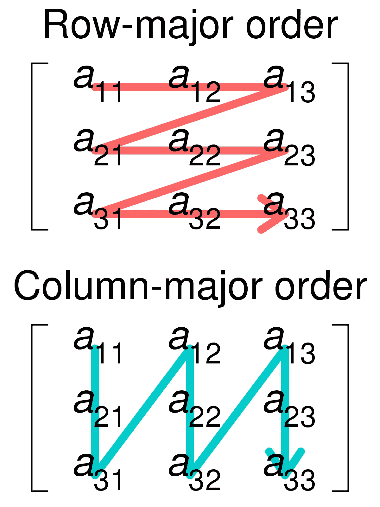

# Java 又回来了

> 原文：<https://medium.com/geekculture/java-and-back-again-43c4030ebc5a?source=collection_archive---------23----------------------->

初学者的故事…第 5 部分


Photo by [Nathan Dumlao](https://unsplash.com/@nate_dumlao?utm_source=medium&utm_medium=referral) on [Unsplash](https://unsplash.com?utm_source=medium&utm_medium=referral)

欢迎来到我的第五篇也是最后一篇关于我学习 java 之旅的文章。在第一部分中，我讲了一些历史和一些基本原理。随着[第二部分](/geekculture/java-and-back-again-fc0747a0ad3a)，我进入了状态和实例，用一些时间解释了一些关于面向对象编程。然后在[第三部分](/geekculture/java-and-back-again-231012ae113f)，我们谈到了数组和数组列表。在第四章中，我们进入了封装，以及访问方法的不同方式。现在，在第五部分，我们将讨论 2D 阵列。

为了澄清我所说的 2D 数组，基本上就是一个数组的数组。其声明类似于标准数组。你会注意到在下面的例子中，一个标准数组在数组类型后用一个方括号声明。而 2D 是用两个括号声明的。

```
 int[] numbers;    //Standard array int[][] moreNumbers;    //2D array
```

当你必须访问数组中的一个元素时，事情会变得有点棘手。在标准数组中，可以在数组名称后面的括号中输入元素索引。对于 2D 数组，您需要在两个括号中输入一个数字。第一个选择子数组，第二个选择数组中的元素。

```
int[][] numbers = {{1,2,3,4}, {5,6,7,8}}; int number = numbers[1][1];  //This would return 6\. 
```

我们有不同的方法来初始化和声明 2D 数组。首先是你可以同时声明和初始化。第二种是在单独的行上声明和初始化。如果这是你选择的路线，你将需要使用新的关键字。

```
int[][] numbers = {{1,2,3,4}, {5,6,7,8}};  //Single line int[][] numbers;numbers = new Integer[][]{{1,2,3,4}, {5,6,7,8}};
```

修改 2D 数组就像修改标准数组一样。你只需要选择你想要改变的指数，然后从那里开始。

```
int[][] numbers = {{1,2,3,4}, {5,6,7,8}}; numbers[0][1] = 10int[][] numbers = {{1,**10**,3,4}, {5,6,7,8}};  //This is what the array     
                                             would look like after
```

我想说的最后一件事是遍历一个数组来找到你想要的数据。我想讨论的方法有两种，一种是行方式，另一种是列方式。Row-Major 将从左上角开始，从左向右移动，然后从上到下。您可以使用如下示例所示的嵌套循环来遍历它们。第一个循环遍历行，而第二个循环遍历列。

```
for(int i = 0; i < numbers.length; i++) {
    for(int j = 0; j < numbers[i].length; j++) {
        System.out.println(numbers[i][j]);
    }
}
```

下图给出了行主要和列主要的很好的视觉效果。



如您所见，Column-major 略有不同。它从同一个地方开始，但是从上到下，从左到右。所以，你需要翻转你的嵌套循环。

```
for(int i = 0; i < numbers[0].length; i++) {
    for(int j = 0; j < numbers.length; j++) {
        System.out.println(numbers[j][i]);
    }
}
```

**结论**

我希望您喜欢我的 Java 入门之旅。我发现这相对容易处理。它与我熟悉的其他语言有很多相似之处，我发现它更容易掌握一些概念。