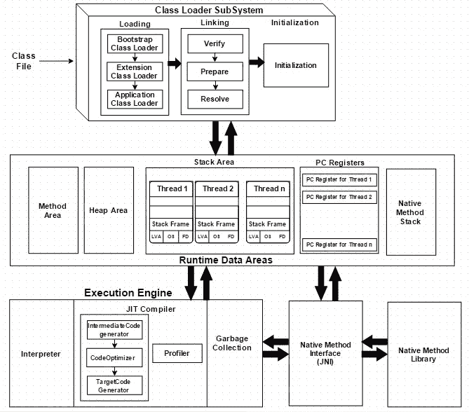

# Java 后端开发人员面试问题(Pt。1–10)

> 原文：<https://medium.com/geekculture/java-backend-developer-interview-questions-pt-1-10-1c74c76442bd?source=collection_archive---------1----------------------->

**1。JVM 的作用是什么？**
JVM 是 Java 虚拟机的简称。它为 Java 代码提供了一个运行时环境。它确保 Java 只需编译一次，就可以在任何地方运行，而不用考虑操作系统和处理器。

**2。Java 源代码的编译过程如何？**
Java 源代码经过源代码开发- >词法分析器- >语法分析器- >语义分析器- >字节码生成器。

**3。JVM 的结构是怎样的？**
JVM 主要由三个子系统组成:类加载器子系统、运行时数据区和执行引擎(详见下图)。

[https://dzone.com/articles/jvm-architecture-explained](https://dzone.com/articles/jvm-architecture-explained)

**4。在 JVM 运行时数据区，多线程之间共享的组件是什么？** 方法区在线程间共享。堆区存储全局变量、对象实例和可以在应用程序中任何地方访问的东西。所以堆区也是共享空间。由于每个线程都有不同的调用方法和变量，所以存储线程内的方法和局部变量的堆栈区域是不共享的。PC 寄存器跟踪关于线程应该如何进行的命令，因此它对于每个线程也是独立的。本机方法堆栈类似于堆栈区域，也包含局部变量和方法。因此本机方法堆栈不能在多个线程之间共享。

**5。Java 中线程之间的通信方式有哪些？** 1)共享内存
volatile 关键字，synchronized 关键字

2)等待和通知机制
wait()和 notify()是 Java 对象的方法。wait()方法使对象从运行状态转换到阻塞状态。一旦满足某个条件，另一个线程将调用 notify()方法来唤醒第一个线程，并让它进入可运行状态。

3)锁/条件机制
锁是 Java 提供的类，用来限制对一个对象的访问。锁类调用了条件。一个锁可以创建多个条件。使用 Condition.await()和 Condition.signal()方法，我们可以让一个线程休眠或者唤醒一个线程来完成它的工作。

**6。什么是易变和同步关键词？** Volatile 关键字针对一个字段，或者一个方法中的一个变量，这样当多个线程访问同一个变量时，保证了数据的一致性。这是通过强制通过主内存而不是高速缓存访问变量来实现的。

Synchronized 关键字用于代码块。它只允许一个线程在给定的时间点访问资源。当一个线程正在操作资源时，不允许其他想要访问同一对象的线程执行。

7 .**。volatile 和 synchronized 有什么区别？** Volatile 是轻量级锁，而 synchronized 是重量级锁。在同步块写入/修改资源后，变量值被刷新回共享内存空间。这会导致并发问题，因为受同步保护的同一对象上的线程不能并发执行。相比之下，volatile 允许多个线程并发执行，强制它们直接从主内存而不是 CPU 缓存中读取变量。此外，同步是基于操作系统实现的，这导致线程进入内核模式，而不是用户模式，这是一个耗时的过程。

**8。ThreadLocal 有什么用？
T5【thread local】是一种保证线程安全的机制。它允许开发人员存储与特定线程相关的变量，这样多个线程就不需要访问共享变量，从而避免对数据一致性造成危害。
每个*线程*类都有一个名为 *threadLocals* 的字段，类型为 *ThreadLocal。ThreadLocalMap* 。 *threadLocals* 的键是对当前 ThreadLocal 的引用，值是开发者想要存储的变量(T 类类型)。要写入或读取变量，需要调用 ThreadLocal.get()或 set()方法。**

**9。Java 中的反射是什么？** Java 是一种静态语言。Java 中的反射赋予了程序自省的能力，使其更具动态性。它允许开发者在运行时检查或修改方法、类或接口的行为。

**10。为什么 HashMap 是线程不安全的？** 1)来自多个线程的多次 put 可能导致元素
的丢失 2)当 put 和 get 并发执行时，get 的返回值可能为空。当线程放置的元素超过阈值时会发生这种情况，导致重新散列操作，get 方法将导致空值。
3)JDK 1.7 中的并发 put 可能会导致循环链表导致 get 中出现无限循环。为了确保线程安全，请使用 ConcurrentHashMap。

我希望这篇文章对你有所帮助。如果你像我一样渴望学习一些与技术相关的东西，或者定期反思工作和生活，请关注我的频道，了解我日常工作和生活中的最新灵感。

**相关** :
[Java 后端开发者面试问题(Pt。11–20)](/@wdn0612/java-backend-developer-interview-questions-pt-11-20-edd176b5c425)
[Java 后端开发者面试问题(Pt。21–30)](/@wdn0612/java-backend-developer-interview-questions-pt-21-30-b6c227d1b3c9)
[Java 后端开发者面试问题(Pt。31–40)](/@wdn0612/java-backend-developer-interview-questions-pt-31-40-c81245b322dc)

演职员表:
[https://www.bilibili.com/video/BV1634y1d7nJ](https://www.bilibili.com/video/BV1634y1d7nJ)
[https://github . com/lok les/we B- Development-Interview-With-Java](https://github.com/lokles/Web-Development-Interview-With-Java)