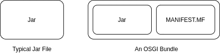
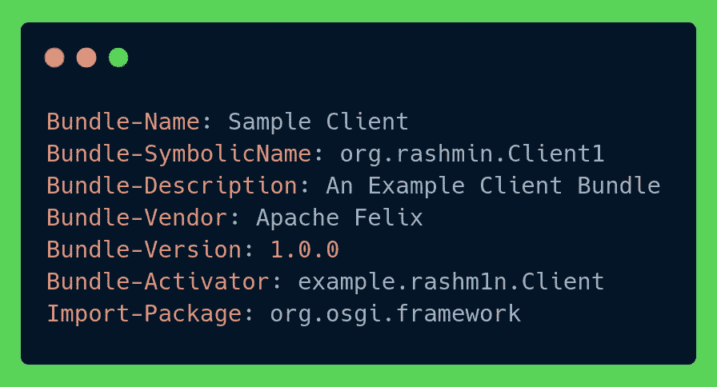
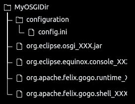
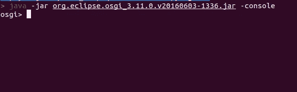
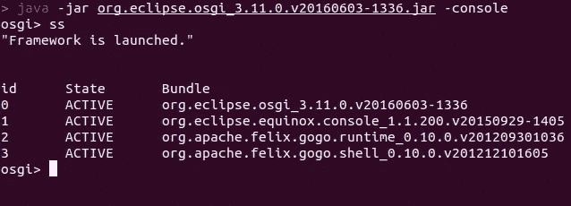

# 赢得胜利的 Java 包！OSGI 简介

> 原文：<https://medium.com/geekculture/java-bundles-for-the-win-an-introduction-to-osgi-f4ebc487bce6?source=collection_archive---------9----------------------->


Photo by [Ryan W](https://unsplash.com/@ryanmwan?utm_source=medium&utm_medium=referral) on [Unsplash](https://unsplash.com?utm_source=medium&utm_medium=referral)

如果您是 Java 生态系统的新手，您可能不会听说过 OSGI。但是不用担心，在本文中，我将让您对 OSGI 的基础知识及其用例有一个坚实的理解。

OSGI，简称 ***开放服务网关倡议*** 是 Java 中用于 ***模块化*** 和 ***动态*** 应用开发的标准。那么在这里，模块化和动态是什么意思呢？模块化意味着“由不同部分组成”，动态意味着“易于不断变化、活动”，因此作为一个整体，我们可以说它是一个由不断变化和活动的、不同的小组件组成的框架。

OSGI 标准定义了一个规范，将单个 Java 应用程序分成更小的组件，称为“捆绑包”,可以单独安装、删除、启动或更新，但 OSGI 计划最有趣的一点是，所有这些都可以在不重启应用程序的情况下完成。因此，您可以热部署(在运行中部署组件)您的 java 组件，而无需停止和重新启动整个应用程序，这通常会花费很多时间。

让我们假设您创建一个应用程序作为一个单独的 jar 文件并部署它。然后，如果您想从项目中删除一个包，并将另一个包的新版本添加到项目中，您只需在代码级别进行更改，然后重新编译并将整个项目打包为一个全新的 jar。然后，您必须停止正在运行的应用程序，并再次重新部署它。但是，如果您已经使用了基于模块化 OSGI 的方法，那么您可以简单地“取消部署”特定的包，并在原始应用程序已经运行的情况下添加所需包的新版本！

## 束

OSGI 规范中的原子实体是我上面提到的**包**。bundle 是紧密耦合的类和配置文件的集合。或者简单地说，包是一个 **jar** 文件和一个名为 MANIFEST 的配置文件的组合。包含 OSGI 特定元数据的 MF。



Bundle vs Jar

清单。MF 文件包含 OSGI 运行时将 jar 注册为包所需的元数据。显化。MF 文件指定了包的命名、包的版本以及最重要的包使用的导入和导出。



A simple MANIFEST.MF

上面我已经给出了一个简单的例子。MF 文件看起来像。bundle name 是 bundle/component 的名称，这可以是一个简单的人类可识别的名称，但是 bundle-SymbolicName 对于每个 Bundle 必须是唯一的**并且不能重复。OSGI 运行时使用它来唯一区分每个包。通常使用组 id 和工件 id 的组合来生成这个 SymbolicName。**

这里给出的另外两个重要字段是包激活器和导入包。在 Bundle-Activator 字段中，我们需要给出作为 Bundle 入口点的类的名称。这意味着当某个包启动时应该执行/运行的类。您可以将它与普通 Java 应用程序中的**public void main(String[]args)**方法进行比较，因此这个 Bundle-Activator 类是应用程序首次开始在 OSGI 环境中运行时将被执行的类。

Import-Package 字段定义了需要由特定包导入的外部包/包。假设有 3 个名为 example.rashmin.A、example.rashmin.B 和 example.rashmin.C 的包，如果包 A 将另外两个包作为“依赖包”,那么它的 Import-Package 字段将类似于下面的内容。

```
Import-Package: example.rashmin.B, example.rashmin.C, org.osgi.framework
```

类似于这个 Import-Package 字段，还有另一个 Export-Package 字段，它指定我们需要在我们的包中导出哪些包，以供其他包显式使用。我将在以后的文章中谈到这一点。

## OSGI 实现

现在我们对 OSGI 的基础有了一个简单的了解。让我们讨论不同的 OSGI 实现。因为 OSGI 只是一个规范，所以需要具体实现来将那些规范和标准带入现实生活。目前市场上有几种流行的 OSGI 实现。

1.  日食春分
2.  阿帕奇菲利克斯
3.  克诺弗勒鱼 OSGI

## 日食春分

在这篇文章中我将谈到 [***【日食春分】***](https://www.eclipse.org/equinox/) 的实现。它实现了 OSGI 规范的所有最新规范，也用作参考实现。让我们用 Equinox 框架做一个小演示吧！

你可以从 [***这个***](https://download.eclipse.org/equinox/)*链接下载春分框架。您可以下载最新版本或以前的版本。确保下载名为 equinox-SDK-x.xx.zip 的文件。您可以通过以下命令下载它*

```
*wget http://www.eclipse.org/downloads/download.php\?file\=/equinox/drops/R-Neon-201606061100/equinox-SDK-Neon.zip*
```

*下载完 zip 文件后，解压它，你会看到里面有几个文件夹和文件。现在你必须创建一个单独的文件夹，并将下面的文件从 <unzip_location>/plugins 目录复制到其中。</unzip_location>*

1.  *org.eclipse.osgi_XXX.jar*
2.  *org . eclipse . equinox . console _ XXX . jar*
3.  *org . Apache . Felix . gogo . runtime _ XXX . jar*
4.  *org . Apache . Felix . gogo . shell _ XXX . jar*

*然后在这个名为**configuration，**的新文件夹中创建一个文件夹，并在其中创建一个 config.ini 文件，内容如下。*

```
*osgi.bundles=file\:org.eclipse.equinox.console_<YOUR_VERSION>.jar@start,file:\org.apache.felix.gogo.runtime_<YOUR_VERSION>.jar@start,file:\org.apache.felix.gogo.shell_<YOUR_VERSION>.jar@start*
```

*在我的例子中，config.ini 文件如下所示*

```
*osgi.bundles=file\:org.eclipse.equinox.console_1.1.200.v20150929-1405.jar@start,file:\org.apache.felix.gogo.runtime_0.10.0.v201209301036.jar@start,file:\org.apache.felix.gogo.shell_0.10.0.v201212101605.jar@start*
```

*最后，你的文件夹结构应该是这样的。*

**

*Folder Structure*

*完成后，您可以从终端进入您的<myosgidir>并输入以下命令。</myosgidir>*

```
*java -jar org.eclipse.osgi_<YOUR_VERSION>.jar -console*
```

*终端应该如下所示。*

**

*OSGI Terminal*

*该终端中使用了一组 equinox 专用命令。您可以从 Equinox 官方文档中进一步了解这些命令。*

*您可以输入 ***ss*** 查看您所有激活的捆绑包。*

**

*All bundles*

*在这里，您可以看到我们复制的所有四个罐子都在这里。*

*如果你看一下这篇文章。您可能会注意到两个重要的列，id 和 state。*

*Id 是 OSGI 运行时给每个安装包的唯一 Id。我们可以通过这个 id 很容易地引用这些包，来启动、停止或删除它们。然后另一列 **State** 描述了该特定束的当前状态。这可以描述包生命周期的任何阶段，如**安装、解决、启动、激活、停止或卸载。***

## *捆绑包生命周期*

*在 OSGI 框架中，每个 OSGI 包都经历一个特定的生命周期，所有这些生命周期阶段都有状态。*

1.  *已安装—软件包安装完成。*
2.  *RESOLVED — OSGI 运行时已经解析了它的所有依赖项*
3.  *启动——调用包的入口点，包正在启动*
4.  *活动—软件包已成功启动并正在运行*
5.  *停止/卸载是不言自明的。*

*我们可以通过 OSGI 控制台来控制一个包的这些状态，*

```
*osgi > install file:home/user/service1.jar
osgi > start 5
osgi > stop 5
osgi > uninstall 5*
```

*(5 是捆绑包的示例 OSGI id。)*

*所以利用所有这些。你可以做一个有清单的罐子。MF 文件并打包成一个包，通过 OSGI 控制台随时安装/启动/停止它。*

*在本文中，我简要介绍了 Java 中的 OSGI。在下一篇文章中，我将制作一个简单的 OSGI 包，并将其部署在 OSGI 框架中。*

*希望大家看了文章都有所收获。如果你喜欢就关注一下。干杯。*

*[](https://www.linkedin.com/in/rashmin95/) [## Ravindu Rashmin -软件工程师- WSO2 | LinkedIn

### 在世界上最大的职业社区 LinkedIn 上查看 Ravindu Rashmin 的个人资料。Ravindu 列出了 7 个工作…

www.linkedin.com](https://www.linkedin.com/in/rashmin95/) 

**资源**

[](https://en.wikipedia.org/wiki/OSGi) [## OSGi -维基百科

### OSGi 联盟，以前被称为开放服务网关倡议，是一个开放标准组织，成立于…

en.wikipedia.org](https://en.wikipedia.org/wiki/OSGi) [](https://www.eclipse.org/equinox/) [## equinox | Eclipse 基金会

### 从代码的角度来看，Equinox 是 OSGi 核心框架规范的一个实现，这是一组包…

www.eclipse.org](https://www.eclipse.org/equinox/) [](https://www.osgi.org/) [## OSGi 工作组 Eclipse 基金会

### 新闻查看所有提交的新闻事件查看所有提交的事件成为成员查看所有成员

www.osgi.org](https://www.osgi.org/)*