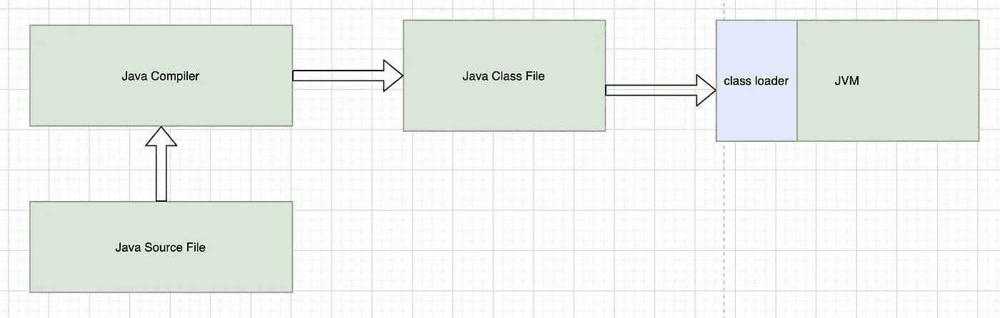
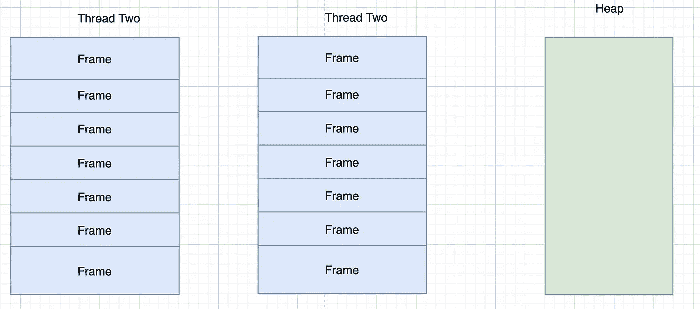
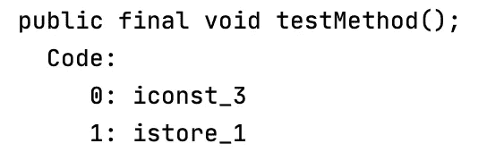
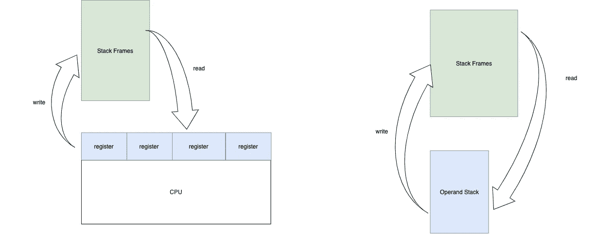
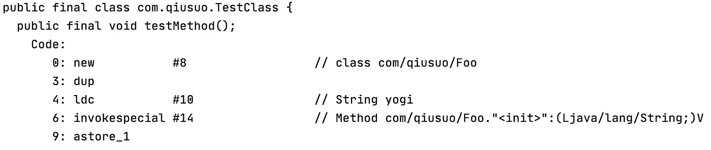
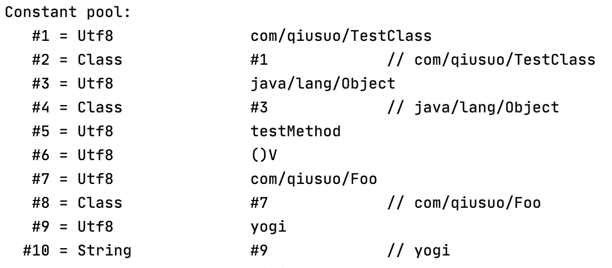
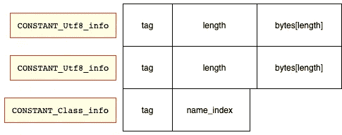

# Java 字节代码操作

> 原文：<https://medium.com/geekculture/java-bytecode-manipulation-a1a660ac93dc?source=collection_archive---------12----------------------->

本文的目标是将一个公共属性手动添加到类文件中。当类加载器完成加载修改后的类文件时，我们能够看到我们手动添加的字段。

在 Java 编译器编译了我们的代码之后，就会生成一个类文件。这个类文件包含由 Java 规范定义的字节码指令。然而，它仍然是一个物理文件。最后，这个文件必须被加载到内存中，解析，然后构造类对象。将此视为解析 XML 文件，我们必须首先定义 XML 文件中允许哪些节点。然后，解析器能够根据我们预先定义的节点解析这个文件。Java 类文件也一样。Oracle 预定义了类文件结构。解析器必须能够理解文件中的结构并执行特定的操作。读取和解析这个文件是由类加载器完成的。在 ClassLoader 加载类之后，一个类对象被放入堆中。



在讨论类文件结构之前，我们先讨论一下指令集。

***与汇编代码类似，字节码指令的最终目标是从内存位置加载值，对它们执行操作，并将结果写回内存位置。在高级语言中，我们总是使用符号。符号可以是方法名，也可以是变量名，等等。符号本身只是绝对或相对内存位置的代表。***

例如，我们可以在任何语言中使用下面的语句。

```
fun calculate { 
  int i = 4
}
```

**i** 是一个符号。它代表一个内存位置。该语句要求将数字 4 放入由 **i** 表示的内存位置。在把任何东西放入一个存储单元之前，计算机必须为它预留空间。在这种情况下，大小由 **int 指定。**

另一个重要的事实:*一个程序总是在一个线程或者多个线程中运行。每个线程都有一个相应的堆栈结构来存储当前线程的运行时状态。这个堆栈可以存储被调用函数的局部变量。另一个内存位置是堆。堆用于存储全局分配的对象。这个内存模型不只是 Java 用的，C++里也有。其他语言或多或少也是如此。*



Java memory model

JVM 为每个函数调用创建一个**帧**。所有的局部变量都存储在一个框架中。**我们可以把框架看作一个局部变量数组。**所以我们的 ***int i = 4 就是*** 只是把数字 4 存储到数组的最后一个位置。有实现这一功能的指令是有意义的。确实有按照这里列出的指令做这件事的指令[https://docs . Oracle . com/javase/specs/JVMs/se7/html/JVMs-6 . html](https://docs.oracle.com/javase/specs/jvms/se7/html/jvms-6.html)

我创建了一个简单的类 TestClass 来查看这个。

```
**class** TestClass(**val name**: String) {
    **fun** testMethod() {
        **val** i: Int = 3
        *print*(i)
    }
}
```

我们可以使用***javap-c test class . class***来查看函数的字节码。



**iconst_3:** 将常数 3 压入操作数堆栈


push — operand stack

**istore_1** :从操作数堆栈中弹出整数，并将整数存入当前帧的局部变量数组的索引 1。


pop — operand stack

**操作数堆栈**

为什么需要操作数堆栈？如前所述，指令必须首先从内存中加载数据，对数据进行操作，然后将结果写回内存。JVM 在哪里存储从内存加载的数据？

在计算机 CPU 上，有寄存器。变量值首先被加载到 CPU 的寄存器中，计算在寄存器中完成。计算完成后，寄存器的结果被写回存储器。我相信 JVM 借鉴了 CPU 本身的这种设计。



JVM 为什么不直接把数据加载到 CPU 寄存器中？因为 JVM 指令不是机器代码。指令必须被翻译成机器代码才能使用寄存器。这项工作是由 JIT 完成的。

JVM 如何表示创建对象的另一个实例？

```
**class** Foo(**val name**: String) {
    **fun** foo() {
        *print*(**"foo"**)
    }
}
**class** TestClass(**val name**: String) {
    **fun** testMethod() {
        **val** foo: Foo = Foo(**"yogi"**) //creating instance of class
    }
}
```

创建一个实例有 3 个步骤:

*   加载目标类
*   在堆上为类实例分配内存
*   调用实例的构造函数

让我们看看生成的字节码



第一个指令是 ***新的#8。*** 数字 8 是进入常量池表的一个索引。

**恒池**

常量池是 JVM **加载类文件**后创建的**运行时结构**。它包含源类中使用的所有符号引用。

我们可以使用***javap-v test class . class***查看类文件中常量池的原始内容。(以下输出实际上是由 javap 解释的)。



在类加载器读取我们的 **TestClass.class** 文件后，JVM 将创建一个常量池表。



常数池表中的每个条目都是可变大小的结构。每个条目可以表示不同的常量类型。常量的类型由名为**标签**的第一个字节表示。这个页面[https://docs . Oracle . com/javase/specs/JVMs/se7/html/JVMs-4 . html # JVMs-4 . 4 . 1](https://docs.oracle.com/javase/specs/jvms/se7/html/jvms-4.html#jvms-4.4.1)有所有的常量类型。在我们的图片中，我们列出了两种常量类型。

```
CONSTANT_Class_info {
    u1 tag;
    u2 name_index;
}CONSTANT_Utf8_info {
    u1 tag;
    u2 length;
    u1 bytes[length];
}
```

*常量 _ 类别 _ 信息*中的**名称 _ 索引**是索引回常量池的数字。constant_pool[name_index]中的条目是一个类型 *CONSTANT_Utf8_info* ，它包含我们的类名称**“com/Qiu suo/Foo”**。

在类加载器构造常量池之后，它将解析方法引用和类引用。在我们的例子中，类加载器将解析 **"com/qiusuo/Foo"** 类。它从类路径加载 **Foo.class** 并在堆上构造类对象。它会用构造的 **Foo** 类对象的实际内存地址替换 **"com/qiusuo/Foo"** 符号引用。

实际上，有急于装和偷懒装。类加载器能够在运行时加载类引用和方法引用。

方法引用包含在方法引用结构中。

```
CONSTANT_Methodref_info {
    u1 tag;
    u2 class_index;
    u2 name_and_type_index;
}
```

上面的结构我们就不赘述了，因为它类似于 *CONSTANT_Class_info。*

当方法引用被解析到内存位置时，JVM 指令如***invoke special # 14***可以调用 **Foo** 类的构造函数。

类文件中另外三个重要的结构是:

```
 field_info     fields[fields_count];
    method_info    methods[methods_count];
```

**field_info** 和 **method_info** 结构包含被加载的类的字段和方法信息。

**字节码操作**

在我们研究了类文件格式之后，字节码操作就是在读取类文件之后改变它的不同部分的内容。我们将使用 [ASM](https://asm.ow2.io/) 库来做实验，因为 Spring 也使用这个库。我们的目标是将一个简单的属性***public int test = 0***添加到我们之前的 **TestClass** 类中。

```
**class** TestClass(**val name**: String) {
    **fun** testMethod() {
        **val** foo: Foo = Foo(**"yogi"**) //creating instance of class
    }
    public var test: Int = 0 // will be added by ASM
}
```

由于字段信息是由类文件中的 **field_info** 结构表示的，所以 **ASM** 库要做的基本上就是在类文件中多加一个 **field_info** 。

```
field_info {
    u2             access_flags;
    u2             name_index;
    u2             descriptor_index;
    u2             attributes_count;
    attribute_info attributes[attributes_count];
}
```

**access_flags** :像公共的，私有的，或者受保护的。

**name_index:** 类似于 CONSTANT_Class_info 中的 name_index

**attribute_info:** 包含类型，注释，泛型信息，字段的常量值。

**descriptor_index:** 进入常量池的索引，该条目代表字段的类型

这个结构的细节可以在这里找到[https://docs . Oracle . com/javase/specs/JVMs/se7/html/JVMs-4 . html # JVMs-4.5](https://docs.oracle.com/javase/specs/jvms/se7/html/jvms-4.html#jvms-4.5)

**ASM 接口**

*   *ClassReader* —负责读取类文件的内容。它将调用 ClassVisitor 来访问类文件的每个部分
*   class visitor—实际的类调用了类文件的不同部分
*   ClassWriter 实际上扩展了 ClassVisitor。ClassWriter 的 visitField 函数首先检查该字段是否存在。如果该字段不存在，则在类文件结构中创建该字段。

我们的 CustomFieldAdder

```
**class** CustomFieldAdder(**val access**: Int, **val name**: String, **val fieldType**: String, **val signature**: String?, **val value**: Any, **val cv**: ClassVisitor, **val api**: Int): ClassVisitor(api, cv) {
    **var isFieldPresent** = **false** **override fun** visitField(access: Int, name: String?, desc: String?, signature: String?, value: Any?): FieldVisitor? {
        **if**(name.*equals*(**this**.**name**)) {
            **isFieldPresent** = **true** }
        **return cv**.visitField(access, name, desc, signature, value)
    }

    **override fun** visitEnd() {
        **if** (!**isFieldPresent**) {
            **val** fv = **cv**.visitField(**access**, **name**, **fieldType**, **null**, **value**) //cv is the ClassWriter
            fv?.visitEnd()
        }
        **cv**.visitEnd()
    }
}
```

测试类

```
**class** TestClassWriter: ClassLoader() {
    **fun** run() {
        **val** className = **"com.qiusuo.bytecode.TestClass"
        val** constValue = 4
        **val** accessType = org.objectweb.asm.Opcodes.*ACC_PUBLIC* **val** name = **"test"
        val** fieldType = Type.*INT_TYPE*.toString()
        **val** reader = ClassReader(className)
        **val** writer = ClassWriter(reader, 0)
        **val** fieldAdder = CustomFieldAdder(accessType, name, fieldType, **null**, constValue, writer, Opcodes.*ASM7*)
        reader.accept(fieldAdder, 0)
        **val** modified =  writer.toByteArray()
        **val** modifiedClass: Class<*> = defineClass(className, modified, 0, modified.**size**)
        **val** instance = modifiedClass.getDeclaredConstructor().newInstance()
        **val** value = modifiedClass.getDeclaredField(**"test"**).get(instance)
        *println*(value)
    }
}
```

**注意:我把初始值设为 4。但是，打印的值仍然是 0。这意味着添加的属性没有初始化为 4。我不知道为什么。**

实验的源代码可以在这里找到

[https://github . com/Ryan-Zheng-teki/spring boot tutorial/blob/master/springcore tutorial/src/main/kot Lin/com/Qiu suo/bytecode/customfieldadder . kt](https://github.com/ryan-zheng-teki/springboottutorial/blob/master/springcoretutorial/src/main/kotlin/com/qiusuo/bytecode/CustomFieldAdder.kt)