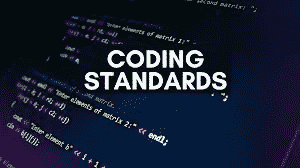
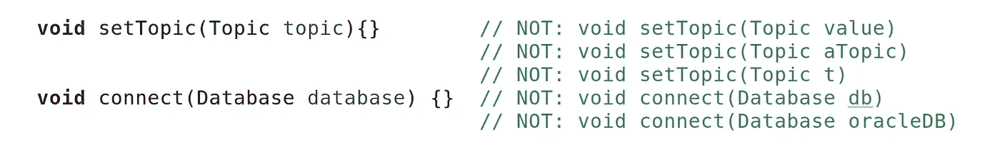
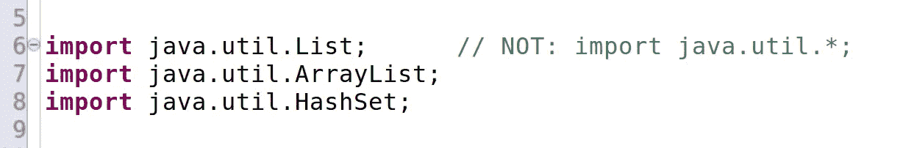
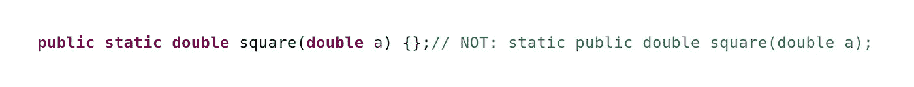
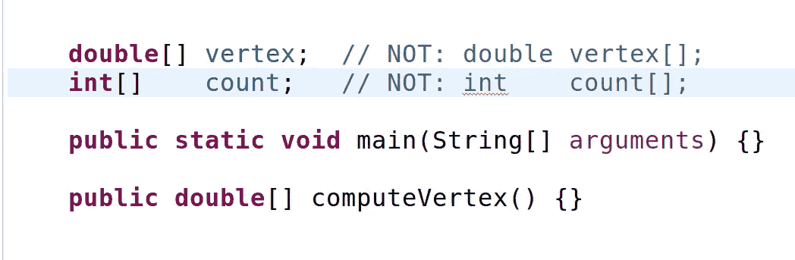

# Java 编码标准

> 原文：<https://medium.com/geekculture/java-coding-standards-68ba6c426794?source=collection_archive---------11----------------------->

Java 提供的指南旨在提高代码的可读性，并使其在各种 Java 项目中保持一致。风格指南是关于一致性的。与本风格指南保持一致非常重要。项目内部的一致性更重要。一个包、类或方法中的一致性是最重要的。

该建议的主要目标是提高可读性，从而提高代码的可理解性、可维护性和总体质量。不可能在一个通用指南中涵盖所有的具体情况，程序员应该灵活。

现在我们来谈谈 Java 中的命名约定:-

## 1.包名:-

它应该是小写的 ASCII 字母，如 java，lang。如果名称包含多个单词，应该用点(。)比如 java.util，java。郎。

示例:mypackage，com.company.application.ui，com.sun.eng，com.apple.quicktime.v2

## 2.类别和接口名称:-

应该以大写字母开头。应该是颜色、按钮、系统、线程等名词。使用适当的词语，而不是缩写。

例子:接口自行车，类登山自行车实现自行车，接口运动，类足球实现运动

## 3.方法名称:-

通常，方法名应该是以小写字母开头的动词或动词-名词组合。如果它包含多个单词，那么每个内部单词都应该以大写字母开头。

示例:print()、sleep()、setSalary()

## 4.变量名:-

**i)实例变量:-** 通常变量名应该是以小写字母开头的名词。如果它包含多个单词，那么每个内部单词都应该以大写字母开头。

例如:姓名、年龄。移动号码

**ii)常量(最终变量):-** 通常，常量名应该是名词。它应该只包含大写字母，如果它包含多个单词，则单词之间用(_)下划线符号分隔。通常，我们用公共的 static 和 final 修饰符声明常量。

示例:-最大迭代次数，红色

**iii)布尔变量:-** 它使用 is 作为变量名前的前缀。

示例:- isSet、isVisible、isFinished、isFound、isOpen

**iv)私有变量:-** 在变量名末尾使用下划线(_)。

示例:-私有字符串名称 _；

**5。JavaBean:-**JavaBean 是一个简单的 Java 类，具有私有属性和公共 getter 和 setter 方法

**吸气方法:**

1.  它应该是一个公共方法
2.  方法名应该以“get”为前缀
3.  这不需要任何争论

**设定方法:**

1.  它应该是一个公共方法
2.  返回类型应该为空
3.  方法名应该以“set”为前缀
4.  这需要一些争论

以上是最常用的命名约定。关于编码标准的一些要点

1.  泛型变量应该与其类型同名。

示例:-

*2。n* 前缀应该用于表示多个对象的变量。

示例:-n 点，n 线

*3。代表实体编号的变量不应使用*后缀。

示例:-表号，员工号

4.迭代器变量应该叫做 *i* 、 *j* 、 *k* 等。

示例:-for(int I = 0；i < nTables; i++) { }

5\. Negated boolean variable names must be avoided.

Example:-

6\. Imported classes must always be listed explicitly. Importing classes explicitly gives an excellent documentation value for the class at hand and makes the class easier to comprehend and maintain.

Example:-

7\. Method modifiers should be given in the following order:
*<访问>静态抽象同步<异常>最终本机*
*<访问>* 修饰符(如果存在)必须是第一个修饰符。

*<访问>* 是*公共*，*受保护*或*私人*而 *<不寻常>* 包括*易变*和*瞬变*。这里最重要的一点是将*访问*修改器作为第一个修改器。

示例:-

8.声明数组时，其括号应在类型旁边。

示例:-

原因是双重的。首先，*数组性*是类的一个特性，而不是变量。第二，当从一个方法返回一个数组时，除了类型之外，不能有其他类型的括号(如最后一个示例所示)。