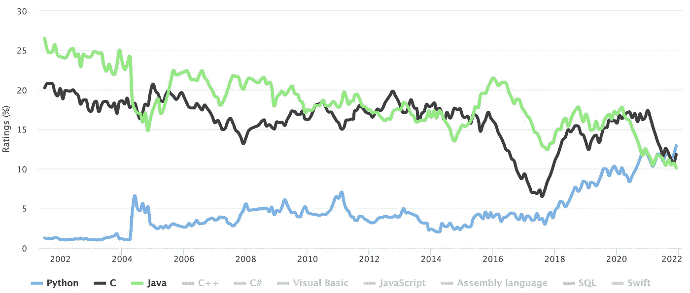

# Java 开发:企业解决方案的理想选择

> 原文：<https://medium.com/geekculture/java-development-an-ideal-choice-for-enterprise-solutions-474b17b6f199?source=collection_archive---------20----------------------->

Java 是开发企业解决方案和 web 应用程序的最重要的编程语言之一。十多年来，它一直是头号编程语言。在 TIOBE 索引中，Java 是第三大最流行的编程语言，仅次于 Python 和 C。

来源: [TIOBE 指数](https://www.tiobe.com/tiobe-index/)

为了在他们的行业中取得优势，公司可以使用 Java 编程语言并创建一流的应用程序。一些利用 [Java 开发服务](https://www.botreetechnologies.com/java-development-company)的世界上最大的公司包括 IBM、微软、甲骨文、谷歌等等。这些公司利用该技术创建企业解决方案，并向不同行业的客户提供 Java 服务作为支持产品。

> [Java vs . python:2022 年的编程语言对比](https://www.botreetechnologies.com/blog/java-vs-python-comparison/) **‍**

# 为什么 Java 是企业解决方案的完美选择

作为一种可扩展的强大的编程语言，Java 提供了许多优势。它与现代技术无缝协作，是一种独立于平台的技术。开发者可以轻松地在不同的操作系统上创建[应用](https://www.botreetechnologies.com/blog/7-reasons-to-use-microsoft-net-framework-for-app-development/)，包括 Linux、macOS 和 Windows。Java 是一种经济有效的技术，它允许初创公司快速开发 MVP，而且没有任何错误或问题。

在最流行的 Java 框架和技术中，Java 8 是使用最多的。69%的开发者使用 Java 8 构建企业和 web 应用。随着现代应用需求的增长，Java 紧随 Python web 开发之后走上前台，帮助企业构建一流的应用。

## 更多阅读:[为什么 2022 年流行 Java 应用开发？](https://www.botreetechnologies.com/blog/why-is-java-application-development-popular/)

资料来源:JRebel

Java 软件开发支持创建可伸缩的应用程序、解决方案和软件，这些应用程序、解决方案和软件可以监视和控制重要的操作需求和流量负载。Java 可以同时管理成百上千个请求，允许公司在没有任何技术问题的情况下扩展应用程序。 **‍**

# Java 适合企业应用开发的 7 个理由

Java 在软件开发过程中扮演着统一元素的角色。企业需要一种能够为其基础设施提供结构的技术，这最终会带来更好的运营成果。这就是为什么 Java 应用程序开发进入了画面，以便[企业](https://www.botreetechnologies.com/blog/pros-and-cons-of-rpa-technology-for-digital-enterprises/)可以获得一个强大的编程语言，可以满足他们所有的性能需求。

以下是 2021 年 Java 适合企业应用开发的 7 个理由:

# 1.跨平台兼容性

JVM 或 Java 虚拟机使企业能够构建跨平台的应用程序。它使得[编程语言能够支持多种操作系统上的应用](https://www.botreetechnologies.com/blog/java-applications-examples/)，包括 iOS、Windows 和 Linux。

Java 可以通过现代处理器在多个系统上轻松运行应用程序。JVM 可以维护巨大的多核机器，这使得它们能够跨设备无缝工作。Java 有多种硬件系统的支持，这为来自多个来源的[开发者](https://www.botreetechnologies.com/blog/guide-to-hiring-ruby-on-rails-developers/)简化了开发过程。 **‍**

# 2.稳定的语言

[Java 软件开发服务](https://www.botreetechnologies.com/java-development-company)随着时间的推移持续增长，这带来了编程语言的稳定性。尽管这种语言已经存在了十多年，但它仍然没有达到成熟阶段。随着编程语言转向 6 个月的发布周期，Java 每 6 个月就有更新的升级。

因为 Java 是稳定的，所以它也是世界各地的大公司的首选编程语言，这些公司希望他们的技术栈有可靠的东西。它在希望整合稳定的[编程语言](https://www.botreetechnologies.com/blog/top-5-in-demand-programming-languages-for-web-development/)以确保客户体验保持无缝的企业中发展了可靠性、可信度和信任度。 **‍**

# 3.可扩展性和可靠性

Java 是一种高度可扩展的编程语言，它提供了任何其他语言都无法比拟的流量管理功能。它非常高效且注重性能，有助于管理企业级应用程序和工作负载。即使当应用程序很大并且包含对库的依赖时，Java 也不会以任何方式导致任何问题。

这种可伸缩性使得 Java 成为企业开发的可靠编程语言。它提供了一系列令人难以置信的功能，使得动态和交互式[网络应用](https://www.botreetechnologies.com/web-application-development)的开发成为可能。 **‍**

# 4.高级别的安全性

Java 软件开发提供了高级别的安全性和数据保护。内置的安全功能使企业能够妥善保护其数据。有像高级认证、访问控制、加密、SQL 注入等功能。

由于安全级别如此之高，这种编程语言被全球的金融科技公司广泛使用。有集成安全策略、数字签名、密码等功能。安全的应用程序是 Java 提供的最大优势之一。 **‍**

# 5.多线程支持

为什么多线程支持很重要？Java 中的多线程环境提供了更快的响应时间、更少的问题、更多的操作、更高的性能以及可以同时处理的多个请求。 [Java 开发者](https://techreviewer.co/java-developers)不必在 Java 所在的同一硬件上执行多个代码副本。

多线程环境也减少了开发过程中的问题。开发团队需要处理的错误更少，这使得团队能够比其他几种编程语言更快地构建软件。必须同时处理多个线程的企业软件可以在 [Java 企业应用开发](https://www.botreetechnologies.com/blog/why-is-java-application-development-popular/)的帮助下轻松完成。 **‍**

# 6.多样化的图书馆支持

Java 中有数百个支持企业应用程序开发的库。这些库支持添加各种特性和功能，包括 Google Guava、iText、Protocol Buffers、XStream 和其他一些库。[企业应用](https://www.botreetechnologies.com/blog/why-companies-use-net-for-enterprise-development/)严重依赖 Java 来添加特性，这是从头开始编写代码的一个麻烦。

有一组丰富的 API 和开发工具，允许开发人员包含否则可能无法实现的功能。它使开发过程变得相当快速、可靠和无缝。 **‍**

# 7.移动开发

如今，移动应用是数字化企业运营的必需品。Java 与 Android 生态系统合作得非常好，可以为该平台构建应用程序。在过去的几年里，一些开发人员认为 Java 是他们在构建任何 [Android 应用程序](https://www.botreetechnologies.com/android-native-development)时想到的第一编程语言。

使用 Java 在 Android Studio 框架中编写代码更简单。越来越多的公司选择 Java 来创建 Android 应用程序，如果他们想为他们的公司开发一个本地移动应用程序的话。定制软件开发公司可以为企业构建移动应用程序，并让它们走上数字化运营的轨道。 **‍**

# 包扎

Java 有一个庞大的社区作为后盾，提供一致的支持。它是公司用来构建、修改和迁移他们的企业应用程序的编程语言。有增强的安全特性，并且该技术对于在[机器学习](https://www.botreetechnologies.com/machine-learning-solutions)、数据科学、AR & VR 和其他领域构建现代应用非常有用。有很多 Java 框架，比如 Spring、Apache、Bootstrap 等等，开发者可以用来构建企业级应用。

*原载于***。**