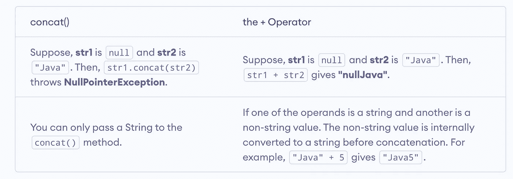

# Java:有趣又酷的技巧

> 原文：<https://medium.com/geekculture/java-interesting-and-cool-tricks-525625d34ca6?source=collection_archive---------3----------------------->

# 👉1 >> Java 字符串

## concat()与+运算符进行连接

## 实习生()