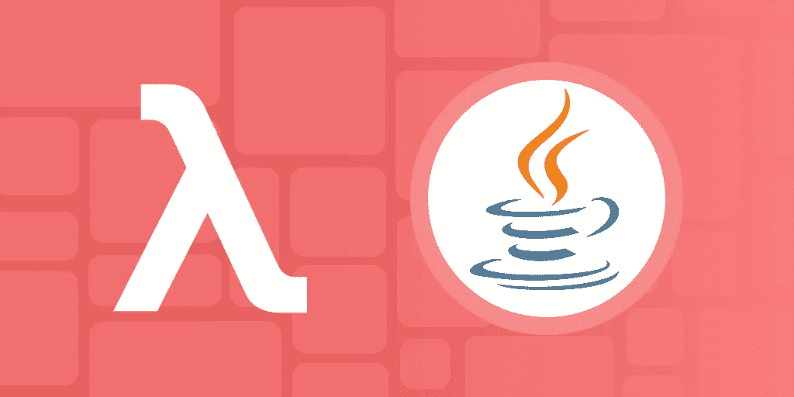

# Java Lambda 表达式教程:Java 中的函数式编程

> 原文：<https://medium.com/geekculture/java-lambda-expression-tutorial-functional-programming-in-java-ccd01c2a8ec?source=collection_archive---------2----------------------->



Image Source: Author

在 2021 年初超过 60%的专业开发人员仍在使用 Java 8 的情况下，理解 Java 8 的特性是一项基本技能。Java 8 于 2014 年发布，带来了大量新功能。

这些变化包括允许 Java 开发人员以函数式编程风格编写代码的特性。最大的变化之一是添加了**λ表达式。**

Lambdas 类似于方法，但是它们不需要名字，并且可以在类之外实现。因此，它们为全功能程序开辟了可能性，并为将来 Java 提供更多的功能支持铺平了道路。

今天，我们将帮助您开始学习 lambda 表达式，并探索如何将它们用于接口。

**下面是我们今天要讲的内容:**

*   什么是 lambda 表达式？
*   如何编写 lambda 表达式
*   Java 中的接口
*   接下来学什么

# 什么是 lambda 表达式？

Lambda 表达式是一个匿名函数，这意味着它们没有名字或标识符。它们可以作为参数传递给另一个函数。它们与一个函数接口成对出现，并带有一个参数，该参数带有一个引用该参数的表达式。

基本 lambda 表达式的语法是:

```
parameter -> expression
```

表达式在成对的函数接口中用作抽象方法(一个已命名但为空的方法)的代码体。

与 Java 中的大多数函数不同，lambda 表达式**存在于任何对象的范围之外。**这意味着它们可以在程序中的任何地方被调用，并且可以被传递。用最简单的话来说，lambda 表达式允许函数的行为就像另一段数据一样。

# Java 中的 Lambda 用例

Lambda 表达式用于实现匿名类的功能，而没有杂乱的实现。它们非常适合于重复简单的行为，这些行为可以在程序的多个区域中使用，例如，在不改变输入数据的情况下添加两个值。

这些属性使得 lambda 对于 Java 中的函数式编程风格特别有用。在 Java 8 之前，Java 努力寻找工具来满足函数式编程的所有原则。

函数式编程有 5 个关键原则:

*   **纯函数**:独立于函数之外的状态运行的函数，并且只包含找到输出所必需的运算。
*   **不变性**:输入被引用，不被修改。函数应该避免复杂的条件行为。一般来说，不管调用多少次，所有函数都应该返回相同的值。
*   **一级函数**:函数被视为与任何其他值相同。您可以用函数填充数组，将函数作为参数传递，等等。
*   **高阶函数**:高阶函数要么将一个或多个函数作为参数，要么返回一个函数。这些对于用函数式编程创建复杂的行为是必不可少的。
*   **功能组合**:可以将多个简单的功能按照不同的顺序串在一起，创建复杂的功能。简单函数完成一个步骤，该步骤可以在多个任务之间共享，而复杂函数完成整个任务

Lambda 表达式帮助我们在 Java 中实现纯函数、不变性和一级函数原则。

Lambda 函数是纯函数，因为它们不依赖于特定的类范围。它们是不可变的，因为它们引用传递的参数，但不修改参数的值来获得结果。最后，它们是一级函数，因为它们可以匿名传递给其他函数。

由于 Lambda 表达式的类独立性，它也被用作非函数式程序中的事件监听器和回调函数。

# 如何用 Java 编写 lambda 表达式

正如我们前面看到的，lambda 表达式的基本形式是传递一个参数。

```
parameter -> expression
```

一个 lambda 表达式也可以有多个参数:

```
(parameter1, parameter2) -> expression
```

表达式段或 lambda 体包含对参数的引用。lambda 表达式的值是用传递的参数执行时表达式的值。

例如:

```
import java.util.ArrayList;public class main {
  public static void main(String[] args) {
    ArrayList<Integer> numbers = new ArrayList<Integer>();
    numbers.add(5);
    numbers.add(9);
    numbers.add(8);
    numbers.add(1);
    numbers.forEach( (n) -> { System.out.println(n); } );
  }
}
```

参数`n`被传递给表达式`System.out.println(n)`。然后使用 print 语句中参数`n`的值执行表达式。对数组列表中的每个数字重复这个过程，将列表中的每个元素作为`n`传递给 lambda 表达式。因此，这个表达式的输出是数组列表元素的打印列表:`5 9 8 1`。

# λ函数体

如果用花括号括起来，lambda 函数体可以包含多行表达式。

例如:

```
(oldState, newState) -> {
    System.out.println("Old state: " + oldState);
    System.out.println("New state: " + newState);
  }
```

这允许执行代码块而不是单个语句的更复杂的表达式。

还可以通过在函数体中添加 return 语句来从 lambda 函数返回。

```
public static Addition getAddition() {
      return (a, b) -> a + b; // lambda expression return statement
   }
```

Lambda 甚至有自己的返回语句:

```
(a, b) -> a + b;
```

编译器假设`a+b`是我们的返回值。这种语法更清晰，将产生与上一个示例相同的输出。

不管表达式有多长或多复杂，记住 lambda 表达式必须立即输出一致的值。这意味着表达式不能包含任何条件语句，如`if`或`while`，也不能等待用户输入。

无论运行多少次，表达式中的所有代码都必须有一个不可变的输出。

# 作为对象的 Lambdas

您可以将 lambdas 作为参数发送给其他函数。想象一下，我们想要创建一个欢迎程序，可以用不同的语言添加更多的`greeting`功能。

```
// WellWisher.java
public class WellWisher {
    public static void wish(Greeting greeting) {
        greeting.greet();
    }
    // Passing a lambda expression to the wish method
    public static void main(String args[]) {
        wish( () -> System.out.println("Namaste") );
    }
}// Greeting.java
@FunctionalInterface
public interface Greeting {
    void greet();
}
```

这里传递表达式本身，并立即执行`greet();`函数。从这里，我们可以为不同的语言添加额外的问候功能，这些功能将覆盖只打印正确的问候。

# Java 中的接口

Java 中的接口类似于类。它们是包含变量和方法的蓝图。然而，接口只包含有签名但没有代码实现的抽象方法。

接口可以被认为是实现类必须定义来操作的属性或方法的列表。接口说明了它必须具备什么特性，但没有说明如何实现它们。

例如，你可能有一个接口`Character`，它列出了一个视频游戏中的角色必须能够做的所有事情的方法。界面列出了所有角色都必须有一个`move()`方法，但是由各个角色的职业来定义距离和方式(飞行、奔跑、滑行等)。)的运动。

接口的语法是:

```
interface <interface_name> { // declare constant fields
    // declare methods that abstract 
    // by default.
}
```

有了接口，Java 类可以实现多重继承，因为它们不受一个类继承的限制。它还帮助我们实现完全抽象，因为默认情况下，接口没有范围或值。

Lambda 表达式用于表达这些接口的实例。在 Java 8 之前，我们必须创建一个内部匿名类来使用这些接口。

```
// functional interface before java8class Test 
{ 
    public static void main(String args[]) 
    { 
        // create anonymous inner class object 
        new Thread(new Runnable() 
        { 
            @Override
            public void run() // anonymous class
            { 
                System.out.println("New thread created"); 
            } 
        }).start(); 
    } 
}// functional interface using lambda expressions class Test 
{ 
  public static void main(String args[]) 
  {     // lambda expression to create the object 
    new Thread(()-> 
       {System.out.println("New thread created");}).start(); 
  } 
}
```

# 功能界面

Lambda 表达式只能实现**函数接口**，也就是只有一个抽象方法的接口。lambda 表达式实质上为函数接口中的抽象方法提供了主体。

如果接口有不止一个抽象方法，编译器将不知道哪个方法应该使用 lambda 表达式作为它的主体。内置功能接口的常见例子有`Comparator`或`Predicate`。

最佳实践是将可选的`@FunctionalInterface`注释添加到任何功能接口的顶部。

Java 将注释理解为被标记的接口只能有一个抽象方法的限制。如果有一个以上的方法，编译器将发送一个错误信息。

使用注释可以确保调用该接口的 lambda 表达式不会出现意外行为。

```
@FunctionalInterface
interface Square 
{ 
    int calculate(int x); 
}
```

# 接口中的默认方法

虽然函数接口对抽象方法有限制，但对默认或静态方法没有限制。默认或静态方法可以微调我们的接口，以便与继承类共享不同的行为。

默认方法可以在接口中有一个主体。最重要的是，接口中的默认方法为给定的类型提供额外的功能，而不会破坏实现类。

在 Java 8 之前，如果一个新方法被引入一个接口，所有的实现类都会崩溃。要解决这个问题，我们需要在所有实现类中单独提供该方法的实现。

但是，有时方法只有一个实现，不需要在每个类中提供它们的实现。在这种情况下，我们可以在接口中将该方法声明为默认方法，并在接口本身中提供其实现。

```
public interface Vehicle {
    void cleanVehicle();
    default void startVehicle() {
        System.out.println("Vehicle is starting");
    }
}
```

这里，默认方法是`startVehicle()`，而`cleanVehicle()`是抽象的。不管实现的类是什么，`startVehicle()`将总是打印相同的短语。因为行为不会基于类而改变，所以我们可以简单地使用默认方法来避免重复的代码。

最重要的是，`Vehicle`接口仍然只有一个抽象方法，因此被认为是可以和 lambda 表达式一起使用的函数接口。

# 接口中的静态方法

接口中的静态方法类似于默认方法，但是它们不能被重写。当您希望一个方法的实现不会因为实现类而改变时，静态方法非常有用。

```
// Car.java
public abstract class Car implements Vehicle {
    public static void repair(Vehicle vehicle){
        vehicle.repairVehicle();
    }
    public static void main(String args[]){ Vehicle.cleanVehicle(); //This will compile.
        Car.repair(() -> System.out.println("Car repaired"));
    }
}// Vehicle.java
//functional interface
public interface Vehicle {
    static void cleanVehicle(){
        System.out.println("I am cleaning vehicle");
    }
    void repairVehicle();
}
```

在`Car`类中，我们能够调用`cleanVehicle()`来产生在我们的接口中定义的实现。如果我们试图对`cleanVehicle()`方法进行`@Override`，我们会得到一个错误消息，因为它被声明为`static`。

最后，我们仍然可以在 lambda 表达式中使用这个接口，因为`repairVehicle()`是我们唯一的抽象方法。

# 接下来学什么

Lambda 函数是 Java 8 最有用的附加功能之一。然而，还有许多特性使 Java 8 成为专业开发人员最常用的语言。

**接下来要学习的一些功能有:**

*   流 API
*   并发 API 添加
*   批量数据处理工具
*   内置高阶函数

*快乐学习！*