# Java 内存管理

> 原文：<https://medium.com/geekculture/java-memory-management-8ff9bc202a58?source=collection_archive---------2----------------------->


在这篇短文中，我将尝试简要解释 Java 如何管理随机存取内存(RAM)，解释垃圾收集的基础知识，Java 中的两种主要内存类型，内存泄漏:如何诊断它们，以及如何确保您的应用程序以正确的方式处理内存。

这篇博文最初发布在这里:[https://French tech lead . com/posts/tech/2021 10 27-Java-memory-management/](https://frenchtechlead.com/posts/tech/20211027-java-memory-management/)

## 计算机中的存储器类型

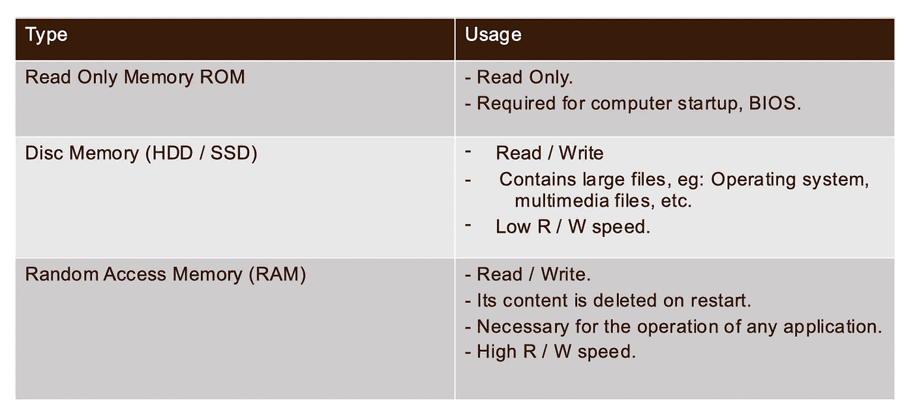

Types of memories in a computer

我们发现计算机中有三种主要类型的存储器，**只读存储器 ROM** 物理上包含在计算机的主板上，它包含启动 PC 所需的程序，这对于启动是必不可少的；它执行主要的输入/输出任务并保存程序或软件指令，另一方面，**磁盘存储器**用于保存大型文件，如操作系统和多媒体文件，与 RAM 相比，它的读/写速度较低。

**随机存取存储器(RAM)** 是一种易失性类型的存储器，这意味着它的内容不是永久的，它只在软件执行期间存在很短的一段时间，换句话说，RAM 为处理器处理的输入数据提供存储，并为产生的输出数据提供存储。

## JVM 如何使用 RAM？


The two main Java Memory types

Java 虚拟机(JVM)以两种主要方式使用 RAM 内存，第一种是**堆栈**，它是一种有序的数据结构，可以比作一本书放在另一本书上面，第二种是**堆**，没有特定的顺序。

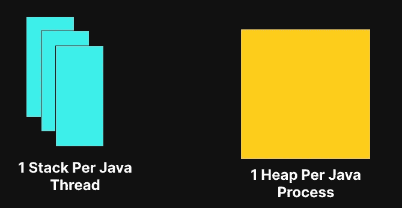

Stack Vs Heap

实际上，每个 Java 进程有 N 个堆栈，其中 N 等于正在执行的 Java 线程的数量，1 个线程= 1 个堆栈。

另一方面，每个 Java 进程只有一个 Java 堆。

让我们来看看下面的程序:

```
public class Stack {
    public static void main(String[] args) {
        int a = 10;
        int b = 20;
        if(a == 10) {
          int c = a + b;
        }
    }
}
```

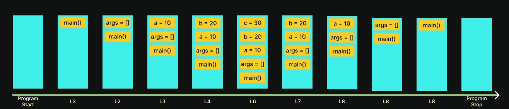

堆栈内存总是以后进先出的顺序引用。**无论何时调用一个方法，都会在堆栈内存**的顶部创建一个新的块，用于该方法保存本地原始值和对该方法中其他对象的引用，一旦该方法结束，该块就会从堆栈顶部弹出，与堆内存相比，堆栈内存的大小非常小。

让我们来看看下面的代码:

```
public static void main(String[] args) {
    int x = 1;
    int y = 2;
    String name = "FrenchTechLead";
}
```

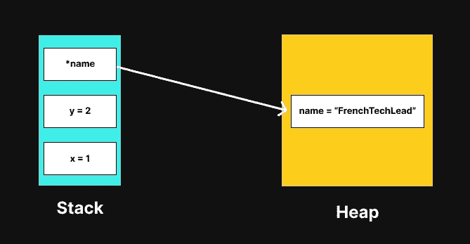

Stack and heap interaction

上面的例子表示了在执行 main 方法的最后一行代码时堆栈和堆的状态，我们注意到第一条指令在堆栈的底部，最后一条指令在堆栈的顶部，我们还注意到堆栈保存了原始值和对存储在堆内存中的非原始类型的引用。

## stack over flower error

让我们来看看下面的程序:

```
public static void main(String[] args) {
    toto();
}
public static void toto() {
    toto();
}
```

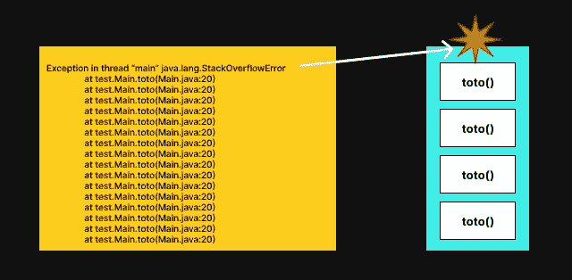

**StackOverflowError**

StackOverflowError 是 Java 和一般编程中非常常见的错误，它发生在堆栈内存内容溢出时。

就像我们之前说过的，每次方法调用都会在堆栈内存的顶部创建一个块，由于上面例子中的程序递归地调用“toto”方法而没有停止条件，所以会导致 StackOverFlow 错误。

## OutOfMemoryError 错误

让我们来看看下面的程序:

```
public static void main(String[] args) {
    List<String> list = new ArrayList<>();
    while(true) {
        list.add(new String("FrenchTechLead"));
    }
}
```


**OutOfMemoryError**

**OutOfMemoryError** 是 Java 世界中的另一个常见错误，它与堆内存有关，发生在没有更多堆空间分配给新对象时，上面的程序在字符串列表中创建新条目，直到没有更多堆空间为止。

## 内存泄漏

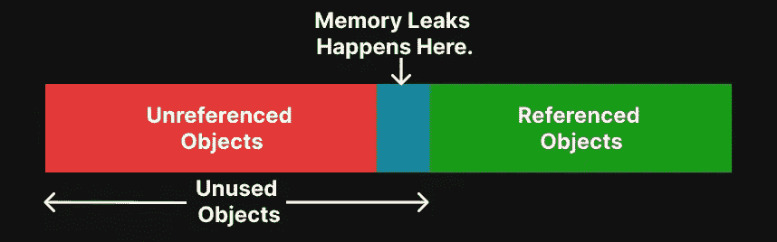

The cause of Memory Leak in Java

**Java 内存泄漏**发生在应用程序无意中(由于代码中的逻辑错误)持有不再需要的对象引用的时候。这些无意的对象引用阻止了内置的 Java 垃圾收集机制释放这些对象消耗的内存。

## 使用 Intellij 执行堆转储

使用 Java 生态系统的许多工具中的一种，有几种方法来执行 JVM 堆转储，大多数工具都非常相似，所以我们在这里看到的 Intellij 可以用任何其他工具来完成，如 VisualVM 或 JDK 任务控制…

> 下面程序的 infinit 循环将允许 java 进程在我们执行堆转储时运行。

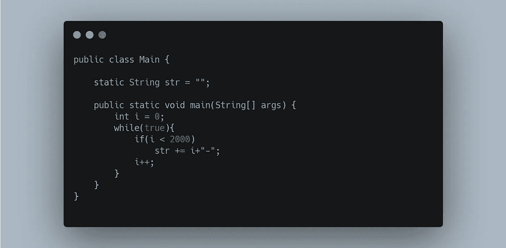

Simple Java program to analyse with Intellij’s Profiler

让我们在 Intellij 的 IDE 中运行这个简单的程序，并使用 Intellij 的默认分析器执行堆转储:

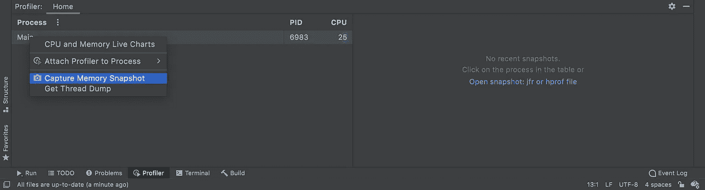

Capture a Memory Snapshot using Intellij

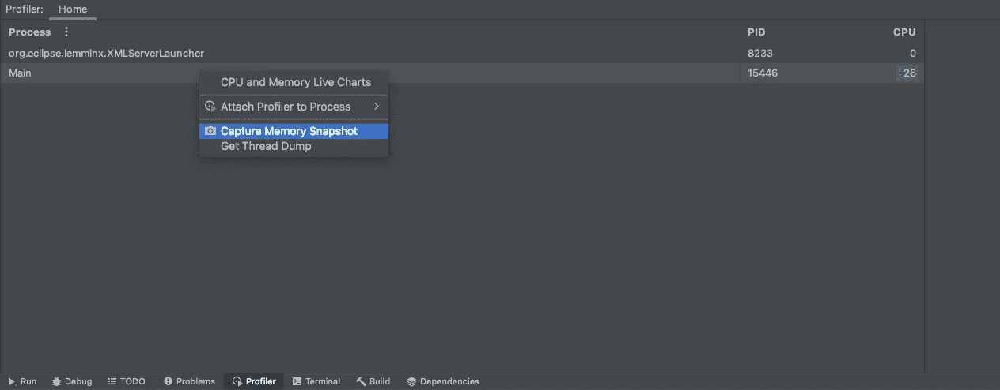

Capture a Memory Snapshot using Intellij

当捕获正在运行的进程的内存快照时，intellij 将创建一个. hprof 文件，并在以下选项卡中解析它:

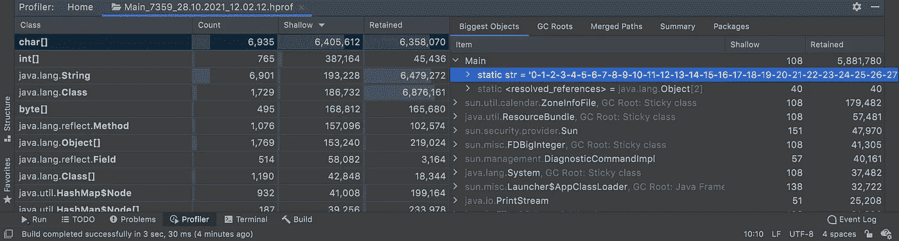

Heap Dump parsed content

我们发现程序中最大的对象是 Main 类型的(我们创建的类)，这是因为它包含了大型静态字段 str。

该视图显示了执行堆转储时堆内存的状态，这对于分析大型应用程序中的内存泄漏很有帮助，我们观察到，对于我们的简单 Java 程序，JDK 在堆上加载了许多对象，因此我们在将库包含到 Java 应用程序中时必须注意，因为它们会使堆内存过载。

在编写内存高效的 Java 代码时，有一些好的实践和必须做的事情，下面是其中的一些:

## Java 良好实践 1

总是在**中声明最小可能作用域**中的变量，这样垃圾收集器就能尽快地将它们收集起来。

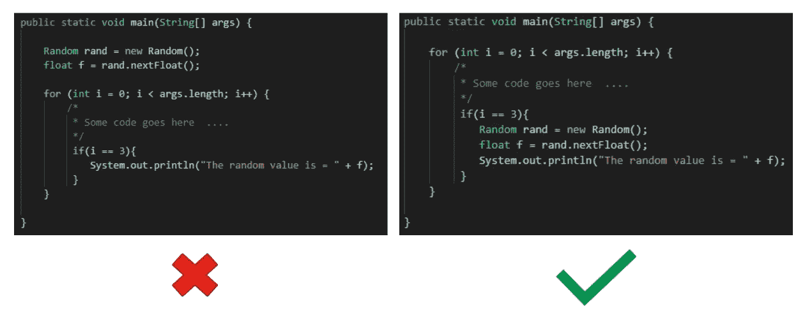

## Java 良好实践 2

**静态属性和方法的使用必须合理。**

Java 对象是在实例化时创建的，在取消引用后被销毁。静态属性和方法是在类装入器装入它们的类时创建的，只有当类装入器本身被 GC 拾取时才被销毁，因此只有在方便的时候才需要使用静态字段/方法。

## Java 必做

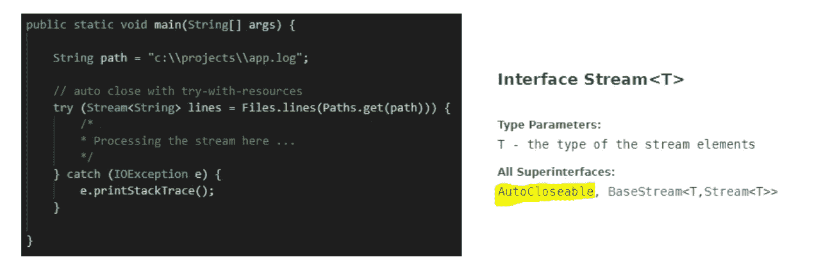

AutoClose IO Streams using try-with-resources

总是关闭 IO 流！

您需要确保在使用 IO 流之后关闭它们，您可以通过在跟随 **"try-catch"** 语句的" **finally** "块中关闭流，或者通过使用" **try-with-resources"** 语句来关闭流，但是为此，您需要确保您的 IO 流实现了可自动关闭的接口。

## Maven 良好实践

*   仅添加可靠的依赖关系。

确保您在项目中使用的库是可靠的、可维护的和设计良好的，一些库可能会导致内存泄漏。

*   **在项目中添加依赖项必须是合理的。**

您需要确保您在项目中使用的依赖项是必要的，您不会添加整个 Maven 库来只使用其中的一个方法，因为这只会向您的类路径添加不必要的条目。

*   **调整 maven 依赖范围(测试/运行时/编译…)。**

这将确保在方便的范围内将依赖项添加到类路径中，例如:测试库只在测试阶段需要，而不必在 Java 应用程序运行时由类加载器加载。

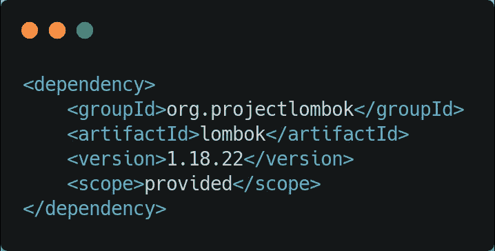

Adapt the scope of the Maven dependencies

## JVM 良好实践

*   定义为 JVM 初始化保留的内存量，例如:`-Xms256m`
*   定义 JVM 可以分配的最大内存大小，例如:`-Xmx2048m`
*   定义最适合您的配置的垃圾收集器执行模式，例如:`-XX: + UseSerialGC`

**就这样**，如果你觉得这篇文章有趣，请不要犹豫，让我发表评论和/或点击👏下面的按钮。

## 更多来自同一作者

[](https://mecheri-akram.medium.com/the-weirdest-java-interview-questions-that-you-ever-heard-of-2ec8b24be8ff) [## 你听说过的最奇怪的 Java 面试问题

### 这是一个收集了我个人在工作面试中遇到的最奇怪的 Java 面试问题的帖子，或者…

mecheri-akram.medium.com](https://mecheri-akram.medium.com/the-weirdest-java-interview-questions-that-you-ever-heard-of-2ec8b24be8ff) [](/geekculture/the-weirdest-bug-that-i-faced-during-my-software-engineering-career-4278fa40215f) [## 我在软件工程职业生涯中遇到的最大的产品缺陷。

### 在这篇文章中，我将描述我一生中遇到的最奇怪的 Internet Explorer 错误，我们是如何诊断它的，以及…

medium.com](/geekculture/the-weirdest-bug-that-i-faced-during-my-software-engineering-career-4278fa40215f) [](https://mecheri-akram.medium.com/how-i-created-a-new-programming-language-based-on-java-%EF%B8%8F-f88d0a522cca) [## 如何基于 Java ♨️创建自己的编程语言

### 我于 2017 年大学毕业，一年后，我的一位教授让我来教一些计算机科学…

mecheri-akram.medium.com](https://mecheri-akram.medium.com/how-i-created-a-new-programming-language-based-on-java-%EF%B8%8F-f88d0a522cca)