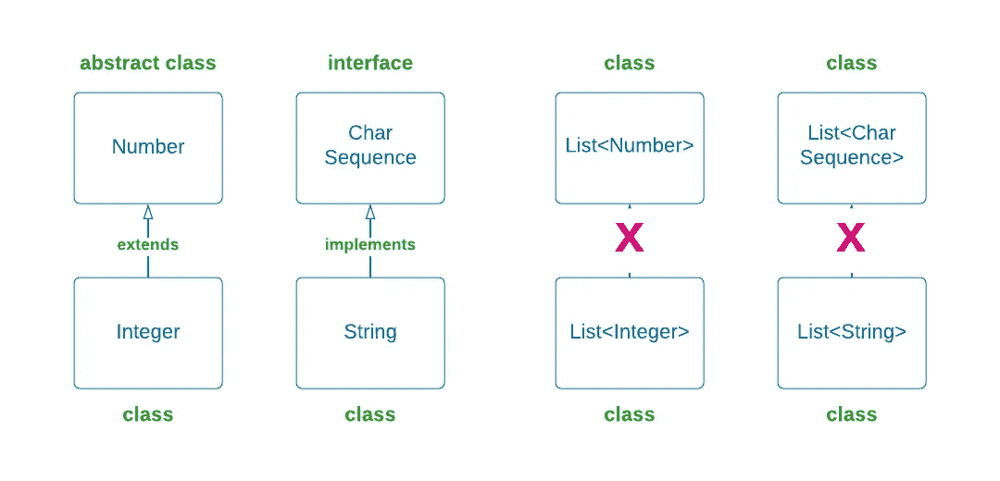
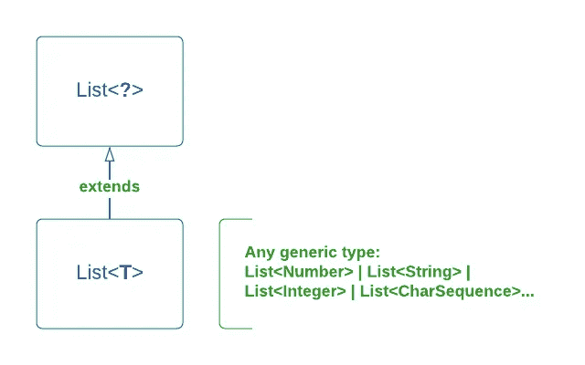
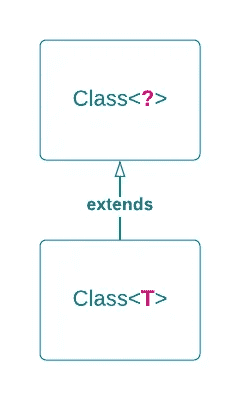

# 通过美丽水仙的神话反思 Java 基础知识

> 原文：<https://medium.com/geekculture/java-reflections-basics-through-myth-about-beautiful-narcissus-33873c253c7d?source=collection_archive---------12----------------------->

## Java 反射 API 网关简介

Narcissus, 1599 by Caravaggio

这是 Java 反思系列的第一篇文章。“倒影”这个词激发了我的想象力，画出了坐在溪边的水仙。长话短说，那西塞斯是一个非常美丽的年轻人。然而，他拒绝了所有浪漫的追求，尽管他受到男人和女人的钦佩。最终，他爱上了自己在溪水中的倒影，并在余生一直凝视着它。

所以，亲爱的，你最好喜欢希腊神话，因为我将通过水仙神话向你介绍 Java 反射。我将向您展示如何获取表示 Java 类型的给定类的基本数据。特别是关于它包含的方法和字段、它扩展的类以及它实现的接口的信息。

我们走吧！

# Java 反射简介

一般来说，Java 反射是一个 JVM 特性，它让我们可以在运行时访问关于应用程序的类和对象的信息。这是俗话所说的特征之一:

> “权力越大，责任越大”——这是一句古老的格言

换句话说，除非万不得已，否则不要使用它(很好的开端！).使用反射的风险主要来自于使代码难以维护和降低执行速度。但是，嘿，每个倒影都有两张脸，对吧？有一些广泛使用的框架利用了 Java 反射，比如 Junit、Spring 的 beans 和不同的 ORM 解析器。约束这些框架的是它们都处理“未知”类的事实。我的意思是，框架不知道它将要处理的类。

我在想，也许“未知”是让那西塞斯的死如此戏剧化的原因(在一个版本中，他自杀了，在另一个版本中，他试图亲吻自己的倒影时淹死了)。根据神话，那西塞斯被预言了许多年的生命，只要他没有看到自己。我是说，他不知道自己长什么样，直到他来到小溪边解渴。很奇怪，但关键是他一看到自己，就暗恋自己的倒影。不久之后，那西塞斯因单恋而死去…

无论如何，反射是一个非常酷的特性，所以让我们看看它的一些基本可能性。

# 反射 API 网关

在 Java 中,`Class<?>`是反映应用程序代码的入口点。该对象包含关于其运行时类型的所有信息。

有几种方法可以获得`Class<?>`对象。第一种方法是使用对象实例的`.getClass()`方法。

以下是三个不同具体对象的示例:

您可以对它们中的每一个调用`.getClass()`方法，并获得由`Class<?>`对象表示的各自的运行时类型。

注意，在 map 对象的情况下，调用将返回`HashMap`类，而不是它的`Map`接口。

顺便说一下，原始类，如`boolean`、`int`和`double`，不是对象，也不是`Object`类的继承。因此，将`.getClass()`应用到原语类会引起编译错误🤭。

另一种获得`Class<?>`对象的方法是在类型名后面附加一个`.class`。当我们没有实例，但无论如何需要特定类型的信息时，这种方法很有用。

这种方式最本质的一点是，它是获取原始类型 `Class<?>`对象的**唯一方式** **。**

一旦我们开始检查类成员的方法参数，例如，它肯定可以是一个原始类型，我们必须能够获得 Java 中所有类型的完整信息，而不仅仅是类。

获得`Class<?>`的另一种方法是使用静态`Class.forName(…)`。通过这种方法，我们可以使用类路径的完全限定名动态地查找任何类。

看一看被截取的最后一行代码。我们可以通过在外部和内部类之间使用`$`来访问内部类。

然而，这种获取`Class<?>`的方法是所讨论的三种方法中最不安全的。因为您更有可能打错字或提供不存在的类名。如果采取这些动作中的任何一个`ClassNotFoundException`将被抛出(nu shoin…)。然而，在一些用例中，寻找类型的`Class<?>`对象的`Class.forName(…)`方法是我们唯一的选择。

一个这样的用例是当我们想要在运行时检查的类型从用户定义的配置文件中传递过来时。使用这种方法，用户可以简单地通过改变外部文本文件来改变应用程序的行为。源代码被提醒没有变化，不应该重新编译。

方法的另外一个用例是当我们想要反映的类甚至不是我们项目的一部分时。换句话说，当我们编译代码时，这个类并不存在。但是，它会在运行时添加到应用程序的类路径中。如果我们在构建一个独立于将要导入和使用它的应用程序的库，这种情况是很有用的。

对于不存在的东西，我以反思的心态回到了水仙。很奇怪，一个到了恋爱年龄的男人竟然认不出自己的影子🤨。一个合理的解释是，那西塞斯爱上的是他的同卵双胞胎姐姐，而不是他自己(事实上这很正常)。她死后，那西塞斯非常哀悼她，以至于他会去河边看自己的倒影。尽管他认出了那个人是他自己，他仍然能够瞥见他所爱的人的形象。好吧，我可以买。

现在来说一个问号`<?>`。

# Java 通配符

复习一下 Java 泛型，尽管类`Integer`扩展了`Number`，但`List<Number>`不是`List<Integer>`的超类。同理，虽然类`String`实现了`CharSequence`，但是`List<CharSequence>`并不是`List<String>`的超类。

Java Generics

我们很酷？现在，`List<?>`是任何泛型类型的`List`的超类型。我的意思是，`List<?>`是`List<T>`的超类，对于任何泛型参数 t。

Java Wildcard

这种关系对于任何泛型类型都是成立的，包括`Class`，它也是泛型。

Class Wildcard

当编译器不知道确切的泛型类型时，定义通配符的能力非常有用，比如在`Class.forName(com.genezeiniss.Narcissus.java)` return 的情况下。通配符的另一个用途是当`Class`的通用参数是通用类型本身时:

让我们从理论转向实践。

# 实践中的 Java 反思

在这一部分，我将向您展示`Class<?>`对象可以为我们提供什么样的数据。为此，让我们用一个方法`destiny()`定义我们自己的接口`NarcissusAdmirer`。

水仙神话有几个从古代流传下来的版本。其中一个版本讲述了艾可和那西塞斯的故事。爱蔻深深地爱着那西塞斯，有一天她试图拥抱他。那西塞斯拒绝了她的求爱，彻底摧毁了她的心。被蔑视的回声在孤独的幽谷中度过了她的余生，直到她只剩下回声的声音。

另一个版本告诉我们一个名叫阿梅尼亚斯的年轻人爱上了那西塞斯。那西塞斯有拒绝男性求婚者的习惯，他也拒绝了阿梅尼亚斯。此外，他给了他一把剑(可能是为了引导他采取一些行动)。阿梅尼亚斯在那西塞斯的门口自杀了(我猜是用剑)。

接下来，让我们创建一个`printClassInfo()`方法，它聚集了`Class<?>`对象的基本能力。

嗯，正如您可能看到的，您可以获得一些关于您的`Class<?>`对象的信息，比如简单名称、包和超类。此外，您可以确定您的类是否是数组、原语、接口、匿名类等等。

现在，尝试在`Echo.class`上运行该方法，您将收到以下信息:

我们很酷？现在，试着为不同类型的类运行这个方法。

注意，基本类型不属于任何包。因此，对于`boolean.class`和`int[][].class`，包装名称将被打印为“无名称”。

接下来，让我们创造一些匿名的仰慕者(我害怕去想他的命运。让我们说这是积极的事情，改变一下)，并检查我们可以接收到什么信息。

在这个测试的输入中，您将看到类名将是`null`并且`.isAnonymousClass()`将返回 true。

待续🤓

在我的 [GitHub 库](https://github.com/genezeiniss/java-reflection)中查看这个故事的源代码。

# 附言

水仙尾也有不同的版本。在一个故事中，他从内心燃烧的激情之火中融化，在另一个故事中，他自杀了。然而，在所有版本中，他的身体消失了，留下的只是一朵水仙花🌼。