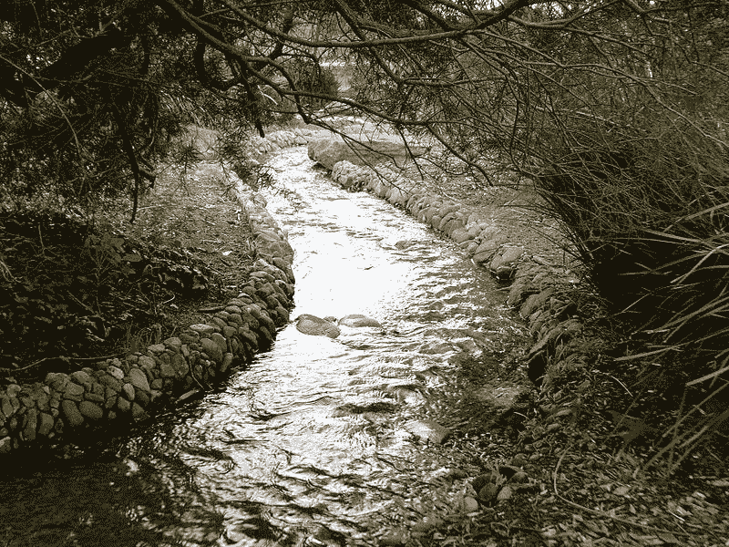

# Java 流:收集到带有分组依据的列表映射

> 原文：<https://medium.com/geekculture/java-streams-collect-to-map-of-lists-with-grouping-by-8cb309df4598?source=collection_archive---------4----------------------->

What a Beautiful Stream! Photo by [Sprocket2cog](https://commons.wikimedia.org/w/index.php?title=User:Sprocket2cog&action=edit&redlink=1) from [Wikimedia Commons](https://commons.wikimedia.org/wiki/File:Urban_stream_in_park.jpg)

## [从**流**，一张地图。](https://danio-quero.medium.com/java-streams-collect-a-stream-to-map-40480b96a38?source=your_stories_page-------------------------------------)的列表

我们发现将一个**流**收集到一个**地图**并不完全安全，在本文中: