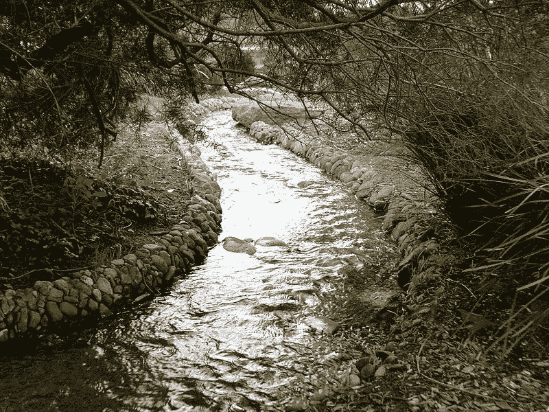

# Java 流:过滤器

> 原文：<https://medium.com/geekculture/java-streams-filters-89ba827254c6?source=collection_archive---------10----------------------->

## 使用 lambda 和谓词过滤掉元素

是时候在这条**溪流**上继续我们的旅程了，抱歉这个双关语。

What a Beautiful Stream! Photo by [Sprocket2cog](https://commons.wikimedia.org/w/index.php?title=User:Sprocket2cog&action=edit&redlink=1) from [Wikimedia Commons](https://commons.wikimedia.org/wiki/File:Urban_stream_in_park.jpg)

让我们继续看这篇[文章](/geekculture/java-streams-map-a8ca76cf28f9)中的例子。