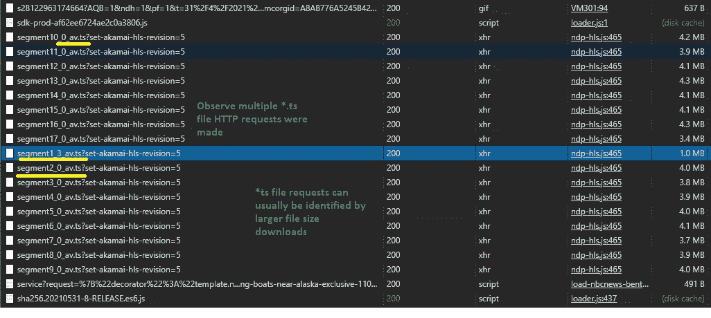
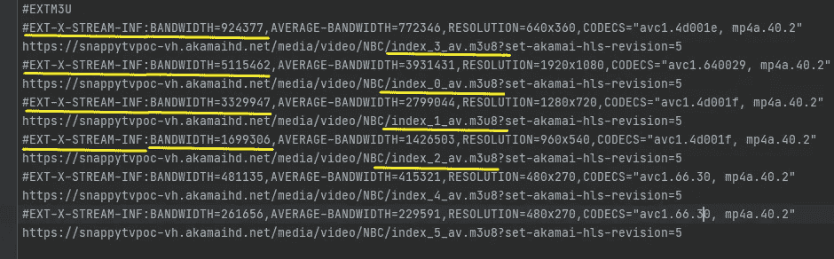
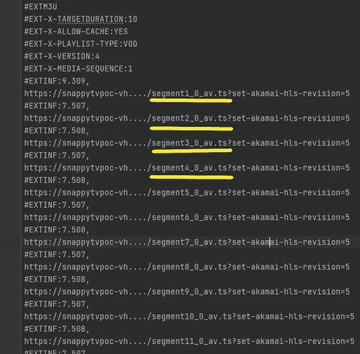

# Java TS 视频下载程序

> 原文：<https://medium.com/geekculture/java-ts-video-downloader-a0fcf23ab84a?source=collection_archive---------8----------------------->

你是否遇到过一个网站，上面有你想下载的视频，但是因为视频格式是**传输流** ( **TS** )文件而无法下载？

与 MP4 或 MOV 多媒体格式不同，大多数 ts 文件格式不在单个文件中包含完整的视频；相反，每个单独的 TS 文件代表完整视频的一个片段。在本文中，我将详细描述如何成功下载和组装 TS 视频文件，以制作一个完整的视频。

但如果你宁愿不去细说，这里是直接的 [**GitHub 项目源代码:**](https://github.com/Jet-C/java-video-downloader-util)

 [## jet-C/Java-视频下载器-util

### 视频文件下载工具。适用于*。ts 和*.mp4 文件-Jet-C/Java-video-downloader-util

github.com](https://github.com/Jet-C/java-video-downloader-util) 

# **TS 文件以及在哪里可以找到它们**

MPEG 传输流(TS)是一种用于传输和存储音频和视频的格式化数据文件。大多数互联网流和数字广播都是通过 TS 完成的，因为它允许接收客户端在传输开始时读取数据。因为分数**，接收客户端不会被迫等待下载完整的数据文件。ts** 文件通过网络连续发送。

变速器由多个**组成。ts** 文件碎片。要拼接完整的视频，必须先下载各个片段，然后再进行组装。视频的**。ts** 文件碎片可以通过获取网络日志中注册的 HTTP 请求获得。

Using the network logs, we can observe the website’s multiple HTTP requests for .ts files

您的浏览器如何知道如何恰当地组合所请求的大量文件？这就是 **M3U8** 文件发挥作用的地方。在**旁边。ts** 文件的 HTTP 请求，一个或多个对 **.m3u8** 文件的请求应该出现在网络日志中。

# MP3 URL (M3U8)和 Master M3U8 文件是什么？

M3U8 文件是简单的纯文本文件，包含**的元数据。ts** 文件片段或 **.m3u8** 文件。元数据包括几个数据指令标签和文件位置的映射。文件位置表示为完整的相对路径 URL 或系统目录。

主 M3U8 文件特别列出了可用的 **.m3u8** 文件变量的位置。这些变量代表不同的视频质量比特率，并映射**。ts** 与特定速率相关的片段。

拥有不同的比特率使客户端能够像浏览器一样选择产生较少缓冲的速率。根据您的网络连接，浏览器可以主动从较低的比特率切换到较高的比特率，反之亦然。在大多数情况下，较高的速率会产生质量较好的视频。

***注:*** ***M3U8*** *为* ***M3U*** *文件，明确说明 UTF-8 字符编码，但 M3U 文件可能使用其他字符编码标准。M3U 文件中描述的数据可能涉及许多类型的多媒体，而不仅仅是视频。*

以下主 M3U8 文件示例列出了可用的 **.m3u8** 文件变量的完整路径位置 URL。不同的比特率可以通过*“带宽”*标签来识别。

Master M3U8 files are distinguishable via their “EXT-X-STREAM-INF” directive tags

在示例 **.m3u8** 文件的变体下面，**。ts** 片段 URL 按照正确视频组装所需的顺序列出。

*.ts fragments are listed in the sequential order required for assembly

点击 [**此处**](https://developer.apple.com/documentation/http_live_streaming/example_playlists_for_http_live_streaming/creating_a_master_playlist) 和/或查看 [**此**](https://en.wikipedia.org/wiki/M3U) wiki 页面，访问主播放列表和 M3U 指令标签描述的深入文档。

# 视频下载工具

让我们深入了解下载器实用程序是如何工作的。

我们将使用 [**FFmpeg**](https://www.ffmpeg.org/) 命令行程序来汇编所有的**。ts** 文件碎片。在运行该实用程序之前，必须在您的计算机上安装该程序。

为了活捉**。ts** 文件片段我们将使用 [**Selenium**](https://www.selenium.dev/documentation/en/) ，一个浏览器自动化工具和网络实用程序 [**BrowserMob 代理**](https://bmp.lightbody.net/) (BMP)。它们的依赖项包含在项目的 pom.xml 文件中。

Project “java-video-downloader-util” Maven dependencies

## 步伐

1.  使用 Selenium 的 Chrome WebDriver，自动启动一个 Chrome 浏览器实例，并将其定向到托管 TS 视频的网站。
2.  BrowserMob 代理拦截来自网站的所有网络请求，并将它们记录到 HTTP 归档(HAR)文件中。
3.  过滤 HAR 文件中的 **.m3u8** 文件请求，并通过其“ *EXT-X-STREAM-INF* 标签识别主 m3u8 文件。
4.  从主 M3U8 文件中，检索与最高比特率 **.m3u8** 变量相关的 URL。比特率通过“带宽”指示标签来表示。
5.  下载每个单独的**。使用在 **.m3u8** 文件变量中列出的 URL 的 ts** 文件片段。片段的比特率将与变体的速率相匹配。
6.  一次全**。下载 ts** 文件片段，准备它们作为命令行参数，并将它们传递给 FFmpeg 程序。
7.  使用 FFmpeg，连接所有**。ts** 片段成一个完整的视频。

Requests are captured in a HAR file to facilitate filtering m3u8 files.

Concatenation of *.ts video files using FFmpeg command line

## 实用程序用法

您可以从 [**Github**](https://github.com/Jet-C/java-video-downloader-util) 下载该实用程序项目。

README.md

**其他注意事项**

每当视频托管网站涉及身份验证 Cookies、JWT 或其他必填字段时，浏览器 Mob 代理请求配置必须包括必要的标题参数。建议使用 Selenium WebDriver 来自动登录网站并检索任何所需的凭证。

如果网站使用倾斜的相对路径来识别视频的资源文件，可能需要进行特定的修改来自动下载视频。