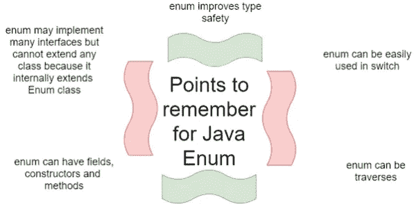

# Java 类型安全枚举历史

> 原文：<https://medium.com/geekculture/java-typesafe-enum-history-20053e8d0ea6?source=collection_archive---------11----------------------->



在这个故事中，我将概述 Java 中`enum`的演变。

***可以跳过这一段*** *。这里我会给你一些什么是 enum 的理论定义。面向对象视图:enum 是 Singelton* ***设计模式*** *的概括。Singelton 意味着我们最多可以有 1 个实例，enum 意味着我们正好有 n 个实例，其中 n 是编译时常数。这种观点在爪哇占主导地位，直到 JDK 14/15。功能视图:枚举是* ***不相交并集*** *的(差)实现。“真正的”Java 实现将* ***密封类*** *。密封类型是关于“有限数量的可能类型”* *而枚举是关于“有限数量的可能实例”。关于这一点的更多内容将在不同的故事中讲述，现在让我们来回顾一下历史。*

> *枚举类型指定一组相关常数作为其值。示例包括一周的天数、标准的北/南/东/西罗盘方向、货币的硬币面额以及词法分析器的令牌类型。*
> 
> *传统上，枚举类型被实现为整数常量序列，这由下面的方向常量集来演示:*

[https://www . infoworld . com/article/3543350/how-to-use-types safe-enums-in-Java . html](https://www.infoworld.com/article/3543350/how-to-use-typesafe-enums-in-java.html)

# 最初在 JDK 1.0 `enum`构造没有被采用。

上面描述的方法是 Java 语言设计者最初建议 Java 程序员处理 Java 缺少枚举特性的方法。

> 这种方法有几个问题
> 
> *** ***缺乏类型安全*** : *因为枚举的类型常量只是一个整数，所以在需要常量的地方可以指定任何整数。此外，可以对这些常数执行加法、减法和其他数学运算；例如* `*(DIR_NORTH + DIR_EAST) / DIR_SOUTH*` *)，这是没有意义的。*
> 
> *** ***命名空间不存在*** : *枚举类型的常数必须以某种(最好是)唯一标识符为前缀(例如* `*DIR_*` *)，以防止与另一个枚举类型的常数冲突。*
> 
> *** ***脆性*** *:因为枚举类型常量被编译成类文件，它们的文字值存储在类文件中(在常量池中)[参见下面我的旁注]，改变常量的值需要重新构建这些类文件和依赖它们的应用程序类文件。否则，运行时将出现未定义的行为。*
> 
> * ***缺少信息:*** *打印常量时，其整数值输出。这个输出没有告诉您整数值代表什么。它甚至不能识别常量所属的枚举类型。*
> 
> *使用* `*java.lang.String*` *常量可以避免“缺少类型安全”和“缺少信息”的问题。例如，您可以指定* `*static final String DIR_NORTH = "NORTH";*` *。..与整数比较不同，不能用* `*==*` *和* `*!=*` *运算符比较字符串值(这些运算符只比较引用)。*

[https://www . infoworld . com/article/3543350/how-to-use-types safe-enums-in-Java . html](https://www.infoworld.com/article/3543350/how-to-use-typesafe-enums-in-java.html)

另请参见[https://docs . Oracle . com/javase/8/docs/technotes/guides/language/enums . html](https://docs.oracle.com/javase/8/docs/technotes/guides/language/enums.html)

*旁注* : *“改变一个常量的值需要重新构建这些类文件和那些依赖于它们的应用程序类文件”。这种情况在我身上确实发生过几次。我正在源代码中更改*常量的值*，依靠 IDE 的*自动构建*功能，但是代码没有得到应该做的事情。经过几个小时的调试，我发现*常量的值*在运行时不会改变。我断定在类之间有一些奇怪的*链接*错误(这在我的 C++代码中早几年就发生了)。所以我只是让*干净*和*重修*。几个小时后，它再次发生。再一次。经过一番研究我已经弄清楚这是因为 ***恒池*** 。我决定禁用*自动建*功能*。*从那以后我再也没有重新启用过它。随着*自动构建*特性被禁用**，我意识到我在改变一些常量，所以我应该重新构建我的所有代码，包括我的客户端代码**。当我不改变任何常量时(大多数时候)，我只是使用一些额外的快捷方式来保存和重建。因为一些怪异的行为，我需要清理和重建是非常罕见的。*

引用:

> *这些问题导致开发人员发明了一种基于类的替代品，称为* `*Typesafe Enum*` *。*
> 
> [https://www . infoworld . com/article/3543350/how-to-use-types safe-enums-in-Java . html](https://www.infoworld.com/article/3543350/how-to-use-typesafe-enums-in-java.html)

从其他来源引用:

> *在他的优秀著作《有效的 Java 编程语言指南》中，Joshua Bloch 展示了如何在 Java 中使用类型安全枚举来定义一组命名值(参见第 21 项:用类替换枚举构造)。比如:*

> *现在如果创建一个* `*currentState*` *类型的* `*MachineStates*` *对象，它只能取值{* `*WAIT*` *、* `*NICKLE*` *、* `*DIME*` *、* `*QUARTER*` *}。超出范围的值将在编译时被捕获。*
> 
> 有一个封装了类型安全枚举功能的基类会很好。然后基类可以用来定义各种类型安全枚举子类:

和

> TypeSafeEnum 基类可以在这个[网页](http://www.bearcave.com/software/java/misl/enum/TypeSafeEnum.html)上找到或者在这里下载[。](http://www.bearcave.com/software/java/misl/enum/TypeSafeEnum.java)

[http://bear cave . com/software/Java/misl/enum/type _ safe _ enum . html](http://bearcave.com/software/java/misl/enum/type_safe_enum.html)

为了方便起见，我提供了*类型安全枚举*的源代码:

*注:*

*   这本书的第一次添加是在 2001 年，所以我怀疑它是在 JDK 1.3 上写的。它看起来仍然很奇怪，因为集合 API 在 JDK 1.2 中可用，但是使用了`java.util.Vector`(而不是`java.util.List`的一些实现，例如`ArrayList`)。注意，那个`java.util.Enumeration` 是`java.util.Iterator`的“旧式”。所需的修复很简单。
*   因为，这是 Java 5.0 之前的代码，所以它使用了`raw` 类(`java.lang.Class`在 JDK 5.0 中被通用化)。所需的修复是微不足道的。
*   命名约定:为什么是`getName()`和`getValue()`？有点有趣的是，`enumInfo`并不遵循 JavaBean 约定，但是`TypeSafeEnum` API 将自己暴露为 JavaBean。在`Java 5.0` `enum` 中对应的方法(有意地)没有遵循 JavaBean 约定。无论哪种方式，所需的修复都是微不足道的。
*   `getName()`和`getValue()`应做成`final`的样子。这是在`Java 5.0`枚举中完成的。我个人认为这不是一个大问题。如果有人想射进他的腿，没人能阻止他。`TypeSafeEnum`本身不依赖`getName()`和`getValue()`方法。无论哪种方式，所需的修复都是微不足道的。
*   在`Java 5.0` `enum` `hashCode()`作出`final`和`equals()`作出 `==`的比较:

这确保了`java.lang.Object's hashCode()`和`equals()`用于`Enum`的比较。这是一个非常有效的方法，它也可以和多个类装入器一起工作(下面会详细介绍)。从正确性的角度来看，这样做也是正确的。如果我们有两个具有相同数据成员的`enum`常量，我们希望将它们视为不同的实例。在`java.lang.Enum`中`"value"` (它被称为`ordinal` their)是由客户端代码提供的，所以我们不能依赖它。在这个实现中,`“value”`是在内部计算的，客户端代码无法破解它，所以我们可以用它来做比较。所以，*可以是 ok 的，不提供任何实现的* `*hashCode()*` *和* `*equals(),*` *可以提供上述实现或者基于* `*“value”*` *的比较。做出设计决策后，这种变更应该易于实现。*

*   在`Java 5.0`中`enum finalize()`方法被做成了空的和最终的。再说一次，如果有人想射进他的腿，它可能会这样做。我个人认为这是不需要的。无论哪种方式，所需的修复都是微不足道的。
*   在`Java 5.0`中`enum`是实现了`java.lang.Comparable`。从设计的角度来看，我们可以认为在每一个枚举中，我们都可以根据`*“value”*` *(在`Java 5.0` `enum`的术语*中的* `*ordinal*` )来定义*总顺序*。另一个人可能会说，这样的顺序并不总是有意义的。*无论哪种方式，所需的修复都很简单。**
*   在第 25 行`infoVec`应该声明为`final`。在 Java 8+中，这个变量将会是`*effectively final*`，所以它还不错(我仍然认为把它改成`final`只是为了可读性——为了清楚地表明意图),但是支持它们可以潜在地防止错误。*所需的修复是微不足道的。*
*   有趣的是，`enumInfo`并不是作为 JavaBean 创建的。首先，它的名字是小写，最好是大写。在这种特殊的情况下，我实际上可以不把这个类定义为 JavaBean，我不会坚持这个修正。*无论哪种方式，所需的修复都是微不足道的。*
*   不是很明显，但其实这个类是(*差不多* ) `Thread-safe`。代码执行离开构造函数后，类就是`immutable`。唯一需要修改的地方是在第 45 行，我们将常量`Enum` 发送给客户端。最简单的修复将是**制作返回**的防御副本`**Enumeation**`。*所需的修复很简单。*
*   *注意，*尽管我们在构造函数内部改变了`static infoVec`变量，但这种改变实际上是线程安全的。`infoVec`仅在构造函数之外读取。在构造函数内部，在该类的类加载器中强加了`TypeSafeEnum.class`上的`implicit lock` 。这种锁是 JLS 要求的。引用:

> 对于每个类或接口 C，都有一个唯一的初始化锁 LC。
> 
> *…。*
> 
> 对于每个类或接口 C，都有一个唯一的初始化锁 LC。从 C 到 LC 的映射由 Java 虚拟机实现决定。初始化 C 的过程如下:
> 
> *在 c 的初始化锁 LC 上同步。这包括等待，直到当前线程可以获取 LC。*
> 
> *…*

[https://docs . Oracle . com/javase/specs/jls/se8/html/jls-12 . html # jls-12 . 4 . 2](https://docs.oracle.com/javase/specs/jls/se8/html/jls-12.html#jls-12.4.2)

*   围绕`enumInfo.hashCode.`
    有一个非常微妙的问题，这个字段用枚举的类的 *hashCode 填充。可以认为是`getClass().hashCode()`。由于`infoVec`变量是`static`，所以我们的`**infoVec**` **将应用程序的所有类型安全枚举保存在一个大的** `**Vector**` **(列表)**中，其中*枚举的类的 hashCode* 作为*区分的*字段(见上图)。
    你应该在这里看到代码气味。
    这里有一些*性能*问题，例如，可能导致`OutOfMemoryError.`
    在 mutli 类加载器环境中也有一些*内存泄漏*相关问题。
    *所需的修复并不难，但很难考虑到所有问题。*下面我会回到这一点*(见下面关于缓存)*。*
*   缺少两个方法。`findEnumByValue()`和`findEnumByName().`客户端代码可以获得`Enumeration` (这将花费与应用程序中类型安全枚举的数量成比例的时间，这实际上可能很长，尤其是如果我们使用多个类加载器，见下文)，然后它应该使用比较(并依赖于`getName()`和`getValue()`)找到正确的一个！).这与`Enum`中的常数数量成比例。*这个任务很难，但是可行(见下面关于缓存的内容)。[见【https://bugs.java.com/bugdatabase/view_bug.do? bug_id=5058132](https://bugs.java.com/bugdatabase/view_bug.do?bug_id=5058132)*
*   在`Java 5.0`中`enum` 覆盖`java.lang.Object’`的`clone()`方法为`throw new CloneNotSupportedException()`。上面的实现没有做到这一点。这实际上是强制性的修复，否则我们就为创建新的常量提供了漏洞。*所需的修复很简单。*
*   在`Java 5.0`中`enum`提供了`readObject()`和`readObjectNoData()` 的方法即`throw new InvalidObjectException()`的方法。这样做是为了阻止使用序列化机制创建新的`enum`实例的能力。也可以用另一种方式实现，用现有的枚举替换序列化的枚举(基于它的`getName()`和`getValue()`)。重点是阻止创建新实例的能力。*所需的修复很简单。*
*   还有一个微妙的问题是这些代码是否正确地**同步**。我认为是这样的，但原因并不明显。首先，根据 Java 语言规范，*类初始化是自顶向下进行的，静态初始化应该在非静态*之前完成。

***注:这部分比较复杂，可以跳过，从“上表看一看”开始继续阅读。***

尽管如此，代码仍然是非常脆弱的**，*如果你稍微改变变量声明的顺序，它就可能变得不正确(*边注*:这实际上也发生在我身上，花了很多时间来理解为什么我的代码突然停止正常工作)，并且不容易推理。让我们考虑一些基于[https://stack overflow . com/questions/2547713/why-static-fields-is-not-initialized-in-time](https://stackoverflow.com/questions/2547713/why-static-fields-are-not-initialized-in-time)的更简单的例子*

*如果我们运行这段代码，屏幕上会显示什么？如果您已经猜到输出是:*

```
*nullnullMyClass@15db9742null*
```

*请接受我的祝贺。*

*简化解释如下:为了运行 main，应该先初始化`MyClass` 。初始化是自顶向下的，静态初始化应该在非静态初始化之前完成，所以第 3 行中的第一个初始化将会发生。第一部分是对构造函数的调用，所以我们跳到第 7 行。我们仍然在静态初始化块中，但是现在我们在非静态上下文中运行(*旁注*:这就是为什么不推荐从构造函数调用方法的原因——它们可能对应未初始化的非静态字段)。因为它们还没有被初始化，所以它们有`null`值(它可能包含垃圾，就像 C；这个其实是 JVM 保证的)。所以，我们会看到 2 `null`印在控制台上。然后我们将退出构造函数，回到第 3 行，用 object 初始化`myClass`字段(尽管`myclass2` 仍然是`null`)。那我们就去 4 号线。同样，将调用构造函数。在构造函数中，我们引用静态字段— `myClass` 被初始化，所以我们看到它的非空值，但是`myclass2`仍然是`null,`，所以我们看到`null`被打印出来。然后我们将退出构造函数，没有什么(有趣的)事情可做了。*

*详细解释如下:*

> **这是当你第一次引用类* `*MyClass*` *时 JVM 经历的顺序。**
> 
> ***将字节码载入内存。**
> 
> ***静态存储的内存被清除(二进制零)。**
> 
> ***初始化类:**
> 
> **1。按照出现的顺序执行每个静态初始化器，这包括静态变量和* `*static { ... }*` *块。**
> 
> **2。JVM 然后初始化【JVM 持有*初始化锁 LC，见上面*你的* `*myClass*` *静态变量到* `*MyClass*` *的新实例。**
> 
> **3。当这种情况发生时，JVM 注意到* `*MyClass*` *已经被加载(字节码)* ***并且正在被初始化*** *的过程中，所以它跳过【静态】初始化。**
> 
> **4。在堆上为对象分配内存。**
> 
> **5。执行构造函数。**
> 
> **6。打印出* `*obj*` *的值，它仍然是* `*null*` *(因为它不是堆和构造函数初始化变量的一部分)。**
> 
> **6。当构造函数完成时，执行下一个静态初始化器，将* `*obj*` *设置为* `*Object*` *的新实例。**
> 
> ** *类初始化完成。从这一点来看，所有的构造函数调用都将如你所想的那样运行——也就是说* `*obj*` *将不是* `*null*` *而是对一个* `*Object*` *实例的引用。**
> 
> *…*
> 
> **还要注意，这都发生在第一次引用该类的同一个线程上。其次，* **JVM 保证在任何其他线程被允许使用这个类** [ *JVM 持有*初始化锁 LC，见上】*。**

*[https://stackoverflow.com/a/2557613/1137529](https://stackoverflow.com/a/2557613/1137529)*

*我将重复: **JVM 保证初始化将在任何其他线程被允许使用这个类之前完成。**实际上，JVM 在初始化过程中持有*初始化锁 LC* 。因为这个这个**锁，** `**TypeSafeEnum**` **的代码是线程安全的**；`infoVec`在任何`TypeSafeEnum` 实例之前被初始化；`infoVec`只改变**在`TypeSafeEnum` 的构造函数内**(即在初始化锁 LC 下；`findInfo()`也在初始化锁 LC) **下执行。这不是微不足道的陈述，而是真实的。***

***复杂零件结束***

*看看上面的列表。虽然上面的大部分都很简单(我一会儿会回到难的那一点)，但有很多并不明显。事实是，有许多提议的*类型安全枚举的“标准”实现，*包括 Joshua Bloch 的一个，遗漏了其中一些。*

*这里要告诉你的是，2006 年在 JDK 1.4 的某个地方，我做了自己的实现。当 5 出来的时候，我做的第一件事就是看 Sun(Oracle 后来收购了 Sun)对`enum`的实现。*

*实现并不完全相同，但涵盖了所有问题。例如，我的实现考虑到了`Serialization`漏洞，虽然不是通过完全阻止它，而是通过实例替换。例如，我也没有实现`java.lang.Comparable`接口。*

*有 4 个问题实际上很难解决:*缓存*、 *GC* 、*类加载器*、*扩展性。**

*我的缓存实现与 Sun 的完全不同。我不能增加`java.lang.Class`来在其中存储`enum constants`(这样一些垃圾收集(GC)相关的问题就解决了，下面会详细介绍)并且改变`javac` ——Java 编译器不是我考虑的选项之一。:-) )*

*我的缓存实现如下: *TypeSafeEnum* 有`private` `**static** HashMap` ，键为`String`(是`YourEnum.class.getName()`)，值为`HashMap` ，键为`String`(是`getName()`)，值为 *enum 常量*。在*typesafenum*中有`public static TypeSafeEnum` `valueOf(Class enumClass, String name`)函数有明显的实现。还有一个在构造函数中调用的`protected addEnum()`方法，用于将`enum`常量放入缓存。*

*基本思想是 *TypeSafeEnum* 包含从他那里继承的所有枚举的缓存——每个枚举的常量按照它们的类名(作为字符串)分组。在`enum`构建完成后，你应该只能通过`valueOf()` 函数来访问这个缓存。您可能可以访问其他人的枚举，但是您应该提供该访问的`Class`对象。如果您可以访问`Class` 对象，那么向您提供对这个`Class`的实例的访问是可以的。*

*现在，你可能有以下问题:*

1.  *为什么缓存是`static`？*
2.  *为什么外键是`String`而不是`Class`？*
3.  *为什么内部缓存是`HashMap` 而不是`ArrayList`？*

*让我们开始逐一回答这些问题。*

1.  *你可能认为缓存是`static` 为了能够被`public static TypeSafeEnum` `valueOf(Class enumClass, String name`)函数访问。这只是原因之一。在`*initialization order*` 的 enum 中还有更微妙的原因。为了演示我所说的，我将提供一些来自 *Java 语言规范*的例子。*

> ***例 8 . 9 . 2–2。对枚举常量自引用的限制***
> 
> *如果没有关于`*static*`字段访问的规则，显然合理的代码会在运行时失败…下面是一个会失败的代码的例子:*

> *这个枚举的静态初始化会抛出一个`*NullPointerException*`，因为当枚举常量的构造函数运行时`*static*`变量`*colorMap*`未初始化。代码可以很容易地重构以正常工作:*

> **重构后的版本显然是正确的，因为* ***静态初始化自顶向下发生。****

*[https://docs . Oracle . com/javase/specs/jls/se8/html/jls-8 . html # jls-8.9](https://docs.oracle.com/javase/specs/jls/se8/html/jls-8.html#jls-8.9)*

*是的，我在实践中遇到过这种情况。这是如此糟糕，以至于 Sun 增加了具体的规则，在编译时拒绝上述代码。*

*使用`static`字段，只需按照描述进行简单的代码重新排序和重构就足够了。对于`non-static`字段，无论`*TypeSafeEnum*`如何扩展，都很难有工作代码(因为`static`字段首先被自顶向下初始化，而`non-static`字段被初始化，但是在`enum` 类的构造函数中，我们调用了`addEnum`类，这可能会导致尚未初始化的字段的意外初始化(*更多详细信息，请参见上面的* `*MyClass*` *复杂示例* ) …这真是一团糟，为了避免这种情况，最好将缓存声明为`static,`*

*2.*为什么外键是* `*String*` *而不是* `*Class*` *？**

*有两个原因:*类加载*相关和 *GC* 相关。*

## *让我们从类加载问题开始。*

****这一节比较复杂，你可以放心地跳过它，继续阅读与 GC 相关的问题。****

*在我的设置中`*TypeSafeEnum*` 属于某个 infra 项目，所以它被打包在某个`jar`中。`Tomcat` web 服务器托管多个应用程序，这些应用程序被打包在单独的`war`文件中(您应该记得，那是 2006 年，支持它们)在同一个`web server`上托管多个应用程序是正常的做法；更不用说，手动安装和配置`Tomcat`并为其部署应用程序是正常的做法。所以，我有多个`war`文件，其中有`jar`的副本，而`jar`中有`*TypeSafeEnum*`**。***

**因此，在 JVM 中，我们为每个 war 文件提供了*类加载器，并且为* `*jar*` *文件*提供了*单独的类加载器。所以，每个`war`级装载器都有它自己的**`jar`级装载器。你可以在这里阅读[http://Tomcat . Apache . org/Tomcat-6.0-doc/class-loader-how to . html](http://tomcat.apache.org/tomcat-6.0-doc/class-loader-howto.html)以及更多细节。*****

> ****注意:*虽然可以将* `*jar*` *放到* `*shared*` *lib 中，并且使用这种方式我们可以拥有* `*shared jar*` *类加载器，这将导致在内存中只有 1 个* `*TypeSafeEnum*` *，这样的尝试实际上是非常有价值的。你可以在这里阅读*[*https://stack overflow . com/questions/267953/does-Tomcat-load-the-same-library-file-into-memory-two-if-they-is-in-two-web*](https://stackoverflow.com/questions/267953/does-tomcat-load-the-same-library-file-into-memory-twice-if-they-are-in-two-web)*仅引用此链接中的一句话:*****
> 
> ****将库放在 commons 目录中可能是危险的，只有在您可以控制部署哪些 webapp，以及每个 web app 使用的库的**版本是什么的情况下，才必须使用它…******
> 
> ****因此，你不能拥有不同版本的共享 jar。但还有更多】。****
> 
> *****在这种情况下，您将有 1 个* `*TypeSafeEnum*` *，其中 1 个缓存保存从不同的* `*war*` *类加载器加载的* `*enum*` *。这会导致*应用程序重新部署*的问题。如果我想重新加载某个应用程序*`*A.war*` *Tomcat 在幕后做的事情，它抛出应用程序类加载器，加载* `*A.war*` *的所有类。这将导致 GC 收集所有这样的类，这样它们可以被新创建的专用* `*war*` *类加载器重新加载。但是现在，我有了位于* `*shared jar*` *类加载器中的缓存，它间接保存了对已加载类的强引用，所以重载会失败。这种情况的可能解决方案是使用* `*WeakHashMap*`。****
> 
> ****注意:*这需要小心:我们不希望* `*enum*` *常量在应用程序运行过程中消失。这确实发生在我身上，所以我把原来使用的* `*WeakHashMap*` *换成了* `*HashMap*` *。*****
> 
> *****下面我再回到这一点。*****

****我们最终得到了多份`*TypeSafeEnum*` 坐在记忆中。但是它们存在于完全独立的类装入器层次结构中(从应用程序 A.war 类装入器装入的用户定义类不能访问从应用程序 B.war 类装入器装入的用户定义类)。因此，虽然我们确实有一些浪费，磁盘上的*—*相同的`jar`和内存中的*的多个副本—* **我们实际上有多个** `***TypeSafeEnum.class***` 的实例，将**留在内存**中，但是它们不能相互交互，因为 Tomcat 提供了类加载器隔离。所以，它并没有消除任何 ***实际的*** 问题，事实上，我们可以使用`Class`作为地图中的一个键。然而，还有一个与 GC 相关的问题，我将在下面讨论。****

> ****附注:*在我的下一份工作中，我们已经将应用程序从 Tomcat 转移到 JBoss。最初 JBoss 配置错误(这样做是为了解决与类路径相关的问题；JBoss 使用 logger 和我们使用相同的* `*jar*` *进行日志记录，但是版本不同，我们要使用我们的* `*jar*` *进行日志记录里面的* `*war*` *和 JBoss 的 logger for JBoss——这样的问题最终导致了* [*Java 平台模块系统*](/swlh/java-platform-module-system-953cc88658fb) *at JDK 9)。观察到的行为是，在第一次用户请求时，我们在 Logger 类上获得了* `*ClassClassException*` *。应用程序正常启动，并用日志程序初始化，但是在第一次用户请求时，我们有奇怪的* `*ClassClassException*` *说* `*org.apache.log4j.Logger*` *不能转换为* `*org.apache.log4j.Logger*` *。当向我显示这个异常时，我立即想起了上面描述的场景，实际上我可以用两个不同的类装入器装入同一个类。这有助于我们追踪问题，初始化代码是用不同的类加载器运行的，不是用* `*war*` *类加载器，而是用它的父类加载器。再次，它发生了，因为 JBoss 的错误配置，这是固定的。我们以不改变类加载器用法的方式解决了 JBoss 中不同版本的* `*logger*` *。*****

# ****使用`String`而不是`Class`作为缓存中的外部关键字时出现与 GC 相关的问题****

****如果你使用`HashMap`作为缓存，使用`Class`作为键，你*可以*阻止`enum`被垃圾收集。****

****引用:****

> *****…应该注意确保值对象不会直接或间接地强烈引用它们自己的键，因为这将防止键被丢弃。*****

****[https://docs . Oracle . com/javase/8/docs/API/Java/util/weakhashmap . html](https://docs.oracle.com/javase/8/docs/api/java/util/WeakHashMap.html)****

****因此，使用`String`而不是`Class`可以防止 GC 无法丢弃`enum`的可能性，因为我们将它的`Class`作为键。****

****例如，如果我们的`enum`正在使用`war`类加载器加载，并且我们想要重新部署我们的应用程序，Tomcat 将通过当前的`war`类加载器，GC 应该丢弃所有加载的类。如果`***TypeSafeEnum***` 是使用某个不同的不可丢弃类加载器加载的，这将防止此类`enum`被丢弃。所以，使用`String`和`Class`可以提前避免这样的陷阱。****

> ****注:*有一个极端案例是我认识到的，而*被设计*忽略了。我们可以把* `*enum*` *说成* `*com.company.entities.MyEnum*` *那是在*`*jar*`*-文件里面定义的和在*`*war*`*-文件里面重新定义的* `*com.company.entities.MyEnum*` *。这样做是为了“覆盖”某些类定义。在常规的类加载机制下，这工作得很好，将只有 1 个* `*java.lang.Class*` *表示* `*com.company.entities.MyEnum.*` *但是我可以编写代码，这也将从* `*jar*` *文件中加载* `*com.company.entities.MyEnum*` *(通过显式指定* `*jar's*` *类加载器；而且我可以相当容易地得到* `*jar's*` *类加载器的参考)。在这种极端情况下，我将有两个* ***分布图*** `*java.lang.Class*` *，它们都代表* `*com.company.entities.MyEnum*` *，但是如果我使用* `*String*` *而不是* `*Class*` *，我就不能同时存储它们。我只是忽略了这个问题，我不认为这是实践中会发生的事情。*****

****看看`java.lang.Enum`的缓存的 JDK 5.0 实现是有启发性的。这样的缓存不保存在`java.lang.Enum`对象内，而是保存在`enum`的`java.lang.Class`对象上。****

****将缓存存储为`java.lang.Enum`内的`HashMap`将是错误的。`java.lang.Enum`由系统类加载器加载，直到 JDK 9，理论上甚至不可能丢弃由它加载的类(JDK 的模块化确实提供了这样的理论可能性，参见 [*Java 平台模块系统*](/swlh/java-platform-module-system-953cc88658fb) *)。因此，如果某个应用程序`A.war`已经定义了某个`enum`，并且它的实例存储在由系统类加载器加载的`java.lang.Enum`对象中，我将始终拥有对该`enum`的强引用，并且它不能被丢弃。*****

****因此，Sun 选择了下面的方法:不将所有`enum`的缓存存储在`java.lang.Enum`对象中，而是将它们存储在……`java.lang.Class`中。**孙的修改实际上** `**java.lang.Class.** java.lang.Enum.valueOf(Class<T> enumType, String name)`实际上是从`Class<T> enumType`取回缓存。为了实现这一点，JDK 5' `enum` s 被做成*实际上是不可扩展的——你只能在直接继承`java.lang.Enum`的类中定义`enum’s contant`。我将在下面回到这一点。*****

****当缓存存储在代表`enum`的`**java.lang.Class**` 中，而不是存储在`java.lang.Enum,`中的一个位置时，这实际上使 GC 变得容易。因为`enum` 实例和它的`java.lang.Class` 保证由同一个类装入器装入，我们实际上是将`enum`的缓存存储在由同一个类装入器装入的对象中。所以，如果 GC 想要丢弃这个`enum` 对象，它的`java.lang.Class` **里面的缓存`cache`的存在不会阻止垃圾收集。******

****3.**为什么内部缓存是** `**HashMap**` **而不是** `**ArrayList**` **？******

****这是个有趣的问题。我选择`**HashMap**` 而不是`**ArrayList**` 的主要原因是性能考虑。我以为从*理论*的角度来看，查询`**HashMap**` ，不迭代`**ArrayList**` **，会快很多。******

****后来我做了一些测量，我发现*直到某个阈值，实际上迭代整个* `*ArrayList*` */* `*array*`比使用`**HashMap**` **花费的时间要少。**非常有趣的是`java.util.EnumSet`使用阈值 64 来确定是否足够具有“常规”大小或“大”大小，因此将使用替代实现。****

****`java.lang.Enum.valueOf(Class<T> enumType, String name)`用途`HashMap`。****

****有趣的是`java.lang.Class`有 3 种不同风格的缓存:****

*   *****包-私有*返回`HashMap`的`enumConstantDirectory()`。专门用于`java.lang.Enum.valueOf(Class<T> enumType, String name)`内部。它在第一次使用时被初始化`HashMap`(注意:它也是`volatile` (和`transient`——这个没那么有趣)。****
*   *****包-私* `getEnumConstantsShared()`即返回`array`。这个方法使用一些巧妙的技巧来调用编译生成的`values()`方法，该方法原样返回 enum 常量的`array`。它在 JDK 被广泛使用。比如里面的`java.util.EnumMap`和`java.util.EnumSet`。(它使用一些助手类，允许另一个包中的类访问包私有方法)。它在第一次使用时被初始化`HashMap`(注意:它也是`volatile` (还有`transient`——这个没那么有趣)。****
*   *******公有*** `getEnumConstants()` 的方法，对每一个叫**克隆体的** `getEnumConstantsShared()`阵列。****

****因此，我们可以看到 3 种不同的使用模式。内部`java.lang.Enum.valueOf(Class<T> enumType, String name)`在第一次使用`HashMap.`时初始化，用于**公共**使用，它返回**防御性复制** `array,`，因此如果 JDK 之外的人想要实现缓存，预期的使用是`array`而不是`HashMap`(但同样，JDK 本身更喜欢`HashMap`)。对于 JDK **内部**的使用，而不是`java.lang.Enum.valueOf(Class<T> enumType, String name)` JDK 更喜欢使用`array`进行缓存。它绕过了制作防御性副本(我猜是因为性能原因)，但它仍然使用了`array`表示。****

****所以，这里有一些歧义。我认为这真的取决于你如何使用缓存。如果你只需要找到正确的枚举常量(例如，通过名字)，那么使用`HashMap` *可能*是有意义的(同样，这实际上取决于你拥有的枚举常量的数量，如果你有，比方说，3 个常量，那么使用`array`将会更快*)。但是如果你需要遍历所有的 enum 常量，例如在`EnumSet`的情况下，那么使用`array`作为缓存肯定更好。你会想要绕过防御副本。一种方法是对`java.lang.Class`的 ***公共*** `getEnumConstants()`方法进行一次“昂贵的”调用，并将调用结果存储在某个数据字段中。当然，您应该考虑适当的**同步**(至少，您应该将您的数据字段定义为`violatile`)。*****

# ****展开性****

****这其实很难。我先从实际的角度来描述这个问题。****

****我在一些基于 SQL 的数据库中有主表。它有一些属性，比如保存 id 的*Color*和指向至少有属性 id 和名称的颜色表(我称之为*查找*表)。因此，在我的表中，我的属性具有*颜色*，例如，值 1，在颜色查找表中有 id=1、name=white 的行。****

****现在，我想在 Java 代码中表示*主*表。我可以使用一些 ORM 框架，或者依靠 Spring Repository，或者实现我自己的 DAL，这与本文的目的无关。我有哪些选项来建模*颜色*属性？****

****它可以是 integer、java.lang.String 或 Enum。现在，你可以回到文章的开头来说服自己，通常情况下你会喜欢使用 Enum。****

> ****旁注:*在我目前从事的项目中，我实际上选择了字符串。首先，我目前的项目是 Python 上的，不是 Java 上的。第二，我用的是 Postgress。选择 Postgress 的原因之一是它支持数据库级别的 Enum。在我的例子中，我根本没有*查找颜色*表。相反，我有* maintable_colour **枚举类型。** *我的主表有类型为* maintable_colour 的属性 colour *。*当我对* colour *属性进行插入/更新或选择时，我只看到字符串(有时，我需要进行一些显式转换，例如，如果我想要枚举*的*数组的类型)。然而，在内部，每个枚举常量由 4 个字节表示(如 Java 中的* `*int*` *)，这就好像 postgresse 使用了来自*typesafenum*的* `*value*` *或来自* java.lang.Enum *的* `*ordinal*` *以及从* `*int*` *到特定于 postgresse 的字符串的一些转换逻辑，但在概念上与在*typesafenum*或*中相同*****
> 
> ****我使用 String 的原因:*在后端，我没有使用 enum*的任何操作。实际上，我正在获取数据(解析为 java.lang.String ),并将 enum constrant 原样传输到 DB。它保持不变，成为我用来与数据库交互的库(它实际上理解数据库级别的 Enum，并对它进行一些操作，如添加显式强制转换；在大多数情况下，这些操作对代码是完全透明的)。因此，从后端的角度来看，它接收字符串并将字符串发送到数据库。一切都是可读可贬的。主表和*查询*表之间没有额外的查询调用或连接。在 DB 存储级别，该字符串被转换为 4 个字节，因此是高效的。****
> 
> ****当然，如果将要存储在数据库中的字符串不代表某个枚举常量，将抛出验证异常以保持数据的一致性。****
> 
> ****有关更多信息，请参见*您会在 SQL 中使用 ENUM 做什么？[https://DBA . stack exchange . com/questions/231795/what-you-use-enum-for-in-SQL](https://dba.stackexchange.com/questions/231795/what-would-you-use-enum-for-in-sql)*和*枚举类型[https://www.postgresql.org/docs/13/datatype-enum.html](https://www.postgresql.org/docs/13/datatype-enum.html)***

***因此，如果您想用 Java 对主表的 c *olour* 属性建模，选择 java.lang.Enum 是很自然的(如果您的 DAL 支持 Enum，这在很长一段时间内都不是问题)。标准的做法是在编译时创建 enum 并复制 lookup *Colour* 表的内容。***

***如果数据是静态的，这是足够好的解决方案。但是如果表*的内容是动态的*或者在编写代码的时候是未知的呢？***

***我说的*动态*内容是什么意思？如果我们回到我们的例子，如果我们的系统支持的*颜色*可能会随着时间而改变。在这种情况下，最好用不同的表来建模。***

***我说的内容不明是什么意思？嗯，我的意思是，我们有一些通用代码，可以用于不同的特定表格。它不是任何表，它应该是满足某些特定约束的表。*颜色*本身可以有不同的支持值集，但它可以因实例而异。在这种情况下，对于每个特定的*实例*，我们有*静态*内容，但是与特定的*实例一起工作的(通用)代码(*特定的 main+查找表)不知道内容。***

***上面描述的场景不是理论上的，因为它，我实际上实现了我自己的 enum 实现。***

***因此，在这种情况下，我不能在编译时“仅仅”创建 enum。我想做的是在代码级别有一些类型安全的类型，它们将被转换成 DB 级别的`int`。***

# ***关注`java.lang.Enum,`很有趣，它支持这样的用例吗？***

***引用:***

> ****枚举声明是隐式的* `*final*` *，除非它包含至少一个具有类体的枚举常量……****
> 
> ****枚举类型 E 的直接超类是*`*Enum<*`*E*`*>*`*…****
> 
> ****除了由枚举常量定义的实例之外，枚举类型没有其他实例...****

***[https://docs . Oracle . com/javase/specs/jls/se8/html/jls-8 . html # jls-8.9](https://docs.oracle.com/javase/specs/jls/se8/html/jls-8.html#jls-8.9)***

***如你所见，`java.lang.Enum`是*几乎是*最终。你可以声明`YourEnum` 来扩展`java.lang.Enum.`*枚举常量*可以有类体，但是**明确禁止添加新的*枚举常量*，除了那些在`YourEnum`中编译时**定义的。***

***什么是具有类体的*枚举常量，总之*？*让我们看看代码示例:****

***[https://docs . Oracle . com/javase/8/docs/technotes/guides/language/enums . html](https://docs.oracle.com/javase/8/docs/technotes/guides/language/enums.html)***

```
*{ double eval(double x, double y) { return x + y; } },*
```

***是具有类体的*枚举常量、*即 PLUS 的示例(见上文)。***

***从概念上讲，它等效于以下代码:***

***[https://docs . Oracle . com/javase/8/docs/technotes/guides/language/enums . html](https://docs.oracle.com/javase/8/docs/technotes/guides/language/enums.html)***

******注:******

*   ***你可以认为对于每个常数，我们都可以重写一些方法。另一种思考方式是，这个“扩展枚举”有一些带有内部*分派*机制的方法，如上所述。如果它类似于*密封类*用法(分离联合)，这是正确的，但我们现在不会朝这个方向走。***
*   ***引用上面的链接:***

> ***这工作得很好，但是如果没有 throw 语句就无法编译，这不是很好。更糟糕的是，每次向 Operation 添加一个新的常量时，都必须记住向 switch 语句添加一个新的 case。如果您忘记了，eval 方法会失败，执行前面提到的 throw 语句。***

***关于`AssertionError` 为什么被抛出，参见[https://Alex-ber . medium . com/Java-exception-hierarchy-f 6 AEF 08 ab 9b](https://alex-ber.medium.com/java-exception-hierarchy-f6aef08ab9b)。***

*   ***有趣的是，在 JDK 5.0 中添加 enum 时，为了避免使用“打开 enum”，添加了具有类主体的 Enum 常量*。如果你仔细看这个，这个 ***模式匹配*** 的例子。足够有趣的是，JDK 14 引入了一种有限形式的[模式匹配](https://openjdk.java.net/jeps/305)，所以，本质上现在承认使用开关是首选方式，而整个*枚举常数有一个类体*是错误的。****
*   ***我想再重复一遍，当 JDK 5.0 发布时，使用了具有类主体的*枚举常量*优先于我们的枚举切换(这是[模式匹配](https://openjdk.java.net/jeps/305)的形式)。从 JDK 14 开始，Java 开始支持 *Sum 和 product 类型*(这些是函数式编程中的概念，我将单独写一篇关于它们的大文章)。这里我只想提一下，这个拥有类体的*枚举常量是一个 abundon。同样，它向您展示了使用*继承*机制来实现 *disjouint 联合*是一条错误道路。****

# ****具有类体的枚举常量****

***我还想提一下，拥有类主体的*枚举常量是对*枚举可以拥有数据和行为*这一概念的某种概括。****

> ****例如考虑太阳系的行星。每个行星都知道它的质量和半径，可以计算出它的表面重力和行星上一个物体的重量。下面是它的样子:****

***[https://docs . Oracle . com/javase/8/docs/technotes/guides/language/enums . html](https://docs.oracle.com/javase/8/docs/technotes/guides/language/enums.html)***

> ****枚举类型****

*****策略和访客模式*****

***你可以放心地跳过这一步。***

***如果为了计算 *surfaceGravity()* 或 *surfaceWeight()* 你没有一个通用的公式，你需要做一些不同的*计算*，这取决于你使用的是什么类型的平面。如果，你有*黑洞*作为行星，那么对于黑洞的表面引力对于(C=299_792_458 米每秒——真空中的光速)质量 M 的史瓦西解是 C * C * C * C/4 * G *质量。如何为每个枚举常量重写 *surfaceGravity()* 方法？***

***嗯，这是*枚举常量的例子，*即有类体的，见上面*枚举操作*的例子。在这种情况下，定义如下:***

***其中地球黑洞是一个假想的天体，质量相当于地球的黑洞。***

***如果在编写枚举时，我们不知道所提供的枚举方法(如 *surfaceGravity()* )的确切*行为*该怎么办？如果我们想*从我们提供的操作中分离出*我们的枚举，该怎么办？在上面的例子中，如果 enum 表示操作的*节点(*加、减等)，我们可能希望在不同的类中提供*评估*逻辑。***

***所以，我们想让我们的枚举保持原样，我们想将*行为*提取到不同的类中。这就是所谓的**策略**设计模式。***

****下面的代码是基于*[*https://www.baeldung.com/a-guide-to-java-enums*](https://www.baeldung.com/a-guide-to-java-enums)***

***假设我们有一些披萨类，看起来像这样:***

***现在我们可以有单独的 ***披萨配送策略*** :***

***客户端代码可能看起来像这样:***

***本质的过去是 ***交付策略。*** 本质上，它是[function intefrace](https://docs.oracle.com/javase/8/docs/api/java/lang/FunctionalInterface.html)——它只有一个非抽象方法(用 OO 术语定义了*行为*)。我们有一些“概念”，它“知道”如何交付东西(在我们的例子中，它是 Pizza，它实际上是由 Pizza 参数化的)，我们有 2 个实现实现了这个“概念”，它们的*类型*是 enum*PizzaDeliveryStrategy**的一些**扩展，***第一个实现存储在 *PizzaDeliveryStrategy 中。普通*和*披萨配送策略。快递*。我想重新迭代一下，我们有 *enum 常量 PizzaDeliveryStrategy。NORMAL 有一个类体，*我们有*枚举常量 PizzaDeliveryStrategy。EXPRESS 有一个类体，*两个类实际上都实现了*delivery strategy<Pizza>。****

***现在，如果你想也能提供可口可乐，你应该创造***

***现在，如果你真的有多个产品要交付，你会注意到很多代码实际上是重复的。您可能还会注意到，您实际上有两种不同的、但是非常接近的方法*delivery(可交付)*和*delivery()。****

***你可以使用 **Visitor** 设计模式来解决这个问题。你可以想你想实现的*双调度*方法***

```
**public <T extends Deliverable> deliver(T, DeliveryStrategy<T>)**
```

***当 *DeliveryStrategy* 实现是具有类体的*枚举常量时。****

****边注:*实际上，在我的一个项目中，我已经用 enum 原型化了 **Visitor** 设计模式的这种用法，但是它太复杂了，所以它首先被简化为**策略**，当新的“Pizza”被添加时，它被完全从原型中移除，我只是在 enum 上有一些开关，作为私有方法，在需要时被调用。我对此感觉很糟糕(嘿，我打破了封装)，但我对自己说，我真的试图用正确的方式来做，但它太复杂了。 ***密封类*** (在 JDK 15) 就是为了感受这种差距而设计的。我会就此写单独的文章。***

# ***我的类型安全可扩展枚举实现***

***让我们回到我自己的 enum 实现。我提醒你我在不支持枚举的 JDK 1.4 上做的，所以我用`public static final`变量代替枚举常量。我的实现也是类型安全的。它非常接近 JDK 1.5 enum，有两个显著的区别。我没有改变编译器或`java.lang.Class`，所以“枚举缓存”保存在我的基本枚举类中，我用`public static final`变量代替枚举常量，我的枚举是 ***可扩展的*** 。***

***正如我们看到的，我们不能使用标准的`java.lang.Enum`在代码级别拥有一些类型安全的类型，这些类型将被转换成 DB 级别的`int`。虽然它可以被扩展(以非常有限的方式),但是你不能在运行时动态地添加枚举常量*。有趣的是，在 JDK，15 个“密封类”是和现有的 enum 一起添加的，因为它太有限了。不采取的方法实际上是将 enum 转换为“密封类”。当 enum 在 JDK 1.5 中被添加时，没有人认为 enum 是“和类型”(在范畴理论的意义上)，“密封类”是这种“和类型”的 Java 受限版本。正如我上面所说的，我会写一个单独的故事。****

***那么，我是如何设法在代码级别拥有一些类型安全的类型，并在 DB 级别转换成`int`的呢？***

***我想更精确一点。在我的用例中，我有一些*枚举常量*，它们应该是每种用法通用的。每个(代码)用户可以根据自己的意愿添加一些新的*枚举常量*。***

***所以，我有一些 *BaseEnum* ，它是我的 *TypeSafeEnum 的变体。它有一些编译时的枚举常量。*它还有`protected addEnum()`的方法。***

***每个(代码)用户都定义了自己的 enum，它扩展了 *BaseEnum。*在我的例子中，每个 war 类加载器有一个用户的 enum——也就是说，我有不同的`war` 应用程序，每个应用程序都有自己的 enum 版本，所以它在用户的 enum 之间提供了很好的隔离。根据 Web 服务器的配置，隔离可能会有所不同。***

***实际上，我最初的架构是多个`war`，每个都有自己的“枚举”(扩展 *BaseEnum* 的类)。`BaseEnum`本身在`jar`文件中，已经被**复制**到各个`war`文件中。因此，我有多个由不同的(`war`)类加载器加载的`BaseEnum` 类。因此，每个实际的枚举都存储在不同的`BaseEnum`副本中。隔离是完美的，但是我们的内存利用率很低。***

***因此，我们改变了生产中的架构，使 1 个`war`文件与不同的应用程序兼容，因为`jar,`和`BaseEnum`也打包在不同的`jar`文件中。现在，我们只有 1 个`BaseEnum`副本，所以内存利用率好很多。让事情运转起来要困难得多，因为现在隔离非常糟糕，一个“应用程序”看到另一个“应用程序”的代码。应注意配置文件，如`log4j.xml,` 等。与我们相关的是，现在来自不同应用程序的所有枚举都存储在对每个“应用程序”可见的同一个类`BaseEnum`(`jar`class loader)中。回想一下，枚举缓存是以这样一种方式组织的，即枚举常量按它们的定义类分组在一起。然而，从理论上讲，访问另一个“应用程序”的枚举是可能的(因为，我们使用`jar`而不是`war` classloader)，所以从理论上讲，我可以从另一个应用程序加载类，并从缓存中访问它的枚举常量。***

***因此，每个“实际枚举”都扩展了 *BaseEnum* 并具有`public static final`变量而不是枚举常量。每个枚举常量都有代表 DB 中的`int`值的`int`数据成员(我没有依赖我已经明确定义的`ordinal,`值)。在代码本身中，我可以写类似于 *MyEnum 的东西。FIRST.db_value* 将枚举转换为 db 中的`int` 值。我还有一些静态方法`*getEnumByDBValue()*`，它将 DB 中的`int`值转换为`enum` (我最初的实现为此使用了额外的`HashMap` ，后来我发布了这样的消息:只需检查最初的缓存`HashMap` 并找到这样的枚举，效率会更高)。***

*****可能根本没有定义枚举常量。**你可以调用数据库中的一些表来保存你所有的枚举常量，它们的名字，序号和数据库值。现在，你可以用从数据库中获取的数据用`YourEnum`来扩展 *BaseEnum* 和来调用`addEnum()`方法。你只需要知道*你的应用程序的初始化顺序，*你不应该使用`YourEnum`直到调用`addEnum()`完成。令我惊讶的是，这实际上没有任何问题。***

***在使用 enum 的代码中，我不能使用 switch。回想一下，这些开关不仅使用编译时常量，而且我枚举不是编译时常量，实际上我有意动态添加了枚举常量。所以，我必须使用`if-else`构造。假如没有内置支持`enum` back than，完全没问题。***

# ***开关和枚举***

***在 JDK 1.4 中，当定义 switch 语句的情况时，我们需要遵守 Java 语言规范中定义的规则:***

*   ***switch 语句要求值的 case 标签是*常量表达式。****
*   ***与 switch 语句关联的 case 常量表达式中不能有两个具有相同的值。***

***举个例子，***

```
*public static final int MAXIMUM_NUMBER_OF_USERS = 10;*
```

***原始类型的所有类常量也是编译时常量。*字符串*是一个特例，将在下面讨论。Java 编译器能够在代码编译期间*计算包含常量变量和某些运算符的表达式:****

```
*public static final int MAXIMUM_NUMBER_OF_GUESTS = MAXIMUM_NUMBER_OF_USERS * 10;
//public String errorMessage = ClassConstants.DEFAULT_USERNAME + " not allowed here.";*
```

***像这样的表达式被称为*常量表达式*，因为编译器会计算它们并生成一个编译时常量。***

***如果 Java 变量是基元类型的*,声明为 final，在其声明中初始化，并带有常量表达式，那么它就是编译时常量。字符串*是一个特例，将在下面讨论。***

***术语*编译时常量*包括类常量，但也包括使用常量表达式定义的实例和局部变量。***

***并非所有的*静态*和*最终*变量都是常量。如果一个物体的状态可以改变，它就不是一个常数:***

```
*public static final Logger log = LoggerFactory.getLogger(ClassConstants.class);
public static final List<String> contributorGroups = Arrays.asList("contributor", "author");*
```

***虽然这些是常量引用，但它们引用的是可变对象。***

***所以，我的 enum 实现，像上面的 *TypeSafeEnum* 不是编译时常量，因此至少在 JDK 1.4 中不能在 switch 中使用。***

***但是，Java 的 JDK 5.0 enum 怎么样呢？它是否适合在交换机中使用？***

***为了支持这一点，switch 语句的要求被更改了。此外，对`java.lang.Enum`施加了限制。引用:***

> ****枚举声明是隐式的* `*final*` *，除非它包含至少一个具有类体的枚举常量(*[*8 . 9 . 1*](https://docs.oracle.com/javase/specs/jls/se8/html/jls-8.html#jls-8.9.1)*)。****
> 
> ****如果同一个关键字作为枚举声明的修饰符* *出现不止一次，则为* ***编译时错误…******
> 
> ******除了由枚举常量定义的实例之外，枚举类型没有其他实例。*** *试图显式实例化枚举类型是一个编译时错误(*[*15 . 9 . 1*](https://docs.oracle.com/javase/specs/jls/se8/html/jls-15.html#jls-15.9.1)*)。****

***[https://docs . Oracle . com/javase/specs/jls/se8/html/jls-8 . html # jls-8.9](https://docs.oracle.com/javase/specs/jls/se8/html/jls-8.html#jls-8.9)***

***这使得对开关的要求可以更改如下:***

***在定义 switch 语句的情况时，我们需要遵守 Java 语言规范中定义的规则:***

*   ****switch 语句的 case 标签需要常量表达式*或 ***枚举常量*** 的值。***
*   ***与 switch 语句关联的 case 常量表达式中不能有两个具有相同的值。***

***在 JDK 实现端，一些*去串行化*过程由编译器完成，用它的*序号*替换枚举常量，然后打开`int.` 开关，因此，Java 编译器再次被更改为支持打开枚举。示例:***

***[https://alvinalexander . com/Java/using-Java-enum-switch-tutorial/](https://alvinalexander.com/java/using-java-enum-switch-tutorial/)***

***因为，由于`java.lang.Enum` (见上)的限制，编译器可以用`case 1`代替`case MONDAY`，用`case 2`代替`case TUESDAY` ，...、`case SUNDAY` 与`case 7\.` 一起还可以“破坏”`swith(theDay)`到`switch(theDay.ordinal)`，因此将执行`int`上的实际开关。***

# ***打开绳子怎么样？***

***好吧，在这里我们可以在我们的故事中有些转折。从技术上讲，常量表达式可以包含字符串。 ***字符串*** 是原始类型之上的一个特例，因为它们**是不可变的，并且存在于*字符串*池中。**因此，应用程序中运行的所有类都可以共享*字符串*值。***

***尽管如此，在 JDK 1.7 版本之前，打开琴弦是被禁止的。实际上，如果我们有 enum 的“去糖化”过程，在 JDK 内部实现这个特性的努力是非常小的。需要一种新的“脱糖”，但基本上就是这样。***

***许多人想拥有 switch on String，并等待这一特性，但当它真正发布时，大部分都没有被注意到。为什么？嗯，因为你可以用*打开枚举*来模仿*打开串*。***

***例如，假设你想打开字母“A”，“B”，“C”，而你用的是 JDK 6.0。所以，你可以这样写:***

****旁注:*我写过很多这样的代码。更有甚者，我只写了几个开关。***

# ***java.lang.Enum 动态枚举？***

***2014 年，我有一些小项目要做。那是在微服务时代之前，所以我有 1 个共享数据库和一堆 web 服务。我想实现一些锁定机制来防止同时运行一些 Web 服务。所以，本质上我在数据库中有一些锁表，本质上有 Web 服务列表。你可以在这里阅读详情[锁高层设计](https://alex-ber.medium.com/lock-high-level-design-3e02bbb8eb7f)。***

***那么，我可以在代码中将 Lock 表示为 enum 吗？***

***嗯，网络服务列表是*半静态*。它不是完全静态的，它可能会随着时间的推移而变化，但这种变化发生得非常缓慢——您不会每周都添加 Web 服务(再次强调，它不是微服务，它是完整的 Web 服务)。***

***引用:***

> *****注 2021:** *我们希望能够动态地向系统添加 web 服务和锁。所以，Lock 可以是 Java 的包含所有锁的* `*enum*` *类。
> 我做了* [*原型*](https://gist.github.com/alex-ber/ee6cc2ba941771c01235d644a52e7a4c) *一些动态添加实例到* `*enum,*` *的解决方案，但它只是一个大的黑客，可以在小的 JDK 更新上收支平衡。* [*项目拼图*](https://mreinhold.org/blog/jigsaw-phase-two) *是* [*即将在 JDK 上市 9*](http://openjdk.java.net/projects/jigsaw/) *，所以我很清楚，这种黑客行为造成了重大的技术债务。****

***[https://Alex-ber . medium . com/lock-high-level-design-3e 02 BBB 8 EB 7 f](https://alex-ber.medium.com/lock-high-level-design-3e02bbb8eb7f)***

***因此，虽然从技术上讲我们可以打破 Java 的枚举不可扩展性(同样，这是在**和**中完成的，见上文)，但我宁愿避免这种情况。***

******密封类*** (在 JDK 15)将是最后一个用例更好的解决方案。***