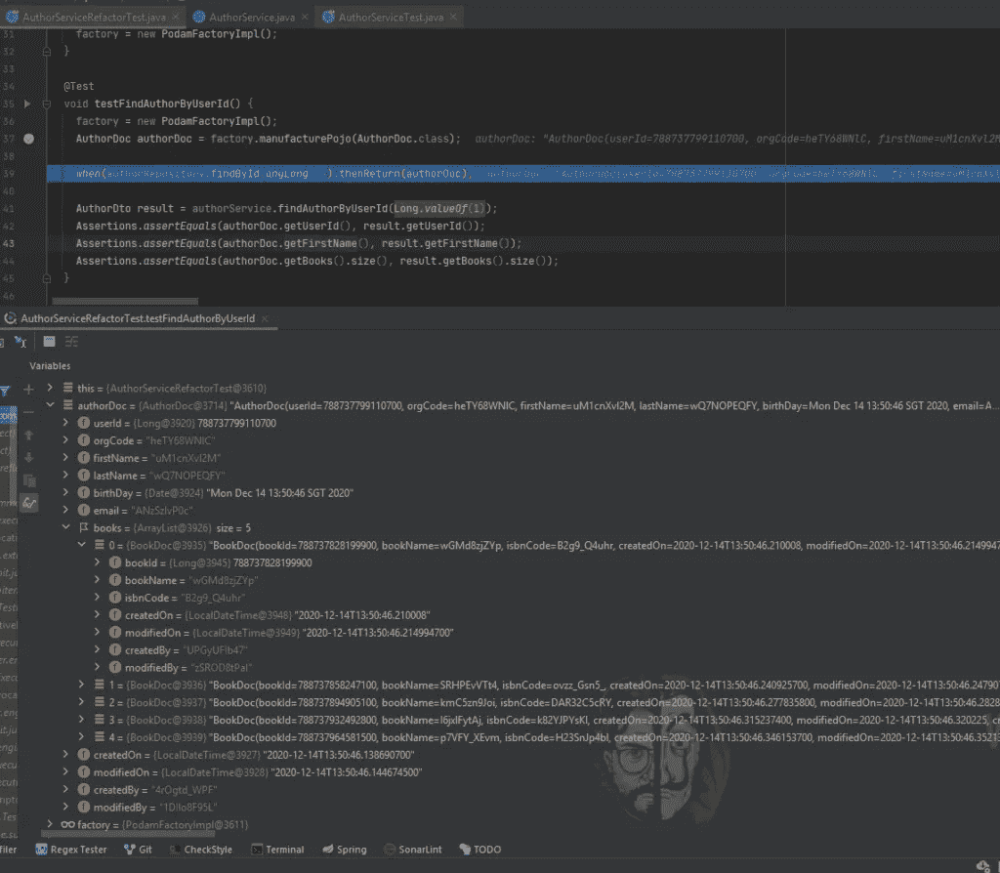

# Java 单元测试变得简单——使用 PODAM 的随机值

> 原文：<https://medium.com/geekculture/java-unit-tests-make-easy-random-values-with-podam-2b1de8a56958?source=collection_archive---------0----------------------->

在这篇文章中，我们讨论了如何使用 PODAM 库为我们在 Junit 测试中使用的对象、集合生成随机值。

W 当我们为函数编写单元测试用例时，让开发人员头疼的一件事就是向我们的对象、集合等填充模拟数据。

例如，让我们看看从一个函数中获取一个对象的测试用例是什么。

请看下面的代码片段。在这个对象中也包含子对象列表。

在这个代码片段中，我们可以看到许多硬编码数据，我们必须使用这些数据向对象填充值。

现在让我们看看我们能为这件事做些什么…

***有什么好办法吗？？***

是的，我们有 **PODAM** 。

# 什么是 PODAM？

PODAM 是一个用数据自动填充 Java POJOs 的轻量级工具。这在开发单元测试时很方便。多亏了 PODAM，用户现在有了一个可以完成所有工作的命令行程序。

# PODAM 有哪些特点:

*   自动检查 POJOs，用随机数据填充所有可能的属性。您可以自定义这种行为。
*   基于名称或注释定制数据策略、字段排除的扩展点
*   支持您的自定义注释，以提供数据或排除字段
*   选择最小构造函数(对于轻量级 POJOs)或完整构造函数的选项
*   以及对 Java 类型、枚举、数组、集合(列表、集合、映射)的支持
*   也支持泛型
*   当 PODAM 无法自省足够的信息来生成类型时，为您的工厂提供支持(例如 XMLGregorianCalendar)
*   当典型的生命周期结束时，支持任意方法执行

# 在 Spring boot 应用程序中使用 PODAM

我们必须向 spring boot 项目添加 podam 依赖项。

请使用最新版本。当我写这篇文章的时候，最新的版本是 7 . 2 . 5 . release[T13](https://mvnrepository.com/artifact/uk.co.jemos.podam/podam/7.2.5.RELEASE)

给 Maven 的

为了格雷尔

现在我们将使用 Podam 重构上面提到的代码。

## Pojo 使用 podom

你能相信吗？46 行代码我们减少到不到 10 行。让我们看看那里发生了什么。我们来分解一下。

首先，我们实现 PodamFactory 实例。

`PodamFactory factory = new PodamFactoryImpl();`

然后使用上面的 PodamFactory，我们可以创建一个带有值的对象。

`AuthorDoc authorDoc = factory.manufacturePojo(AuthorDoc.class);`

如果我们对此进行调试，我们可以看到分配给对象的值，如下所示

Values inside object assign from Podam

让我们看更多的例子

## 使用 podom 列出(字符串)

让我们看看如何使用 Podam 构建一个字符串列表。

## 使用 podom 的 List (Pojo)

如果我们需要用列表对象测试一些功能，这是一个巨大的痛苦。

现在让我们看看如何使用 podam 来使用魔法位置。

我们节省了多少代码行？？？

## 使用 podom 映射(String，Pojo)

与上面的例子一样，我们可以使用 podam 快速构建一个日期图。

## 定义属性级策略

到目前为止，我们看到 podam 将样本值分配给 POJO 属性。如果有验证会发生什么。例如，如果它是一个电子邮件字段，我们必须给出一个准确的电子邮件地址。

为此，我们可以在属性级别使用数据策略

让我们创建一个 EmailStrategy 类

我们可以用两种方式来使用它，

2.创建 PadomFactory 时的配置策略。然后，它将自动分配 POJO 级别验证

## 限制集合大小。

在前面的例子中，我们在 author 对象中有一个图书列表。让我们看看如何限制这个列表的大小。为此，我们可以使用@PodamCollection 注释。

我们添加了大小为 3 的集合元素。因此，这将在列表上只创建 3 条图书属性记录。

有关支持的注释的完整列表，请参考 podam [注释](https://mtedone.github.io/podam/annotations.html)页面。

# 结论

感谢您阅读文章《Java 单元测试变得简单——使用 PODAM 的随机值》。

你可以从我们的 [Github](https://github.com/authoronloadcode/Java-Unit-Tests-make-easy-Random-Values-with-Podam) 找到这个教程的源代码。

*原载于 2020 年 12 月 14 日***。**