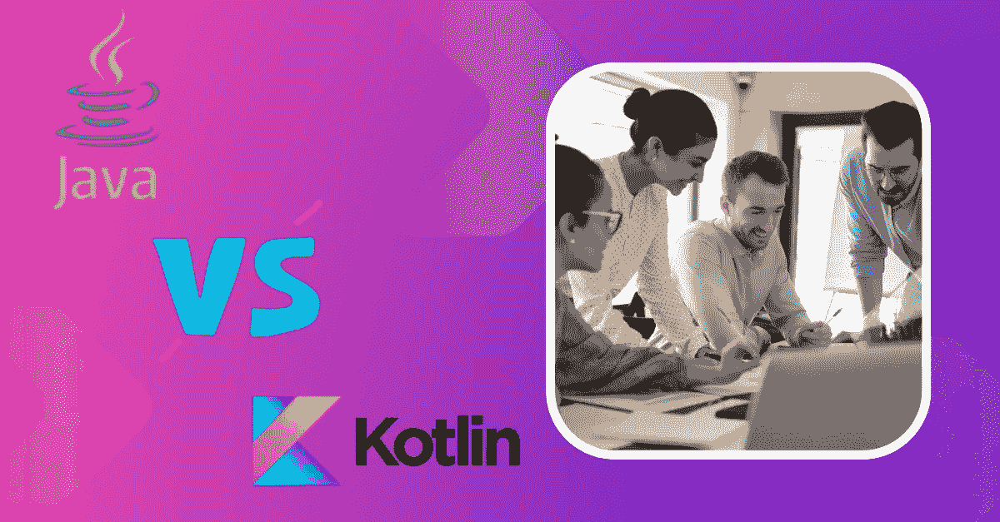
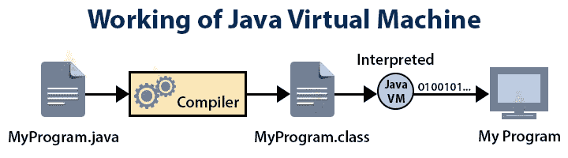

# Java vs Kotlin:有什么区别？

> 原文：<https://medium.com/geekculture/java-vs-kotlin-whats-the-difference-60a2e6b5a710?source=collection_archive---------9----------------------->

Java vs Kotlin

Java 和 Kotlin 编程语言都遵循面向对象的范例。然而，每一个都有不同的功能。Kotlin 主要用于 Android 的应用程序开发过程，而 Java 主要用于企业应用程序的开发。在这篇关于 Java 和 Kotlin 的区别的教程中，我们将看看这两种编程语言之间最重要的区别。但是在我们深入了解 Kotlin 和 Java 的具体区别之前，让我们先来回答“什么是 Kotlin？”以及“Java 是什么？”首先，我们来说说科特林:

# Java 是什么？

Java 是一种可以在各种平台上运行的编程语言，它专注于对象和网络。它是使用最多的编程语言之一。1995 年，Sun Microsystems 公司首次将该平台用于计算机行业。甲骨文公司最终决定收购该公司。詹姆斯·高斯林是面向对象编程语言 Java 的创始人，Java 是同类语言中最流行、最常用的语言。我们有能力利用 Java 开发广泛的程序，包括桌面应用程序、企业应用程序、基于网络的应用程序和基于云的应用程序。在大多数情况下，它用于开发后端的过程中。说到 Android 应用程序的开发，Java 是目前为止最受开发者欢迎的选择。请注意，Java 是用于创建 Android 的语言。

# Java 的特性:

以下是 Java 中更复杂的**编程特性的综合列表:**

## **1.容易理解**

**Java 很容易理解，因为它的编码风格非常简洁明了，很容易掌握。它简化了事情，因为它没有采用 C 和 C++等其他语言的困难和复杂方面，如下所示:**

1.  **显式指针背后的思想**
2.  **存储类别**
3.  **程序的头文件和预处理程序**
4.  **多重遗传**
5.  **运算符重载**
6.  **Goto 格式的语句**

**由于以下原因，Java 是可识别的:**

1.  **它基于众所周知的语言，如 C 和 C++，并结合了这些语言提供的大量功能。**
2.  **它消除了 C 和 C++的缺点、复杂性和令人困惑的组件。因此，如果你对 C 或 C++有扎实的理解，你会发现 Java 相当熟悉，掌握起来也很简单。**

## **2.数据的汇编和分析**

**通常，计算机语言可以被编译或解释，这取决于具体情况。Java 既考虑了编译语言的速度，又考虑了解释语言的灵活性。**

**Java 编译器称为 javac，它将 Java 源代码转换成字节码。**

**得益于 Java 虚拟机(JVM ),这种字节码是可移植的，可以在各种操作系统上执行，然后进行测试。**

**下图描述了以下过程:**

****

## **3.独立于平台**

**Java 可以在任何平台上运行的事实可能是它最重要的特点，因为这使得可移植性更容易，这最终是 Java 最强大的特点。**

**平台独立性是指一个计算机程序可以在一台计算机上编写，然后在世界上任何其他计算机上运行，而无需任何更改。通过利用字节码的思想，Java 能够实现其独立于平台的目标。**

**使用 Java 编译器时，源代码永远不会变成机器码。这与 C++编译器的工作方式不同。**

**相反，它将源代码转换为称为字节码的中间代码，另一个称为 JVM 的软件层将字节码转换为依赖于机器的形式(Java 虚拟机)。**

**因此，JVM 可以在安装了字节码的任何平台或操作系统上运行字节码，而不管字节码最初是在哪台计算机上编写的。**

**这就是 Java 的“一次编写，随处运行”(WORA)口号发挥作用的地方。这表明我们可以在一个操作系统(OS)上编写程序，然后在任何其他操作系统上运行它们，而不用以任何方式修改代码。**

## **4.轻便的**

**在这种情况下，Java 的标准版(SE)就是“可移植”一词的含义。可移植性是通过底层架构的中立性实现的。**

**Java 使这个过程远没有 C 或 C++复杂，在 C 或 c++中，源代码在各种硬件平台上的操作可能略有不同。Java 字节码可以在任何硬件上运行，只要它有一个满足机器需求的 Java 虚拟机(JVM ),并且能够正确地转换字节码。**

**在 Java 中，基本数据类型的大小不依赖于机器，这与 C 和 C++编程语言相反，它们依赖于机器。因此，将这些规则落实到位使得 Java 程序能够在许多平台上运行，比如 Windows、Unix、Solaris 和 Mac。**

**此外，对操作系统、处理器或系统资源所做的任何更新或更改都不会影响任何 Java 应用程序。**

## **5.建筑中性**

**如果为一个平台或操作系统编写的程序能够在任何其他操作系统上运行而不需要重新编译，则称该程序独立于其他平台或环境。**

**换句话说，它遵循“随处写一次运行”(WORA)或“随处写一次运行”(way)的方法。**

**Java 虚拟机(JVM)能够轻松地将字节码翻译成特定于机器的代码。字节码不依赖于任何特定的机器架构。**

**当涉及到开发小应用程序或从互联网下载应用程序时，这个功能非常方便。**

**此外，这些应用程序必须在各种机器上运行，这意味着这种能力在这种情况下将特别有用。**

## **6.面向对象**

**在本文关于 Java 特性的下一节中，我们将讨论 OOP 特性。Java 有时被称为纯面向对象语言，因为它很好地支持面向对象编程(OOP)的思想。**

**Java 是一种面向对象的编程语言，支持封装、抽象和继承等重要的 OOP 特性。**

**Java 程序几乎总是把某个东西称为对象。所有数据和应用程序都包含在它们自己的对象和类中。Java 不是以“过程”为模型，而是以“对象”为模型。Java 附带了一组类，这些类可以扩展并分类到包中。**

**例如，我们无法用 Java 构建一个能够被执行的程序，除非我们使用这个类。这表明 Java 以极其严格的方式遵守封装原则。**

## **7.粗野的**

**Java 的可靠性来自于它可以处理运行时错误，它可以自动收集垃圾和处理异常，并且它不使用显式指针。**

**Java 编程语言具有强大的内存管理系统。因为它在构建和运行时都检查代码，所以它有助于减少 bug。**

**Java 是一种垃圾收集编程语言，这意味着 Java 虚拟机(JVM)自动分配内存块，从而减轻了程序员不得不手动删除内存的负担，而这在 C/C++中是必需的。**

**Java 也有“异常处理”的概念，它可以发现运行时发生的错误并将其排除。**

**Java 虚拟机(JVM)检测到的任何运行时问题都不会直接传递到底层系统。相反，程序会立即终止，防止它对底层系统造成任何损害。**

## **8.安全的**

**当使用任何编程语言时，必须采取安全措施来防止恶意行为和病毒，必须采取措施来阻止不好的事情发生和阻止病毒传播。Java 允许使用访问修饰符来检查内存的使用情况。这种编程语言也阻止病毒进入小程序。**

**因为一个程序员不能在 Java 里故意做指针，所以它是比 C 和 C++更安全的语言。所以，如果我们不正确地设置一个 Java 变量，我们就无法使用它。**

**虚拟机是执行程序的地方。沙箱是一个与系统其他部分分离的环境，允许用户运行他们的应用程序而不会伤害他们。**

**它有一个字节码验证器，用于检查代码片段，看它们是否包含任何违反访问权限的非法代码。Java 的安全能力可以应用到应用程序编程中。**

## **9.全面地**

**因为它使用户能够创建也是分布式的应用程序，所以 Java 本身就是分布式的。我们能够把一个程序分成许多部分。使用 Java，然后在许多计算机上保存这些节。在一台计算机上工作的 Java 程序员可以访问在另一台计算机上运行的程序，而他们两人却坐在同一台计算机上。**

**Java 的这个特性让我们可以进行分布式编程，这在我们处理非常大的项目时非常有用。Java 通过给我们提供 RMI(远程方法调用)和 EJB(企业 JavaBeans)概念来实现这一点。**

**用 Java 创建网络连接比用 C++或 Objective-C 简单得多，因为 Java 附带了一个全面的类库，用于使用 TCP/IP 协议(如 HTTP 和 FTP)进行接口。**

**这也使得不同地方的许多程序员可以同时在同一个项目上工作。**

## **10.多个方向的线索和互动。**

**一个程序可以有多个线程，每个线程都是并行运行的独立执行路径。当我们谈论多线程处理时，我们指的是同时处理大量任务或并行执行同一程序的多个部分(功能)。**

**Java 的源代码被分解成更容易处理的小块，每一块都在正确的时间以正确的顺序运行。**

## **11.示范性性能水平**

**尽管 Java 是一种解释型编程语言，但它非常高效，因为它使用中间字节码。**

**Java 的快速性能可以归功于一种叫做 JIT 的编译器的使用，JIT 代表“及时”这种类型的编译器根据需要执行程序代码；更具体地说，它只编译当前正在使用的方法。这节省了时间，提高了流程的效率。**

**此外，Java 体系结构的设计方式减少了运行程序所需的时间。有了多线程特性，Java 程序可以更快地完成工作。**

**因为 Java 编译器生成的字节码经过了很好的优化，所以 Java 虚拟机可以在更短的时间内运行它们。**

## **12.灵活性和可扩展性**

**Java 是动态的，可以添加进去，所以我们可以在现有的基础上添加新的类和方法。我们也可以通过使用子类继承现有的类来创建新的类。正因为如此，扩展我们自己的类，甚至修改它们，对我们来说变得更加简单。**

**Java 使用户能够动态地将新的类库、方法和对象链接在一起。它有很多能量，因为它能适应周围不断变化的条件。**

**Java 函数可以将 C、C++等其他语言编写的函数合并到 Java 程序中，因为 Java 支持这个特性。这些类型的操作被称为“本地方法”当程序被执行时，这些方法被动态地连接在一起。**

# **科特林是什么？**

**编程语言 Kotlin 越来越受欢迎。它是静态类型的，可以在多种平台上使用。Java 虚拟机(JVM)用于运行制作应用程序所需的代码。Android 应用程序的创建越来越多地使用 Kotlin 作为 Java 编程的替代方案。它是一种由 JetBrains 和 Google 制作并保持更新的编程语言，可以免费使用。Kotlin 是一种面向对象的编程语言，支持所有常见的编程特性，如数据类型、运算符、I/O 注释、控制语句、函数、类、对象表达式和构造函数。Kotlin 从一开始就被设计成一种面向对象语言。Kotlin 作为一种制作软件的语言越来越受欢迎，因为它兼容，运行速度更快，并且具有使编码更有效的特性。**

**让我们更深入地研究 Kotlin，它现在是社交媒体世界中讨论最多的主题之一，也是软件工程师的未来语言。Kotlin 是一种静态类型的跨平台编程语言，基于 Java 虚拟机。Java 虚拟机，通常称为 JVM，在编写 Java 编程程序的过程中经常使用。现在我们将讨论过去及其进展。Jet-brains 负责其设计和开发。科特林是位于圣彼得堡附近的一个岛屿的名字，它启发了编程语言的名字。被称为 Java 的编程语言得名于位于印度尼西亚的爪哇岛。就像现在一样，它可以被认为是 Java 在业界的替代品。**

# **科特林的特点:**

## **1.Kotlin 可以免费下载**

**首先，Kotlin 是一种在开源许可下可用的编程语言。这种静态类型的编程语言是由开发 IntelliJ 集成开发环境(IDE)的同一家公司开发的。除了是一种公众可以免费使用的编程语言之外，Kotlin 还通过提供一个只需点击一下的工具，使得将以前编写的 Java 程序转换成自己的语言变得很容易。**

## **2.完整的 Java 互操作性**

**由于 Kotlin 编程语言与 Java 的良好互操作性，这是它的最大优势之一，更多的 Java 开发人员可能会在不久的将来开始学习 Kotlin。它利用 Java 库和工具，并在 JVM 上运行。它与 Java 版本 6 和 7 兼容，提供了向后兼容性。**

## **3.Kotlin 代码可以编译成 JS 或 JVM 字节码**

**因为 Kotlin 可以编译成 JVM 字节码或者 JavaScript，所以从事 Java 和 JS 工作的程序员会感受到精通这种编程语言的最大压力。除此之外，使用垃圾收集运行时的程序员会发现 Kotlin 编程语言是一个值得考虑的有趣选项。**

## **4.Kotlin 中的数据类**

**编程语言的设计者总是争论类在他们的语言中有多么有用、广泛和重要。一个标准的 Java 数据类每个类都包含大量的样板代码，在达到类的预期目的之前，必须浏览所有的样板代码。但是，您可以用 Kotlin 编写代码，以一种相当简单的方式实现与用 Java 编写的代码相同的功能。这会节省你很多时间和精力。Kotin 编程语言将此作为其最有用的功能之一。**

## **5.默认参数**

**当在 Kotlin 中通过参数名而不是索引来传递参数时，默认的参数可以节省大量时间。当有一个带有大量可选参数的函数时，它的好处就显而易见了。**

## **6.Kotlin 不会给程序带来任何运行时开销**

**该语言附带的 Kotlin 库没有任何垃圾。相反，它很小而且组织良好。Java 标准库是其大部分扩展的焦点。它的很多函数只能内联使用，所以它们做的代码也必须内联。Kotlin 有很多优化，大部分都是对 Android 开发有好处的。**

## **7.“科特林语言中的空安全”**

**Kotlin 编程语言的类型系统试图消除在代码中使用空引用的危险，这是一个被称为“十亿美元错误”的常见错误。例如，在 Java 中，如果你试图访问一个空引用的成员，你会遇到一个空引用异常。分配或返回空值的代码不会在 Kotlin 中编译，这被认为是 Kotlin 编程语言最有价值的方面之一。**

## **8.扩展功能**

**您可以用新方法扩展 Kotlin 中的类，而不必因为扩展函数而对类的原始源代码做任何更改。与 Scala 隐式方法的工作方式类似，每个用户都可以向类中添加自己的方法。扩展函数经常被争论，但是当它们被正确使用时，它们会非常有用。**

## **9.标准图书馆的功能**

**使用 Kotlin 的好处之一是它带有标准的库函数。从事 Android 移动应用程序开发项目？这是所有从事该项目的 Android 开发者最重要的考虑因素。**

**在惯用模式(如 let、apply 和 use 等)的帮助下，构建高阶函数的实现非常容易。**

**除此之外，它还附带了多种实用程序，可以用来处理字符和字符串序列。使用扩展函数可以获得序列和集合的查询过程。此外，可用于 Kotlin 的 JDK 类可以使与输入/输出(IO)、文件和线程的交互更加容易。**

## **10.科特林鼓励你减少代码量**

**与 Java 要求您编写所有内容相反，Kotlin 编译器可以解释代码并构建剩余的代码。例如，它可以推断变量声明中的类型。这不仅节省了时间，还提高了生产率。**

# **Java Vs Kotlin:**

**以下是 Kotlin 和 Java 之间的主要区别列表:**

1.  **在开发代码时，Java 使用了由来已久的极其冗长的技术。另一方面，Kotlin 是一种现代编程语言，因此它坚持简洁的概念。以短小著称的 Kotlin 让我们减少了大量样板代码。这意味着我们需要比 Java 更少的代码来做同样的事情。正因为如此，Kotlin 更容易阅读，并且由于人为干预而产生的错误更少。**
2.  **Java 允许用户将空值赋给他们程序中的对象。因此，当访问空引用的成员时，会抛出最著名的 NullPointerException。然而，我们不能默认设置空值，因为 Kotlin 不允许它们。因此，Kotlin 提供了改进的代码稳定性，这是其无效安全实践的结果。**
3.  **在 Java 中，我们需要继承类，然后重写方法以增加它的功能。另一方面，Kotlin 包含了扩展函数的能力，可以在不继承相关类的情况下使用。**
4.  **因为 Java 是一种强类型语言，每个变量的类型都必须在创建时设置。另一方面，Kotlin 是一种静态类型的编程语言，它可以根据赋给变量的值的类型来确定变量的类型。**
5.  **在 Java 中，程序员负责确定变量的类型并对其进行转换，以便它可以用于适当的操作。另一方面，Kotlin 包括一个巧妙的转换功能，编译器会自动管理它。**
6.  **另一方面，Kotlin 具有面向对象和函数式编程语言共有的特征，而 Java 是一种面向对象的编程语言。与 Java 不同，编程语言 Kotlin 允许同时使用 lambda 表达式和内联函数。此外，Kotlin 兼容各种函数式编程概念，如委托和扩展函数。**
7.  **Java 支持在后台创建大量线程，这些线程可用于执行耗时且消耗大量 CPU 资源的操作。另一方面，管理多个线程是一项具有挑战性的工作。另一方面，Kotlin 提供了对协程的支持，协程能够在特定的时间点暂停阻塞线程的执行。**
8.  **Kotlin 从语言发展的一开始就包含了密封类的思想。密封类的概念是在版本 15 中作为预览特性首次引入 Java 的。然而，从版本 17 开始，密封类是该语言不可或缺的组成部分。中的 Kotlin 和 Java 15 中讨论了密封类**

**我们的两篇文章题为“Kotlin 中的密封类”和“Java 15 中的密封类和接口”在这一节中，我们将仅仅提供 Java 和 Kotlin 实现之间主要区别的简要概述。**

1.  **在 Java 中，只有与密封类属于同一个模块的其他类才能继承它。在 Kotlin 中，子类总是需要和父类在同一个文件中定义。**
2.  **Java 密封类需要提供能够扩展它的类的显式列表。为了实现这一点，我们能够利用保留的标识符权限。包含在同一个 Kotlin 文件中的任何类都能够从密封类继承。**
3.  **在使用 Kotlin 时，可以在 switch 语句中使用对象的类型，尽管 Java 在 17.4.9 版本中将只为其 switch 语句添加模式匹配作为预览功能。**

# **结论**

**在本文中，我们将对比和比较运行在 JVM 上的两种编程语言:Java 和 Kotlin。首先，我们研究了一些 Java 和 Kotlin 各自的能力。在此之后，我们继续对两者进行了面对面的比较。最后，如果我们想构建一个 Android 应用程序或进行服务器端编程，我们可能会选择使用 Kotlin 编程语言。如果我们想要构建一个企业应用程序、桌面应用程序或 web 应用程序，那么我们应该使用 Java 作为我们的编程语言。**