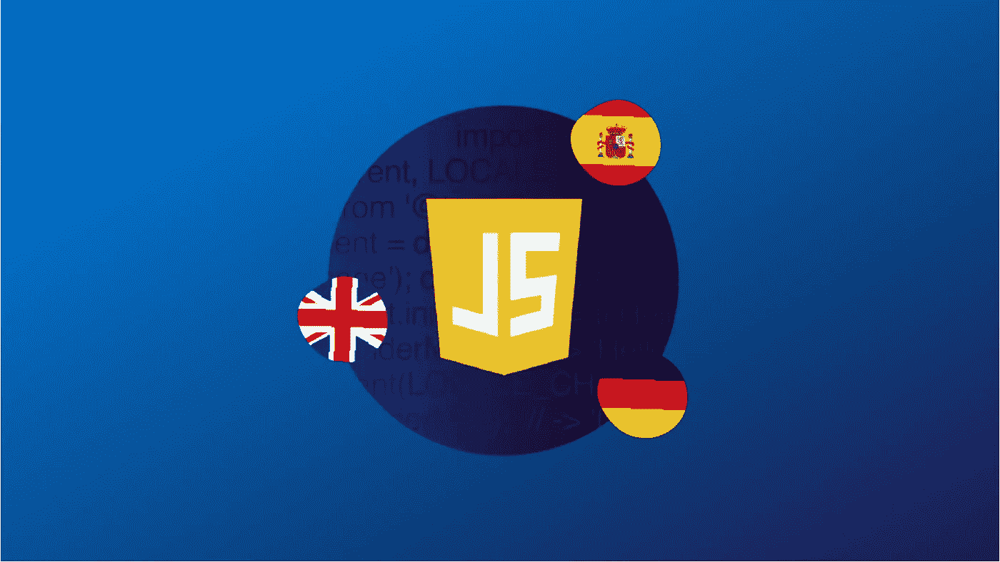
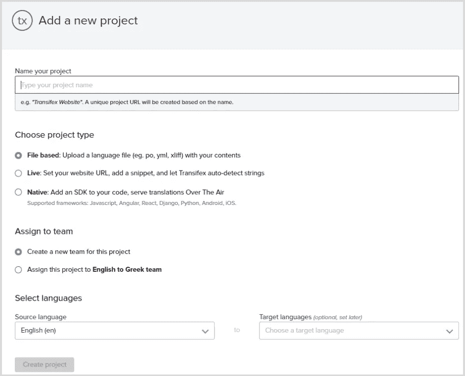
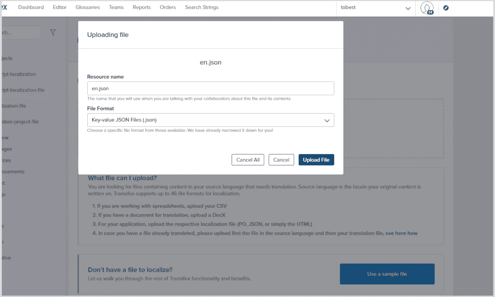

# JavaScript 本地化:逐步指南

> 原文：<https://medium.com/geekculture/javajavascript-localization-a-step-by-step-guide-868c80a586bd?source=collection_archive---------12----------------------->



根据 Statista 的数据，JavaScript 是全球软件开发人员最常用的编程语言，超过 65%的受访者表示他们在使用 HTML/CSS 的同时也使用 JavaScript。JavaScript 本地化的需求不足为奇。

在本文中，我们将学习如何通过两种方式实现这一点:基于文件的翻译，其中我们使用 Transifex 获取这些翻译并在本地应用程序中使用它们，或者 Transifex native，这是一个基于云的本地化堆栈，其 SDK 可以通过 CDN 安装或使用，并允许我们直接使用 Transifex 推送和拉取本地化内容，而不需要文件。

许多开发人员使用 JavaScript 创建网站、web 应用程序、移动应用程序和其他东西。随着这些产品或平台规模的增长，他们意识到他们需要本地化。

# 什么是本地化？

[本地化](https://www.transifex.com/blog/2021/what-is-localization/)是基于特定位置显示内容的过程。例如，如果一个用户在一个讲阿拉伯语的国家，你希望你的网站的内容以阿拉伯语显示给这个用户，这同样适用于其他语言。

这不仅仅是语言的问题。您可以使用本地化来处理其他形式的媒体，如图像，甚至声音，以便您能够使用当地人最熟悉的东西。

通过进行研究，您可以确定所有潜在的目标受众，然后努力确保您的产品或 web 内容可以本地化，以便他们可以使用他们的母语访问您的内容。

当谈到本地化时，许多开发人员不确定使用哪个库，哪个平台将是最有效的，以及许多其他因素。

在本指南中，我们将展示如何使用 Transifex 本地化 JavaScript 网站或应用程序，transi fex 是一个让您的本地化和国际化工作更加容易的平台！

JavaScript 本地化有两种方式:

1.  **基于文件:**意思是你以文件的形式提取你的内容，上传到[翻译管理系统(TMS)](https://www.transifex.com/blog/2021/what-is-a-translation-management-system/) ，翻译内容，然后从 TMS 下载，上传回你的应用/网站，部署修改。
2.  **无文件:**直接在你的代码中安装一个“插件”,让 TMS 同步你的翻译，而不需要你经历上面的过程。

在这个 GitHub 库上找到教程的代码！

# JavaScript 本地化:基于文件的方法

在处理小项目时，您可能不想安装库、使用 CDN、完成所有的配置练习等。你可能想在本地做所有的事情，这是完全可行的。

在库发展之前，需要本地化的项目必须咨询个人来帮助翻译内容并从文件中提取内容，从而允许许多类似的文件翻译成不同的本地语言。

# 提取您的内容

让我们开始吧。假设我们有一个像这样的想要本地化的页面:

```
```HTML
<!-- ./index.HTML --><html lang="en">
    <head>
        <title>JavaScript Transifex Demo</title>
    </head>
    <body>
        <div class="container">
            <nav class="navbar">
                <div class="container">
                    <div class="logo">
                        <h1>Local JS</h1>
                    </div>
                    <div class="navbar-right">
                        <select id="localization-switcher" class="locale-switcher">
                            <option value="en">English</option>
                            <option value="fr">French</option>
                            <option value="ar">Arabic (العربية)</option>
                        </select>
                    </div>
                </div>
            </nav>
            <div class="content-section">
                <h1 localization-key="title">
                    Welcome to this localization demo site
                </h1>
                <p localization-key="description">
                    Software localization is the process of adapting software to the culture and language of an end user, from standards of measurement to video and graphic design. It involves translation, design, and UX changes to make software look and feel natural to the target user.
                </p>
            </div>
        </div>
        <script src="./js/script.js"></script>
    </body>
</html>
```
```

目前，所有内容都被硬编码到页面中。为了执行基于文件的本地化，我们需要将这些内容提取到一个文件中，可能是 JSON 格式，然后从该文件中检索它。

让我们在语言文件夹中创建一个文件来跟踪不同语言的所有文件:

```
```JSON<!-- ./lang/en.json -->{ "title": "Welcome to this localization demo site", "description": "Software localization is the process of adapting software to the culture and language of an end user, from standards of measurement to video and graphic design. It involves not only translation but also design and UX changes to make software look and feel natural to the target user."}```
```

现在，让我们使用一个 fetch 请求，用这个 JSON 中的内容替换 HTML 文件中的静态内容:

```
```js<!-- ./js/script.js -->let translations = {};const fetchContent = () => { return fetch(`lang/en.json`) .then((response) => { return response.json(); }) .then((data) => { translations = data; translatePage(); });};fetchContent();const translatePage = () => { document.querySelectorAll('[localization-key]').forEach((element) => { let key = element.getAttribute('localization-key'); let translation = translations[key]; element.innerText = translation; });};```
```

在前面的代码中，我们从 JSON 文件中检索了全部内容。然后，我们使用 **`querySelectorAll()`** 方法来查找我们在 HTML 文件中分配的具有 **`localization-key`** 属性的所有元素，循环查看与我们的对象的 **`key`** 匹配的属性，然后嵌入数据。

到目前为止，我们已经看到了如何使用 JavaScript 从文件中读取数据。对于基于文件的本地化，Transifex 允许我们上传源文件，这是我们的演示内容的英文版本 **(`en.json `)。**

然后，您还可以获得一个平台，在翻译的帮助下翻译您的内容。之后，我们可以下载翻译后的文件并获取本地化的内容。

让我们看看如何在 Transifex 上创建一个基于文件的项目，然后上传我们的源内容进行翻译。我们将负责翻译并下载翻译后的内容。

# 如何在 Transifex 上创建基于文件的项目

第一步是创建一个 Transifex 账户。[用你的 GitHub，Google，或者 LinkedIn 账号注册](https://www.transifex.com/signup/)，免费 15 天，开源项目永远免费！

创建帐户后，您需要创建一个项目。您必须为您的项目命名，并选择“**基于文件的**”作为项目类型。



最后，您必须指定您的应用程序的主要语言和我们将翻译成的语言。我将使用英语作为本指南的主要语言，法语和阿拉伯语作为我的目标语言。

**注意**:取消勾选询问您是否想自动添加演示文件的复选框，除非您想先用它来测试 Transifex 平台。

完成后，点击“**创建项目**按钮。

接下来，我们将引导您进入下一页，在这里您可以上传任何支持格式的[源文件。但是我们将使用](https://docs.transifex.com/formats/introduction) [JSON 格式](https://docs.transifex.com/formats/json)。

创建项目后，选择“**上传文件**”按钮上传提取的 JSON 文件:



完成后，您就可以开始将您的内容翻译到编辑器中了！

# 从 Transifex 下载您的翻译内容

我们现在可以在成功翻译后下载翻译后的文件，以使用我们的应用程序中的内容。要下载，导航到您项目的语言选项卡，单击该文件，然后选择“**仅下载已审核的翻译**”transi fex 将允许我们下载您的翻译语言的 JSON 文件:


**>注意**:确保将带有区域名称的文件保存在我们之前创建的“lang 文件夹”中，例如`。/lang/ar.json`。

# 如何从本地文件异步加载翻译

到目前为止，我们已经能够将我们的源文件(` en.json `)翻译成阿拉伯语(` ar.json `)，并且我们已经将这两个文件保存在 languages 文件夹(` lang `)中。我们以前能够从源文件加载数据。

现在，让我们看看如何异步加载我们的翻译:

```
```jsconst locale = 'ar';let translations = {};document.addEventListener('DOMContentLoaded', () => { setLocale(locale);});const setLocale = async (newLocale) => { translations = await fetchTranslations(newLocale); translatePage();};const fetchTranslations = async (newLocale) => { const response = await fetch(`lang/${newLocale}.json`); return await response.json();};const translatePage = () => { document.querySelectorAll('[localization-key]').forEach((element) => { let key = element.getAttribute('localization-key'); let translation = translations[key]; element.innerText = translation; });};```
```

上面的代码与我们用来从源文件中检索数据的代码非常相似。我们是异步进行的，所以它根据“locale”参数加载内容。让我们再看一遍代码。

首先，我们声明了两个变量来指定我们希望基于可用的语言环境检索的语言环境。如我们所见，我们将我们的设置为“ar ”,这是阿拉伯语的语言代码:

```
```jsconst locale = 'ar';let translations = {};```
```

然后，我们创建了一个“addEventListener()”,当页面内容准备使用“DOMContentLoaded”事件时，该事件将被触发。在这个“addEventListener()”中，我们调用了“setLocale()”函数并传递了“Locale”变量。

```
```jsdocument.addEventListener('DOMContentLoaded', () => { setLocale(locale);});```
```

核心函数是“setLocale()”,它执行两个主要任务:加载给定语言环境的翻译和翻译页面以显示指定语言的本地化内容:

```
```jsconst setLocale = async (newLocale) => { translations = await fetchTranslations(newLocale); translatePage();};```
```

正如在“setLocale()”函数中看到的，我们首先获取我们的翻译，正如我们可以看到的，我们使用 async/await 来获取翻译，然后触发将使用获取的内容加载我们的页面的函数。我们将区域设置传递给“fetchTranslations()”函数，并使用它从区域设置文件中检索内容:

```
```jsconst fetchTranslations = async (newLocale) => { const response = await fetch(`lang/${newLocale}.json`); return await response.json();};```
```

最后，当我们获得内容时，我们现在将该内容传递给我们的页面，因此它使用 setLocale 函数中的第二个函数出现，该函数是` translatePage()`:

```
```jsconst translatePage = () => { document.querySelectorAll('[localization-key]').forEach((element) => { let key = element.getAttribute('localization-key'); let translation = translations[key]; element.innerText = translation; });};```
```

# 如何实现语言环境切换器

此时，我们可以加载我们翻译的内容，如果我们有大量的文件，我们所要做的就是更改我们的 locale 变量的值以匹配翻译的文件，这将获取内容。然而，这不是最好的方法，因为用户将无法访问我们的代码库。我们希望用户能够使用我们的 UI 在语言之间切换。

我们在 HTML 代码中添加了一个 select 标记，它有一个指示语言的下拉列表；现在，让我们编写逻辑，帮助我们从下拉列表中获取值，并将其传递给前面的代码:

```
```jsconst switcher = document.getElementById('localization-switcher');switcher.onchange = (e) => { // Set the locale to the selected option's value setLocale(e.target.value);};```
```

我们所做的就是通过 id 获取 select 标记，然后传递“onChange()”事件，这样我们就可以将 locale 设置为所选选项的值，如上所示。

最后，假设我们想要使用存储在浏览器中的用户默认区域设置。在这种情况下，我们可以通过 navigator JavaScript 对象这样做，我们还可以处理错误，这样，如果用户选择了一种没有翻译的语言，我们可以选择将内容保留为特定的语言环境:

```
```jslet translations = {};document.addEventListener('DOMContentLoaded', () => { setLocale(defaultLocale);});const switcher = document.getElementById('localization-switcher');switcher.onchange = (e) => { setLocale(e.target.value);};const setLocale = async (newLocale) => { translations = await fetchTranslations(newLocale); translatePage();};const fetchTranslations = async (newLocale) => { const response = await fetch(`lang/${newLocale}.json`); if (!response.ok) { console.log(`Could not fetch translations for locale ${newLocale}`); } return await response.json();};function translatePage() { document.querySelectorAll('[localization-key]').forEach((element) => { let key = element.getAttribute('localization-key'); let translation = translations[key]; element.innerText = translation; });}```
```

这就是基于文件的 JavaScript 本地化方法。

如果您想要更简化的解决方案，可以考虑无文件方法。

**注意**:由于我们请求的是一个文件，这个方法在特定浏览器上可能会因为 CORS 问题而不起作用。最好的解决方案是在本地或远程服务器上运行应用程序。

# Javascript 本地化:无文件方法

无文件方法就是我们所说的“Transifex Native”。这使您能够允许本地化平台直接与您的代码库通信，并自动拉/推内容。您基本上几乎完全摆脱了基于文件的方法所需要的所有步骤。

1.  [如果你还没有 Transifex 账户的话，创建一个。](https://www.transifex.com/signup/)
2.  创建 Transifex 本地项目
3.  指定您的应用程序的主要语言以及我们将把它翻译成的语言。

如前所述，英语将是主要语言，法语和阿拉伯语作为我的目标语言。

完成后，点击**创建项目**按钮，这将引导您进入下一页，在这里您将找到为您的项目创建凭证的说明。

在页面底部，单击“**立即生成本机凭据**”。将在弹出窗口中显示 **API _token_** 和 **_secret_ key** 。复制两把钥匙并保存好，以备后用。这也将显示我们将在 JavaScript 文件中使用的配置。


完成后，我们现在可以将内容推送到 Transifex，然后对其进行本地化。

# 如何在我们的 JavaScript 项目中配置 Transifex Native

使用 Transifex native 的第一步是配置它。有许多方法可以做到这一点，如在 [Transifex JavaScript 文档中所见。](https://developers.transifex.com/docs/javascript-sdk-setup)

但是对于本指南，我们将使用 CDN，稍后当我们想要推送我们的内容时，我们将使用 Transifex CLI。

我们将 CDN 添加到 HTML 文件中，然后我们就可以在 JavaScript 文件中直接使用 Transifex:

```
```HTML<!DOCTYPE html><html lang="en"> <head> <title>JavaScript Transifex Demo</title> </head> <body> // ... <script type="text/javascript" src="https://cdn.jsdelivr.net/npm/@transifex/native/dist/browser.native.min.js" ></script> <script src="./index.js"></script> </body></html>```
```

完成后，我们现在可以使用之前创建项目时获得的密钥来配置我们的 JavaScript 文件:

```
```jsconst tx = Transifex.tx;const t = Transifex.t;tx.init({ token: 'ADD TOKEN KEY HERE.'});```
```

# 如何用 JavaScript 将内容推送到 Transifex

Transifex 现在已经成功地在我们的 JavaScript 文件中进行了本地配置。

对于基于文件的方法，我们必须将内容 JSON 文件上传到 Transifex，但现在我们希望直接推送我们的内容，而不使用任何外部文件，这可以通过 Transifex CLI 来完成。

为此，我们首先必须创建一个 package.json 文件，然后通过运行以下命令安装 Transifex CLI 依赖项:

```
```bash$ npm init -y$ npm install @transifex/cli --save```
```

完成后，我们将看到 Transifex CLI 已经安装在我们的 packe.json 文件依赖对象中:

```
```JSON"dependencies": { "@transifex/cli": "^4.2.2"}```
```

我们现在可以使用“t”功能来推送我们的内容。正如我们在下面看到的，我们还使用了` _ key `[ parameter](https://docs . transi fex . com/JavaScript-SDK/international ize-JavaScript-code # parameters-and-metadata)为每个内容提供了一个键，因此以后很容易获取这些内容:

```
```jsconst tx = Transifex.tx;const t = Transifex.t; tx.init({ token: 'ADD TOKEN KEY HERE', }); t('Welcome to this localization demo site', { _key: 'title', }); t( 'Software localization is the process of adapting software to both the culture and language of an end user, from standards of measurement to video and graphic design. It involves not only translation, but also design and UX changes to make software look and feel natural to the target user.', { _key: 'description', } );```
```

到目前为止，我们已经初始化了要推送到 Transifex 进行本地化的内容。现在让我们用`@transifex/cli `库推送内容，该库将收集所有可翻译的字符串，并使用以下命令将它们推送到 transifex:

```
```$ ./node_modules/.bin/txjs-cli push src/ --token=<PROJECT TOKEN> --secret=<PROJECT SECRET>```
```

**注意**:在上面的命令中，确保添加了令牌和密钥。您还会注意到我们使用了“src/”,这意味着该命令将在“src”文件夹中查找“index.js”文件。

“index.js”文件是包含我们想要推送的内容的文件。确保你把你的 HTML、CSS 和 JavaScript 文件放在一个“src”文件夹中，如[GitHub 库](https://github.com/olawanlejoel/JS-localization-transifex/tree/main/Transifex%20Native)所示

# 如何从 Transifex 获取本地化内容

从 Transifex 中提取内容类似于我们以前从 JSON 文件中检索数据的方式。唯一显著的区别是我们不再使用 fetch API 进行数据检索:

```
```jsconst locale = 'ar';document.addEventListener('DOMContentLoaded', () => { setLocale(locale);});const setLocale = (newLocale) => { tx.setCurrentLocale(newLocale) .then(() => { translatePage(); }) .catch((err) => console.log(err));};const translatePage = () => { document.querySelectorAll('[localization-key]').forEach((element) => { let key = element.getAttribute('localization-key'); let translation = t(key); element.innerText = translation; });};```
```

在上面的代码中，我们指定了要从中检索本地化内容的语言环境。我们创建了一个函数来检索数据，这是“setLocale()”方法，最后，我们使用“translatePage()”方法来帮助获取基于“key”的每个内容，并将其传递给 UI。

# 如何实现语言环境切换器

就像我们对基于文件的 JavaScript 本地化所做的一样，我们也可以对 Transifex native 做同样的事情，因为我们想要做的只是获取值并将其传递给“setLocale()”方法:

```
```jsconst switcher = document.getElementById('localization-switcher');switcher.onchange = (e) => { setLocale(e.target.value);};```
```

到目前为止，我们已经能够使用 Transifex native 实现本地化；但是，我们也可以选择从浏览器中检测用户的首选语言环境，并将其作为 JavaScript `navigator `对象的初始语言环境。我们还可以处理错误，这样，如果传递了一个不可用的区域设置，它将返回任何其他指定的区域设置作为后备:

```
```jsconst defaultLocale = navigator.language.split('-')[0];document.addEventListener('DOMContentLoaded', () => { setLocale(defaultLocale);});const switcher = document.getElementById('localization-switcher');switcher.onchange = (e) => { // Set the locale to the selected option[value] setLocale(e.target.value);};const setLocale = (newLocale) => { tx.setCurrentLocale(newLocale) .then(() => { translatePage(); }) .catch((err) => console.log(err));};const translatePage = () => { document.querySelectorAll('[localization-key]').forEach((element) => { let key = element.getAttribute('localization-key'); let translation = t(key); if (translation === key) { console.log(`Translation not found for key: ${key}`); setLocale(defaultLocale); } element.innerText = translation; });};```
```

# 处理方向:从右向左和从左向右的语言

β在结束本指南之前，内容方向是我们在处理本地化时总想实现的一个主要特性。每种语言的内容显示方式不同。例如，英语从左向右显示(` ltr `)，而阿拉伯语从右向左显示(` rtl `)。

默认情况下，我们的内容以“ltr”格式显示，但是我们可以添加逻辑来处理某些特定语言的方向，这适用于本指南中介绍的两种方法:

```
```jsconst setLocale = async (newLocale) => { // ... document.documentElement.dir = direction(newLocale);};const direction = (locale) => { return locale === 'ar' ? 'rtl' : 'ltr';}```
```

上面的代码检查区域设置是否等于“ar ”,并返回指定的方向，这是使用“document.documentElement.dir”实现的。

# 结论

在这本 JavaScript 本地化指南中，我们学习了实现 JavaScript 本地化的两种主要方法:基于文件的和无文件的。

总而言之，这两种方法都可以完美地工作，但是对于大型项目来说，基于文件的方法变得非常难以管理。因此，使用 Transifex Native 的最大优势是，正如我们刚刚看到的，翻译不包含在您的代码库中。

我真诚地希望这篇文章是有帮助的，如果你需要更多的信息，请参阅 [Transifex 文档](https://developers.transifex.com/)。

本帖原载于页面[。](https://www.transifex.com/blog/2022/javascript-localization/)