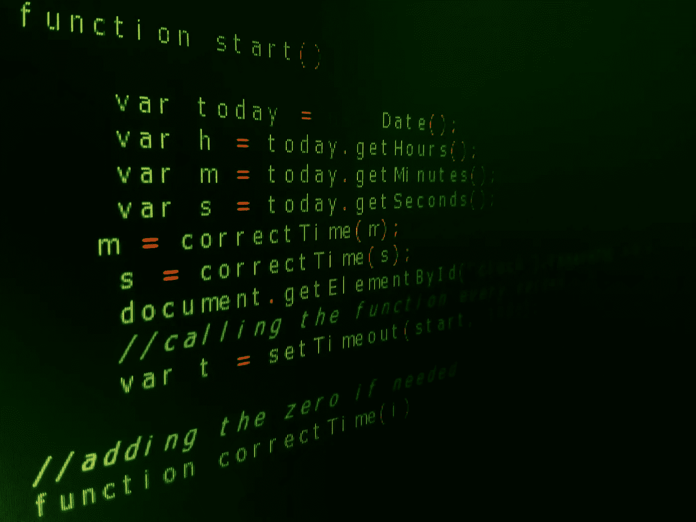

# JavaScript:应该明白的 10 件事

> 原文：<https://medium.com/geekculture/javascript-10-things-should-understand-d371f6590df7?source=collection_archive---------19----------------------->



Image is taken from Pexels

JavaScript 是目前最流行的编程语言之一。所以，如果你是一个 JavaScript 爱好者，那么这些东西你必须学会。那我们走吧。

# **评论**

它不仅适用于 javascript，也适用于所有类型的语言。注释主要用于理解代码中这一行或其他行发生了什么。这很好，但是你必须记住，注释越少越有效，代码越容易理解。大多数新人都在为更多的细节做解释性注释，这使得代码潦草难读。所以你必须集中精力。好的变量名或函数名也有助于理解代码。

# **试试……..接住**

尝试…catch 由两个块组合而成，一个是 try{}，另一个是 catch{}。那么实际上会发生什么呢？让我们看看

```
try{
  //codes
}
catch(err){
  //handle error
}
```

所以，在这个过程中，会发生三件事。

1.  try 将运行代码。
2.  如果没有错误，将跳过 catch 并执行代码。
3.  如果代码有一些问题或面临任何错误，那么 try 将停止，catch 将启动。

```
//case 1
try {
  alert('Hello');
// code is ok and has no error //catch skipped
} catch (err) {
  alert('Erorr found');
}//case 2
try {
  Hello; // error
  alert('How are you '); //catch will start
} catch (err) {
  alert(`Error has occurred!`);
}
```

只要记住代码必须是可运行的，并且应该是有效的 JavaScript 代码。因为 javascript 先读取代码再运行代码。如果 Javascript 甚至不能读取代码，它应该如何运行或发现错误？所以小心点。

# **错误**

当错误发生时，JavaScript 生成一个包含详细信息的对象，并通过 catch{}发送它。基本上，一个错误有两个属性。

1.  **Name** :表示代码中发现的错误类型的名称。
2.  **消息**:它描述了人类可以理解的错误类型。

# **全球渔获量**

假设有一个错误发生在 try…catch 之外，那么会发生什么呢？当资源加载失败或其他情况时，使用接口 error event 的错误事件在 window 处被激发，window.onerror()被调用。

```
window.onerror = function(message, source, lineno, colno, error) {      
  //code 
};
```

1.  **信息**:错误信息
2.  **来源**:出现错误的地方
3.  **行号**:出现错误的行号
4.  **列号**:出现错误的列号
5.  **错误**:错误对象。

# **ES6:块绑定**

在 JavaScript 中声明变量或绑定非常棘手。在基于 C 的语言中，变量是在声明发生的地方创建的。在 javascript 中，创建的变量取决于如何声明它们。对于这一点，经典的 var 声明有点混乱。为此，ES6 引入了块级绑定(let，const)以实现最佳使用。

```
var a = 10;
const b = 20;
let c = 30;
```

# **ES6: Var 申报&吊装**

变量声明被视为是在函数内部的函数顶部声明，还是在函数外部全局声明，实际在哪里调用并不重要。这意味着较小代码块中的变量，比如 if-else 语句或 for 循环，实际上并不在这些代码块的本地。那叫吊装。

```
function getColor(condition) { if (condition) { var color = "red"; // other code return color; } else { //color exist here with the value undefined return null; } //color exist here with the value undefined}
```

# **ES6:块级声明:Let**

它的工作过程与 var 几乎相同，但变量的范围仅限于其当前块。

```
function getColor(condition) { if (condition) { let color = "red"; // other code return color; } else { //color doesn't exist here return null; } //color doesn't exist here}
```

# ES6:块级声明:**常量**

Const 声明更多地局限于变量处理和修改。如果一旦 const 声明，你就不能修改变量。如果有，它会抛出一个错误。它非常适合静态值。

```
const color = "red";color = "blue"; //It throw an error
```

# **ES6:对象&常量**

在一个对象被 const 声明时，我们可以改变或修改对象的属性。但是我们不能改变物体本身。

```
//validconst car = { make: "Honda"};car.make = "Toyota"//invalidconst car = { make: 'Honda'};car = { make: 'Toyota'};
```

# **ES6:阻止绑定循环**

循环中的 var 造成了如此多的混乱。让我们看一看

```
for (var i=0; i < 10; i++) { console.log(i); //1,2,3,4,5,6,7,8,9}// i is still accessible hereconsole.log(i); //10
```

在其他语言中，只有 for 循环才访问 I 变量，但是在 JavaScript 中，在循环之后，I 仍然可以被访问，因为变量提升，如果函数中有多个循环，会导致更多问题。这就是为什么让我们预防这个问题。

```
for (let i=0; i < 10; i++) { console.log(i); //1,2,3,4,5,6,7,8,9}// i is not access hereconsole.log(i);
```

但是如果我们在这里使用 const，它只能在循环中访问一次，并阻塞循环。

```
for (const i=0; i < 10; i++) {console.log(i); //1}// i is not access hereconsole.log(i);
```