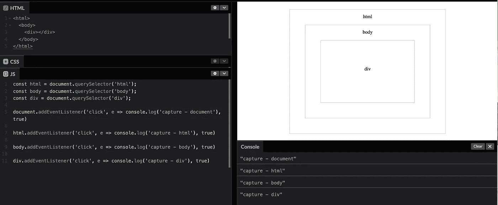
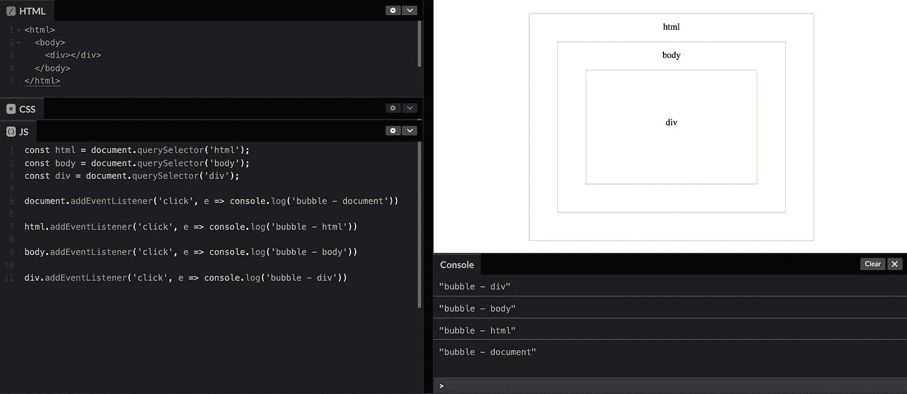
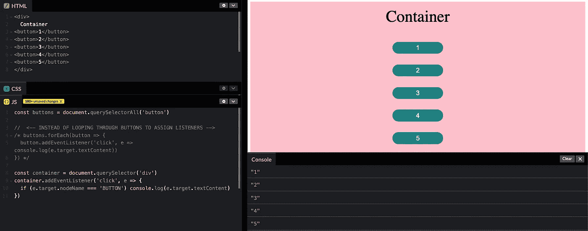
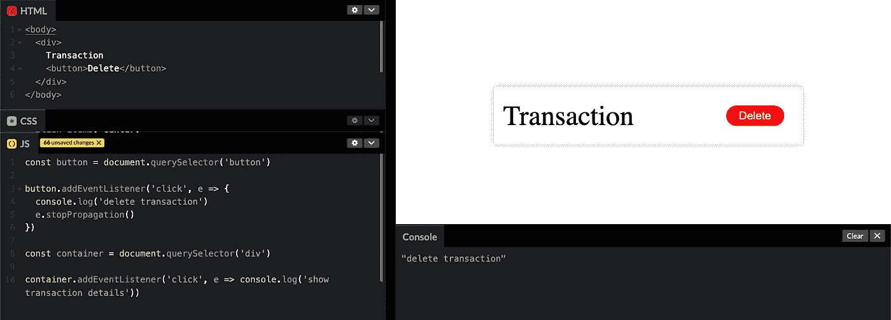
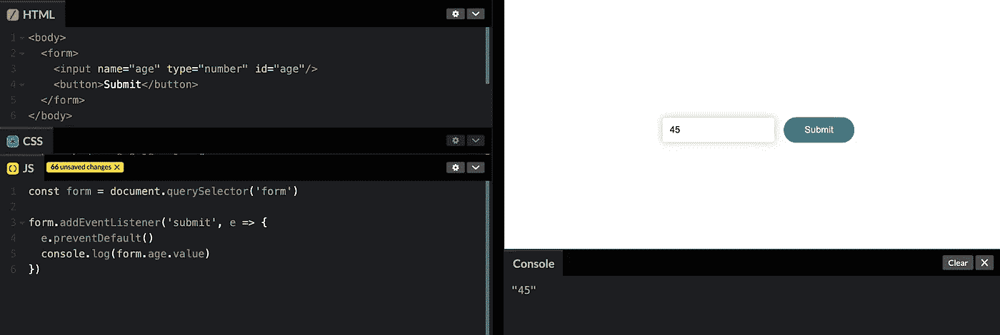

# Javascript 101:事件

> 原文：<https://medium.com/geekculture/javascript-101-events-9c90fb7e2dce?source=collection_archive---------14----------------------->

一个*事件*是一个信号，表明已经发生了一些事情，它是按照**观察者模式**建模的，该模式允许页面的行为和外观之间的松散耦合。

事件发生后，会在整个 DOM 中传播，让它们的侦听器做出响应。这些事件在页面上的接收顺序被描述为**事件流。**

# DOM 事件流

由 [DOM Level 2 Events](https://www.w3.org/TR/WD-DOM-Level-2/events.html#Events-Event) 指定的事件流有三个阶段:目标处的**事件捕获**阶段，以及**事件冒泡**阶段。事件捕获首先发生，提供了在必要时拦截事件的机会。

[Even capturing and bubbling flow after **div** is clicked](https://codepen.io/caleb-42/pen/ExwPbQM)

在 DOM Level 2 Events 规范事件流中，实际的目标(

元素)在**捕获阶段**不接收事件。上图描述了另外一种情况，因为 **Safari** 、 **Chrome、**和 **Firefox** 在事件目标的捕获阶段触发了一个事件(这个例子是在 Chrome 中完成的)。

这意味着在事件目标的下一个阶段开始(**冒泡阶段)**之前，本应在事件目标的父级(元素)停止的捕获阶段会继续到事件目标(

元素)，这将触发< div >返回到文档。

> 这种修改的最终结果是有两个机会来处理目标上的事件。

# 事件捕获

事件捕获(又名**事件滴流**)的理论是最不特定的节点应该首先接收事件，最特定的节点应该最后接收事件。要使用事件捕获， [addEventListener](https://developer.mozilla.org/en-US/docs/Web/API/EventTarget/addEventListener) 方法的第三个参数( **useCapture** )被赋予值 **true** ，如下所示。

Event capturing flow after **div** is clicked

使用事件捕获，单击事件首先被文档接收，然后继续沿着 DOM 树向下到达事件的实际目标，即

元素。

> 事件捕获通常不被使用，因为在旧的浏览器中缺乏支持。一般的建议是自由使用事件冒泡，同时为特殊情况保留事件捕获。

# 事件冒泡

事件冒泡是指事件从最具体的元素(文档树中可能最深的点)开始，然后向上流向最不具体的节点(文档)。为了使用事件冒泡， [addEventListener](https://developer.mozilla.org/en-US/docs/Web/API/EventTarget/addEventListener) 方法的第三个参数( **useCapture** )被赋予值 **false** 。但是因为 false 是它的默认值，所以我们可以像这样忽略它。

Event bubbling after **div** is clicked

当您单击 div 元素时，click 事件按以下顺序发生:div — body — html — document。click 事件沿着 DOM 树向上，一路上在每个节点上触发，直到到达文档对象。(火狐、chrome、safari 一直延续到窗口对象)——疯狂吧？他们总是做额外的😂。

# 事件委托

捕获和冒泡允许我们实现最强大的事件处理模式之一，称为事件**委托**。也可以使用 target 属性为特定类型的事件广泛撒网。

[Event delegation in practice](https://codepen.io/caleb-42/pen/RwLrzrb)

例如，如果您有一个包含一长串按钮的节点，如上图所示，那么在外部节点上注册一个单击处理程序(在本例中为 **div** )并让它使用 target 属性来判断一个按钮是否被单击，而不是在所有按钮上注册单独的处理程序，这样可能会更方便。

# 关于事件的更多信息

## 停止事件传播

在任何时候，事件处理程序都可以调用事件对象上的 **stopPropagation** 方法来阻止更高层的处理程序接收事件。

[**stopPropagation** method in action](https://codepen.io/caleb-42/pen/mdBVZVd)

例如，当您在另一个可点击的元素中有一个按钮，并且您不希望点击按钮激活外部元素的点击行为时，这可能是有用的。

## 防止默认事件

许多事件都有与之关联的默认操作。一个常见的例子是提交表单时发生的刷新操作。对于大多数类型的事件，JavaScript 事件处理程序在默认行为发生之前被调用。如果处理程序不希望这种正常行为发生，通常是因为它已经处理了事件，它可以对事件对象调用 preventDefault 方法。

[**preventDefault** Event method in action](https://codepen.io/caleb-42/pen/dyVGxxZ)

这可以用来实现您自己的键盘快捷键或上下文菜单。它还可以用来讨厌地干扰用户预期的行为。

# 结论

如果没有事件和听众，我们的节目尽管漂亮，也不过是表达思想和情感，缺乏反馈。这使得事件成为 Javascript 中一个有趣的话题，因为它们使我们能够通过交互来了解世界对我们的应用程序的感觉。我希望你已经了解了它们是如何工作的，以及如何在你的应用中利用它们的传播。再见👋

# 参考

*   [雄辩的 Javascript](https://www.amazon.ca/Eloquent-JavaScript-3rd-Introduction-Programming/dp/1593279507)