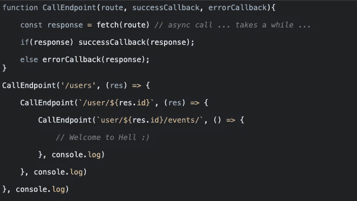
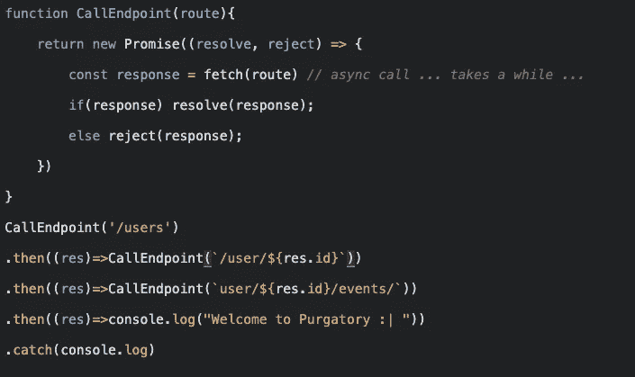
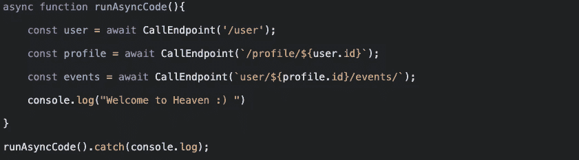

# Javascript 101:处理异步——第 1 部分

> 原文：<https://medium.com/geekculture/javascript-101-handling-asynchrony-part-1-7e944ee6c76e?source=collection_archive---------28----------------------->

当程序与处理器之外的东西交互时，如通过计算机网络通信，操作系统在多个运行的程序之间切换处理器，这样它就不会闲置。这是异步的一个经典案例。Javascript 是单线程的，有很多方法可以处理异步。让我们去了解他们😊。

# 复试

回调是 JS 中异步的基本单位。在这种异步编程方法中，一个执行缓慢动作的函数需要一个额外的参数，一个**回调函数**。动作开始，当动作完成时，回调函数被调用并得到结果。

在上面的例子中，Node.js 和浏览器中都可用的 setTimeout 函数等待给定的毫秒数(一秒是一千毫秒)，然后调用一个函数(回调)。

这种风格的编程很容易实现，但是缩进层次会随着每个异步动作而增加，并导致一个被称为**回调地狱的困境。**

# 为什么复试不那么好

首先，我们的大脑以顺序的、分块的、单线程的语义方式计划事情，但是回调以一种相当非线性的方式表达异步流，这使得对这样的代码进行适当的推理变得更加困难。

第二，也是更重要的一点，回调受到**控制反转**的影响，因为它们隐式地将控制权交给了另一方(通常是不受您控制的第三方工具！)来调用你的程序的延续。这种控制转移给我们带来了一系列令人不安的信任问题，比如回调的调用次数是否比我们预期的要多。

# 承诺——更好的方法

我们可以返回一个表示未来事件的对象，而不是安排一个函数在未来的某个时刻被调用。

> 承诺是一个异步动作，可能在某个时间点完成并产生一个值。当它的值可用时，它能够通知任何感兴趣的人。

要创建一个 promise，可以使用 Promise 作为构造函数。它有一个有点奇怪的接口——构造函数需要一个函数作为参数，在调用过程中需要两个函数——resolve(对于成功路径)和 reject(对于错误路径)。

我们在上面看到的是一个**承诺链**，它以顺序的方式表达异步流。要获得承诺的结果，可以使用它的 then 方法。这注册了一个回调函数，当 promise 解析并产生一个值时调用这个函数。但是这并不是**然后**方法所做的全部。它返回另一个承诺，该承诺解析为处理函数返回的值。catch 方法用于处理错误。

# ES7 异步和等待

JavaScript 语言最近增加了[异步函数](https://developer.mozilla.org/en-US/docs/Web/JavaScript/Reference/Statements/async_function)和`[await](https://developer.mozilla.org/en-US/docs/Web/JavaScript/Reference/Operators/await)`关键字，这是所谓的 ECMAScript 2017 JavaScript edition 的一部分。这些特性基本上充当了承诺之上的语法糖，使得异步代码更容易编写和阅读

如果我们加入 async 和 await，这就是我们前面例子中调用 CallEndpoint 的样子。放在函数声明前面的关键字`async`将把它变成一个[异步函数](https://developer.mozilla.org/en-US/docs/Web/JavaScript/Reference/Statements/async_function)。默认情况下，异步函数返回一个承诺，并期望使用`await`关键字来调用异步代码

承诺的主要优点是它们简化了异步函数的使用。基于承诺的函数看起来与常规函数相似，而不是传递回调:它们将输入作为参数并返回输出。唯一的区别是输出可能还不可用。

# 结论

很有趣，对吧？我们已经通过回调看到了 JS 中最常见的异步实现，并研究了它的缺点。然而，Promises 提供了一个更好的编程接口，并且与使用 **async/await** 的普通 javascript 函数非常相似。承诺不会消除回调，它们只是将回调的编排重定向到一个可信的中介机制，该机制位于我们和另一个实用程序之间。承诺是令人敬畏的。使用它们！

下一站— [处理异步—第 2 部分](/geekculture/javascript-101-handling-asynchrony-part-2-555bebbaf83e)

# 参考

*   [你不知道 JS: Async &性能](https://www.amazon.ca/You-Dont-Know-JS-Performance/dp/1491904224)
*   [雄辩的 JavaScript，第三版:编程的现代介绍](https://www.amazon.ca/Eloquent-JavaScript-3rd-Introduction-Programming/dp/1593279507/ref=pd_lpo_2?pd_rd_i=1593279507&psc=1)