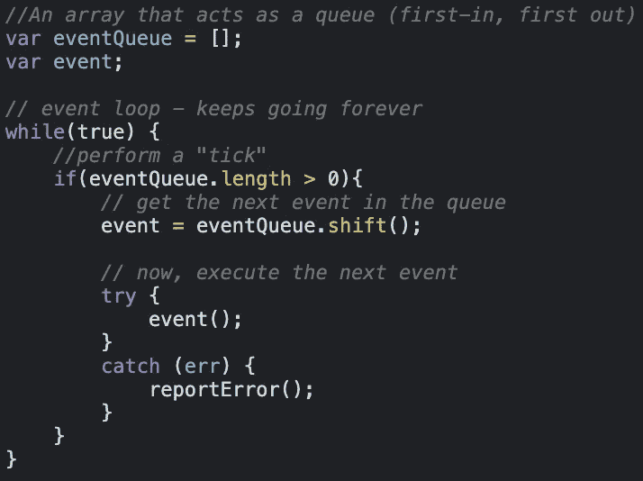
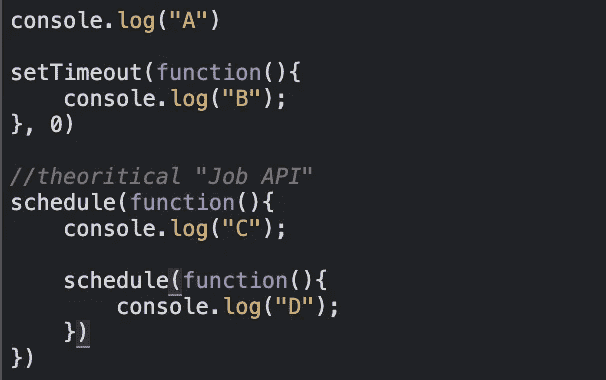

# Javascript 101:处理异步——第 2 部分

> 原文：<https://medium.com/geekculture/javascript-101-handling-asynchrony-part-2-555bebbaf83e?source=collection_archive---------23----------------------->

异步调用只有在完成工作后才返回，并且能够阻塞程序执行的主线程。许多语言通过为请求启动一个额外的**线程** ( *一个独立的执行路径*)来处理这个问题。另一方面，JavaScript 使用一个**事件队列**来记录请求的执行，而**主** ( **单个)线程**则忙于其他事情。

# 事件循环

当一个异步调用发生时，通常会有一个相关的回调，它最终会被放在一个**事件队列的末尾。**

> “事件循环”是 Javascript 引擎在事件队列中连续运行的循环，以执行它遇到的每个回调，直到队列为空。

事件队列充当线程的待办事项列表，而事件循环则是线程不断检查其待办事项列表，直到列表为空。如果队列为空，线程将进入睡眠状态，但当队列中出现新事件时，循环将重新开始。

以上是事件循环的一个大大简化的版本。如您所见，while 循环代表了一个持续运行的循环(事件循环)，该循环的每次迭代都被称为**“tick”**对于每一个节拍，如果队列中有一个事件在等待，它就会被取走并执行。这些事件是你的函数回调。

> 一个重要的注意事项是 **ES6** 现在指定了事件循环如何工作，这意味着从技术上来说，它在 **JS 引擎**的范围内，而不仅仅是**托管环境。**这种变化的一个主要原因是 **ES6 承诺**的引入，因为它们需要能够对事件循环队列上的调度操作进行直接、细粒度的控制

# **SetTimeOut —幕后**

看到 JS 中异步事件是如何操作的，我们理解 setTimeout(..)不会将您的回调放在事件循环队列中。它的作用是设置一个计时器。当定时器到期时，JS 引擎将您的回调放入事件循环中，以便将来的某个 tick 会拾取并执行它。

*如果在那个时刻*事件循环中已经有 20 个项目了怎么办？你的回电在等着。它排在其他人的后面——通常没有抢占队列和跳到队伍前面的路径。这解释了为什么 setTimeout(..)定时器可能不会以完美的时间精度触发。您可以保证您的回调不会在您指定的时间间隔之前触发，但它可以在该时间或之后发生，这取决于事件队列的状态。**很神奇吧？😊**

# **工作队列**

从 ES6 开始，在事件循环队列之上有了一个新的概念，叫做“作业队列”您最有可能接触到的是承诺的异步行为。

> “作业队列”是悬挂在事件循环队列中每个滴答末尾的队列。

在事件循环的节拍期间可能发生的某些异步隐含动作不会导致整个新事件被添加到事件循环队列中，而是将一个项目(也称为作业)添加到当前节拍的作业队列的末尾。

一个作业还可以导致更多的作业被添加到同一队列的末尾。因此，从理论上讲，一个作业“循环”(一个作业不断添加另一个作业，等等)是可能的。)可能会无限期地旋转，从而使程序无法继续执行下一个事件循环。

让我们想象一个调度作业的 API(直接，没有黑客)，并把它叫做 schedule(..).认为

您可能希望它打印出 B C D，但实际上，它会打印出 C D B，因为作业发生在当前事件循环节拍的末尾，计时器触发以调度下一个事件循环节拍(如果可用！)

# 结论

Javascript 是单线程的，通过其事件循环模型处理异步流程，以调度需要在以后执行的回调。与多线程编程相比，构建在 node.js 之上的应用程序使用尽可能少的线程来减少资源使用和复杂性。这是一大优势。

下一站— [网络工作者](/geekculture/javascript-101-web-workers-1c70bcb4ba90)

# 参考

*   [你不知道 JS: Async &性能](https://www.amazon.ca/You-Dont-Know-JS-Performance/dp/1491904224)
*   [雄辩的 JavaScript，第三版:编程的现代介绍](https://www.amazon.ca/Eloquent-JavaScript-3rd-Introduction-Programming/dp/1593279507/ref=pd_lpo_2?pd_rd_i=1593279507&psc=1)