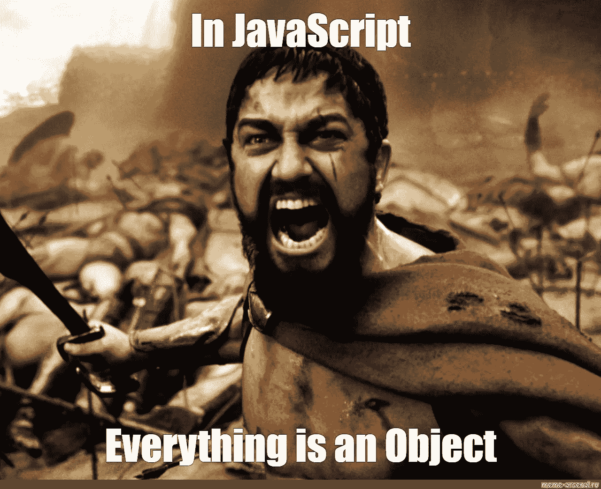
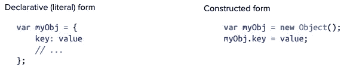
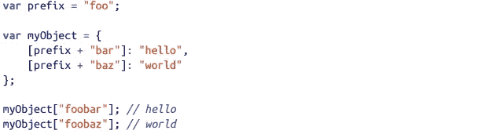
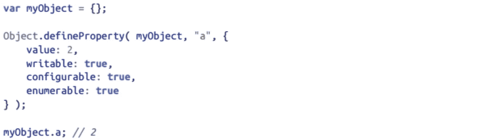
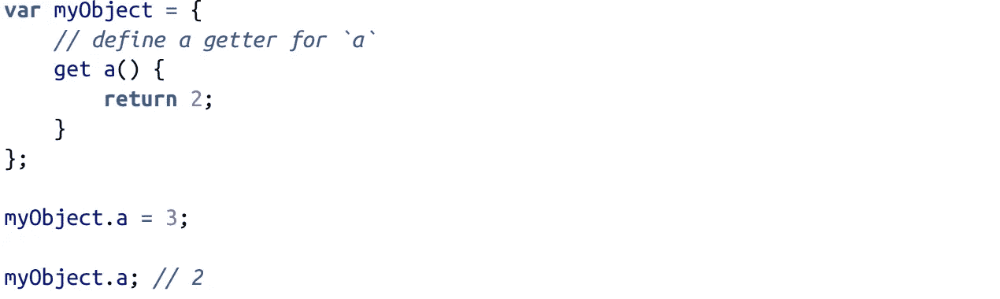

# Javascript 101:对象

> 原文：<https://medium.com/geekculture/javascript-101-objects-1d071851a01a?source=collection_archive---------25----------------------->

今天，我们从揭穿开发人员(和斯巴达人一样)的一个普遍误解开始。对象确实是构建大部分(不是全部)JS 的通用构件。它们与**字符串、数字、布尔、空、未定义、bigint 和符号一起构成了 Javascript 中的第八种主要类型。**所以说 Javascript 中的一切都源于对象显然是不真实的。道歉**列奥尼达国王😂**。

# 但是对象到底是什么呢？

> 对象是属性的集合，属性是名称(或*键*)和值之间的关联

在 JavaScript 中，对象是一个独立的实体，具有属性和类型。例如，与杯子相比。杯子是一种物体，具有属性。一个杯子有一种颜色、一种图案、重量、一种材料等等。同样，JavaScript 对象可以有属性，这些属性定义了它们的特征。

javascript 中的对象有两种形式:陈述(文字)和构造形式。

唯一的区别是，您可以向文本声明添加一个或多个键/值对，而对于构造形式的对象，您必须一个接一个地添加属性。

> 在对象中，属性名总是字符串。如果使用除字符串(原语)之外的任何其他值作为属性，它将首先被转换为字符串。

# 计算属性名

ES6 添加了计算属性名，您可以在对象文字声明的键名位置指定一个表达式，用[ ]对括起来:

当目标是使用变量值作为对象的键时，这个特性的好处就显现出来了。这是 javascript 活力的真实证明。

# 属性描述符

我们可以使用 Object.defineProperty(..)来添加新的属性或修改现有的属性(如果它是可配置的！)，具有想要的特性。

1.  **Writable**
    你改变属性值的能力是由 Writable 控制的。
2.  **enumeratable**
    名字可能使它变得显而易见，但是这个特性控制一个属性是否会出现在某些对象属性枚举中，比如 for..在循环中。
3.  **可配置** 只要一个属性当前是可配置的，我们就可以修改它的描述符定义，使用相同的 defineProperty(..)实用程序:有一个细微的例外需要注意:即使属性已经是可配置的(false)，writable 总是可以从 true 更改为 false 而不会出错，但是如果已经是 false，则不能返回 true。configurable(false)防止的另一件事是使用**删除操作符**删除现有属性的能力。

# 对象不变性

有时你想让属性或对象不能被
改变(无论是偶然的还是有意的)。尽管有很多方法可以实现这一点，但是需要注意的是，所有这些方法都产生了浅层不变性。也就是说，它们只影响对象及其直接属性特征。以下是 JS 中实现不变性的方法

1.  **对象常数**
    通过组合 writable: false 和 configurable: false，本质上可以创建一个常数(不能更改、重定义或删除)作为对象属性
2.  **防止扩展**
    如果你想防止一个对象被添加新的属性，但是让对象的其余属性保持不变，调用 Object.preventExtensions(..).
3.  **印章**印章
    印章(..)创建一个“密封的”对象，这意味着它接受一个现有的对象，本质上调用 Object.preventExtensions(..)上，但也将其所有现有属性标记为可配置:false。
4.  **冻结** 对象.冻结(..)创建一个冻结的对象，这意味着它接受一个现有的对象，并且本质上调用 Object.seal(..)上，但它也将所有“数据访问器”属性标记为 writable: false，这样它们的值就不能更改。

# Getters 和 Setters

Getters 是实际调用隐藏函数来检索值的属性。Setters 是实际调用隐藏函数来设置值的属性。当您将属性定义为具有 getter 或 setter 或两者兼有时，它的定义就变成了“访问器描述符”(与“数据描述符”相对)。对于访问器描述符，描述符的值和可写特性是没有意义的，会被忽略，相反，JS 考虑属性的 set 和 get 特性(以及可配置和可枚举)。

我们在对象上创建了一个属性，它实际上并不包含值，但是对它的访问会自动导致对 getter
函数的隐藏函数调用，它返回的任何值都是属性访问的结果。由于我们只为 **a** 定义了一个 getter，如果我们稍后试图设置 **a** 的值，
set 操作将不会抛出错误，而只会悄悄地丢弃
赋值。下面是您最有可能遇到的一个完整的 getter 和 setter 场景。

# 结论

至此，我们结束了对 Javascript 中对象的介绍。对象是一个关键部分，确实有许多可以在其上执行的操作，使得用 Javascript 创建应用程序更加容易。但是还有更多…在未来的课程中，我们将深入研究并检查**原型**和**行为委托**，以便完全掌握隐藏在这种看似原始的类型中的力量。回头见👋。

PS——如果你认为斯巴达人的联系与这个话题无关……你绝对是对的😂。但是它确实打破了僵局，不是吗？

下一站— [处理异步—第 1 部分](/geekculture/javascript-101-handling-asynchrony-part-1-7e944ee6c76e)

# 参考

**你不知道 JS:这个&对象原型**——[https://www . Amazon . com/You-Don-Know-JS-Prototypes/DP/1491904151](https://www.amazon.com/You-Dont-Know-JS-Prototypes/dp/1491904151)