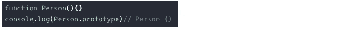
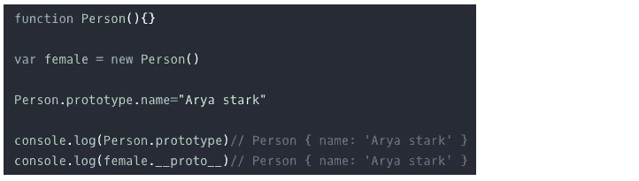
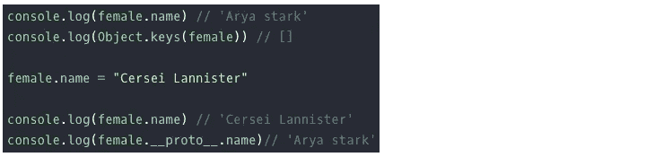
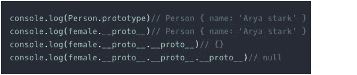
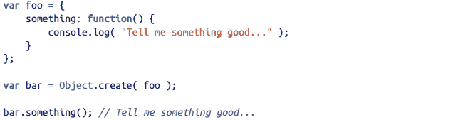
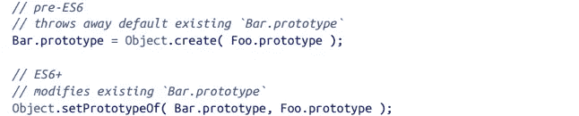

# Javascript 101:原型

> 原文：<https://medium.com/geekculture/javascript-101-prototypes-9c06739635b0?source=collection_archive---------6----------------------->

与大多数语言不同，Javascript 对象关系/链接基于原型而不是类。类是不存在的，所以不像面向类的语言那样有对象的抽象模式/蓝图。JavaScript 只有直接定义自己行为的对象，并通过**原型**来扩展自己。

# 原型机制

这是 Javascript 利用来实现**行为委托**的实际机制，类似于面向类的语言对继承所做的事情，并且都是关于对象被链接到其他对象。

> 原型是一个对象，作为属性存在于 javascript 的每个函数中

原型不是一个类，而是一个对象。因此，当一个函数被创建时，它会在幕后获得一个对象作为原型**。**

****

**如果该函数随后被用作带有 new 关键字的构造函数。创建的对象具有一个 **__proto__** 属性，该属性指向作为函数原型的同一个对象。为了证明它们指向同一个参照，人的原型属性的改变会影响女性的原型属性。**

> **从 ECMAScript 2015 开始，使用访问器`[Object.getPrototypeOf()](https://developer.mozilla.org/en-US/docs/Web/JavaScript/Reference/Global_Objects/Object/getPrototypeOf)`和`[Object.setPrototypeOf()](https://developer.mozilla.org/en-US/docs/Web/JavaScript/Reference/Global_Objects/Object/setPrototypeOf)`来访问`[[Prototype]]`。这相当于 JavaScript 属性`__proto__`，它是非标准的，但事实上被许多浏览器实现了。**

# **原型遗传**

**JavaScript 中的对象有一个内部属性，在规范中表示为[[Prototype]]，它只是到另一个对象的链接。**

**当针对第一个对象进行属性/方法引用，并且不存在此类属性/方法时，会使用此链接[[原型]]链接告诉引擎在链接到的对象上查找属性/方法。反过来，如果该对象无法完成查找，则跟踪它的[[Prototype]]，依此类推。**

****

**这里要注意的关键概念是，在将女性的名字设置为“瑟曦·兰尼斯特”之前，女性对象从未有过**名字**属性，只有其原型(**女性)。__proto__** 做到了。我们将女性对象键的结果记录为空数组的事实证明了这一点。当你从一个对象请求一个属性时，javascript 会尝试从该对象获取它，如果失败，它会查找该对象的原型，直到找到并返回它，否则返回**未定义的**。**

# **原型链——多级继承**

****

**到目前为止，我们只研究了一个层次的继承。我们知道 Person 函数的原型在其 __proto__ 属性中指向与我们的女性原型相同的对象。女性原型还有一个原型是 Javascript Object — {}。对象的原型为空，意味着它没有原型。**

> **这种从对象到对象的级联链接本质上定义了一个“原型链”**

# **继承上的行为委托**

****

**虽然这些 JavaScript 机制看起来类似于传统面向类语言中的“类实例化”和“类继承”,但关键的区别在于，在 JavaScript 中，**没有复制**。相反，对象最终通过内部[[原型]]链相互链接。**

**除了**新的**操作符，还有其他通过 Javascript 中的链接通过原型委托行为的方法:**

1.  ****Object.create(…)****

****

**对象.创建(..)创建一个链接到我们指定的对象(foo)的新对象(bar)，这给了我们[[Prototype]]机制的所有权力(委托)，但是没有新函数作为类的任何不必要的复杂性。**

**2. **Object.setPrototypeOf(..)** object . create(…)的一个小缺点是，当链接一个已经存在的对象时，我们必须创建一个新的对象来替换它的原型，丢弃旧的原型对象，而不是修改它。ES6 添加了一个“Object.setPrototypeOf(..)" helper 实用程序，它以一种标准的、可预测的方式来完成这个任务。**

****

# **结论**

**原型是 javascript 的一个有趣部分，一旦理解了它，就可以打开面向对象语言中常见的可能性和可伸缩性的世界。事实上，JavaScript 在各种语言中几乎是独一无二的，可能是唯一有权使用“面向对象”标签的语言，因为
它是可以直接创建对象而根本不需要类的少数语言之一。嗯，原型就是这样。再见👋**

**下一站— [对象](/geekculture/javascript-101-objects-1d071851a01a)**

# **参考**

****你不知道 JS:这个&对象原型**——[https://www . Amazon . com/You-Dont-Know-JS-Prototypes/DP/1491904151](https://www.amazon.com/You-Dont-Know-JS-Prototypes/dp/1491904151)**

****吉姆·库珀的 JavaScript 对象和原型**—[https://app . plural sight . com/library/courses/JavaScript-Objects-Prototypes/table-of-contents](https://app.pluralsight.com/library/courses/javascript-objects-prototypes/table-of-contents)**