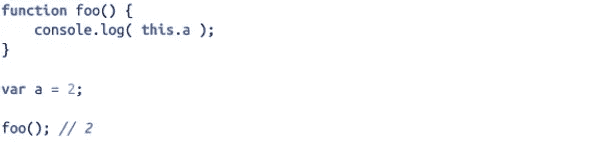
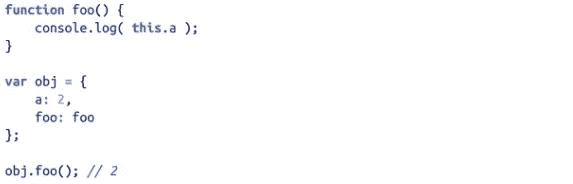
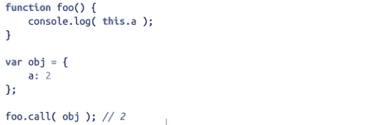
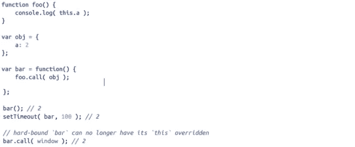
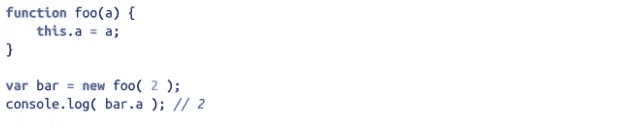
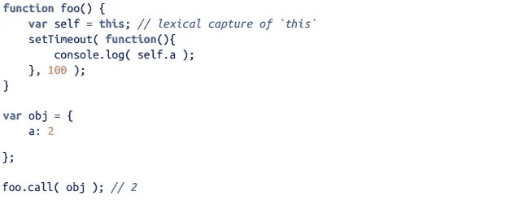

# Javascript 101:什么是“这”

> 原文：<https://medium.com/geekculture/javascript-101-what-is-this-eaeb4a740a9b?source=collection_archive---------24----------------------->

如果在 Javascript 中还有更棘手的问题，那么“**this”**就是它了(看我在那里做了什么😏).我已经数不清有多少次不得不猜测“**这个”绑定**对于一个特定的函数来说是一个有意义的编码挑战，但都无济于事。尽管它可能难以捉摸，但理解它肯定会带来更多的清晰。这里是一个简单的概述；

> javascript 中的 **THIS** 引用是一个**运行时**绑定，并且基于其封闭函数的调用条件。

# 迷茫？我们再深入一点。

当调用一个函数时，会创建一个激活记录，也称为执行上下文。此记录包含以下信息:

*   从哪里调用函数(调用堆栈)
*   函数是如何被调用的
*   以及传递了哪些参数。等等

记录的属性之一是" **This"** reference。函数 **foo 的**调用点在**全局对象**中，因此当在 **foo** 中引用“**this”**时绑定到它。因为**变量 a** 在全局对象中被定义为 2，所以对 foo 的调用将检查全局对象中的 **a** 并将 2 输出到控制台。这种解析“This”引用的方法被称为**默认绑定**，是函数调用最常见的情况。

# 在执行函数中解析“THIS”

现在谈谈争论的焦点。默认绑定是确定特定函数的“this”绑定的四种方法中最常见(最弱)的一种。下面是实现这一目的的其他方法。

1.  **隐式绑定**

这里，调用点使用 obj 上下文来引用函数。在调用函数时，obj 拥有函数引用。通过在当前为 obj 的 **"this"** 绑定中查找 **a** 的值，对 foo 的调用发出 2。

> 这种绑定类型的一个常见问题是，这个引用可能会通过函数回调**隐式丢失**。对于 javascript 中的事件，this context 被直接覆盖以指向事件所针对的 DOM 实例。

2.**显式绑定**

通过 foo.call 调用带有显式绑定的 foo(..)允许我们强制其“this”为 obj。这种方法的一个缺点是，它只能在调用点执行，而调用点有时不受我们的控制，比如在回调的情况下,“this”上下文可能会丢失或被替换。为了避开这个障碍，我们应用了一个更严格的显式绑定变体，称为**硬绑定**

在硬绑定中，我们创建了一个函数 bar()，它在内部手动调用 foo.call(obj ),从而为此强制调用 foo with obj binding。不管你后来怎么调用函数栏，它总会用 obj 手动调用 foo。这种绑定既明确又强大。

> 由于硬绑定是一种如此常见的模式，所以它在 ES5 中提供了一个内置的实用工具——function . prototype . bind .用法如下: **foo.bind(obj)**

3.**新操作员**

当调用前面带有 new 的函数(也称为构造函数调用)时，会自动执行以下操作:

*   一个全新的物体凭空被创造出来。
*   新构造的对象是[[Prototype]]链接的。
*   新构造的对象被设置为该函数调用的“this”绑定。

除非函数返回自己的替代对象，否则新调用的函数调用将自动返回新构造的对象，该对象充当函数的“this”绑定。

# 词汇 This

在识别“this”引用可能被证明是一件麻烦事的情况下，ES6 确实给了我们一种完全逃避猜谜游戏的方法。ES6 **arrow-functions** 没有使用四个标准绑定规则，而是使用词法作用域进行“this”绑定，这意味着它们从其封闭函数调用中继承了“this”绑定(无论它是什么)。

> 值得注意的是，箭头函数本质上禁用了传统的 **this 机制**，有利于更广泛理解的**词法范围。**通过提供使用 bind 的替代方案(..)对一个函数。

# **结论**

很有启发性，对吧？我们不仅理解了“this ”,还学习了如何使用箭头函数通过词法作用域来利用封闭作用域的“THIS”。我希望你再也不会发现自己在猜测“这个”是什么了。**再见👋**

下一站— [原型](/geekculture/javascript-101-prototypes-9c06739635b0)

# 参考

**你不知道 JS:这个&对象原型**—[https://www . Amazon . com/You-Dont-Know-JS-Prototypes/DP/1491904151](https://www.amazon.com/You-Dont-Know-JS-Prototypes/dp/1491904151)