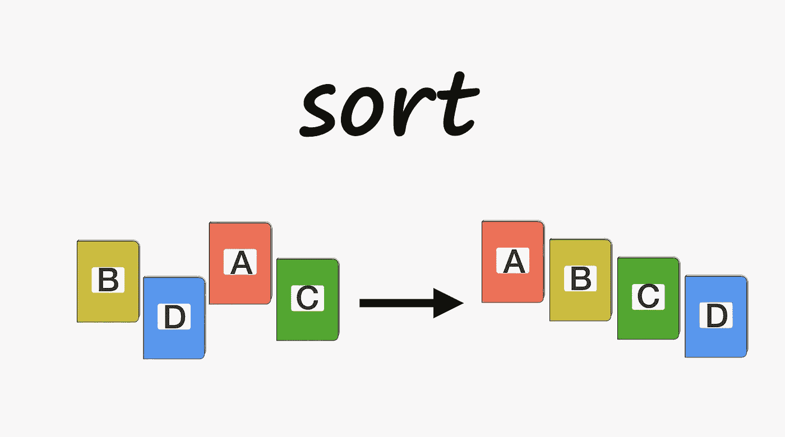

# JavaScript 数组助手

> 原文：<https://medium.com/geekculture/javascript-array-helpers-347b226631?source=collection_archive---------31----------------------->

作为一名 JavaScript 学生，当我开始学习更多关于数组的知识时，我对所有的 JavaScript 数组助手感到惊讶。

我们不必为数组中的一些常见操作手动构建我们自己的算法，JavaScript 有一些内置的函数。

Java script 数组是类似列表的对象，或者我们可以说 JavaScript 中的数组就像一个平面对象。Array prototype 有几个有用的方法，我们可以对它进行从简单到复杂的操作。

在这篇文章中，我将试着向你介绍 6 种最有用和最神奇的方法，它们会让你的开发变得更加容易。

下面我们讨论的方法是数组原型(Array.prototype)的方法。

# 过滤器()

由于名称是不言自明的，它将通过提供的函数给出的测试来过滤给定数组的内容。filter()方法将创建一个新数组来存储过滤后的数组。它不会改变原始数组。

**语法**

```
let newArray = arr.filter(callback(currentValue[, index[, array]]) {
  // return element for newArray, if true
}[, thisArg]);
```

起初，语法看起来很难阅读和理解，一旦你掌握了窍门，它就变得简单了。

所有"[ ]"里面的东西都是可选参数。所以为了简单使用，我们只需要一个回调函数来测试每个元素。callback 返回值强制为 true 的值将被保留，其他值将被过滤掉。

一旦我们开始使用数组过滤器，我们将永远不会停止。假设我们有一个函数 isPrime()，它为素数返回 true，否则返回 false。

**举例**

```
function isPrime(num){
   for(let i = 2; num > i; i++){
      if(num % i == 0){
         return false;
      }
   }
 return num > 1;  // filter every value below 1
} const arr = [22,4,11,23,-3,7,15,88,-34,83,42] primeArray = arr.filter(isPrime);console.log(primeArray); // [11,23,7,83]
```

我们刚刚创建了一个只包含质数的数组。

# 地图()

map()函数创建一个新数组，其结果是对调用数组中的每个元素调用一个提供的函数。当我们需要对一个数组中的所有元素进行操作时，这非常有用。

**语法**

```
let newArray = arr.map(callback(currentValue[, index[, array]]) {
  // return element for newArray, after executing something
}[, thisArg]);
```

回调函数将对数组中的每一项进行一些操作，并返回到新的数组。

map()不会改变原始数组。

**例子**

```
let scores = [ 21, 23, 11, 32, 16]
let doubleScores = scores.map(function(score){
       return score * 2
 })// scores is still [ 21, 23, 11, 32, 16]
// doubleScores is now [ 42, 46, 22, 64, 32]
```

如果我们不使用合成数组，那么 map 将比`[forEach](https://developer.mozilla.org/en-US/docs/Web/JavaScript/Reference/Global_Objects/Array/forEach)`或`[for...of](https://developer.mozilla.org/en-US/docs/Web/JavaScript/Reference/Statements/for...of).`昂贵

# 切片()

slice()将帮助我们精确地分割数组，而不改变原始数组。slice()将接受两个参数 start 和 end，如果没有提供，它将假设从开始到结束。这里要注意的是 end 不包括在内，start 和 end 是数组中项目的索引。

**语法**

```
slice()
slice(start)
slice(start, end)
```

当不带任何参数调用时，slice 将返回数组的副本。每当我们需要复制一个数组时，都可以使用它。

**示例**

```
let fruits = ['Banana', 'Orange', 'Lemon', 'Apple', 'Mango']
let citrus = fruits.slice(1, 3)
let lastFruits= fruits.slice(3)// fruits contains ['Banana', 'Orange', 'Lemon', 'Apple', 'Mango']
// citrus contains ['Orange','Lemon']
// lastFruits contains ['Apple', 'Mango']
```

# 拼接()

简称拼接，是切片操作后剩下的部分。splice()将改变原始数组的内容，通过移除替换或添加新元素来实现。

**语法**

```
let arrDeletedItems = arr.splice(start[, deleteCount[, item1[, item2[, ...]]]])
```

`start`是指定改变数组的起始索引。

`deleteCount`是指定从开始删除的字符数。

`item1 , item2` 是开始后添加元素。

**举例**

```
let myFish = ['angel', 'clown', 'mandarin', 'sturgeon']
let removed = myFish.splice(2, 0, 'drum')

// myFish is ["angel", "clown", "drum", "mandarin", "sturgeon"]
// removed is [], no elements removed
```

splice()会改变原来的数组没有返回被删除的元素。splice()可用于在数组中同时移除和添加项目。

# 减少()

reduce()方法对数组的每个元素执行 reducer 函数，并输出一个值。

**语法**

```
arr.reduce(callback( accumulator, currentValue, [, index[, array]] )[, initialValue])
```

callback 是我们给 reduce()的函数，用于在数组中的每个元素上执行。**减速器**函数有四个参数:

1.  累加器→它保存回调函数返回值。
2.  当前值→数组中要处理的当前值。

index 和 array 是可选参数。

reduce()方法在 reducer 函数对每个元素执行后返回一个值。我们可以指定累加器的初始值，建议总是给一个初始值。

**示例**

```
let initialValue = 0
let sum = [{x: 1}, {x: 2}, {x: 3}].reduce(
    (accumulator, currentValue) => accumulator + currentValue.x
    , initialValue
)

console.log(sum) // logs 6
```

我们可以在数组中使用 reduce()而不是 filter()然后 map()，这样可以减少一次数组遍历。

# 排序()



sort()方法对数组元素进行排序并返回排序后的数组。我们可以使用比较函数来定义排序顺序，但默认是升序，通过将元素转换为字符串来构建，并根据 UTF-16 值进行比较

**语法**

```
arr.sort([compareFunction])`
```

我们也可以使用第一个和第二个元素作为比较函数的参数，但它是可选的。将比较函数留空时，所有字符都将被转换为 UTF-16 格式，并将比较值进行排序。

在字符串排序中，“香蕉”在“樱桃”之前，80 在 9 之前。更疯狂的是，如果我们不指定任何比较函数，2343242342 将在 9 之前出现。83 会在 89 之前到来。在转换为字符串并转换为 UTF-16 的值时，它会比较第一个字符的 Unicode 值，如果相同，它会比较第二个字符的 Unicode 值。

这就是为什么 89999 会出现在 9 之前，因为“89999”和“9”在比较时首先比较 Unicode 的“9”和“8”，后来变小了，所以它返回小于 9 的 8999。所以，如果你想使用 sort()函数，请将它与 compare 函数一起使用。

如果指定了 compareFunction，它将使用一些逻辑进行排序。

1.  如果 compareFunction(a，b)返回小于 0 的值，则保持 a 和 b 不变。
2.  如果 compareFunction(a，b)返回 0，则 a，b 相对于彼此不变，但会相对于所有其他元素排序。
3.  如果 compareFunction(a，b)返回大于 0 的值，则交换 b 和 a。

注意 compareFunction(a，b)调用任意次都必须返回相同的结果，否则会影响 sort()结果。

简单来说，如果 compareFunction 返回正值，排序将会改变。

**例子**

```
function compare(a, b) {
  if (a is less than b by some ordering criterion) {
    return -1;
  }
  if (a is greater than b by the ordering criterion) {
    return 1;
  }
  // a must be equal to b
  return 0;
}//but above result can also be achieved by function compareNumbers(a, b) {
  return a - b;
}
```

一旦你掌握了其中的窍门，那就太棒了，我们可以比较物体的内在价值，我们只受比较功能的限制。

我在这里只介绍了几个数组助手，更多的可以在官方文档中找到。

我只是希望你通过这篇文章熟悉一些最有用的数组助手方法，快乐编码，干杯。