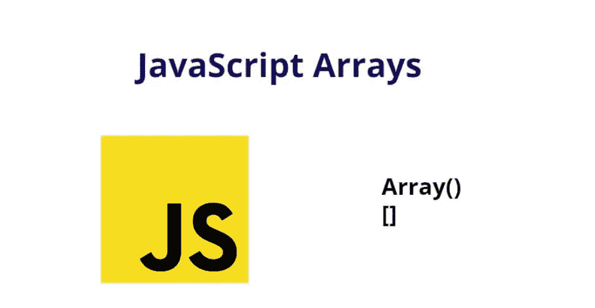

# JavaScript 数组

> 原文：<https://medium.com/geekculture/javascript-arrays-f6179da9fe42?source=collection_archive---------21----------------------->

Img-1

# 介绍

在这篇博客中，我将介绍我们日常使用的 Javascript 中不同的数组方法。

# 什么是 JavaScript 数组？

JavaScript Array 类是一个全局对象，用于使用高级的类似列表的对象构造数组。