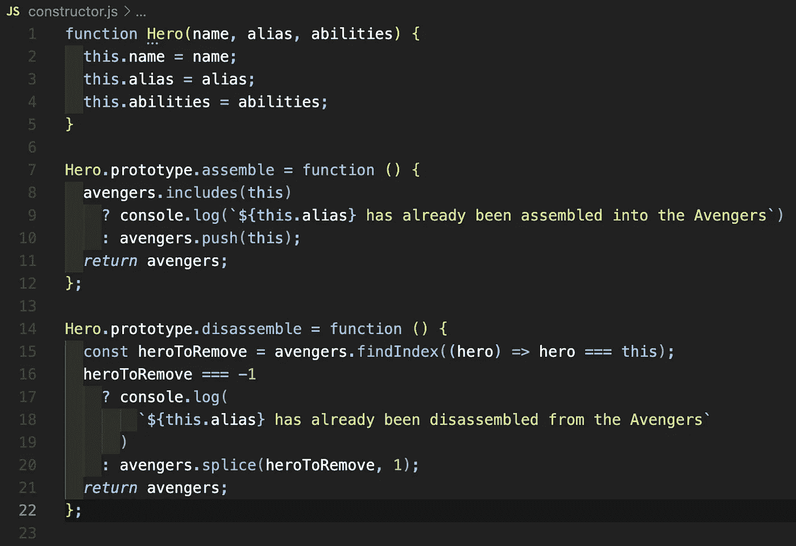
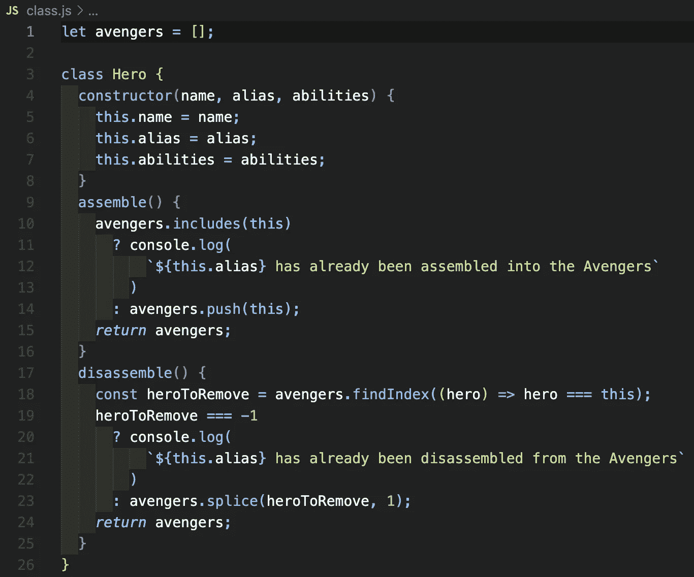

# JavaScript:类

> 原文：<https://medium.com/geekculture/javascript-classes-4e49e5bc1940?source=collection_archive---------18----------------------->

## 为对象创建创建模板


Photo by [Feliphe Schiarolli](https://unsplash.com/@flpschi?utm_source=medium&utm_medium=referral) on [Unsplash](https://unsplash.com?utm_source=medium&utm_medium=referral)

这是第三周也是最后一周/故事，涵盖了从函数创建对象的过程。我首先进入了[工厂函数](https://javascript.plainenglish.io/javascript-factory-functions-cbc5b744671b)的主题，并从这个想法转移到[构造函数](https://jmhero05.medium.com/javascript-constructor-functions-c92125251448)。在这之前，这一切都是儿戏；现在我们在玩大联盟— [JavaScript 类](https://developer.mozilla.org/en-US/docs/Web/JavaScript/Reference/Classes)。

JavaScript 类本质上是我之前讨论的前两种方法的语法糖。类完成完全相同的事情，一个函数返回一个对象，但是以一种更令人愉快、更容易使用的方式。以前，我们必须构建构造函数，并分别定义它可以通过原型链访问的不同方法。有了类，我们可以把所有的东西放在一个地方。



Our Hero constructor function from before. We can do better!

## 班级

要开始用 JavaScript 构建一个类，您需要从关键字`class`开始。因此，如果我们要开始构建我们的英雄模板，我们应该写:

```
class Hero {}
```

很简单。从这里开始，我们现在需要添加我们将在类的每个实例化中定义的唯一属性。如果你看过我以前关于构造函数的文章，你会觉得有些熟悉。

```
class Hero {
  constructor(name, alias, abilities) {
    this.name = name;
    this.alias = alias;
    this.abilities = abilities;
  }
}
```

这个“特殊函数”看起来非常类似于我们之前定义构造函数的方式。每个类在定义时都需要包含这个唯一的`constructor`方法。它在类中只能有一个[构造函数方法](https://developer.mozilla.org/en-US/docs/Web/JavaScript/Reference/Classes#constructor)；否则，会抛出一个`SyntaxError`。有趣的是，我们为什么不添加一个`console.log`来看看在这个构造函数中发生了什么！

```
class Hero {
  constructor(name, alias, abilities) {
    console.log('THIS IS THE BEGINNING OF CONSTRUCTOR');
    this.name = name;
    this.alias = alias;
    this.abilities = abilities;
    console.log('THIS IS THE END OF CONSTRUCTOR');
  }
}let captainAmerica = new Hero('Steven Rogers', 'Captain America', ['Enhanced strength, speed, stamina, durability, agility, reflexes, senses, and mental processing via the super soldier serum', 'Master martial artist and hand-to-hand combatant', 'Accelerated healing', 'Immunity to diseases and toxins', 'Slowed aging', 'Master tactician, strategist, and field commander', 'Using Vibranium-steel alloy shield'])// I know that captainAmerica object looks terrible in the Medium code template, but what ya gonna do? //
```

如果您在浏览器中运行上面的代码，您会注意到在创建 Hero 类的新实例时，这两个字符串会立即打印到控制台，这意味着我们的构造函数会在新实例创建后立即被调用。此外，它将`this`的值设置为一个新的空对象，然后根据我们在创建时通过`[new](https://developer.mozilla.org/en-US/docs/Web/JavaScript/Reference/Operators/new#description)` [关键字](https://developer.mozilla.org/en-US/docs/Web/JavaScript/Reference/Operators/new#description)传递的值为该对象添加适当的值。

还有几件事需要注意。定义新的`class`时，标准的定义是以大写字母开始(即`class Hero`)。此外，您可以在`constructor`方法中用不同的名称定义属性，比如`this.alias = alias`可以是`this.orange = alias`，但是，出于我认为显而易见的原因，使用`this.alias = alias`是标准的做法。

好吧，但是 JS 类的真正优势来自于方法。我们不必在外部定义它们，并像处理构造函数那样将它们添加到原型链中(`Hero.prototype.assemble = function(){}`)。类提供了甜蜜的语法糖，允许我们做以下事情:



嘣！那看起来和感觉不是很好吗？当我们实例化我们的 Hero 类的一个新实例时，这两个方法(`assemble` & `disassemble`)会自动包含在对象的原型链中。真的就这么简单。

快乐编码🤓