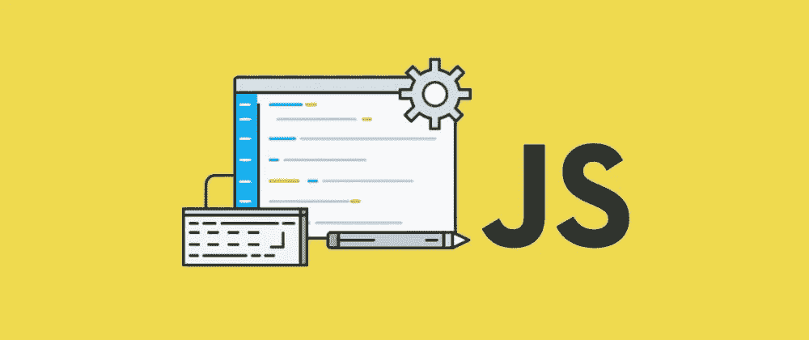

# 面向初学者的 JavaScript 概念概述

> 原文：<https://medium.com/geekculture/javascript-concept-recap-for-beginners-721ba630f05e?source=collection_archive---------24----------------------->

就像我上一篇评论 JavaScript 的文章一样，我也将尝试讨论一些更多的 JavaScript 主题。

## **JavaScript 中的数据类型**

JavaScript 只有两种类型。
1。原始数据类型—字符串、数字、布尔型
2。复合/对象&函数—数组、对象、函数

**检查数据类型:**

有一个预建函数“typeof()”。我们可以用它来检查数据类型。
例如:
console . log(type of(10))；> >编号
console.log(typeof("嘿！"))> >字符串

*但是，检查数组或对象会作为对象返回，作为函数运行。所有其他的像 date，regex 都是对象。*

console . log(type of([]))；> > object
console . log(type of(x =()=>x * 5))；>功能>

我们使用数据类型来检查它们是否使用了特定任务的正确数据类型。

## **什么是 BigInt？**

BigInt 是 JavaScript 中的一种数值数据类型。这是在 JS2020 中引入的。
bigint 的目的是使用大于 2⁵ -1 的数字。
BigInt 的限制是我们不能用 BitInt 做正则数的运算。也不能使用数学函数。
只允许 BigInt 之间的运算。

## **什么是符号？**

这就像一个唯一的 ID。
例如:
const Symbol 1 = Symbol(' cat ')；
const Symbol 2 = Symbol(' cat ')；

symbol1 === symbol2 >> false。因为即使符号是相同的，但它们背后有不同的 ID，这是独一无二的。

符号的用例是定义一个属性的唯一键。和常量表示。

## 试试……接住，这是怎么回事？

Try-Catch 是一种错误处理方法。这里有两个滑轮，一个是试滑轮，一个是抓滑轮。

尝试{
//我们要运行的代码
}
catch(error)
{
//这里我们处理错误数据。
}
所以首先执行 try 块，如果在“try”中一切正常，那么它跳过“catch”并继续剩余的代码。

如果 try 块中有错误，它会发送可能的错误来捕捉，这样我们就可以看到错误了。

Try…Catch 同步工作，因此如果 Try 块中有任何具有时间间隔的代码，它就不会工作。
要捕获预定代码中的错误，应在预定函数内实现试捕。

setTimeout(function(){
try {
//您这里的代码
}
catch(err){
//如果发生任何错误。
}
}，1000)；

## **编码风格**

擅长编码风格使一个开发人员成为更好的开发人员。以干净和结构化的方式编码是程序员的艺术。

假设我们有一个购物清单:
版本 1 = >牛奶、土豆、西红柿
版本 2= >牛奶、土豆、西红柿
哪个好看又好读？显然是第二个，对吗？这同样适用于编程。在每个逗号“，”后使用一个空格。

在函数内部，代码是两个空格。

比如:

功能你好(姓名){
..console . log(" Hello "+name)；//计数..作为两个空间。
}

然后在函数中的每条语句后使用分号(如下面的第二条)。

功能你好(姓名){
..const newName = name
..console . log(" Hello "+newName)
}

对

函数你好(名字){
..const newName = name
..console . log(" Hello "+newName)；
}

**骆驼案还是蛇案？这两种情况都很好，但我们应该为整个项目只有一种类型的风格。否则，它会很乱，并且很难阅读和理解。
**骆驼案:**const userName = " Tommy "；
**上驼案例:**const UserName = " Tommy "；
**蛇案:**const user _ name = " Tommy "；**

当我们声明一个函数时，我们通常会看到两种风格。
1。function do something(){
//你在这里编码
}

2.function do something()
{
//你在这里编码
}

大多数时候你会看到第一个例子，但有时也会看到第二个例子。

你可以选择其中任何一种，但是在整个项目中只能使用一种。

**if/else 语句风格:** 在编写许多或更大的条件时，我们应该通过换行来保持它的简短。
举个例子:
if(
userName = = = " Marrek "&&
dateOfBirth = = = 25&&
place of live = = = " Helsinki "
){
console . log("你是对的人！");
}

不要写没有花括号的条件，即使它们工作正常。
例如:

if( num < 0) console.log(“It’s negative”);
*或*
if(num>0)
console . log("是正的")；

这两种方法都可以，但是如果有几百行代码，你写了像这样的简短语句。如果需要查找任何 bug，您就有麻烦了。
这样做:
if(num<0){
console . log("是负数")；
}

## **编码时的注释:**

当您需要与他人共享您的代码或稍后可能需要检查的大型代码库时，注释非常重要。

//这个函数做这做那，做这做那，之后就发生了
//..和许多其他事情。

function do something(){
//您的代码
//另一行代码

for(设 I = 0；我< 10; i++){
…如果(条件){
……//做某事
……}
}
}

如果你这样做，而不是那样做

function do something(){
//您的代码

//这个循环 chcek evey index 并做点什么
for(让 I = 0；我<10；i++){

//检查正确的条件并采取措施
…if(conditon){
……//采取措施
…}
}
}

这可能很容易阅读和愉快地看着。

***如果需要简要说明怎么办？*** 好，那么我们可以这样做:
/**
*将登录用户的有效性返回为 boolean。
*
*[@ param](http://twitter.com/param){ string }用户名，检查该用户的有效性。
* [@param](http://twitter.com/param) {number}年龄，尽量与存储的用户数据匹配。
*[@ return](http://twitter.com/return){ number } id，从数据库查找匹配。
*/
函数 validUser(用户名，年龄，id){
return something
}

***我们来学点不一样的:***

## **JavaScript 中的事件循环是什么？**

众所周知，JavaScript 是一种单线程语言。这意味着它一次只能完成一项任务。

举个例子:
假设你在一部漫画里有一堆不同流派的书。你必须把它们按流派放在架子上。你很可能会挑选一本书，检查它的类型，然后把它放在书架的正确位置。
所以 JavaScript 与此非常相似。但并不像你想象的那么慢..

事件循环的任务就像一只援助之手。

您有一个堆栈和任务队列。

堆栈:当前显示“Hello World！”
事件循环://一旦堆栈清空或完成当前任务，就会推送队列中的下一个任务。任务队列:[“生活是美好的”，“我们都有活着的目的”]

*《你好世界》已经上映。所以当前任务完成了。
见现:*
**栈:**现上映《生活很美好》。
**事件循环:** //栈一清空或完成之前给定的任务，就推下一个队列第一的任务[《生活很美好》]。
**现在的任务队列:**【“我们都有活着的目的”】

## **回调函数是什么？**

简单来说，当我们执行/调用一个函数时。被调用的函数完成工作，当工作完成后，它调用另一个函数。那就是回调函数。所以在一个函数中调用另一个函数。
例如:

> Function do something(passed Function){
> let name = " Main Function "；
> //还有其他的事情要做。
> passedFunction(名称)；
> }
> 
> 函数 print something(name){
> console . log(" Called from:"+name)
> }
> 
> do something(print something)；//将函数传递给我要执行的主函数。