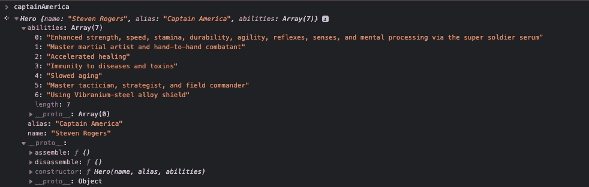
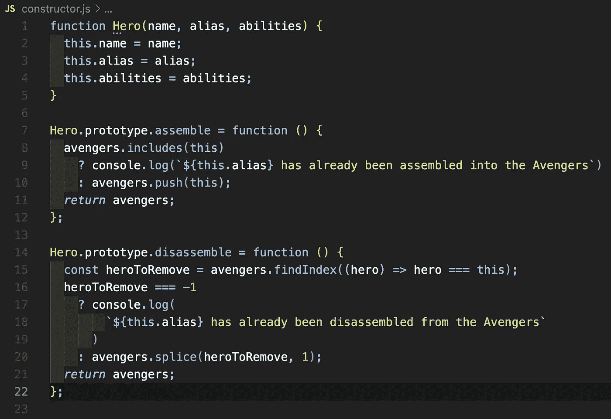

# JavaScript:构造函数

> 原文：<https://medium.com/geekculture/javascript-constructor-functions-c92125251448?source=collection_archive---------18----------------------->

## 用构造函数& new 运算符创建对象


Photo by [Ben Allan](https://unsplash.com/@ballonandon?utm_source=medium&utm_medium=referral) on [Unsplash](https://unsplash.com?utm_source=medium&utm_medium=referral)

上周，我谈到了[工厂功能](https://javascript.plainenglish.io/javascript-factory-functions-cbc5b744671b)的主题。正如我所承诺的，本周，我想把我们创建的同一个工厂改造成一个[构造函数](https://developer.mozilla.org/en-US/docs/Web/JavaScript/Guide/Working_with_Objects#using_a_constructor_function)，并用[新操作符](https://developer.mozilla.org/en-US/docs/Web/JavaScript/Reference/Operators/new)创建对象的实例。

在将工厂函数转变为构造函数之前，这里有一段 Eric Elliot 关于两者区别的摘录:

> **工厂和建造师有什么区别？**
> 
> 构造函数强制调用方使用`new`关键字。工厂没有。就是这样，但这有一些相关的副作用。
> 
> 那么`new`关键字是做什么的呢？
> 
> **注意:我们将使用** `**instance**` **来引用新创建的实例，使用** `**Constructor**` **来引用创建该实例的构造函数或类。**
> 
> 1.实例化一个新的实例对象，并在构造函数中将`this`绑定到它。
> 2。将`instance.__proto__`绑定到`Constructor.prototype`。
> 3。作为 2 的副作用，将`instance.__proto__.constructor`绑定到`Constructor`。
> 4。隐式返回`this`，引用`instance`。
> 
> — **Eric Elliot，** [**JavaScript 工厂函数 vs 构造函数 vs 类**](/javascript-scene/javascript-factory-functions-vs-constructor-functions-vs-classes-2f22ceddf33e)

现在，让我们开始吧。

# 构造函数

> 在[基于类的](https://en.wikipedia.org/wiki/Class-based_programming) [面向对象编程](https://en.wikipedia.org/wiki/Object-oriented_programming)中，一个**构造器**(简称: **ctor** )是一种特殊类型的[子程序](https://en.wikipedia.org/wiki/Subroutine)，被调用[创建一个对象](https://en.wikipedia.org/wiki/Object_creation)。它准备新对象以供使用，通常接受构造函数用来设置必需的[成员变量](https://en.wikipedia.org/wiki/Member_variable)的[参数](https://en.wikipedia.org/wiki/Parameter_(computer_programming))。
> 
> — [维基百科](https://en.wikipedia.org/wiki/Constructor_(object-oriented_programming))

为了让我们开始，让我们将上周的工厂功能放在下面以供参考:

```
const makeHero = (name, alias, abilities) => {
  const hero = {};
  hero.name = name;
  hero.alias = alias;
  hero.abilities = abilities;
  hero.assemble = function () {
    avengers.includes(this)
      ? console.log(
          `${this.alias} has already been assembled into the
           Avengers`
        )
      : avengers.push(this);
    *return* avengers;
  };
  hero.disassemble = function () {
    const heroToRemove = avengers.findIndex(
      (hero) => hero === this
    );
    heroToRemove === -1
      ? console.log(
          `${this.alias} has already been disassembled from the
           Avengers`
        )
      : avengers.splice(heroToRemove, 1);
    *return* avengers;
  };
  *return* hero;
}
```

上面的工厂函数创建一个对象，然后返回该对象。让我们来看一个来自 [MDN](https://developer.mozilla.org/en-US/docs/Web/JavaScript/Guide/Working_with_Objects#using_a_constructor_function) 的构造函数的例子:

```
function Car(make, model, year) {
  this.make = make;
  this.model = model;
  this.year = year;
}
```

您会注意到，该对象从未被设置为函数中的变量，也没有被设置为从函数返回任何内容。那么，这是如何工作的呢？输入`[new](https://developer.mozilla.org/en-US/docs/Web/JavaScript/Reference/Operators/new)` [操作符](https://developer.mozilla.org/en-US/docs/Web/JavaScript/Reference/Operators/new)。`new`关键字有一些 JS 魔术在幕后工作，并通过以下步骤授权对象实例的创建:

> 1.创建一个空白的普通 JavaScript 对象。
> 2。向链接到构造函数的原型对象
> 3 的新对象(`__proto__`)添加一个属性。将新创建的对象实例绑定为`this`上下文(即，在构造函数中对`this`的所有引用现在都是指在第一步中创建的对象)。
> 4。如果函数不返回对象，则返回`this`。
> 
> — [MDN](https://developer.mozilla.org/en-US/docs/Web/JavaScript/Reference/Operators/new#description)

你会在上面看到，在步骤 1 中，`new`关键字“创建一个空白的普通 JavaScript 对象”，在步骤 4 中，“如果函数不返回对象，则返回`this`”这就是为什么我们不必像在工厂函数中那样，将新的对象集硬编码为变量并返回该对象。经过一些小的调整，我们得到了下面的构造函数:

```
function Hero(name, alias, abilities){
  this.name = name;
  this.alias = alias;
  this.abilities = abilities;
  this.assemble = function () {
    avengers.includes(this)
      ? console.log(
          `${this.alias} has already been assembled into the
           Avengers`
        )
      : avengers.push(this);
    *return* avengers;
  };
  this.disassemble = function () {
    const heroToRemove = avengers.findIndex(
      (hero) => hero === this
    );
    heroToRemove === -1
      ? console.log(
          `${this.alias} has already been disassembled from the
           Avengers`
        )
      : avengers.splice(heroToRemove, 1);
    *return* avengers;
  };
}
```

这是我们之前做的工厂函数，但是作为构造函数。如果我们想创建一个`Hero`的新实例，我们将这样声明它:

```
const captainAmerica = **new** Hero('Steven Rogers', 'Captain America', ['Enhanced strength, speed, stamina, durability, agility, reflexes, senses, and mental processing via the super soldier serum',
'Master martial artist and hand-to-hand combatant',
'Accelerated healing',
'Immunity to diseases and toxins',
'Slowed aging',
'Master tactician, strategist, and field commander',
'Using Vibranium-steel alloy shield']);
```

这非常类似于我们之前使用工厂函数所做的，但是现在我们使用`new`关键字来创建实例。

最后一件事。如果我们比较对象的两个实例和工厂函数(`assemble` & `disassemble`)中包含的函数，你会注意到它们不相等。

```
captainAmerica.assemble === captainMarvel.assemble
// false
```

每次创建一个新对象时，它都会被赋予这些函数，作为该对象实例的唯一函数。有了构造函数，我们可以通过使用[原型属性](https://developer.mozilla.org/en-US/docs/Web/JavaScript/Guide/Working_with_Objects#defining_properties_for_an_object_type)来避免这些函数被对象唯一地创建。创建这些相同的函数，这样我们的`Hero`构造函数就可以通过原型链访问它们，如下所示:

```
Hero.prototype.assemble = function() {
    avengers.includes(this)
      ? console.log(
          `${this.alias} has already been assembled into the
           Avengers`
        )
      : avengers.push(this);
    return avengers;
  };
```

然后如果你现在比较函数，就像我们之前做的那样，你会得到`true`！

```
captainAmerica.assemble === captainMarvel.assemble
// true
```



`assemble` & disassemble are part of the prototype chain for Hero

我们的最终构造函数，以前是一个工厂函数，现在看起来像这样:



构造函数给了我们使用 new 关键字创建对象的机会。工厂函数基本上做同样的事情，但是不使用关键字 new。下周我们将讨论函数的最后一个变化，变成一个类。

快乐编码🤓