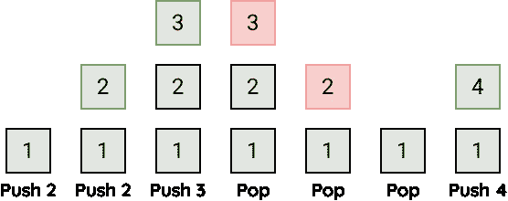
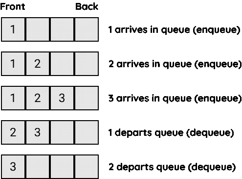

# Javascript 数据结构和算法:堆栈和队列

> 原文：<https://medium.com/geekculture/javascript-data-structures-and-algorithms-stacks-and-queues-57c06ba9d6ee?source=collection_archive---------22----------------------->

# 大量

堆栈是一种数据结构，其中只有最后插入的元素可以被移除和访问。想象一下把盘子堆在桌子上。要到达底部的一个，你必须移除顶部的所有其他的。这就是所谓的后进先出(LIFO)原则。堆栈很棒，因为它很快。因为已知最后一个元素将被移除，所以查找和插入发生在常数时间 O(1)内。当您需要处理 LIFO 形式的数据时，应该使用堆栈而不是数组，在这种情况下，算法只需要访问最后添加的元素。堆栈的限制是它们不能像数组那样直接访问非最后添加的元素；此外，访问更深层次的元素需要从数据结构中删除元素。该操作如下所示。



## 堆栈实现

为了构建一个栈，我们首先需要决定我们将用来存储栈元素的底层数据结构。我们将在实现中使用数组。下面是一些基本代码。

```
function **Stack**(array) { this.array = []; if (array) this.array = array;}
```

## 插入

要实现的第一个函数是 push()函数。当我们将一个新元素放入堆栈时，我们必须将它存储在顶部位置，并递增顶部变量，这样新的顶部就是数组中的下一个空位置。代码如下:

```
Stack.prototype.**push** = function (value) { this.array.**push**(value);};
```

## 删除

pop()函数与 push()函数相反，它返回堆栈顶部位置的元素，然后递减顶部变量。代码如下:

```
Stack.prototype.**pop** = function () { return this.array.**pop**();};
```

## 偷看

查看堆栈中最后添加的元素意味着返回最后添加的元素，而不将其从数据结构中移除。扫视通常用于将最后添加的元素与其他变量进行比较，并评估最后添加的元素是否应该从数据结构中删除。代码如下:

```
Stack.prototype.**peek** = function () { return this.array[this.array.length - 1];};
```

如果在一个空栈上调用 peek()函数，结果会得到 undefined。这是因为栈顶位置没有存储值，因为它是空的。有些情况下，你需要知道堆栈中存储了多少元素。length()函数通过返回 top 的值来返回该值:

```
Stack.prototype.**length** = function () { return this.array.length;};
```

下面是栈的完整代码实现:

# 行列

队列也是一种数据结构，但是您只能删除第一个添加的元素。这是一个被称为先进先出(FIFO)的原则。队列之所以伟大，还因为它的操作时间是恒定的。与堆栈类似，它也有局限性，因为一次只能访问一项。当您需要处理 FIFO 形式的数据时，应该使用队列而不是数组，在 FIFO 形式中，算法只需要访问第一个添加的元素。

涉及队列的两个主要操作是向队列中插入新元素和从队列中删除元素。插入操作称为**入队**，移除操作称为**出列**。入队操作在队列末尾插入新元素，出列操作从队列前面移除元素。该操作如下所示。



## 队列实现

在 JavaScript 中，数组有定义队列类的方法:shift()和 push()。回想一下，JavaScript 中数组上的 shift()方法移除并返回数组的第一个元素。添加到队列中通常称为入队，从队列中移除通常称为出队。shift()可用于出列，而。push()可用于入队。下面是一些基本代码。

```
function **Queue**(array) { this.array = []; if (array) this.array = array;}
```

## 插入

队列的插入被称为入队。因为数组用于保存堆栈数据，所以 push()方法可用于实现入队。enqueue()函数将一个元素添加到队列的末尾:

```
Queue.prototype.**enqueue** = function (value) { return this.array.**push**(value);};
```

## 删除

队列的删除也称为出列。因为数组用于保存堆栈数据，所以 shift()方法可用于移除和返回队列中的第一个元素。dequeue()函数从队列前面删除一个元素:

```
Queue.prototype.**dequeue** = function () { return this.array.**shift**();};
```

## 偷看

peek 函数查看第一个项目，而不将它从队列中弹出。在堆栈实现中，返回数组中的最后一个元素，但是由于 FIFO 的原因，队列返回数组中的第一个元素。

```
Queue.prototype.**peek** = function () { return this.array[0];};
```

我们可以使用这些函数来检查队列的前端和后端元素:

```
Queue.prototype.**front** = function () { return this.array[0];}; Queue.prototype.**back** = function () { return this.array[this.array.length - 1];};
```

我们还需要一个 toString()函数来显示队列中的所有元素:

```
Queue.prototype.**toString** = function () { return this.array.**map**((queue) => queue).**join**(" ");};
```

最后，我们需要一个让我们知道队列是否为空的函数:

```
Queue.prototype.**isEmpty** = function () { return this.array.length === 0;};
```

下面是队列的完整代码实现:

# 参考/重要链接

[](http://www.apress.com/9781484239872) [## JavaScript 数据结构和算法

### 这本书探索了与 JavaScript 相关的数据结构和算法概念，以及它们与日常生活的关系

www.apress.com](http://www.apress.com/9781484239872) [](https://github.com/Apress/js-data-structures-and-algorithms) [## GitHub-a press/js-Data-Structures-and-algorithms:JavaScript 数据结构和

### 这个知识库伴随着余思敏·裴的《JavaScript 数据结构和算法》(Apress，2019)。下载文件…

github.com](https://github.com/Apress/js-data-structures-and-algorithms)