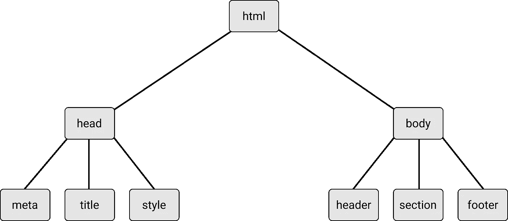
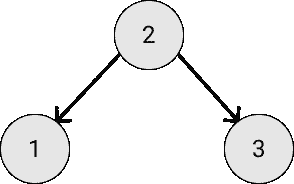

# Javascript 数据结构和算法:树

> 原文：<https://medium.com/geekculture/javascript-data-structures-and-algorithms-trees-76f0403dee9c?source=collection_archive---------16----------------------->

树是计算机科学中常用的数据结构。树是一种非线性数据结构，用于以分层方式存储数据。树形数据结构用于存储分层数据，例如文件系统中的文件，并用于存储数据的排序列表。树是由一组通过边连接的节点组成的。树的一个例子是文档 HTML:



树的顶部节点被称为根节点。如果一个节点连接到它下面的其他节点，前面的节点称为*父节点*，后面的节点称为*子节点*。一个节点可以连接零个、一个或多个子节点。没有任何子节点的节点称为*叶节点*。

# 二叉树和二分搜索法树

二叉树的每个节点最多只能有两个子节点。通过将子节点的数量限制为两个，我们可以编写高效的程序来插入数据、搜索数据和删除树中的数据。

二分搜索法树(BST)也有两个孩子，左和右。然而，在二叉查找树中，*左边的孩子比父母小，右边的孩子比父母大*。BST 具有这种结构，因为这种特性使得能够以 O(log2(n))的时间复杂度搜索、插入和移除特定值。二分搜索法树的一个例子:



## 构建二叉查找树实现

二分搜索法树有一个根节点(最顶端的节点)，它最初被初始化为空(在插入任何项目之前)。

```
function **BinarySearchTree()** { this.root = null;}
```

## 插入

插入 BST 需要几个步骤。首先，如果根是空的，那么根将成为新的节点。否则，将使用 while 循环遍历 BST，直到满足正确的条件。在每次循环迭代中，检查新节点是大于还是小于当前根节点。

```
BinarySearchTree.prototype.**insert** = function (value) { let thisNode = { left: null, right: null, value: value, }; if (!this._root) { this._root = thisNode; } else { let currentRoot = this._root; while (true) { if (currentRoot.value > value) { if (currentRoot.left != null) { currentRoot = currentRoot.left; } else { currentRoot.left = thisNode; break; } } else if (currentRoot.value < value) { if (currentRoot.right != null) { currentRoot = currentRoot.right; } else { currentRoot.right = thisNode; break; } } else { break; } } }};
```

## 删除

该算法首先遍历树，专门寻找具有指定值的节点。下面的代码实现了上述三种情况。首先，它递归遍历，直到满足其中一种情况，然后删除节点。

```
BinarySearchTree.prototype.**remove** = function (value) { return **deleteRecursively**(this._root, value); function **deleteRecursively**(root, value) { if (!root) { return null; } else if (value < root.value) { root.left = **deleteRecursively**(root.left, value); } else if (value > root.value) { root.right = **deleteRecursively**(root.right, value); } else { if (!root.left && !root.right) { return null; } else if (!root.left) { root = root.right; return root; } else if (!root.right) { root = root.left; return root; } else { let temp = **findMin**(root.right); root.value = temp.value; root.right = **deleteRecursively**(root.right, temp.value); return root; } } return root;}function **findMin**(root) { while (root.left) { root = root.left; } return root; }};
```

## 搜索特定值

可以使用 BST 节点的左子节点总是小于其父节点并且 BST 节点的右子节点总是大于其父节点的属性来执行搜索。遍历树可以通过检查 currentRoot 是小于还是大于要搜索的值来完成。如果 currentRoot 较小，则访问正确的子节点。如果 currentRoot 较大，则访问左边的子节点。我们可以用 find 函数在 BST 中实现搜索，定义如下:

```
BinarySearchTree.prototype.**find** = function (value) { let currentRoot = this.root, found = false; while (currentRoot) { if (currentRoot.value > value) { currentRoot = currentRoot.left; } else if (currentRoot.value < value) { currentRoot = currentRoot.right; } else { found = true; break; } } return found;};
```

## 搜索最小值和最大值

在 BST 中搜索存储的最小值和最大值是相对简单的过程。因为较小的值总是存储在左边的子节点中，所以要找到 BST 中的最小值，只需遍历 BST 的左边缘，直到到达最后一个节点。为了找到存储在 BST 中的最大值，函数必须简单地遍历节点的右边链接，直到函数到达 BST 的右端。存储在该节点中的值必须是最大值。定义函数如下:

```
BinarySearchTree.prototype.**getMin** = function () { let current = this.root; while (current.left !== null) { current = current.left; } return current.value;};BinarySearchTree.prototype.**getMax** = function () { let current = this.root; while (current.right !== null) { current = current.right; } return current.value;};
```

以下是二叉查找树的完整代码实现:

# 参考/重要链接

[](http://www.apress.com/9781484239872) [## JavaScript 数据结构和算法

### 这本书探索了与 JavaScript 相关的数据结构和算法概念，以及它们与日常生活的关系

www.apress.com](http://www.apress.com/9781484239872) [](https://github.com/Apress/js-data-structures-and-algorithms) [## GitHub-a press/js-Data-Structures-and-algorithms:JavaScript 数据结构和

### 此时您不能执行该操作。您已使用另一个标签页或窗口登录。您已在另一个选项卡中注销，或者…

github.com](https://github.com/Apress/js-data-structures-and-algorithms)