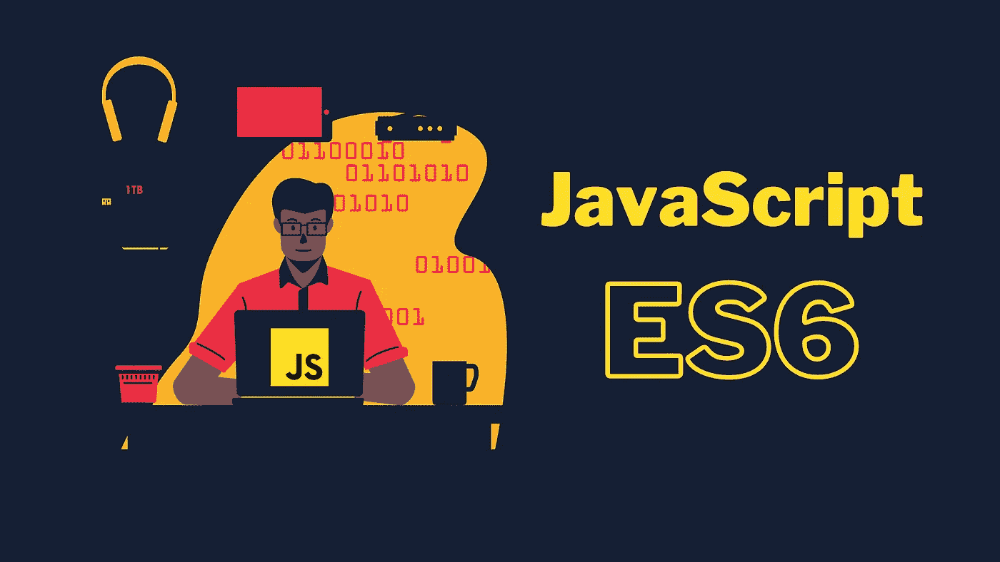

# JavaScript ES6——初学者的视角

> 原文：<https://medium.com/geekculture/javascript-es6-a-beginners-perspective-eac9ab6c86e0?source=collection_archive---------21----------------------->



ES6 指的是 ECMAScript 版本 6，它是 JavaScript 的标准化名称。2015 年发布的 ES6 引入了该语言的几个新概念和更新。
在本文中，我将尝试提供一个易于理解的 ES6 概述，以及为什么每个 JavaScript 开发人员都应该知道这一点。

## **常数**

首先介绍 let/const。以前我们必须用 var 来声明一个变量。但是它的问题是它可以在代码中被重新赋值和修改。这可能会导致重大问题。

现在，如果你想声明一个不改变值的常量变量，你可以使用 const，如果你想声明一个可重写的变量，你应该使用 let。

```
// Before ES6
var number1 = 5;
number1 = 10
console.log(number1) // Returns 10// After ES6
const number2 = 5;
number2 = 10; // gives an errorlet number3 = 5;
number3 = 10;
console.log(number3); // Returns 10
```

## **块范围的变量、函数**

变量以前是函数作用域的，这意味着函数中不能存在两个相同的变量。但是现在它是块范围的，你可以在一个函数中有相同的变量，但是在不同的块中。

```
// Before ES6
function test(){
let x = 5; 
  {
   let x = 10; // Error variable is declared before
  }
}// After ES6
function test(){
  let x = 5; 
    {
     let x = 10; 
     console.log(x); // returns 10
    }
  console.log(x); // returns 5
}
```

## **箭头功能介绍**

箭头函数没有任何特殊功能，但它有一个更简单的语法。这种类型的函数对于编写内联函数非常有帮助。有了箭头函数，我们不需要声明函数类型。

```
// Before ES6
function notArrow(parameter){
//Expression
}// After ES6
const arrowFunction = (parameter) => //Expression ;[1, 5, 9, 15].map(a => console.log(a+1));// returns 2,6,10,16
```

## **默认功能参数**

这个特性在处理错误时非常方便。基本上，通过这个特性，您可以为函数参数添加一个默认值，这个默认值只在给定的参数无效时使用。使用默认参数，你可以保证你的函数不会崩溃。

```
// Before ES6
function add (num1, num2){
var sum = num1 + num2;
return sum;
}
add(5) // Reutrns NaN(not a number)// After ES6
const add2 = (num1=0, num2=0) => num1+num2;
add2(5,5) // Returns 10
add2(5)   // Returns 5
add2()    // Returns 0
```

## 扩展运算符

扩展语法`(...element)`绝对是 ES6 最酷的特性之一。这种语法允许将数组或字符串等可重复项放在函数参数、数组元素和对象表达式等位置。
为了简单起见，你可以把一个完整的数组作为一个函数的参数，利用这个特性很容易复制数组。例子

```
// Before ES6 
// Function parameter array element
var array = [1, 2, 3];
function sum(num1, num2, num3){
    return num1 + num2 + num3;
}
sum(array[0], array[1], array[2]) // returns 6//............................................................// Adding arrays and element
var arr1 = ['Java'];
var arr2 = ['Script'];
var str = 'Language'; var arrayTotal = arr1 + arr2;
arrayTotal.push(str); 
console.log(arrayTotal); // returns ['Java','Script','Language']//.............................................................// After ES6 
// Function parameter array element
const array2 = [1, 2, 3];
function sum1(num1, num2, num3){
return num1 + num2 + num3;
}
sum1(...array2); // returns 6//.............................................................// Adding arrays and element
var arr1 = ['Java'];
var arr2 = ['Script'];
var str = 'Language';var arrayTotal = [...arr1, ...arr2, str];
console.log(arrayTotal); // returns ['Java','Script','Language']
```

## **剩余功能参数**

ES6 中增加了另一个重要特性，即通过函数传递所有参数的能力。在函数中，我们可以获得定义的参数，但是如果用户传递的参数多于定义的参数，ES6 可以用`…args`参数来处理。

```
// Before ES6
function multiply(num1, num2){
let total = num1 * num2;
return total;
}
multiply(3,5,8); // Returns 15 no way to get 8// After ES6
function multiply(num1, num2,...args){
let total = num1 * num2; 
console.log(args);
return total; 
}
multiply(3,5,8,9); // Returns 15 and arguments array [8,9]
```

## 模板字符串

另一个我们必须知道的优秀特性是字符串模板。这个特性允许我们使用``${arguments}`'语法将变量等表达式放入字符串中。这个特性有很大的好处，在此之前，我们必须断开字符串，将表达式放入代码中，或者在字符串末尾添加表达式。现在我们可以在字符串中写表达式了。

```
// Before ES6
var name = 'john';
var str1 = 'Hello Mr ' + name + ' How are You, today?';
console.log(str1); // returns Hello Mr john How are You, today?// After ES6
var name2 = 'john';
var str2 = `Hello Mr ${name} How are You, today?`;
console.log(str2); // returns Hello Mr john How are You, today?// Using Function call inside string
const empty = () => { 
   return 'Hi';
}
str3 = `${empty()}, How are You ?`;
console.log(str3); // Returns Hi, How are You ?
```

## 对象简化

在这个版本的 Js 中，声明和使用对象的语法非常简化。

```
//Before ES6 
var x = 5;
var y = 10; 
var name = 'john';
var obj1 = {x:x, y:y, name:name};
obj1['age'] = 20;
console.log(obj1); returns {x: 5, y: 10, name: "john", age: 20}//After ES6 
const a = 5;
const b = 10;
const name1 = 'John';
let obj2 = {a, b, name1, age:20};
console.log(obj2) // returns {a: 5, b: 10, name1: "John", age: 20}
```

## 正式的类定义

JavaScript 使类定义有点正式语法。以前没有`class`关键词。对象是由函数创建的。ES6 类增加了诸如 getter/setter、extends、static、super 等功能。

```
// Before ES6
function pet(name, type)
{  
    this.name = name;  
    this.type = type;  
} 
pet.prototype.getName = function() {
  return this.name;
};
 pet.prototype.getType = function() {
  return this.type;
};var tom = new pet('tom', 'cat');
console.log(tom); // returns pet {name: "tom", type: "cat"}// After ES6class pet2 {  
  constructor(name, type) 
  {    
       this.name = name;    
       this.type = type;
  }   
  getName() {
    return this.name;  
  }   
  getType() {
    return this.type;  
  }   
}const jerry = new pet2('Jerry', 'Rat');
jerry.getName(); // returns 'Jerry'
console.log(jerry); // returns pet2 {name: "Jerry", type: "Rat"} 
```

接下来，您可以了解类继承获取器以及更多内容。请在 [MDN](https://developer.mozilla.org/en-US/docs/Web/JavaScript) 上阅读这篇文章，了解 ES6 的高级知识。

这就是 ES6 一些重要特性的基本概述。
从这里，您可以深入了解 JavaScript。谢谢你读到这里。