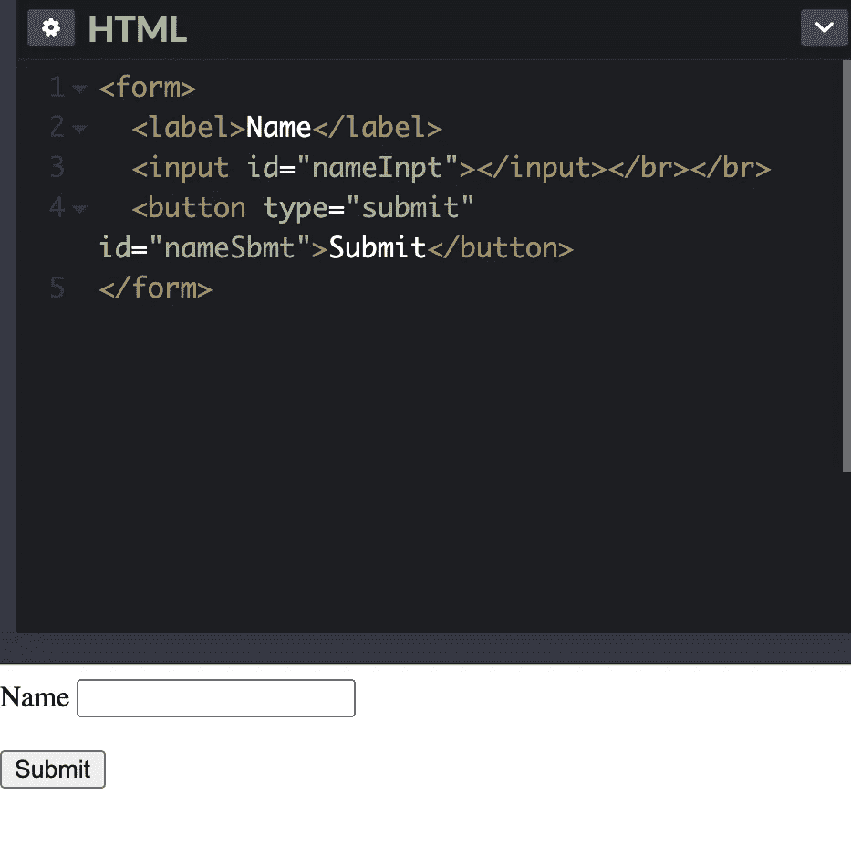
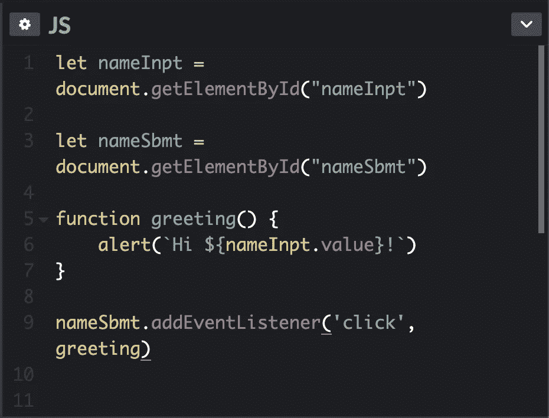

# 面向虚拟对象的 JavaScript 函数第 2 部分:addEventListener() &一级对象

> 原文：<https://medium.com/geekculture/javascript-functions-for-dummies-part-2-addeventlistener-c3914d5b4f0d?source=collection_archive---------39----------------------->

如果你是从第 1 部分开始学习的，我们已经知道 JavaScript 函数可以用*声明*或*表达。*我们现在知道函数必须用`()`参数调用，不管参数是否已经包含在我们的函数中。但是也暗示了在没有参数的情况下调用函数*的选项。这就是`addEventListener()` 发挥作用的地方。*

我们将像以前一样使用相同的`greeting()`函数，但是这次我们将把它添加到一个表单中，当表单被提交时，我们将得到提交的名称的问候。

```
function greeting(name) {
    alert(`Hi ${name}!`)
}
```

这是我们目前的职能。我们调用`greeting("James")`,在浏览器中得到一个提示说`Hi James!`,我们可以把名字改成我们喜欢的。这太棒了！我们的功能足够动态，可以根据需要进行更改，但我们绝不会希望与我们网站交互的人直接与我们的功能进行交互。因此，让我们再次重构它，使其更加用户友好。



更现实的是，我们的网站将有一个输入字段供人们互动。为了模仿这一点，我制作了一个超级简单的表单，在 [codepen.io](https://codepen.io/jbondeson19/pen/gOgVrXa) 上有一个输入和按钮，来演示它可能的样子。我们有一个输入字段来输入姓名，还有一个提交按钮来确认姓名已提交到我们的简单表单。

理论上，我们希望发生的是，我们提交任何我们想要的名字，我们将得到一个警告，就像我们对上面的函数所做的一样。让我们修改我们的代码，使其更加用户友好。

# addEventListener()

JavaScript 提供了大量可以在浏览器中使用的预置方法，其中之一就是`addEventListener()`，我们将用它来帮助我们的用户与 JavaScript 交流。

> “等等，有什么方法？这和函数有什么不同？”

很高兴你问了！函数是存储的代码块，用于执行 JavaScript 中的任务。方法也是函数，但是它们存储为*对象属性。**JavaScript 中所有的*对象都有[预先建立的方法](https://www.tutorialspoint.com/javascript/javascript_builtin_functions.htm)。我们甚至可以自己做。但是`addEventListener()`是让生活变得更容易的预设方法之一。下面，我们可以看到如何用`addEventListener()`和`getElementById()`调用一个对象方法。首先，识别正在使用的对象(在我们的例子中是“文档”)，然后用`.`调用方法。方法仍然只是函数，正如我们在`getElementById()`中看到的，它接受一个字符串参数。记住，参数是函数的参数值。

那么`addEventListener()`是如何工作的，这与我们最初的`greeting()`功能有什么关系呢？



Codepen.io

让我们分析一下第 9 行发生了什么。`nameSbmt`是我们创建的一个变量，正如我们所建立的那样`addEventListener()`是一个预先建立的方法，它接受两个参数。第一个参数是我们想要操作的事件的字符串。[这里的](https://developer.mozilla.org/en-US/docs/Web/Events)是所有可以修改的 JavaScript 事件的引用。第二个参数是您希望该事件做什么。我们希望事件发送一个警告，提醒用户输入他们的名字。那么，为什么我们现在不加参数地调用`greeting`？函数不是只有用`()`调用才有效的规则吗？这是其中一个例外！如果我们包含了参数并调用了`greeting()`，JavaScript 会让*立即*触发那个函数，根本不会注册用户的任何输入，它会加载页面并立即看到`greeting()`被调用并立即触发它。就应该这样！但我们不希望这种情况发生。我们希望等待使用`greeting()`,直到我们的用户输入他们的名字，然后单击“提交”。所以在我们的方法`addEventListener()`中，我们将`greeting`作为一个**对象**来调用。由于 JavaScript 的性质，所有函数都被认为是一级对象，这意味着函数可以存储在变量或对象中，因此表现得像对象一样。还记得我们在《T21》第一部中的第一个表达吗？

```
let greeting = function() {
      alert("Hi James!")
}
```

在这个例子中，我们创建了一个新变量`greeting`。但是要调用这个函数，我们必须包含参数。然而，在 JavaScript 中它仍然被认为是一个对象*。这就是我们在`addEventListener()`中呼吁的。即使我们在 codepen.io 示例中将 greeting 编写为声明性函数，它仍然将`greeting`存储为对象。所以现在当我们调用`addEventListener`时，JavaScript 看到`greeting`的*对象*，其中存储了一个函数，并对自己说*

> “好的，一旦有人点击“提交”**，我们将执行存储在`greeting`中的函数，但在此之前不会执行。**

这是一个微小而微妙的区别，但是理解函数和它们与对象的关系是让 JavaScript 工作的关键**。**所有函数都是 JavaScript 中的一级对象。这意味着我们可以像对待其他数据类型(字符串、整数、数组等)一样对待我们的函数。).****

如果您注意到了，我还删除了我们的问候函数中的`(name)`参数。这是因为如果我们在 addEventListener 中输入名称的值，它会尝试在页面加载时立即触发`greeting`函数。所以我们移动了一些东西，正如我们看到的，现在 JavaScript 告诉自己

> 好的，我已经存储并保存了所有这些信息，我有一个表单，并且我知道当它被交互时我想要如何响应表单。每当有人在输入框中输入他们的名字，一旦他们点击“提交”按钮，我将向他们的屏幕发送一个提示，告诉他们“嗨”以及他们输入的任何值作为他们的名字。

JavaScript 是一种非常酷的动态语言，我相信有很多其他方法可以做到这一点。但重要的是知道什么是一级对象，知道函数和方法之间的区别，知道如何让我们的函数与我们在站点中创建的对象进行交互。这需要一些练习，但随着时间的推移，它将有助于减少修复错误的时间，我保证！编码朋友们快乐！