# JavaScript 图形和游戏框架将在 2021 年激发灵感

> 原文：<https://medium.com/geekculture/javascript-graphics-and-game-frameworks-for-2021-cf0cad5ed4c8?source=collection_archive---------4----------------------->

随着时间的推移，我不断惊讶于 JavaScript 功能和工具的进步。这里有一些专注于 web 交付的图形和游戏框架来启发。

# 可视化 gl

Vis.gl 是一套围绕 [deck.gl](https://deck.gl/) 的可组合、可互操作的开源地理空间可视化框架。

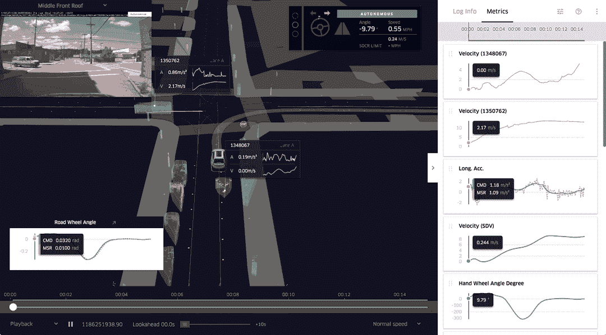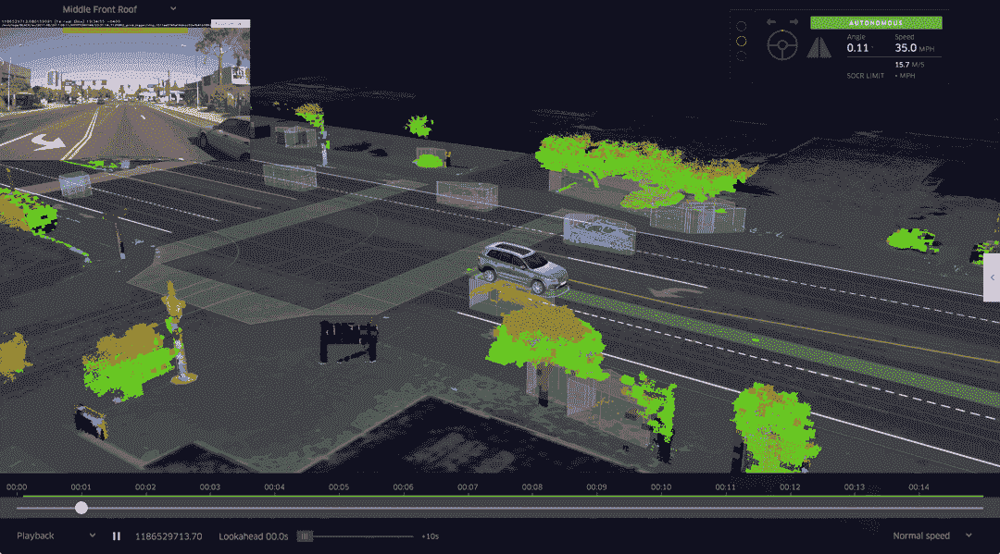

[Uber Advanced Technologies Group Demo](https://eng.uber.com/atg-dataviz/)

它由优步创建，受 Linux 基金会和城市计算基金会的开放管理。

vis.gl 框架专为基于 GPU 的网络地理空间可视化和分析而设计。这些框架被设计成可以独立使用，同时遵循一种通用的风格，使得它们可以无缝地协同工作。

*   网址:【https://vis.gl/ T3
*   GitHub:【https://github.com/visgl 
*   框架目录:[https://vis.gl/frameworks/](https://vis.gl/frameworks/)

## Deck.gl

基于 WebGL 的框架，用于大型数据集的可视化探索性数据分析，允许通过组合现有层来构建复杂的可视化。

通过在 GPU 中模拟 64 位浮点计算，deck.gl 以无与伦比的准确性和性能渲染数据集。

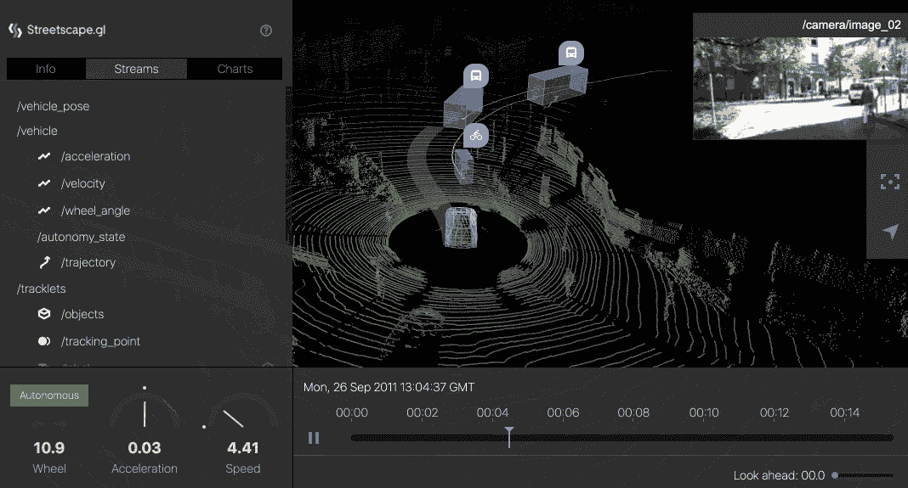

[Autonomous Visualization System](https://avs.auto/demo/index.html)

*   网址:[https://deck.gl/](https://deck.gl/)
*   例子:[https://deck.gl/examples](https://deck.gl/examples)
*   展柜:[https://deck.gl/showcase](https://deck.gl/showcase)

## 开普勒

针对大规模数据集的强大开源地理空间分析工具，使用 Redux 来管理状态。

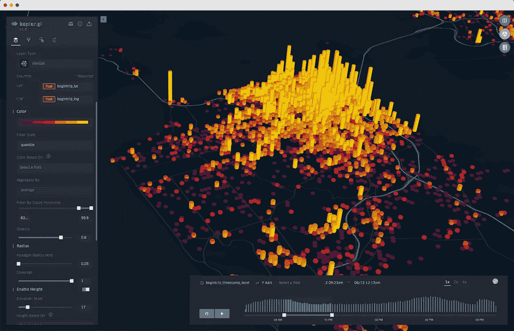

*   网址:[https://kepler.gl/](https://kepler.gl/)
*   GitHub:[https://github.com/keplergl/kepler.gl](https://github.com/keplergl/kepler.gl)

## 星云网

高性能、支持 3D 的 GeoJSON 编辑 deck.gl 和 React。

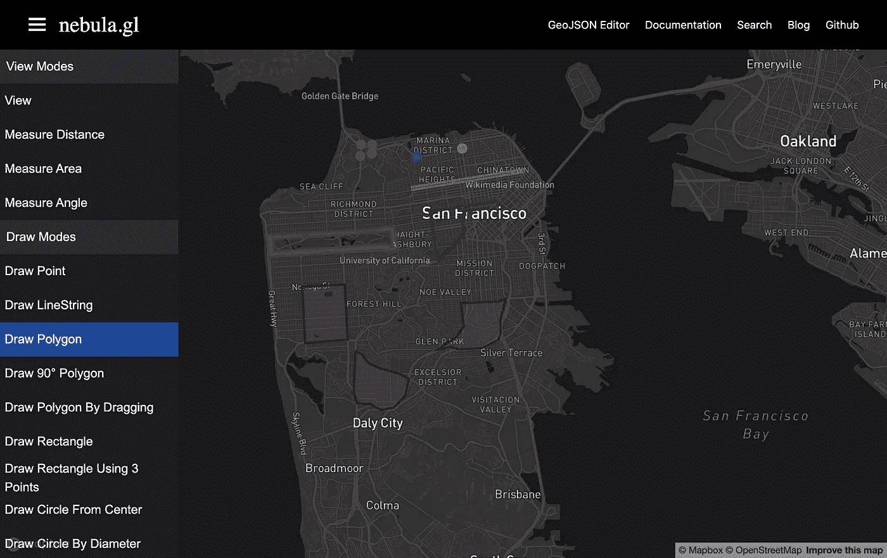

*   网址:[https://nebula.gl/](https://nebula.gl/)
*   GeoJSON 编辑:[https://nebula.gl/geojson-editor/](https://nebula.gl/geojson-editor/)
*   GitHub:[https://github.com/uber/nebula.gl](https://github.com/uber/nebula.gl)

## 游戏画布

具有开源 web 第一游戏引擎的商业产品，用于协作构建令人惊叹的 HTML5 游戏和可视化，具有跨多种设备实时更新的浏览器内 WebGL 编辑器。

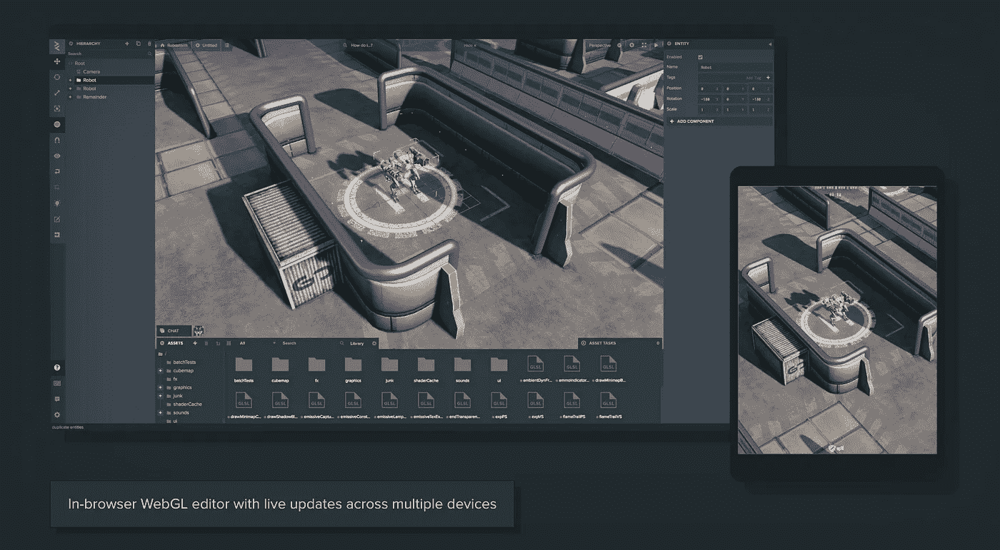

*   网址:[https://playcanvas.com/](https://playcanvas.com/)
*   GitHub:【https://github.com/playcanvas/engine 

## 三. js

轻量级，跨浏览器，通用 3D 库。当前版本只包含一个 WebGL 渲染器，但是示例中也提供了 WebGPU(实验)、SVG 和 CSS3D 渲染器。

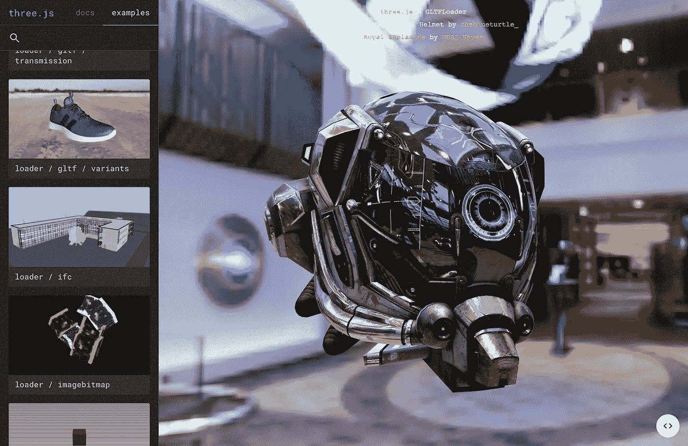

[GLTF Loader example](https://threejs.org/examples/#webgl_loader_gltf)

*   网址:【https://threejs.org/ 
*   例子:[https://threejs.org/examples/](https://threejs.org/examples/)
*   编辑:[https://threejs.org/editor/](https://threejs.org/editor/)
*   GitHub:[https://github.com/mrdoob/three.js/](https://github.com/mrdoob/three.js/)

## 巴比伦. js

实时 3D 引擎，用于通过 HTML5 在 web 浏览器中显示 3D 图形，具有 WebGL 和 WebGPU 引擎。

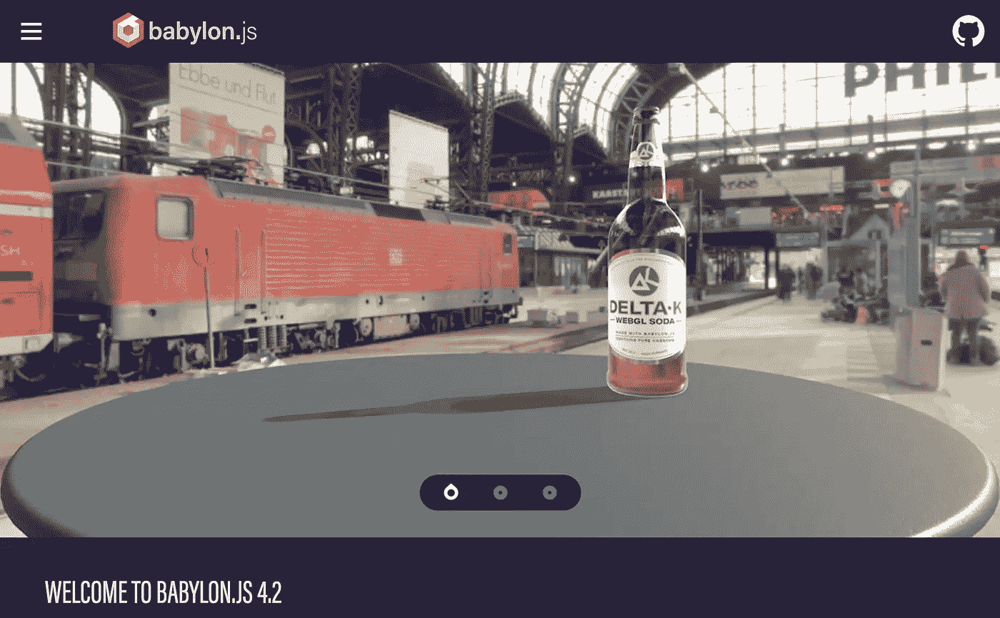

Babylon 通过操场提供带有代码编辑器的实时样本:

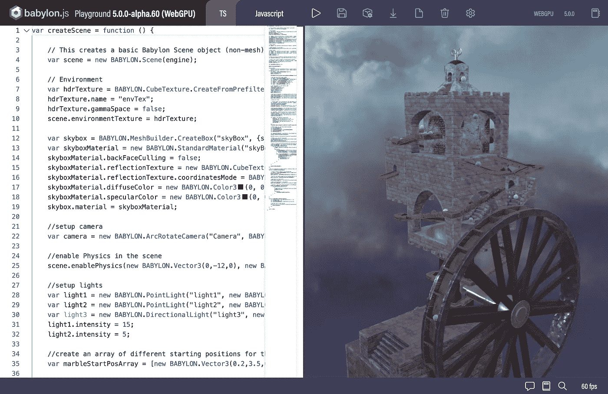

[Babylon Playground](https://playground.babylonjs.com/#3I55DK#0)

*   网址:[https://www.babylonjs.com/](https://www.babylonjs.com/)
*   游乐场:[https://playground.babylonjs.com/](https://playground.babylonjs.com/)
*   演示:[https://www.babylonjs.com/community/](https://www.babylonjs.com/community/)
*   GitHub:[https://github.com/BabylonJS](https://github.com/BabylonJS)

## 相位器

开源 2D 游戏框架，为桌面和移动网络浏览器制作 HTML5 游戏，支持 Canvas 和 WebGL 渲染。

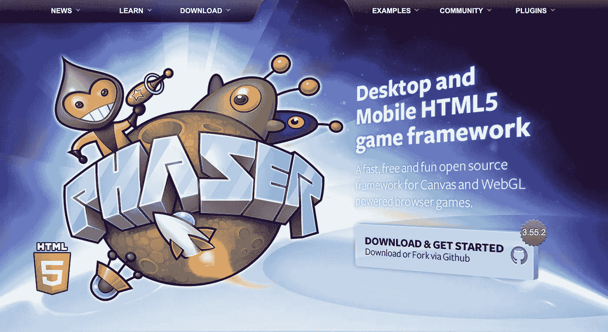

*   网址:[https://phaser.io/](https://phaser.io/)
*   GitHub:[https://github.com/photonstorm/phaser/tree/v3.55.2](https://github.com/photonstorm/phaser/tree/v3.55.2)

## Pixi.js

2D HTML5 内容创建引擎。

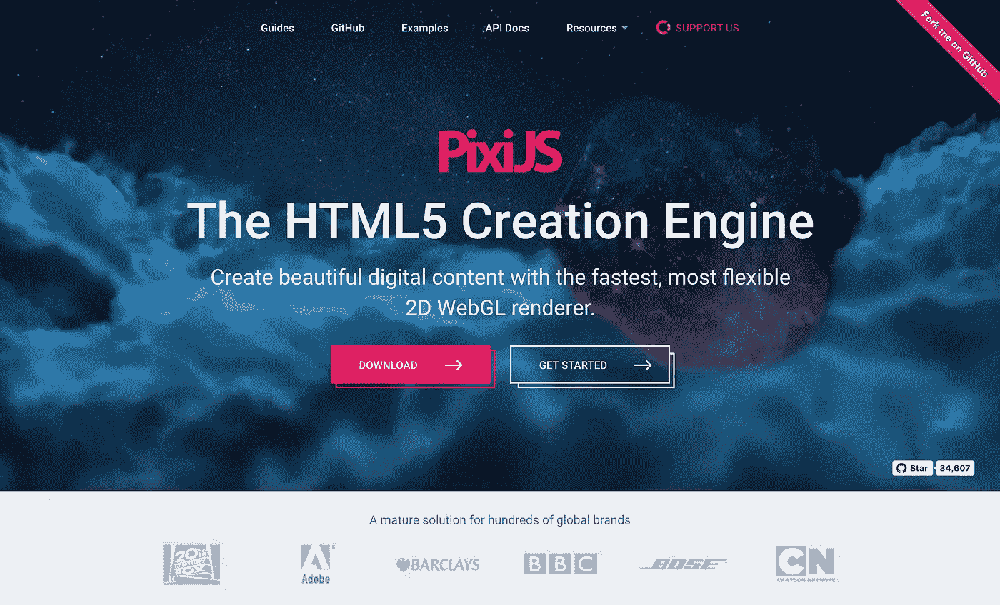

*   网址:[https://pixijs.com/](https://pixijs.com/)
*   例子:[https://pixijs.io/examples/#/demos-basic/container.js](https://pixijs.io/examples/#/demos-basic/container.js)
*   GitHub:[https://github.com/pixijs](https://github.com/pixijs)

## Cocos2D-X

用于 2D 和 3D 游戏创作的开源跨平台游戏开发框架，提供渲染、GUI、音频、网络、物理和用户输入。此外还有 Cocos Creator，这是一套用于游戏逻辑和高性能游戏创作的开发工具。

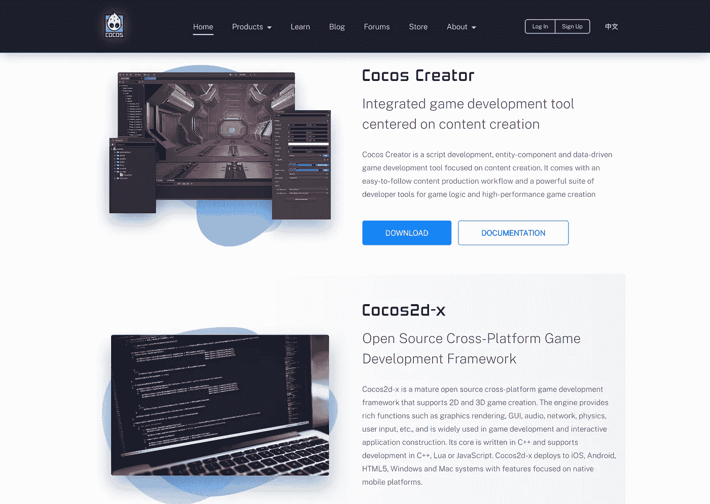

*   网址:[https://www.cocos.com/en/](https://www.cocos.com/en/)
*   Cocos Creator 引擎:【https://github.com/cocos-creator/engine 
*   GitHub:【https://github.com/cocos2d/cocos2d-x 

## 影响

用于桌面和移动的 HTML5 游戏引擎，具有 *Weltmeister* 级编辑器，让你创建自己的游戏世界。

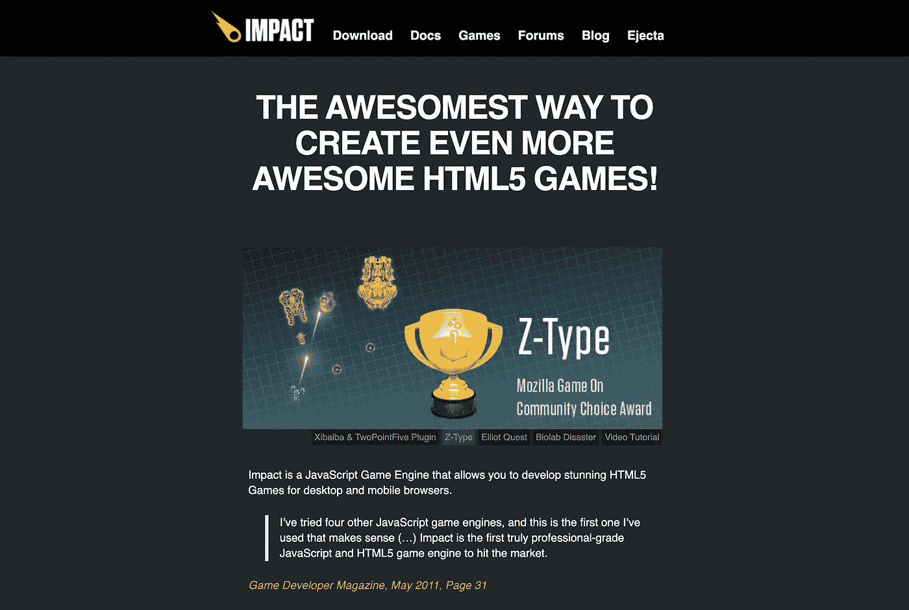

*   网址:[https://impactjs.com/](https://impactjs.com/)
*   GitHub:[https://github.com/phoboslab/Impact](https://github.com/phoboslab/Impact)

## 梅龙尼斯

开源 HTML5 游戏引擎，使开发人员和设计人员能够专注于内容，具有一系列可组合的实体。

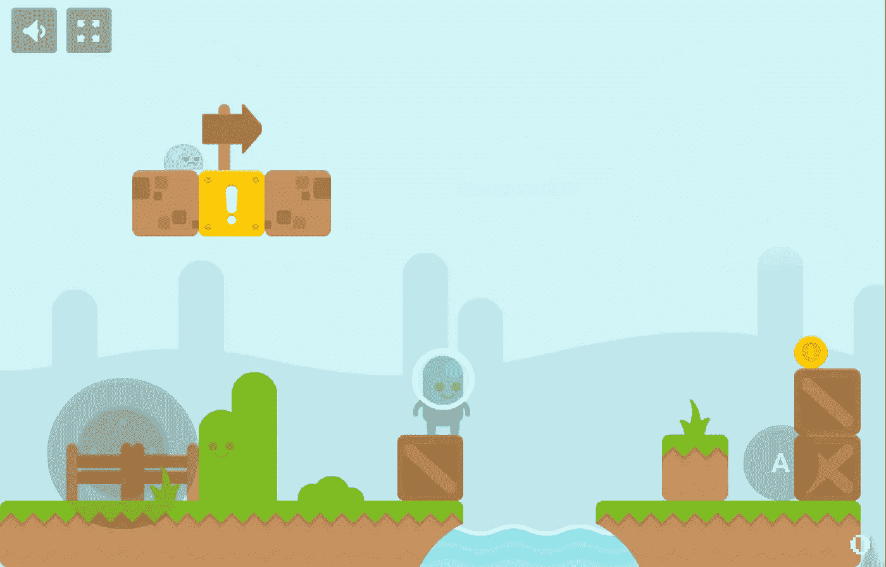

[Platformer example](https://melonjs.github.io/examples/examples/platformer/)

*   网址:[https://melonjs.org/](https://melonjs.org/)
*   GitHub:[https://github.com/melonjs/melonJS](https://github.com/melonjs/melonJS)
*   例子:[https://melonjs.github.io/examples/](https://melonjs.github.io/examples/)

## GDevelop

开源构建器创建游戏，一键发布到 web、iOS、Android、Stream、脸书、Windows 应用商店等。

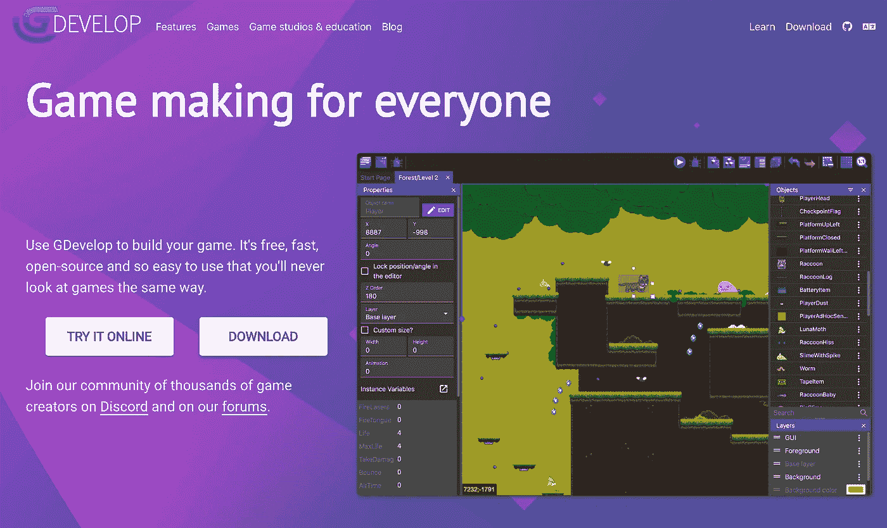

*   网址:[https://gdevelop-app.com/](https://gdevelop-app.com/)
*   GitHub:[https://github.com/4ian/GDevelop](https://github.com/4ian/GDevelop)

## 建造

不需要代码的可视化脚本，或者可选地将块与 JavaScript 结合起来进行进一步的控制。

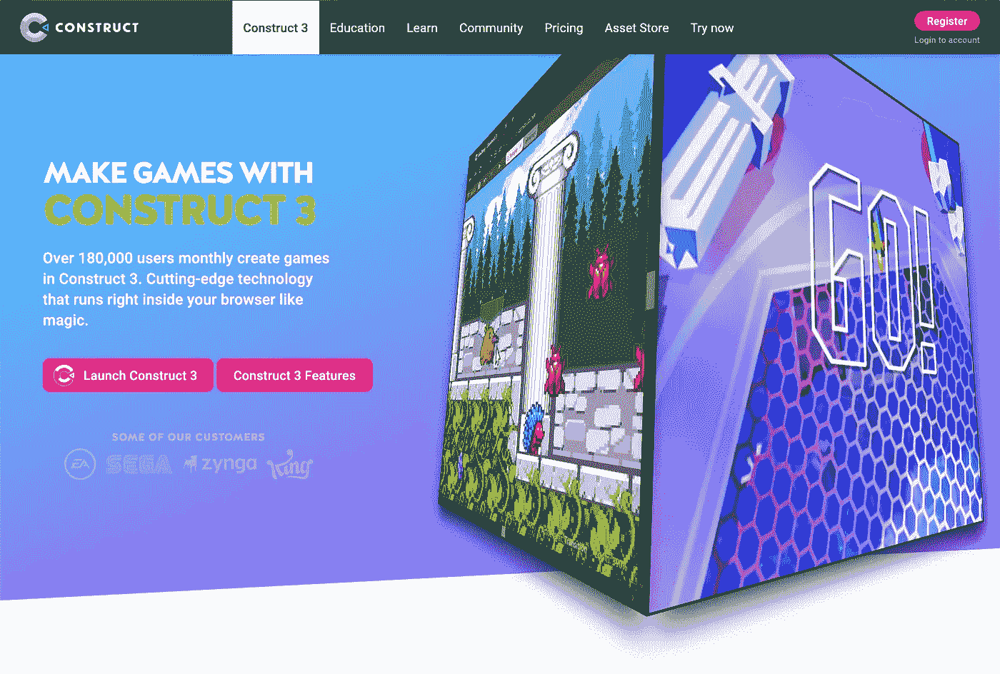

*   网址:[https://www.construct.net/en](https://www.construct.net/en)

## 狡猾的 JS

Javascript 游戏的灵活框架。

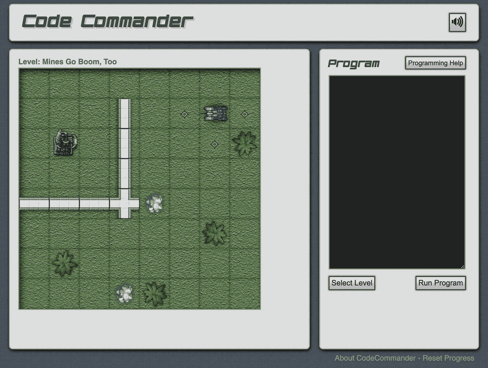

[Code Commander example](http://morrisgames.info/)

*   网址:[https://craftyjs.com/](https://craftyjs.com/)
*   GitHub:[https://github.com/craftyjs/Crafty](https://github.com/craftyjs/Crafty)

## 猕猴桃. js

基于移动和桌面浏览器的 HTML5 游戏框架，使用 CocoonJS 发布到 AppStore。

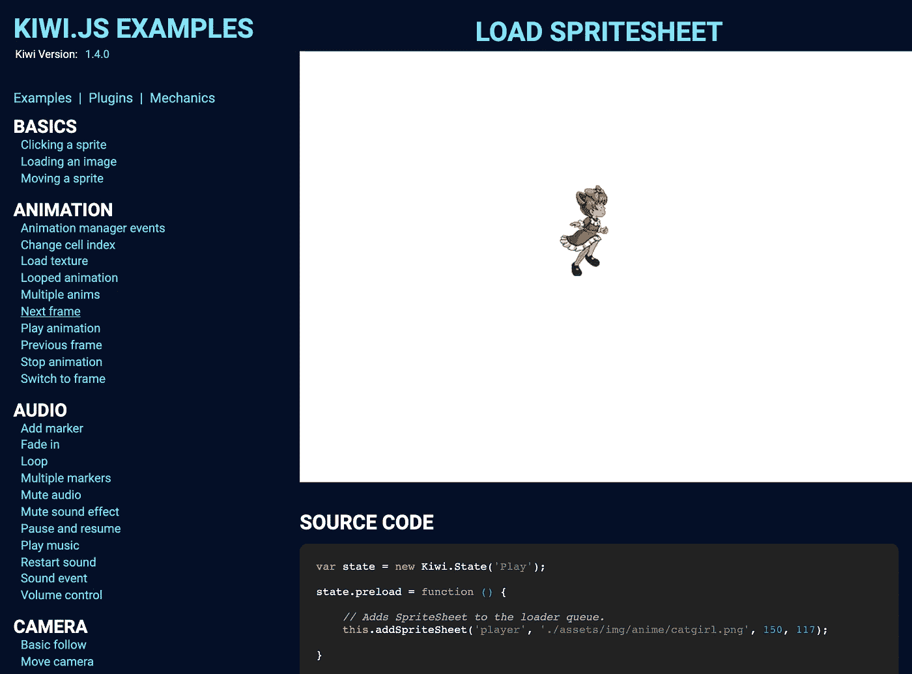

*   网址:[http://www.kiwijs.org/](http://www.kiwijs.org/)
*   例子:[http://www.kiwijs.org/examples/](http://www.kiwijs.org/examples/)
*   GitHub:[https://github.com/gamelab/kiwi.js](https://github.com/gamelab/kiwi.js)

## 铁匠 2D

轻量级 HTML 5 2D 游戏引擎。

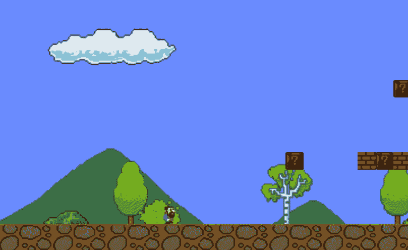

[Arcade physics Mario example](https://blacksmith2d.io/Docs/Examples/Arcade-Physics/Mario)

*   网址: [blacksmith2d.io](https://blacksmith2d.io/)
*   GitHub:【https://github.com/MassiveHeights/Black 

## 斯坦基

无需代码即可创建游戏并发布到 iOS、Android、Windows、Mac、Linux 和 web。

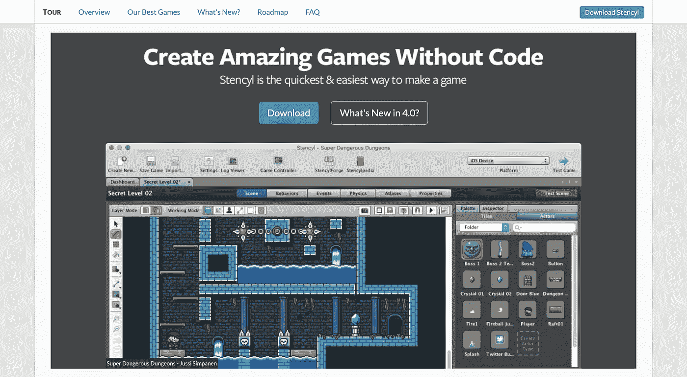

*   网址:【https://www.stencyl.com/ 
*   GitHub:[https://github.com/Stencyl](https://github.com/Stencyl)

## RPG 制造商

为初学者和开发者制作游戏的工具和资产。

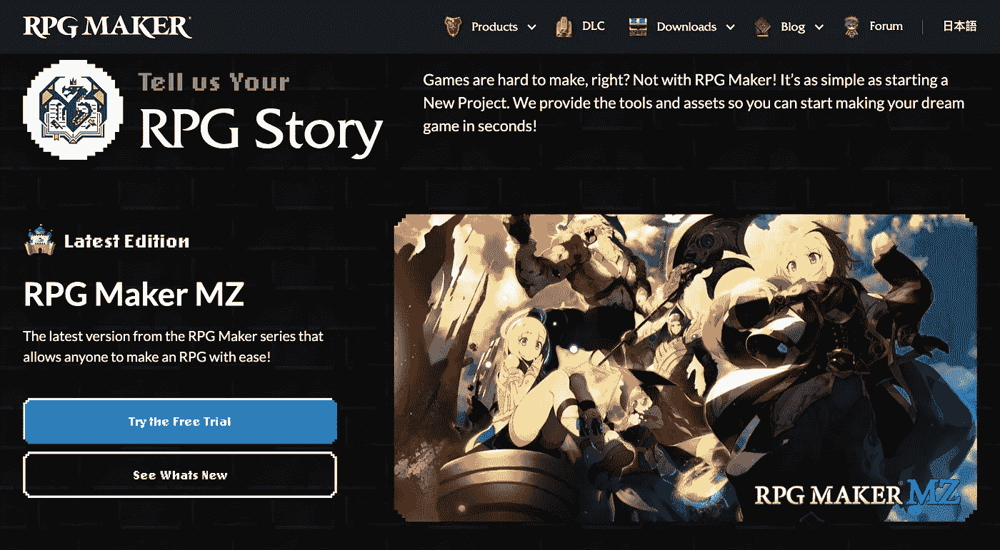

*   网址:[https://www.rpgmakerweb.com/](https://www.rpgmakerweb.com/)

## D3

用于基于数据操作文档的 JavaScript 库，使用 HTML、SVG 和 CSS 赋予数据生命。

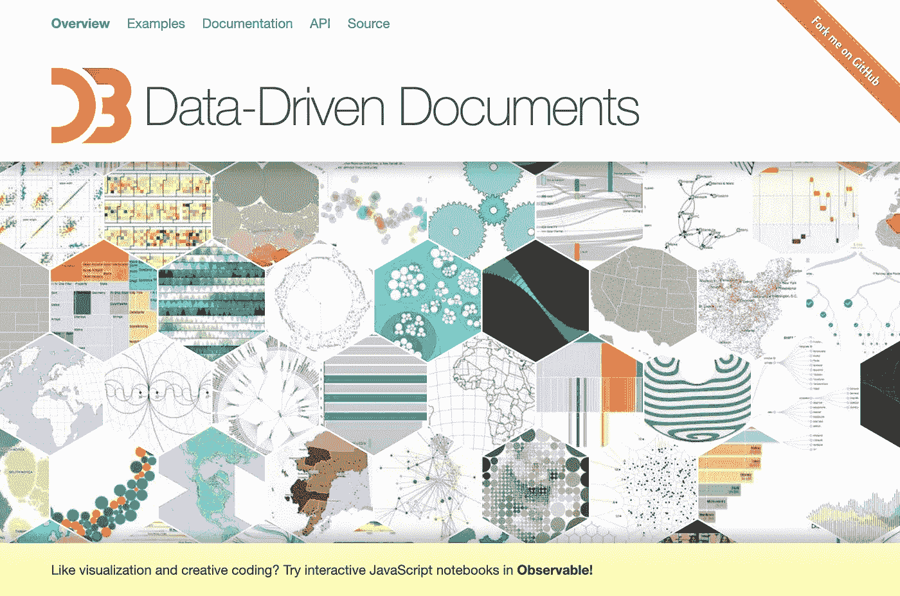

*   网址:[https://d3js.org/](https://d3js.org/)
*   图库:[https://www.d3-graph-gallery.com/](https://www.d3-graph-gallery.com/)
*   可观察的:[https://observablehq.com/explore](https://observablehq.com/explore)
*   街区实例:[https://bl.ocks.org/](https://bl.ocks.org/)
*   GitHub:[https://github.com/d3/d3](https://github.com/d3/d3)

## GoJS

用于快速构建交互式图表的 Web 框架。

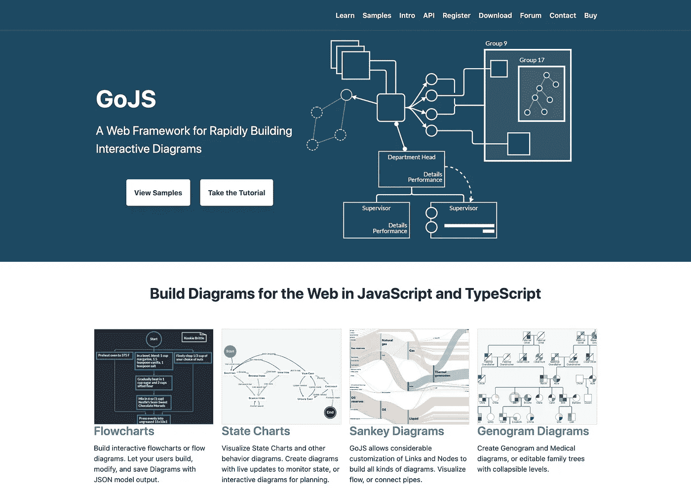

*   网址:[https://gojs.net/](https://gojs.net/)
*   样品:[https://gojs.net/latest/samples/](https://gojs.net/latest/samples/)

## 织物. js

画布库和解析器支持通过场景操作进行编辑。

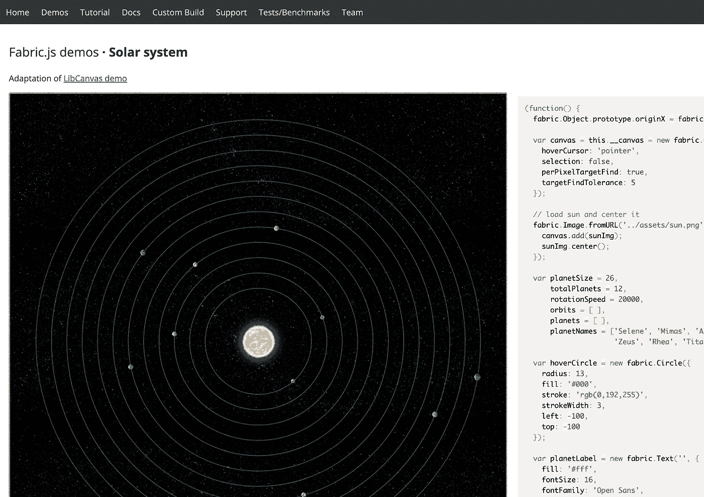

*   网址:[http://fabricjs.com/](http://fabricjs.com/)
*   演示:[http://fabricjs.com/demos/](http://fabricjs.com/demos/)
*   GitHub:[https://github.com/fabricjs/fabric.js](https://github.com/fabricjs/fabric.js)

## Two.js

面向现代网络浏览器的二维绘图 api。它是渲染器不可知的，使得同一个 api 能够在多个上下文中进行绘制:svg、canvas 和 WebGL。

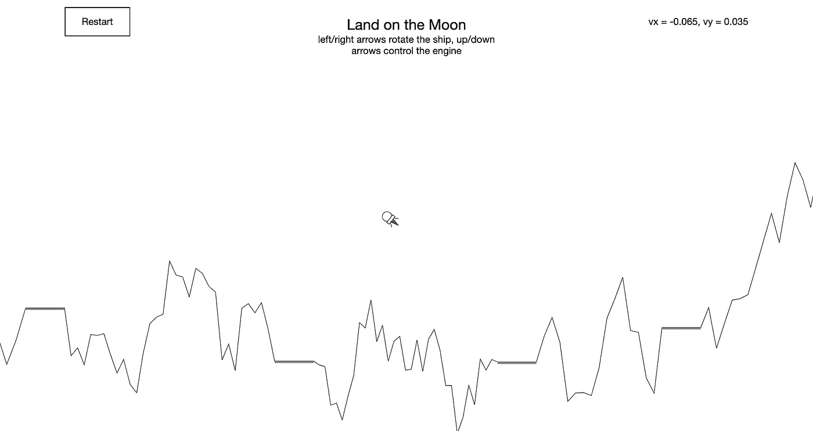

[Land on the Moon examples](https://luniland.halabe.com/)

*   网址:[https://two.js.org/](https://two.js.org/)
*   例子:[https://two.js.org/examples/](https://two.js.org/examples/)
*   项目:[https://two.js.org/projects/](https://two.js.org/projects/)
*   GitHub:【https://github.com/jonobr1/two.js/ 

## 孕烯醇酮

让艺术家、设计师、学生和任何人都能够学习编码，并在网络上创造性地表达自己。

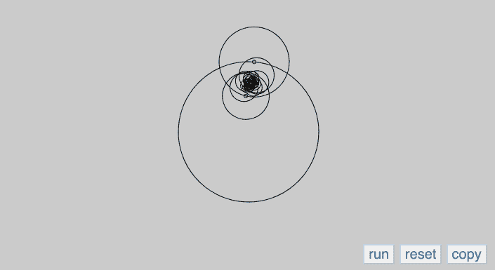

[Spirograph Example](https://p5js.org/examples/simulate-spirograph.html)

*   网址:【p5js.org 
*   例子:[https://p5js.org/examples/](https://p5js.org/examples/)
*   编辑:[https://editor.p5js.org/](https://editor.p5js.org/)
*   GitHub:[https://github.com/processing/p5.js/](https://github.com/processing/p5.js/)

请注意，通过 JavaScript 直接利用画布或着色器来创建令人惊叹的 HTML5 体验不需要任何框架。

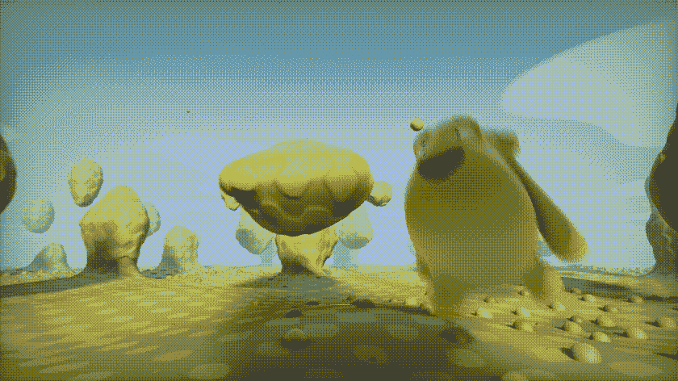

[Happy Jumping Shader Toy](https://www.shadertoy.com/view/3lsSzf)

有关着色器的更多信息:

*   着色器玩具:[https://www.shadertoy.com/](https://www.shadertoy.com/)
*   着色器之书:[https://thebookofshaders.com/](https://thebookofshaders.com/)
*   着色器编辑器:[http://editor.thebookofshaders.com/](http://editor.thebookofshaders.com/)

最后，请注意，通过设置一个构建目标来通过 JavaScript 和 WebAssembly 产生 HTML5 WebGL，web 交付也可以通过其他框架实现，如 [Unity](https://unity.com/) 。

## 一致

2D / 3D VR 和 AR 引擎，适用于游戏、电影、动画等领域。

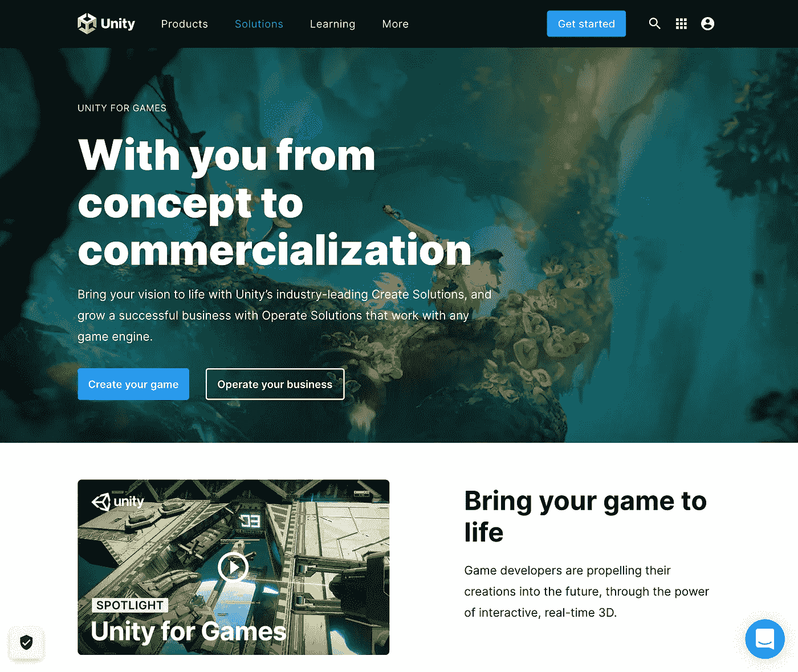

*   网址:[https://unity.com/](https://unity.com/)
*   资产商店:[https://assetstore.unity.com/](https://assetstore.unity.com/)
*   学习:[https://learn.unity.com/](https://learn.unity.com/)