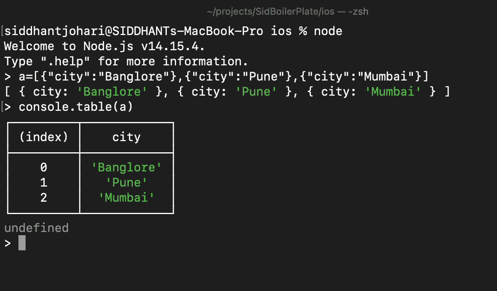

# Javascript 黑客

> 原文：<https://medium.com/geekculture/javascript-hacks-cf8f0fecbc60?source=collection_archive---------1----------------------->

javascript 中有许多惊人的特性可以让你的生活变得更加简单，在这篇博客中，我添加了每个 javascript 开发人员都应该知道的 20 个特性。

1.  使用数组调整数组大小。长度。

2.两个数的交换。

3 在不导致服务器过载的情况下连接两个或多个数组。

4.以不同的方式使用过滤器。

5.在地图上从 0 到 n 迭代。

6.替换字符串中出现的所有单词

7.条件的快捷键。

在这里，我解释了我们可以用多种方式实现的两个基本例子。

8.字符串到数字/数字到字符串。

9.以不同的方式使用控制台。

10.使用控制台.表格

11.获取数组最后一个索引附近的项。

12.得到任意数的 n 次方。

13.检查虚假值或真实值。

14.使用 eval 函数通过存储在字符串中的函数名调用函数。

15.运算符的类型。

16 .产量关键字

17.javascript 中的函数*。

18.javascript 的 new.target

19.标签语句。

20.Rest 参数语法。

# **结论:**

感谢您的阅读，在这篇博客中，我解释了 javascript 的一些最常用的特性，我将在下一篇博客中解释更多的特性。

请在回复中给出反馈。