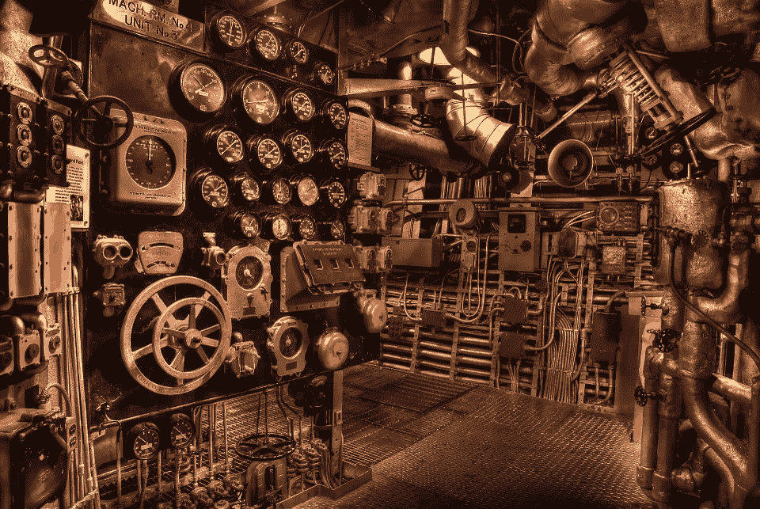

# Javascript 内部:什么在引擎盖下？

> 原文：<https://medium.com/geekculture/javascript-internals-whats-under-the-hood-29946f0ae156?source=collection_archive---------0----------------------->



*本文原载于*[*priyathregory . dev*](https://priyathgregory.dev/blog/javascript-internals-whats-under-the-hood)*。*

您真的不需要了解太多就可以开始使用 Javascript。事实上，一个完全成熟的产品化应用程序可以在不理解语言内部工作原理的情况下构建。这既是福也是祸；这种语言有许多采用者，但只有极少数掌握者。

这种认识让我开始尝试理解 Javascript 到底是如何工作的。旅程远未结束，但雾已经开始消散。这一切都始于一个问题，“Javascript 到底是什么？”。

那么 Javascript 是什么呢？正式地说，Javascript 是一种单线程、非阻塞、异步编程语言。

…

等等什么？

从表面上看，这个定义(至少对我来说)是矛盾的、令人困惑的，而且只会引发更多的问题。单线程程序怎么可能是非阻塞的呢？怎么可能也是异步的呢？

这些都是非常合理的问题。但是请原谅我，他们也有答案。答案就在 Javascript 的核心——它的运行时环境。

# Javascript 运行时

Javascript 运行时环境是让您的代码工作的基础，它允许 Javascript 在其正式定义中包含所有复杂的术语，从浏览器的上下文来看，它主要是 4 个方面的组合:

1.  Javascript 引擎
2.  Web APIs
3.  回调队列
4.  事件循环

让我们逐个检查这些部分。

> **注**
> 
> Javascript 运行时环境可以根据上下文采取不同的形状和形式。例如，浏览器的运行时环境(我们将详细探讨)与 node.js 的运行时环境不同。我们讨论的概念将适用于大多数 Javascript 运行时环境，与上下文无关。

# Javascript 引擎

Javascript 引擎是运行时环境的大脑，它的主要目的是将人类可读的脚本转换成机器可读的代码。

它还管理一个调用栈(想想 LIFO 栈数据结构)来跟踪代码的执行，并且执行本身总是在一个线程上同步执行。此外，该引擎还执行垃圾收集、优化和一大堆其他的事情，这些都值得单独撰写一篇文章。

任何值得您花费时间的引擎都将包含 ECMAScript 的实现，ECMAScript 是一种为标准化 Javascript 而创建的脚本语言规范。这使得引擎“知道”什么是`while`循环，以及`Math.round(x)`应该做什么。如果您所需要的只是一堆 while 循环、一些函数定义和一些变量(换句话说，如果您所需要的是在 ECMAScript 规范中定义的)，Javascript 引擎完全有能力自己处理您的代码。

但是 Javascript 不仅仅是几个函数定义。它是一种强大的语言，能够做很多事情，这就把我们带到了下一个难题，web APIs。

# Web APIs

如果您查看诸如 V8 之类的 Javascript 引擎的源代码，您会发现许多您认为是标准 Javascript 规范的一部分的功能根本不存在。一个恰当的例子是`setTimeout`函数。我不知道你怎么想，但是对我来说`setTimeout`是标准的 Javascript。但是如果它不在引擎里，它在哪里？

输入 Web APIs。Web APIs 是特定于浏览器的关键实现，它扩展了 Javascript 语言。例如，如果你打开谷歌 Chrome 控制台，输入如下内容:

```
function main(){ 
  setTimeout(()=>console.log('Hello World!'), 5000); 
}; 
main();
```

“Hello World”将如预期的那样在 5 秒钟后打印到控制台上。这段代码之所以有效，是因为谷歌 Chrome 的 Web APIs 将自己的`setTimeout`实现嵌入到了它的 Javascript 引擎 V8 中。类似地，DOM 也是 Javascript 引擎的一部分。任何与 DOM 相关的东西:无论是事件侦听器、访问器还是操纵器，都在..你猜对了，web APIs！

此时，一个非常合乎逻辑的问题是，如果 Javascript 引擎不知道这些函数，那么它将如何处理我的脚本中的“web API”函数调用？

答案在于浏览器如何将 web APIs 嵌入其 Javascript 引擎。

当 Javascript 引擎试图解析一个符号时，它将从局部范围开始，沿着范围链向上。链的最末端是`global`范围。作为初始化 Javascript 引擎的一部分，任何主机环境都可以向这个`global`范围添加自己的 API，从而向 Javascript 引擎公开函数及其相应的处理程序。

为了更好地理解这一点，让我们回到我们的例子:

```
function main(){ 
  setTimeout(()=>console.log('Hello World!'), 5000); 
}; 
main();
```

当这段代码被复制到 Google Chrome 浏览器时，实际上会发生什么？

*   V8 引擎将通过向调用堆栈添加`main()`来启动。
*   然后引擎会在作用域链中寻找`setTimeout`函数定义。(这将在`global`范围内提供，因为`setTimeout`没有内置在发动机中)。
*   V8 引擎将把`setTimeout()`推到调用栈上，“调用”web API 的`setTimeout`定义，这反过来将在 Javascript 主线程的之外启动浏览器为此准备的任何本机实现。
*   至此，就发动机而言，它的工作已经完成。因此，`setTimeout()`将被弹出调用堆栈，紧接着是`main()`。

好吧。但不可能是这样，对吧？延迟 5 秒钟后，仍有一个回调要执行。说到回调，到底发生了什么？

为了找到这些答案，我们需要看看运行时难题的下一部分，回调队列。

# 回调队列

那该死的复试去哪了？

在此之前，我们需要首先理解回调函数的作用。

回调函数本质上是 Javascript 引擎和一个**异步** web API 任务之间的绑定，通常带有在异步任务完成其职责后做什么的指令。**任何在引擎主线程之外运行的代码都需要一个相关的回调函数来与引擎进行通信。**

如果你还没有意识到，这是异步 Javascript 背后的基本概念。

> **提示**
> 
> 任何在 Javascript 引擎主线程之外执行的操作都是异步操作。

好吧，这些都很好，但是说真的，我们的复试在哪里？

让我们倒回去一点。

在 V8 引擎“调用”了`setTimeout` web API 绑定之后，一些特定于浏览器的本地代码将负责计时 5 秒的延迟。这是一个发生在引擎主线程之外的异步操作，其实现细节并不重要。同样的本地代码也将负责确保我们“丢失的”回调函数找到回家的路。

那么这是怎么做到的呢？

嗯，在 Javascriptland 领域中，等待执行的回调有一个特殊的位置。这是回调队列，它是 Javascript 运行时中使异步 Javascript 成为可能的两个关键部分之一。

本机代码知道它的存在，一旦异步任务完成，它将把我们的回调函数推到回调队列中。

我们的回调函数就要完成了，但是我们还没有完成。Javascript 运行时难题还有最后一块。

# 事件循环

*到底什么是事件循环？*

事件循环是 Javascript 引擎和回调队列之间的凝胶，它做两件事。

首先，它将定期检查 Javascript 引擎的调用堆栈是否为空。如果是，则它将从回调队列中获取一个回调，并将其放入调用堆栈中，从而有效地安排其执行。

其实就是这么简单。

回调队列和事件循环共同使异步 Javascript 代码工作。前者将完成的异步操作的回调函数排队，而后者将安排它们在 Javascript 的主线程上执行。

# 整圈

*“…一种单线程、非阻塞的异步编程语言。”*

我希望这是一篇内容相当丰富的文章，介绍了在 Javascript 的保护下实际发生的事情，而且上面的定义比几分钟前的定义更有意义。

我曾试图保持事物非常一般化；只是为了确保您了解这些概念不仅适用于浏览器的运行时，也适用于您可能遇到的任何 Javascript 运行时环境。

我也非常确信，这将打开许多新的问题，你可能以前没有。但这就是关键所在。问题应该导致研究，这可能会导致更多的混乱，但如果你坚持下去，最终会导致答案。这就是你学习的方法。

所以要把一大堆文字总结成几个要点:

*   **Javascript 运行时**使 Javascript 代码工作。它可以采用许多不同的形状和形式(浏览器、node . js)；但运行时的基本概念在所有环境中都将保持不变。浏览器的运行时环境由 Javascript 引擎、一堆 web APIs、回调队列和事件循环组成。
*   **Javascript 引擎**将人类可读的 Javascript 代码转换为机器可读的字节码，并始终在**单线程上执行。**它还负责管理呼叫堆栈以及其他一系列事务。
*   **web API**扩展了 Javascript 语言，其自身的功能被添加到 Javascript 引擎的`global`对象中。这些功能中有些是同步的，有些可以是异步的。
*   **回调队列**将等待 Javascript 引擎执行的回调排队。回调通常总是与某些异步操作相关联。
*   **事件循环**是 Javascript 引擎和回调队列之间的凝胶。它的工作是将回调从回调队列移动到引擎的调用堆栈中以供执行。
*   回调队列和事件循环是 Javascript 的**异步**(和**非阻塞**)的核心！)自然。

# 资源

1.  如果你喜欢看而不是读，我强烈推荐看看[和*到底什么是事件循环？*](https://www.youtube.com/watch?v=8aGhZQkoFbQ&t=239s) 出自菲利普·罗伯茨。说真的，看看这个。
2.  [这个](https://stackoverflow.com/questions/59316975/the-javascript-v8-engine-and-web-apis)栈溢出帖子讨论 V8 引擎和 web APIs 之间的链接，而[这个](https://stackoverflow.com/questions/59344915/which-part-of-the-javascript-runtime-is-responsible-for-putting-the-callback-int)帖子讨论回调队列。