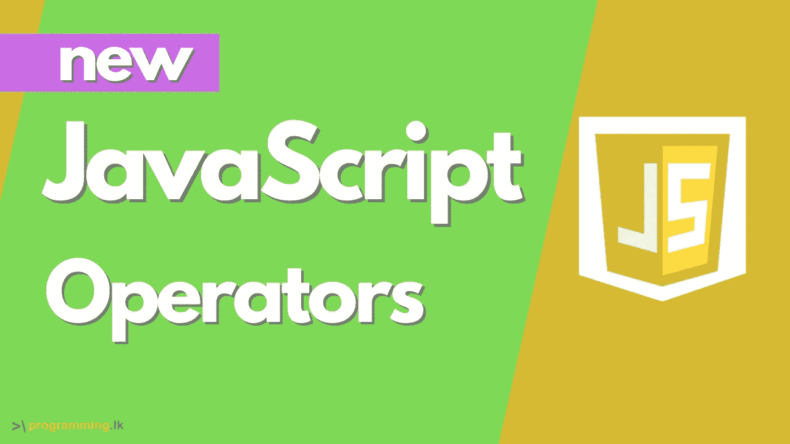

# JavaScript 逻辑赋值运算符

> 原文：<https://medium.com/geekculture/javascript-logical-assignment-operators-b3c8dea26301?source=collection_archive---------44----------------------->

Javascript 是目前最流行和最容易学习的编程语言之一，也是最适合编程初学者的语言之一。原因是，到目前为止，它几乎已经扩散到了编程的每一层。即目前用于开发前端(React、Angular 或 Vue.js)、后端(Node.js)和桌面应用(Electron.js)等所有栈上的应用。