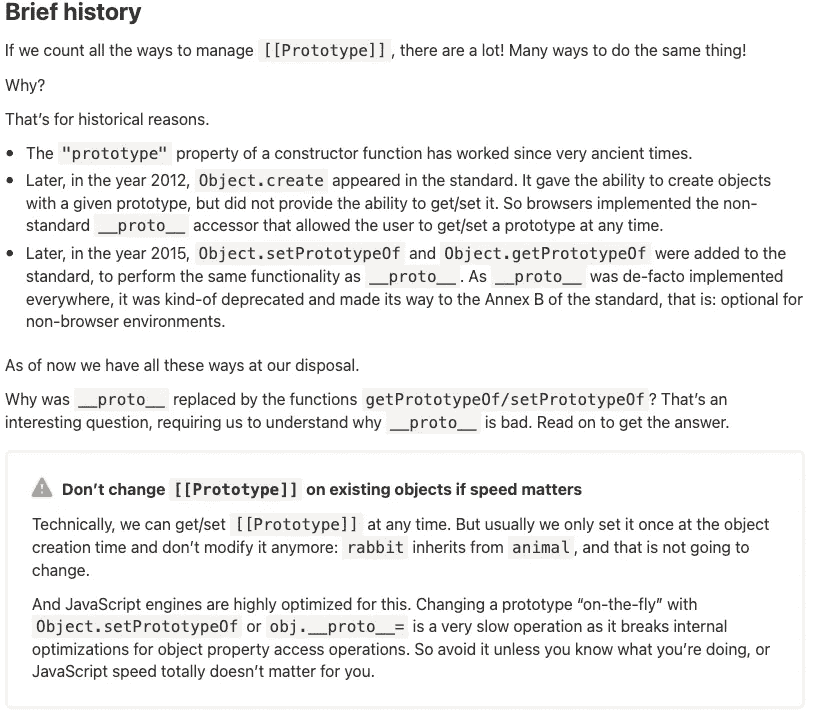
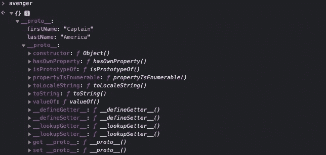

# JavaScript:对象及其原型

> 原文：<https://medium.com/geekculture/javascript-objects-their-prototypes-99e0206edfba?source=collection_archive---------19----------------------->

## 简单看一下 JS 原型


Photo by [Sigmund](https://unsplash.com/@sigmund?utm_source=medium&utm_medium=referral) on [Unsplash](https://unsplash.com?utm_source=medium&utm_medium=referral)

又一周，又一次深入 JavaScript。这个小系列可能会接近尾声，但不是在本周。哦，不，我的朋友们，我们将讨论 JS 原型。一些对我来说太陌生的东西，所以我显然会写信给大众，告诉他们我的发现。

当我观察对象的`__proto__`属性时，我试图更好地理解这个主题的第一个发现发生了有趣的转变。这绝对是我听说过的东西，但在我过去的项目中从来没有要求过。当我了解了使用这个属性的能力并考虑了我将为这个博客写些什么时，我发现这个特性不再被推荐了！MDN 声明如下:


我想我们今天都会学到一些新东西！下面说一下`__proto__`属性的推荐替代方案。但是，首先，为什么不再推荐使用`__proto__`访问器？我会让 [JavaScript.info](https://javascript.info/) 的团队，由 [Ilya Kantor](https://javascript.info/profile/ilya-kantor) 领导，来解释一下。



[Link](https://javascript.info/prototype-methods#brief-history)

好吧。我真正想写的东西，嗯，算是吧。现在，`__proto__`已经被`getPrototypeOf` / `setPrototypeOf`所取代，让我们来看看这两个函数在处理 JS 对象时是如何帮助我们的。

如果我们回顾一下之前[博客中的对象，我们会发现:](https://javascript.plainenglish.io/javascript-how-to-avoid-object-mutation-7cd733913a9f)

```
let character = {
    firstName: 'Captain',
    lastName: 'America'
};let avenger = character;character.lastName = 'Marvel';
```

上面展示了在两个不同变量中持有的同一个对象。在博客中，我谈到了我们如何无意中改变了我们在复仇者中持有的对象，因为两个变量引用了同一个对象。那么，我们如何在使用上面讨论的原型函数的同时创建两个独特的对象呢？

首先，我们从字符变量引用的对象开始。

```
let character = {
    firstName: 'Captain',
    lastName: 'America'
};
```

现在，让我们创建另一个对象，但是我们将使用角色对象作为这个新对象的原型。

```
let avenger = Object.setPrototypeOf({}, character);console.log(avenger.firstName);
```

你认为控制台上会打印出什么？

```
// Captain
```

是不是很酷！？我们从来没有设置过`avenger.firstName`，但是 JavaScript 打印了除了`undefined`以外的东西！这都与`__proto__`的特殊属性有关。由于我们用原型`character`设置了新创建的对象，JavaScript 遍历原型链来寻找对我们的请求`avenger.firstName`的回答。它首先检查由`avenger`变量引用的对象是否有属性`firstName`，意识到它没有，检查`__proto__`属性，并返回保存在那里的值，即`Captain`！这叫做[属性遮蔽](https://developer.mozilla.org/en-US/docs/Web/JavaScript/Inheritance_and_the_prototype_chain#inheritance_with_the_prototype_chain)。伙计，哦，伙计。令人兴奋的东西。下面是在`avenger`引用的对象的样子。



Our avenger object from the Chrome DevTools

您会注意到该对象是用两个`__proto__`属性创建的。上面列出的第一个是从字符变量引用的对象中创建的，也就是我们指定的那个。第二个`__proto__`，通常称为`[[Prototype]]`，是一个内部属性，它赋予我们可以在对象上使用的内部函数，比如`toString` & `valueOf`。

现在，我们需要确保我们的复仇者对象拥有`'Marvel’`的`lastName`。

```
avenger.lastName = 'Marvel';console.log(avenger.lastName);
console.log(character.lastName;
```

你认为现在会发生什么？你认为我们改变了存储在`character`的原始对象吗？`avenger.lastName`现在有一个`__proto__`属性引用了一个属性`lastName`，它将打印到控制台？

```
// Marvel
// America
```

哦，宝贝！看那个！我们现在有了我们想要的两个独特的对象，就像我以前的博客一样。这是我们创造物体同时避免变异的另一种方式。我现在将向你展示如何使用`setPrototypeOf`方法一次性创建复仇者对象，而不是添加一行`avenger.lastName = ‘Marvel’`。

```
let character = {
    firstName: 'Captain',
    lastName: 'America'
}let avenger = Object.setPrototypeOf({lastName: 'Marvel'}, character)console.log(avenger.lastName);
console.log(character.lastName);// Marvel
// America
```

就这样，朋友们。`setPrototypeOf`接受两个论点，使得使用另一个对象作为原型来创建对象变得轻而易举。显然，这很有趣。这是一种我们已经知道如何使用`Object.create`的新方法，但是有点不同，因为`avenger.firstName`属性实际上来自我们的`character`对象。事实上，如果我们改变我们的`character`对象属性中的任何值，它也会改变`avenger`对象的输出。您可以看到当以这种方式使用原型时，这是如何成为一个问题的。原型可能很有趣，但是…