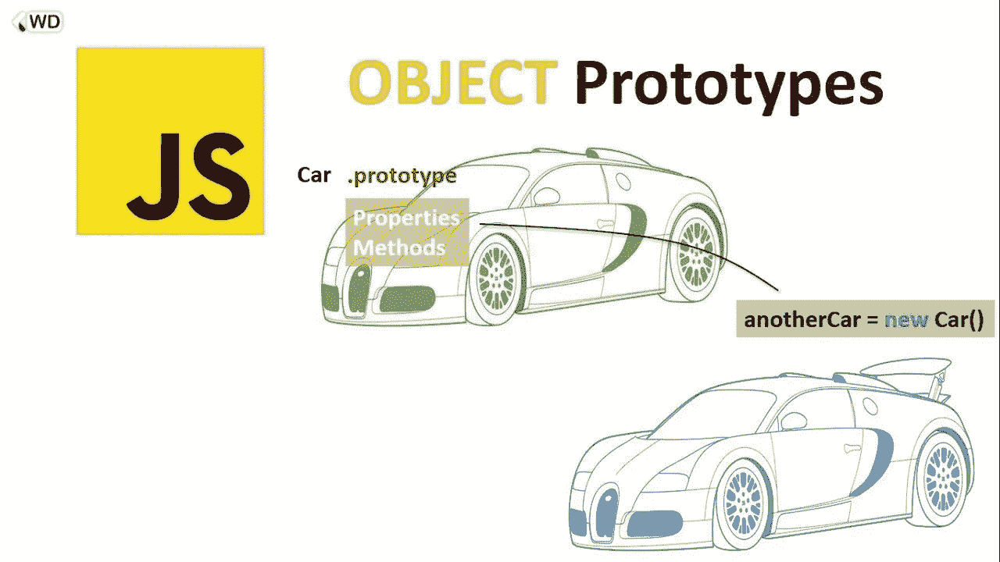
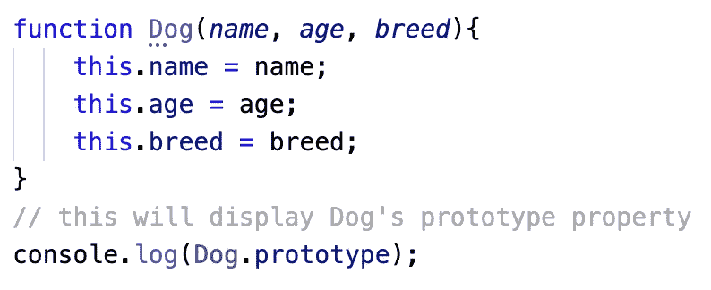
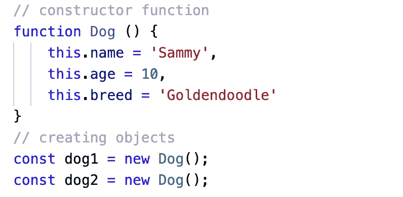
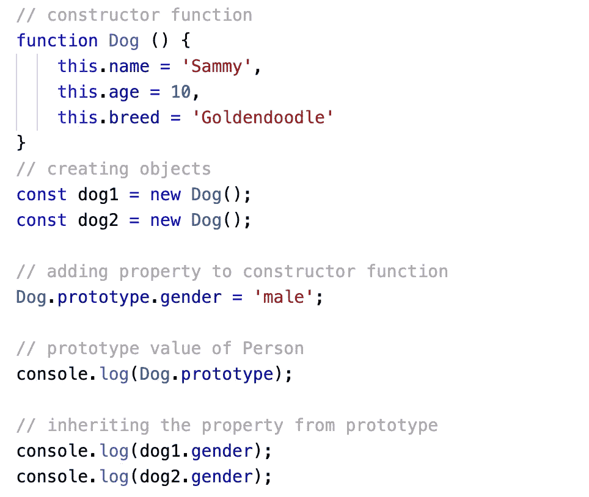
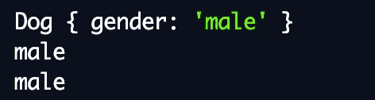
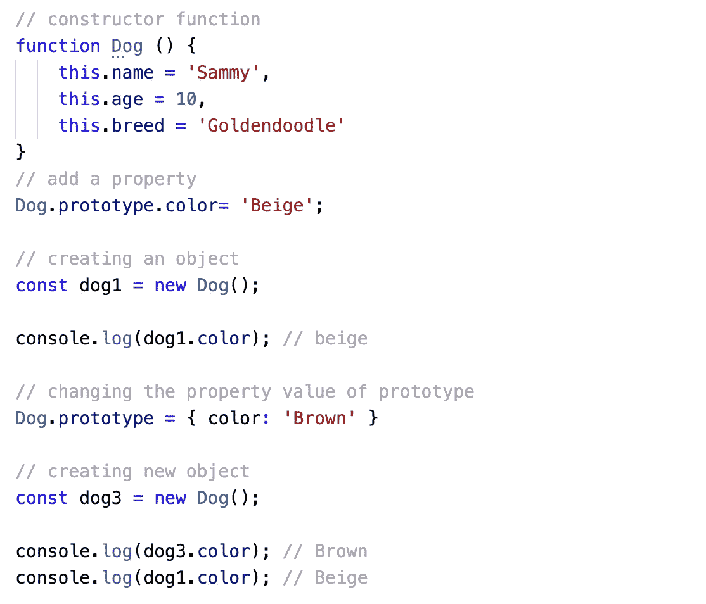
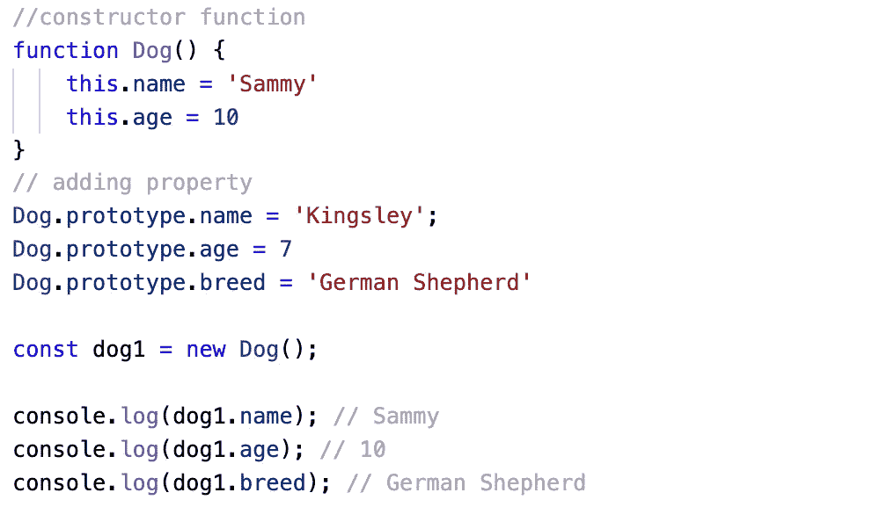

# JavaScript 原型—

> 原文：<https://medium.com/geekculture/javascript-prototype-f2c451029ec0?source=collection_archive---------8----------------------->

## …这是什么？为什么它很重要？

> 我的一个软件工程师朋友给了我一些他认为对准备面试很重要的建议。他问:“你知道什么是 Javascript 原型吗？”我愣了一下。他继续说“如果你不知道，你一定要读一下。这很可能会在你的面试中被问到”——果然，在一次模拟技术面试中，我被问到 JavaScript 原型。那是什么？…

## 什么是基于原型的语言？

JavaScript 是一种基于原型的基于对象的语言。这意味着每当我们创建一个函数时，JavaScript 都会在函数内部添加一个内部属性，也就是所谓的原型对象。这意味着我们可以附加方法和属性，使所有其他对象也能继承这些方法和属性。

*考虑下面这个例子:* Dog 对象是用函数构造器'`function Dog(name, age, breed)`'创建的。Dog 有一个 prototype 属性，prototype 属性有一个构造函数对象。

Since the prototype property has no value, this console.log will show an empty object { }

## 但是首先，理解 JavaScript 对象

在深入研究 prototype 之前，我们先来谈谈 JS 中的对象。对象是键/值对。在 JS 中创建对象的一种方法是使用函数构造器(如上所示的例子),您可以使用点符号向对象添加属性和值。

Example of creating an object using the constructor function

***object . create*** object . create 这是 JS 中创建对象的另一种方式。关于它的阅读，请参考 [***上周关于`Object.create()`的博文***](https://mtphm.medium.com/object-create-a-javascript-fundamental-a7d446670e34)*对这个方法有更深入的了解。*

## *原型继承*

*所以我们知道在 JavaScript 中，原型可以用来给构造函数添加属性和方法。对象从原型继承属性和方法。*考虑下面的例子:**

**输入:**

**

**输出:**

**

*在上面的代码中，我们使用`Dog.prototype.gender = 'male'`向 Dog 构造函数添加了一个新的属性‘性别’—对象`dog1`和`dog2`从 Dog 的原型属性中继承并可以访问属性‘性别’。*

## *改变原型*

*由于对象继承自原型对象，因此如果原型值改变，所有新对象都将具有改变的属性值。所有先前创建的对象都将具有先前的值。*考虑下面的例子:**

**

*Example of changing prototype*

*即使我们将原型颜色从米色更改为棕色，dog1 仍然具有之前的米色值。*

## *原型链接*

*如果对象试图访问构造函数和原型对象中的同一属性，则该对象从构造函数中获取该属性。*

**

*Example of Prototype Chaining*

*在上面的例子中，属性`name`在构造函数中声明，也在构造函数的原型属性中声明。当程序运行代码时，`dog1.name`在构造函数中查看是否有一个名为`name`的属性。因为构造函数的 name 属性的值为“Sammy”，所以对象从该属性而不是“Kingsley”中获取值。然而，因为构造函数没有属性值`breed`，所以代码查看原型对象并从那里继承它。因此，`breed`作为‘德国牧羊犬’得到输出*

*原型是代码重用，其中对象从原型对象继承其方法和属性。使用构造函数或 Object.create()创建对象。Prototype 非常有用和重要，因为它允许我们轻松地为特定对象的所有实例定义方法。由于该方法应用于原型，它只在内存中存储一次，但对象的每个实例都可以访问它！多酷啊！*

*我希望这对您学习 JavaScript 原型有所帮助！！*

**编码快乐，朋友们！**