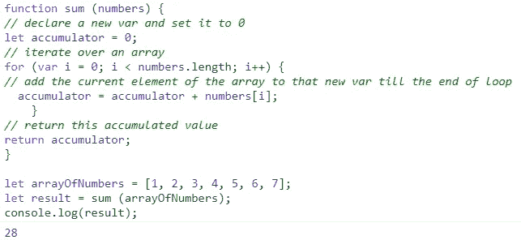
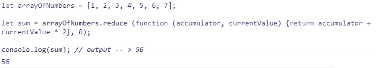
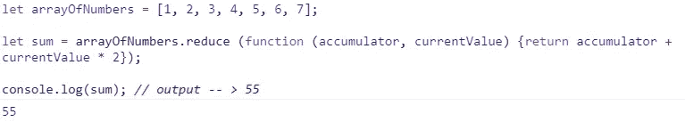
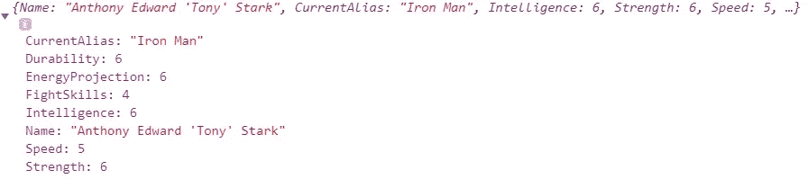
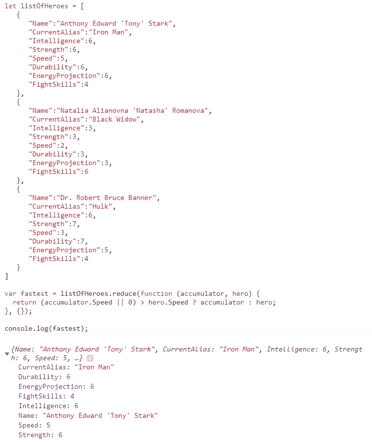

# JavaScript 简化数组。Reduce()方法。

> 原文：<https://medium.com/geekculture/javascript-reducing-arrays-reduce-method-a211e9b82804?source=collection_archive---------22----------------------->

在日常的编程工作中，我们经常使用列表(数组)。有时，我们希望找到满足特定条件的元素，一个[](https://roxvemm2014.medium.com/javascript-filtering-arrays-filter-method-ac582e4594e2)**方法是一个很好的选择，其他时候我们可能希望根据一些逻辑来转换给定数组的元素，然后我们可以应用 [**Map()**](https://roxvemm2014.medium.com/javascript-mapping-arrays-map-method-a650c014fe7) 方法。当我们想要创建一个单独的汇总值或者将一个元素列表(数组)简化为一个单独的值时，该怎么办呢？**

****

**Photo by [Roman Kraft](https://unsplash.com/@romankraft?utm_source=medium&utm_medium=referral) on [Unsplash](https://unsplash.com?utm_source=medium&utm_medium=referral)**

**在本教程中，我们将学习如何使用一个 **Reduce()** 内置的本地 JavaScript 方法来聚合一个结果或得出一个奇异值。该值可以是字符串、数字、布尔值甚至是对象等。**

**首先，让我们尝试通过应用基本的普通 JavaScript /a *for 循环*方法来解决以下问题。**

**你会得到一组数字:**

```
let arrayOfNumbers = [1, 2, 3, 4, 5, 6, 7];
```

**我们需要将该数组的所有元素相加，以获得单个汇总值。预期结果是`1 + 2 + 3 + 4 + 5 + 6 + 7 = 28.`**

**解决这类问题的一个常见方法是，我们首先声明一个新变量，在我们的例子中，它将是一个累加器，并将其值设置为 0。然后，我们遍历给定的数组，并将当前元素添加到累加器变量中，每下一次迭代，我们存储在累加器变量中的值都会增加当前元素的值。最后，当循环结束时，我们返回一个累加值。**

**下面是这个问题的伪代码和代码本身。试试吧！复制并粘贴到您的控制台。**

```
function sum (numbers) {
// declare a new var and set it to 0
let accumulator = 0;// iterate over an array
for (var i = 0; i < numbers.length; i++) {// add the current element of the array to that new var till the end // of loop accumulator = accumulator + numbers[i];
    }// return this accumulated value
return accumulator;
}let arrayOfNumbers = [1, 2, 3, 4, 5, 6, 7];
let result = sum (arrayOfNumbers);
console.log(result);// output -> 28 
```

**控制台中的输出如下:**

****

**这是手动添加数组所有元素的一个非常基本的方法，但是正如你可能看到的，它只适用于这种非常特殊的情况！例如，如果我只想添加前 N 个元素，或者数组的长度会改变，我就必须重写代码。这正是 **Reduce()** 方法派上用场的时候！**

**和往常一样，让我们在 [**MDN Web Docs**](https://developer.mozilla.org/en-US/docs/Web/JavaScript/Reference/Global_Objects/Array/reduce) 看看这个方法和语法的官方定义:**

> ****Reduce()** 方法对数组的每个元素执行一个 reducer 函数(您提供的),产生一个输出值。**
> 
> **reducer 函数有四个参数:**
> 
> **1.蓄电池**
> 
> **2.现值**
> 
> **3.当前索引**
> 
> **4.源阵列**

```
// Arrow function
reduce((accumulator, currentValue) => { ... } )
reduce((accumulator, currentValue, index) => { ... } )
reduce((accumulator, currentValue, index, array) => { ... } )
reduce((accumulator, currentValue, index, array) => { ... }, initialValue)// Callback function
reduce(callbackFn)
reduce(callbackFn, initialValue)// Inline callback function
reduce(function callbackFn(accumulator, currentValue) { ... })
reduce(function callbackFn(accumulator, currentValue, index) { ... })
reduce(function callbackFn(accumulator, currentValue, index, array){ ... })
reduce(function callbackFn(accumulator, currentValue, index, array) { ... }, initialValue)
```

**好了，有了这个关于 **Reduce()** 方法的理论知识，让我们用这个方法来解决上面的问题。**

```
let arrayOfNumbers = [1, 2, 3, 4, 5, 6, 7];let reducerFunction = (accumulator, currentValue) => accumulator + currentValue;let result = arrayOfNumbers.reduce(reducerFunction)
console.log(result); // output -> 28; 
```

**上面的代码可能看起来有点笨拙，所以让我们缩短它，并按照官方文档的建议使用箭头函数表达式:**

```
let arrayOfNumbers = [1, 2, 3, 4, 5, 6, 7];let sum = arrayOfNumbers.reduce ((accumulator, currentValue) => accumulator + currentValue, 0);console.log(sum); // output -> 28;
```

**或者使用内联回调函数:**

```
let arrayOfNumbers = [1, 2, 3, 4, 5, 6, 7];let sum = arrayOfNumbers.reduce (function (accumulator, currentValue) {return accumulator + currentValue}, 0);console.log(sum);// output -> 28;
```

**无论您选择什么语法，上面提到的所有样式的输出都是一样的。**

****

**这里发生了什么事？我们在源或输入数组`arrayOfNumbers`上调用 **Reduce()** 方法，并向其传递两个参数:在本例中定义为箭头函数表达式的回调函数`(accumulator, currentValue) => accumulator + currentValue` 和一个可选的初始值或设置为`0`的累加器。然后，方法依次对源数组的每个元素执行回调函数(1，2，3，4 … 7)，每次传入累加器的当前值和当前元素。在每次迭代之后，回调函数都会更新累加器的值，就像我们之前在这行代码`accumulator = accumulator + numbers[i]`中看到的那样，然后累加器的这个更新值作为第一个参数传递给回调函数，以此类推，直到源数组结束。当输入数组中没有剩余的内容时，累加器的最终值被返回，与我在开始时发布的例子中的`return accumulator` 相同。**

**初始化开始值是可选的，正如在[文档](https://developer.mozilla.org/en-US/docs/Web/JavaScript/Reference/Global_Objects/Array/reduce)中所述，但是省略它可能会导致一些你并不真正期望的事情！如果没有初始起始值，那么数组中的第一个元素被用作起始值/初始累加器值。看看下面两个例子:**

********

**我们已经学习了如何在基本类型上应用和使用 **Reduce()** 方法，现在让我们深入并演示如何在对象上使用这个方法。**

**假设我们有一队超级英雄(用一个对象数组表示)，我们需要确定哪个英雄是最快的。对于所有超级英雄的粉丝，我向你们保证以下数据是有效的，并且来自这个[网站](https://marvel.fandom.com/wiki/Natalia_Romanova_(Earth-616))！让我们来看看谁是最快的——“钢铁侠”、“黑寡妇”或“绿巨人”🍾 🙌 🎉！！！**

```
let listOfHeroes = [
{
"Name":"Anthony Edward 'Tony' Stark",
"CurrentAlias":"Iron Man",
"Intelligence":6,
"Strength":6,
"Speed":5,
"Durability":6,
"EnergyProjection":6,
"FightSkills":4
},{
"Name":"Natalia Alianovna 'Natasha' Romanova",
"CurrentAlias":"Black Widow",
"Intelligence":3,
"Strength":3,
"Speed":2,
"Durability":3,
"EnergyProjection":3,
"FightSkills":6
},{
"Name":"Dr. Robert Bruce Banner",
"CurrentAlias":"Hulk",
"Intelligence":6,
"Strength":7,
"Speed":3,
"Durability":7,
"EnergyProjection":5,
"FightSkills":4
}]
```

**确定任何数组中最大值的常用方法是假设一个值(例如，给定数组中的第一个值)是最大值，然后从第二个元素开始迭代数组，并将每个元素与默认的最大值进行比较。如果当前值大于默认的最大值，则重新分配。一旦我们知道了最大值是多少，我们就可以在初始数组上运行第二个 *for 循环*来确定哪个索引(或者我们的英雄对象)匹配这个最大值，然后返回英雄对象。让我们通过使用普通的 JavaScript 和循环的*来解决这个问题。下面是代码和输出:***

```
function fastestHeroe(array) {
// assume the first element in this array is the largest one
let speedFast = array[0].Speed;// iterate over the array starting from the second element and till the end of this array
for (var i = 1; i < array.length; i++) {// if the current element is more than the assumed largest/first then assign this current element to speedFast var
if (array[i].Speed > speedFast) {
speedFast = array[i].Speed;
}}// iterate over the array
for (var j = 0; j < array.length; j++) {// if a value of “Speed” key is equal to the found largest one then return the current objif (array[j].Speed === speedFast) {
return array[j];}}}
```

**如果你运行这个代码，它应该返回“托尼”斯塔克，因为他的“速度”值是 5，这比“黑寡妇”和“绿巨人”都多。**

****

**现在，让我们演示如何用 **Reduce()** 方法解决同样的问题:**

```
var fastest = listOfHeroes.reduce(function (accumulator, hero) {return (accumulator.Speed || 0) > hero.Speed ? accumulator : hero;}, {});
```

****

****Reduce()** 方法的输出与我们在实现 *for 循环*方法后得到的输出相同。**

**太好了！我们只花了几行代码来减少对象的初始数组，以确定哪个 hero 是最快的，而不是普通 JavaScript/for loop 方法中的多行代码和两个循环。**

**至于这场 **Reduce()** 方法 vs*for loop*比赛的获胜者，“托尼”斯塔克是最快的超级英雄，因为他的速度是 5，比这个超能力网格中的任何人都快。恭喜“托尼”！💯**

****

**Photo by [Marjan Blan | @marjanblan](https://unsplash.com/@marjan_blan?utm_source=medium&utm_medium=referral) on [Unsplash](https://unsplash.com?utm_source=medium&utm_medium=referral)**

**总的来说，当我们想从输入数组中的每个元素获取一些信息并将这些信息收集到最终的信号汇总值(累加器)中时，可以使用 **Reduce()** 方法。这里我们需要考虑三个主要方面:源数组或者我们要缩减的数组；回调函数或缩减器，它定义了需要完成什么样的操作；累加器变量的初始初始值。 **Reduce()** 函数遍历源数组，每次都调用 reducer 回调函数，后者返回累加器的更新值。**

**当然，我们仍然可以像上面演示的那样使用 *for 循环*来完成同样的工作，但是使用本机内置的 **Reduce()** 函数使我们不必编写循环机制、编写多行重复代码、在变量的累加器类型中声明和累加变量，然后在最后返回这个累加器。**

**如果你觉得这些信息有用，请随时关注我。希望您喜欢这篇关于 JavaScript 中 Reduce()方法的简短指导，请保持关注！**