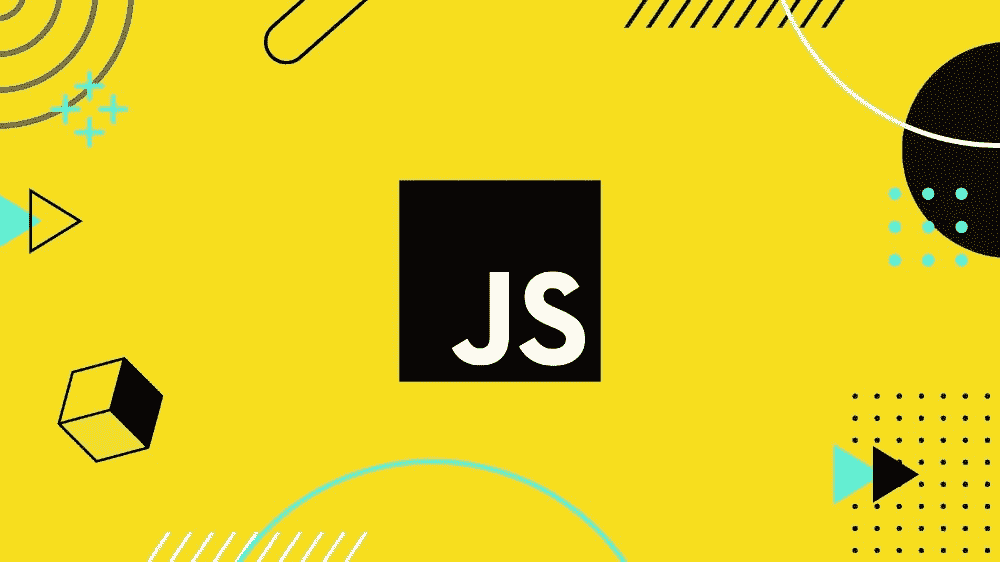
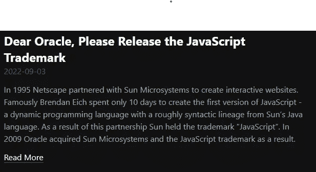

# 甲骨文获得 JavaScript 商标

> 原文：<https://medium.com/geekculture/javascript-trademark-captured-by-oracle-4dab2e3daec9?source=collection_archive---------12----------------------->

## 在 Oracle 收购 Sun Microsystems 之后，JavaScript 商标不再被允许用于某些目的。

在这篇文章中，我想谈谈网络世界中的一个新挑战，它给许多人带来了麻烦，也受到了许多人的批评。

LiveScript 是 Brendan Eich 在 1995 年为 Netscape 编写的一种脚本语言。为了与微软竞争，他们与 Java 的所有者 Sun Microsystems 合作，交换产品，并为了**的推广目的**将名称改为 **JavaScript** 。

**网景在与微软的竞争中**失败并消失，**太阳微系统**也陷入了**财务问题**并在 2010 年被甲骨文收购**，甲骨文成为属于太阳微系统的一切的所有者，比如 Java 语言或 JavaScript 商标。**

甲骨文决定充分利用这次收购，**起诉谷歌**在 Android 中使用 Java 代码，并使其使用 **JavaScript 名称**的产品陷入困境。由于其中一个问题，[苹果被迫从 App Store 中删除了名称中使用 JavaScript 名称的程序。](https://www.theregister.com/2018/04/18/oracle_ios_app_takedown_javascript/)

因为**这些问题**，很多**开发者决定**使用 JavaScript 标准版的名字 **EcmaScript** ，这也是 **ECMAScript 这个名字变得更加常见**的原因之一。

这些问题如此严重，以至于 NodeJS 和 DenojS 的创始人 Ryan Dahl 不得不对这些事件做出反应。日前，2022 年 9 月 3 日，他[在博客上发表了一篇写给甲骨文的帖子，](https://tinyclouds.org/trademark)标题为**“亲爱的甲骨文，请释放 JavaScript 商标”**，要求甲骨文释放 JavaScript 商标。

Ryan Dahl’s blog post to Oracle about the JavaScript trademark

我们讨论了网络世界的新挑战，并发现它已经变得多么严重，发现了甲骨文政治的角落，并意识到为什么许多开发者对甲骨文没有好感。我很想听听你们的意见和建议，这样我才能写出更好的内容。