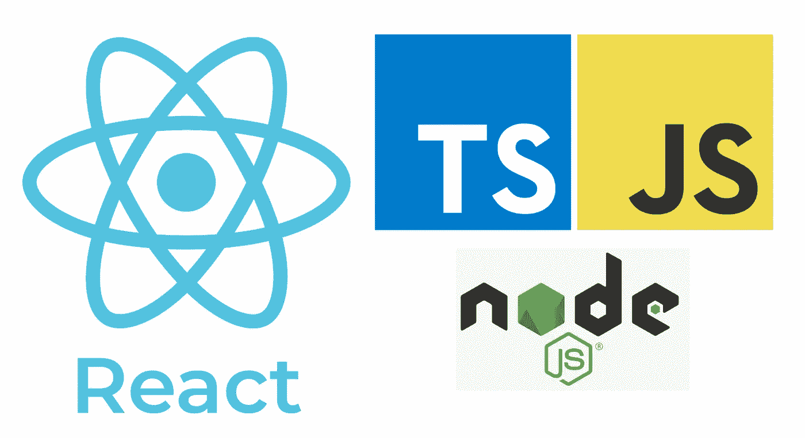

# JavaScript、TypeScript、Node.js 和 React Notes

> 原文：<https://medium.com/geekculture/javascript-typescript-node-js-and-react-notes-930c0c7707f1?source=collection_archive---------16----------------------->



在这里，我想分享一些我在学习 JavaScript、TypeScript、Node.js 以及作为一名对 Java 和后端有丰富经验的软件工程师的一些心得。笔记大多摘自 Maximilian Schwarzmuller 和 Mosh Hamedani (codewithmosh)的免费 youtube 视频。

# JavaScript 注释

JavaScript 是动态的、解释的(在运行时编译)、弱类型和托管的语言(在不同的环境如浏览器中运行)。

JS 在单线程上执行。

代码可以在运行时改变。(例如，变量的类型，假设你在一个变量上存储一个字符串，然后你可以在这个变量上存储整数)->动态

变量类型是假定的，可以随时改变。

JS 被创建用于通过在那里执行来动态地改变浏览器，然而，执行引擎(Google 的引擎 V8)被提取并且现在也可以在服务器端使用(例如 node.js)

JS 代码可以在任何浏览器上运行。

VS 代码扩展:“材质图标主题”、“漂亮器—代码格式化程序”、“Live server”、“ESLint”、“Path Intellisense”、“PowerShell”、“括号对着色程序 2”、“Docker”。

let ->新变量

常量->常量变量

** ->求幂运算符(例如 2**3=8)

模板文字:

```
let calculationDescription = `( ${defaultResult} + 10) * 3) / 2–1`;
```

最好不要在函数后面加上分号，任何声明都要用花括号。

隐藏意味着在不同的作用域上创建一个新变量。

与 Java 不同，字符串在 JavaScript 中是像数字一样的基本类型。

不使用 parseInt 或 parseFloat，只需在字符串前面加上+就可以将字符串转换为整数。(例如+字符串)

数组可以有混合数据。

正在创建数组:

```
let newArray = [];
```

将数据推入数组:

```
newArray.push(“newData”);
```

未定义、空、NaN

defer 关键字让我们可以提前加载 JS 代码，但在正确解析 HTML 代码后执行它们。

```
<script src=”assets/scripts/vendor.js” defer></script>
```

Async 关键字让我们尽早加载 JS 代码，但与上面的关键字不同，它会尽快执行。(不保证执行顺序)

将 JS 脚本代码和 body 部分放在 html 代码中的最佳实践。

*关键字的类型很重要。*

# 打字稿笔记

TypeScript 是 JavaScript 的超集。

在 JavaScript 中，当你试图通过 *input.value* 访问一个输入值时，不管输入的类型是什么，它总是返回一个*字符串*。

术语“普通脚本”是指没有任何附加库的纯 JavaScript。

当我们将打字稿上传到机器上时，我们上传的是将打字稿代码翻译成 JavaScript 代码的编译器。

总是在 HTML 文件中导入 JavaScript 文件，因为浏览器无法运行 TypeScript 文件。

TypeScript 并没有改变 JavaScript 在运行时的工作方式，而是在开发过程中帮助我们处理类型。

TypeScript 逻辑只在开发时执行，不在运行时执行。

TypeScript 是静态类型的，不像 JavaScript 是动态类型的。

任何类型都带走了 TypeScript 的所有优点。使用时要谨慎。

我们可以把一个函数的指针存储在一个变量上，然后把这个变量当作一个函数来使用。

TypeScript 中的核心基元类型都是小写的。

未知的类型比*任何*类型都要严格一些，但是我们也不应该每次都使用。在某些情况下，它可能比*任何*类型都更可取，因为需要显式的类型检查。

*never* 类型通常用在错误抛出函数中，作为从不返回任何东西的返回类型。

**启动项目**

```
npm initnpm install — save-dev lite-server
```

Package.json ->脚本->开始:" lite-server "

**不要每次都运行 tsc 命令**

```
*tsc* app.ts *— watch* or just *-w* 
```

因此，您不需要在每次更改时都运行该命令。

**运行多个类型脚本文件**

```
tsc — init (only once, hence tsconfig.json going to be generated)tsc (to run al TypeScript files in the project) or with watch keyword of course.
```

tsconfig.json 告诉 TypeScript 如何编译。ts 文件。

在 tsconfig.json 中

```
*“exclude”: [“node_modules”]*
```

是默认值。但是，如果您想添加一些要排除的内容，那么您也需要添加这个。

在 json 中表示文件时可以使用 *** ，如 *app_*。ts* 或 **。ts* 等等。

在 tsconfig.json 中

```
*“outDir”: “./dist”*
```

指示生成的 JavaScript 文件的位置。

```
“rootDir”: “./src”
```

指示 TypeScript 文件的位置。

```
“noEmitOnError”: true,
```

如果 TypeScript 文件有任何错误，则不生成任何 JavaScript 文件。

# **Node.js 备注**

Node.js 是服务器上的 JavaScript，更准确地说是任何机器上的 JavaScript。

Vanilla V8 意味着没有 Node.js 扩展的普通 V8。

Node.js 本质上是通过使用监听器来驱动事件的。

Node.js 本质上是异步的，这就是为什么它是事件驱动的。

Node.js 支持单一 JavaScript 线程。然而，工作池在不同线程中处理请求。事件循环监听回调。

```
*npm i nodemon*
```

有了这个包，你不需要每次修改都重启，只需要运行一次这个 *nodemon app.js.*

```
*npm i joi*
```

这个包使验证数据变得容易，并向客户端返回适当的错误消息。

Node.js 不应该用于 CPU 密集型应用(如视频处理)，最好用于数据密集型和实时应用。

在终端，这个命令打开 VS 代码编辑器中的文件夹。

```
code .
```

在节点中，我们导入为:

```
require(‘./logger’);
```

并导出为:

```
module.exports.log = log;
```

总是使用同步方法，除非你确实需要。

Express 框架构建在节点中的 HTTP 模块之上。

# React.js 注释

由脸书维护。

用 React.js 编码的网飞

有了 React.js，我们有了一种声明性的、以组件为中心的方法，而不是普通 JavaScript 的命令式方法。

React.js 可以作为小部件方法用于 UI 的一个或某个部分，或者作为单页面应用程序(SPA)方法用于整个 UI。

其他备选:Angular.js 和 Vue.js。

Angular 通常用于更复杂的项目，Vue 介于 Angular 和 React 之间。

React 只关注组件。例如，对于路由，您需要依赖社区包，这与 Angular.js 和 Vue.js 不同。

**创建新的 React 项目**

```
npx create-react-app my-app
```

React 的 JavaScript 函数通常会返回可以在浏览器中呈现的 JSX 代码(HTML 代码)。但是当然也可以返回其他类型，比如纯文本等等。

在 React 中，每个组件函数都获得 *props* 参数。

React hook 只能在 React 组件函数内部调用。

**路由**

```
npm install react-router-dom
```

反应组件必须是同步的，不能返回承诺，而必须返回 JSX。

```
{ useState } from ‘react’ 
```

总是返回一个数组，第一个值是当前状态快照，第二个值用于更新状态。

```
{ useEffect } from ‘react’ 
```

用于获取数据而不会导致无限循环。

Redux 是用于管理 React、Angular 等中状态的 JavaScript 库。

React 本身也有一个状态管理库，名为:

```
{ createContext } from ‘react’
```

当您创建自己的 React 组件时，以大写字母开始其名称。

我们用花括号导入指定的出口。比如:

```
import { FavoritesContextProvider } from ‘./store/favorites-context’;
```

使用我们导入的上下文，如:

```
import { useContext } from ‘react’;
```