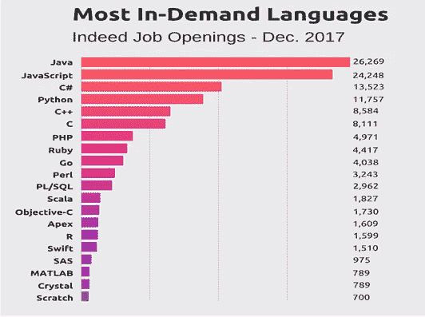
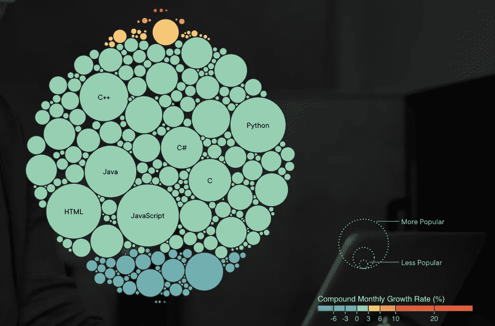
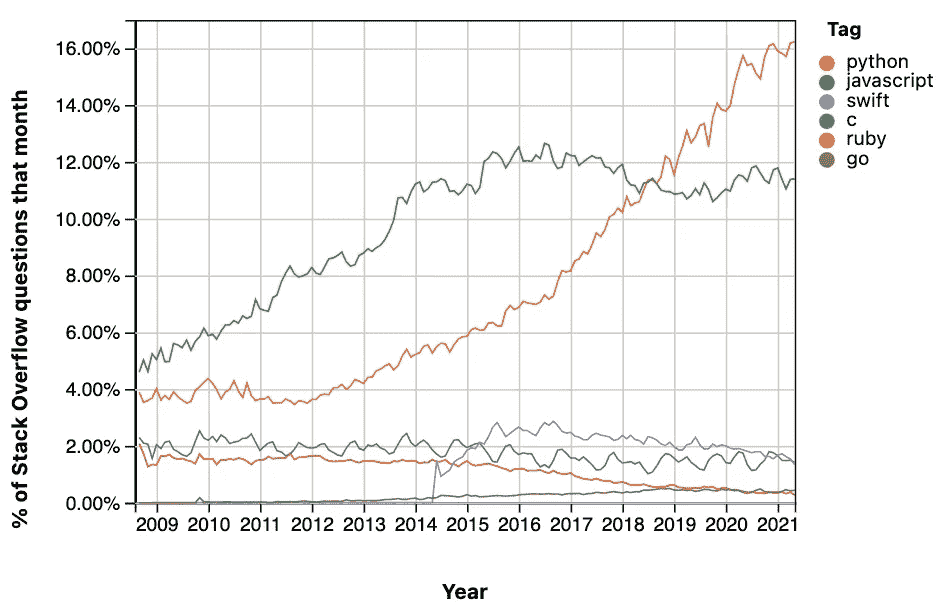

# Javascript？为什么！

> 原文：<https://medium.com/geekculture/javascript-why-de8986d452d9?source=collection_archive---------54----------------------->

## 编程语言系列

## 理解为什么掌握 Javascript 是值得的。

本文将首先简要概述我对编程语言的看法，更具体地说是对 Javascript 的看法，它在过去十年中所经历的发展，以及完全由 Javascript 组成的主要技术栈。

Javascript image that represents how versatile the language is, hence why so popular. Thanks for the image, [check this article where I found this image](/swlh/introduction-to-javascript-basics-cf901c05ca47).

那么为什么还有编程语言呢？它是一种在软件开发中使用的工具，它正在接管世界，而硬件得到了进一步的发展，越来越多的市场需要它在经济和社会的更多部门中以更具创造性的方式使用它，这创造了组织内、社区内、家庭内以及与世界互动的全新方式。

那么，为什么是 Javascript 呢？最后，事情变得非常简单，它无处不在，Javascript 通过 JQuery 接管了 web，从那以后程序员使用它来满足越来越多的需求，随着 Angular 的出现，web 开发中出现了一个潮流点，使 Javascript 成为与前端最相关的语言之一，然后 NodeJS 的另一个创造性使用使 Javascript 成为一个可行的选项，使您的产品成为后端。但是，随着新的部署可用，不同的硬件具有自己的品质和特点，程序员对 Javascript 的创造性使用不断发展，出现了 ReactJS，它是 Javascript UI 框架领域的当前领导者，您可以使用它来制作可重用的组件，如果与 React Native 混合，您甚至可以为 iPhone 应用程序、Android 应用程序和 web 应用程序使用相同的源代码。

最后，这一切都归结于使用该工具的人感觉如何，以及你想用它来创建什么，是否已经有一个很好的框架来满足这种需求，允许你的产品立即诞生，并且很可能 Javascript 中已经有一些特定用途的东西，你可以利用它们。

为了理解 Javascript 作为一种编程语言有多重要，我将提出一些非常重要的问题，这些问题将用一些统计数据来回答。

Javascript 开发人员有职位空缺吗？

This image belongs to this [webpage](https://www.educba.com/uses-of-javascript/), thanks for sharing this image, and [Indeed](https://www.indeed.com/) is a great resource if you are looking for a job in tech.

因为它是工作机会最多的第二语言，所以用这种语言编程是一个可行的选择。尽管如此，从框架和技术栈的角度考虑这一点是很好的，意识到这一点很重要，我将在文章的下一部分对此进行更深入的研究。

**这种趋势会持续下去吗？**

Thanks, [PluralSight](https://www.pluralsight.com/tech-index/software-development) for this amazing graph, I highly recommend checking this graph out from their own webpage and learn more about it.

从 PluralSight 技术指数来看，它的受欢迎程度似乎在不断增加，保持着正的复合月增长率，它已经非常受欢迎，成为该图表中最受欢迎的编程语言。

**这种编程语言可以使用吗？当我陷入困境时，有没有一个社区可以帮助我成长？**

[Stackoverflow](https://insights.stackoverflow.com/trends?tags=c%2Cpython%2Cjavascript%2Cruby%2Cswift%2Cgo) is the source in which you can find the answer to most questions you will ever have while learning to code and very useful once you are a developer too.

Stackoverflow 是一个网页，您可以在其中发布编码问题，人们可以回答这些问题，重要的是要记得检查是否有人已经发布了这个问题，很可能有人已经发布了，您可以免费获得答案，但如果您看到任何您可以回答的问题，也可以付费，慢慢来，帮助其他人。

需要注意的主要技术如果你正在考虑掌握 Javascript，这意味着一系列技术可以让你成为软件工程师职位的良好候选人。

首先是堆栈的名称，然后是它的组成。

**表示**

*   NoSQL 数据库
*   Express.js(后端 web 框架)
*   Angular.js(前端框架)
*   NodeJS(开源、跨平台服务器)

**MERN**

*   NoSQL 数据库
*   Express.js(后端 web 框架)
*   React.js(前端框架)
*   NodeJS(开源、跨平台服务器)

**梅文**

*   NoSQL 数据库
*   Express.js(后端 web 框架)
*   Vue.js(前端框架)
*   NodeJS(开源、跨平台服务器)

所有这些非常受欢迎的技术栈都是在 Javascript 上完成的，这证明了 Javascript 的多种创造性用途，MongoDB 虽然不使用 Javascript，因为它是一个服务器，但使用 JSON (Javascript 对象表示法)，所有组件都使用它进行数据传输。

我希望你已经发现了 Javascript 有多神奇，它是一种彻底改变前端开发的工具，甚至在后端开发中找到了一席之地，所有用它制作的框架，每一个都有自己的风格，给自己一个机会去尝试，看看什么感觉最好，什么最能满足你的特定需求。