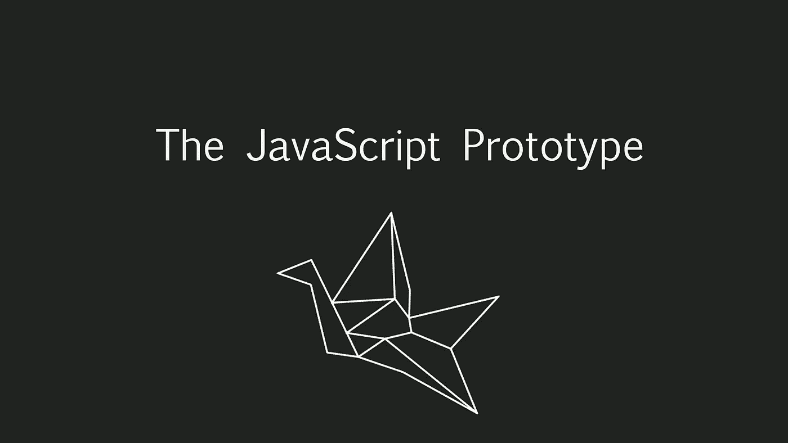

# 为傻瓜解释 JavaScripts 原型继承

> 原文：<https://medium.com/geekculture/javascripts-prototype-inheritance-explained-for-dummies-32b6c4a8a2ef?source=collection_archive---------34----------------------->

## 别傻了，读一读原型，让你的整个职业生涯受益

Image by the [Author](https://www.udemy.com/user/arnold-abraham-3/)

每当你想早点回家，刚刚完成一个故事片，最后点击`git commit`，更奇怪的事情发生了…在我的情况下`prototype`来到了我的路上。