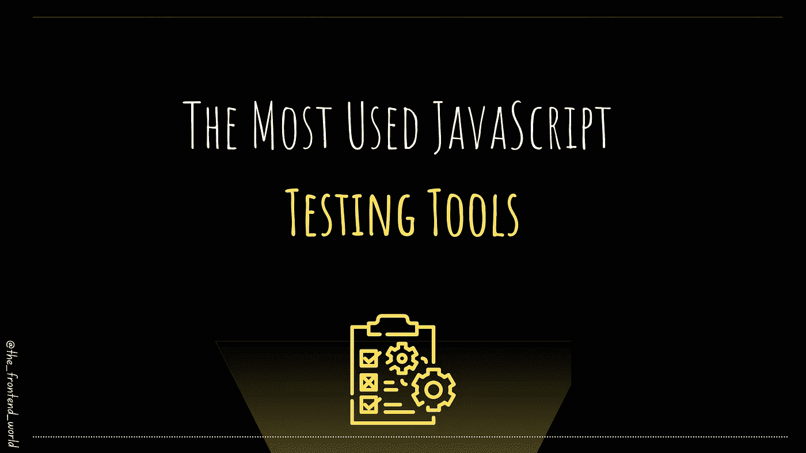

# 最常用的 JavaScript 测试工具

> 原文：<https://medium.com/geekculture/javasthe-most-used-javascript-testing-tools-22ab817f58e5?source=collection_archive---------29----------------------->

## 用于测试 JS 应用程序的工具

By FAM

任何应用程序都必须进行测试。这是维护和拥有一个健康的应用程序的最合适的方式。

在本文中，我将介绍 JavaScript 应用程序最常用的工具，比如 React JS、Angular 或 Vue JS 应用程序。