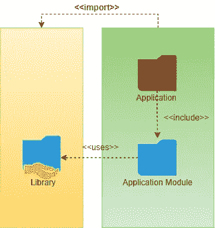
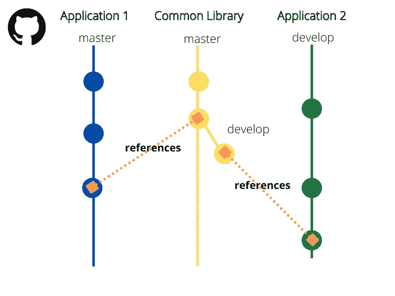
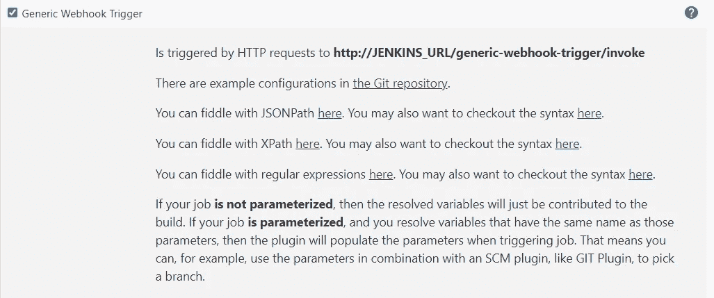
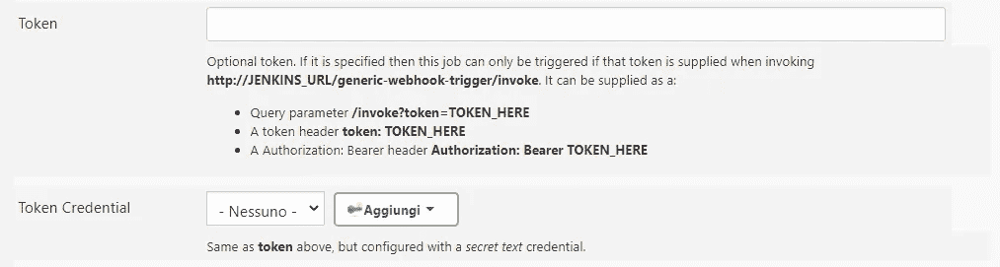
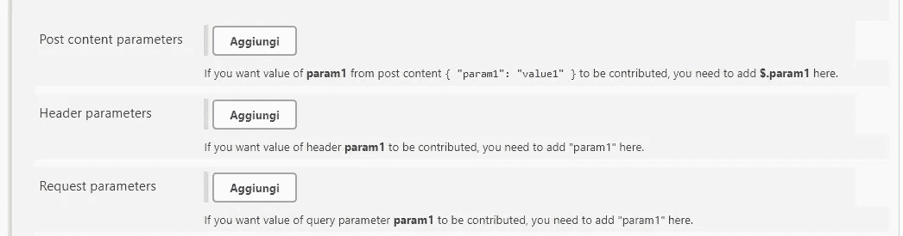
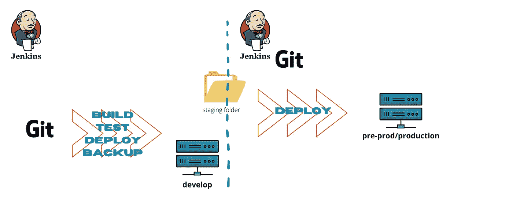

# Jenkins 和 TIBCO BusinessWorks —吸取的教训

> 原文：<https://medium.com/geekculture/jenkins-and-tibco-businessworks-lesson-learned-3d40dfb93b4b?source=collection_archive---------9----------------------->

这个故事可以作为我的故事的续集[詹金斯管道 TIBCO BW 6.x](https://s-maletta-k2.medium.com/jenkins-pipeline-for-tibco-businessworks-6-x-72773506f9dc) 。虽然我在前面的故事中谈到了设置您的第一个管道，但在这里，我将向您展示一些我收到的反馈意见，在现实生活的项目中使用 Jenkins 管道。


## GIT 子模块

在代码中使用库是一种常见的开发和架构模式:这允许您提高代码的质量和稳定性。
TIBCO Business Works 使用共享模块作为库:它们可以在应用程序之间使用，并被应用程序模块和共享模块引用。
如果你的版本控制是 GIT，通常的做法是给你的公共库分配一个专用的项目。

您的应用程序所依赖的项目包含库 1 作为引用。看下面的图表



在这个场景中，我描述的管道不起作用，因为 GIT 不能下载引用的项目:结果，编译器给你一个依赖异常。您必须显式地配置 git 插件来使用子模块。

为了避免这种情况，我们在管道中增加了一个明确的*检验*阶段

```
stage('Checkout')
    {
        checkout(
            [
                $class: 'GitSCM',
                branches:[
                    [
                        name: '*/***branch***'
                        ]
                    ],
                dogenerateSubmoduleConfigurations:false,
                extensions:[
                    [
                        $class: 'SubmoduleOption',
                        disableSubmodules: false,
                        parentCredentials: true,
                       ** recursiveSubmodles: true**,
                        reference: '',
                        trackingSubmodules: false
                    ]
                ],
                submodulesCfg:[],
                userRemoteConfigs:[
                    [
                        credentialsId:'**GIT_Account**',
                        url:'***http://***[***giturl/projecturl.git***'](http://ahhycsvap04.aceaspa.it/bitbucket/scm/tss/salesforcemessagereceiver.git')
                        ]
                    ]
                ]
            )
    }
```

我们指导插件配置:

*   **分支**:应用模块所依赖的分支名称
*   **GIT_Accout** :用于访问 GIT 的凭证
*   **递归子模块**:递归子模块使能；这指示插件遵循子模块依赖性
*   **http://giturl/project url . GIT**:GIT 项目 URL

为了让一切正常工作，你必须急着获取文件。 *gitmodules* 包含了*条目*

```
[submodule "lib"]
 path = library
 url = [***http://giturl/libraryurl.git***](http://ahhycsvap04.aceaspa.it/bitbucket/scm/tss/commonutils.git)
```

必须在*中找到。git/config* 文件。

请务必不仅在本地 TIBCO Business Studio 文件夹中，而且在远程分支中保存更新的 GIT 引用。它自动管理引用:这就是为什么我们不显式库 GIT 位置。我试着用下面的例子来解释它是如何工作的:



应用程序没有嵌入库的副本，但是它只将项目 URL 和提交点存储到树中的*中。gitmodules* 文件如前所述。

这解释了为什么每次您拉一个新的库提交点时都需要提交黄色的圆柱体:根据模型，您将指针移动到库树中，更新。*I modules*文件。如果不这样做，您的存储库副本仍然指向另一个提交点，您的构建可能会失败。

要了解更多关于 GIT 子模块的信息，请点击这里。

## 詹金斯标准网钩

我在前面的故事中描述的管道必须手动启动。我们曾经想要一个完全自动化的过程，让 Jenkins 随时部署:我们选择启用 Jenkins 标准 Webhook。

要启用 webhook，您需要在两端进行配置:一个来自 Jenkins 端，一个来自 git 服务器。在本文中，我将讨论 Jenkins 方面:事实上，配置您的 git 服务器取决于大量变量，如您的服务器提供商(GitHub、GitLab、Bitbucket 等)和安装的插件。由于这些原因，我更愿意让您从官方文档中学习这一部分。

从 Jenkins Pipeline 屏幕标记**通用 Webhook 触发器:**



这样，您的管道将侦听来自服务器的请求。
这个解决方案带来了一个问题:如果你配置了不止一个管道，通常情况下，暴露的 URL 对于每个管道都是相同的。所有构建将同时开始！

为了避免不必要的并发，我们需要定制每个钩子。最快的方法是定义一个自定义令牌:它代表一个共享文本，当然没有加密文本，这允许 Jenkins 识别它必须启动的管道。



您可以关联一个凭据集以避免未经授权的访问。

我发现有用的还有参数定制:



您可以使用请求的头部和主体来参数化您的构建。

## GIT flow 和 Jenkins

当你使用 GIT 时，CVC 就像喝一杯 [IPA](https://en.wikipedia.org/wiki/India_pale_ale) 配一份玛格丽塔披萨一样普遍，采用标准的 GIT 流程。

当我们希望让我们的管理模式与标准流程相匹配时，麻烦就诞生了。

我们有三种运行时环境:

*   *开发*:用于开发者测试和调试
*   *预编程* ( *预生产*):最终用户测试代码的地方
*   *生产*

我们对 git-flow 中的环境建模如下

*   *主人*
*   *预编程*
*   *开发*

*开发*分支带来我们部署在*开发*环境中的代码，用于调试和内部测试目的，*预开发*存储最终用户验收测试的代码，而*主*当然反映产品。

除主管环境的经理外，任何人不得推动*开发*、*预开发*、*主控*分支。

来自我们运营团队的*主要指令*是:

> 如果没有在 d *evelop* 和*pre Prog*环境中进行测试，任何功能和修复都不会部署到生产环境中。

为了遵循这个规则，我们选择在上层环境中提升 ear 本身，而不是代码。我们不会为每个环境重新构建代码，而是在上层重新安装相同的工件。

我们必须在 Jenkins 的自动部署单元中重现这种行为。

最现代的解决方案将使用软件组件管理库和两条不同的管道:一条负责构建和测试，另一条负责在正确的环境中部署。

由于时间限制和没有可用的 SCM，我们创建了一个混合版本的解决方案，我在图中展示了之前说过的一行:



我们知道的管道用于编译、构建自动测试和部署开发环境的代码:它将生成的 ear 备份到一个共享文件夹中。

当代码对于提升到 pre-prod 环境中很有价值时，使用第二个管道:它使用一个虚拟 maven *pom* 和用于正确环境的 TEA 配置。It 只负责使用正确的配置文件来部署它。

管道与开发环境中使用的管道完全不同。

它使用:

*   特设 maven pom 文件称来自官方文件的虚拟文件
*   配置文件:针对您需要部署的环境，即 *AppSpace* 名称、 *AppNode* 名称、端口等；
*   当然是藏物了。

管道只执行一个目标: *deploy。*

## 结论

写这个故事是为了说明在现实生活模式中完成常见任务的解决方案。我知道许多人可以变得更好或重新设计，但这些是我们找到的。

所有表达的观点和描述的解决方案都来自我和我的团队，而非 TIBCO Software Inc .