# 詹金斯自动化我最近一直在使用

> 原文：<https://medium.com/geekculture/jenkins-automation-i-have-been-using-lately-f5eab13ec65e?source=collection_archive---------39----------------------->

我使用 Jenkins 实现自动化(在客户环境中)已经有一段时间了，使用案例如下:

1.  持续部署
2.  循环网络和 API 验证
3.  API 预热

# 持续部署

这是主要的使用案例，旧的部署方式主要是手动工作，要避免所有的人为错误是很有挑战性的。

在部署中，可能有以下操作:

1.  从存储库中获取源代码
2.  编译和链接(对于某些编程语言)
3.  存档原件
4.  配置更改(取决于目的地或版本)
5.  重新启动一些服务
6.  …

## 我为部署而设置的 Jenkins 项目

首先，在常规部分，我设置了一些参数，例如:

1.  选择的 git 标签
2.  要使用的登录和目标服务器
3.  将文件部署到目标服务器的位置。
4.  …

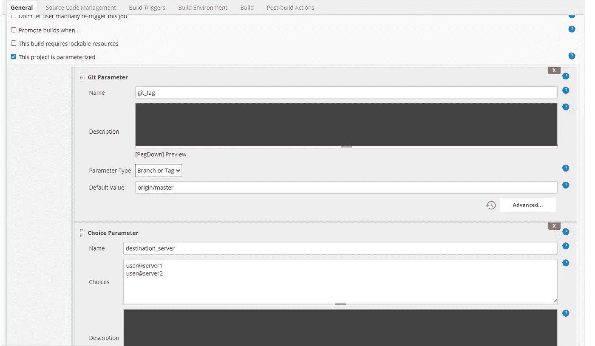

对于源代码管理，我们将重用已定义的 git 标记参数(它将以下拉列表的形式呈现，用户可以从中进行选择)

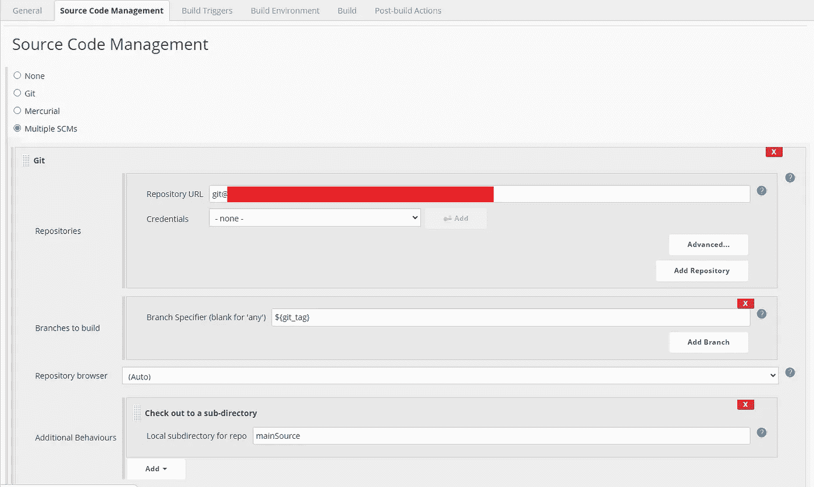

最后，主要步骤是运行一个脚本(它包含在源代码中，但是您也可以在这里直接编写脚本)

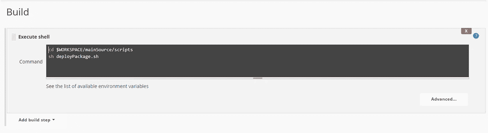

部署脚本逻辑如下:

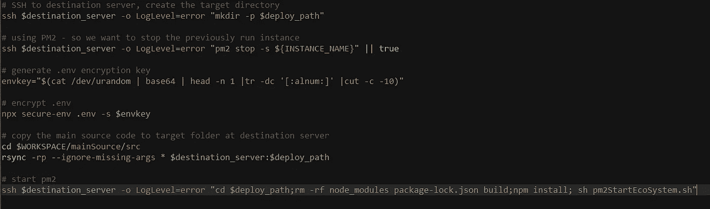

该脚本执行了几项任务:

1.  管理目标服务器文件系统(创建文件夹)
2.  管理配置(使用 secure-env 加密。源文件中的环境文件)
3.  复制文件(当 Jenkins 准备源文件并在 Jenkins 服务器上运行脚本时，需要将文件复制到目标服务器)
4.  复制后操作-使用 PM2 运行服务

使用参数运行此 Jenkins 项目:

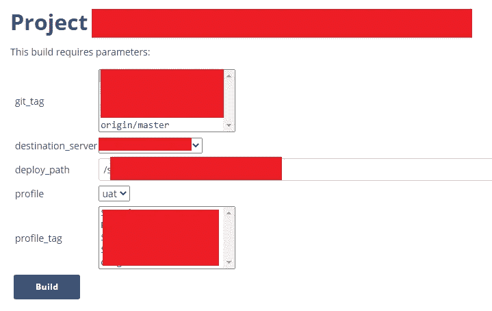

## 詹金斯管道项目简介

假设上面定义的 Jenkins 项目是参数化的，那么如果有多个目标服务器，我们将需要选择不同的服务器再次运行相同的项目(这是另一个人为错误的来源)。

因此，我如何使用詹金斯自动化这是通过管道项目。

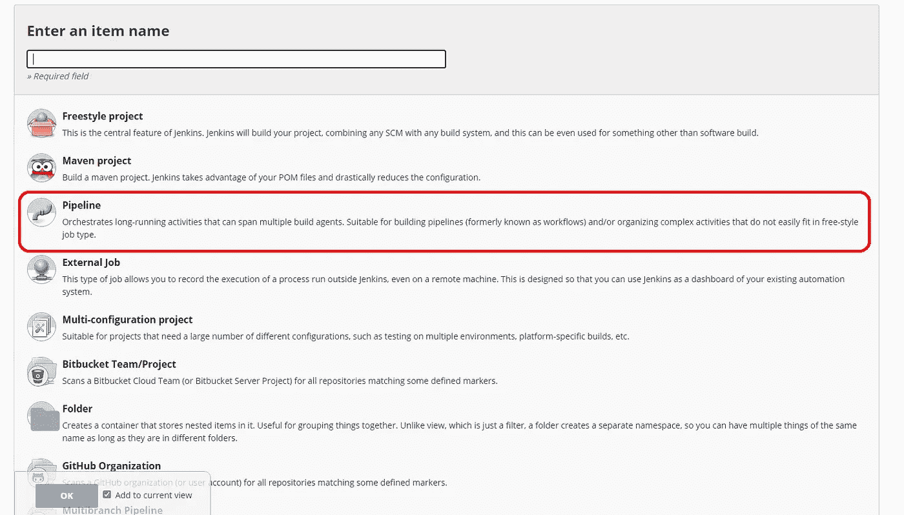

Create a Jenkins pipeline project

在配置管道时，我们的重点是管道部分，该部分允许我们使用“管道脚本”来定义要做的事情。

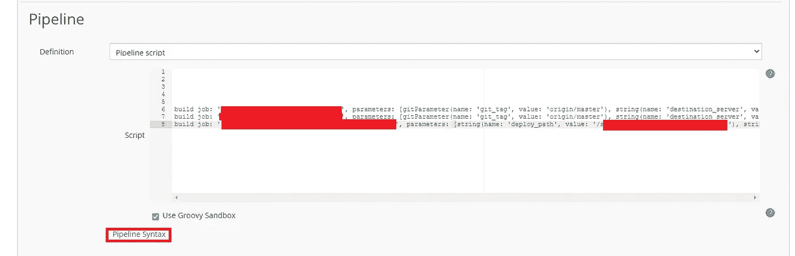

下面有一个“管道语法”的链接，它允许我们生成必要的脚本。

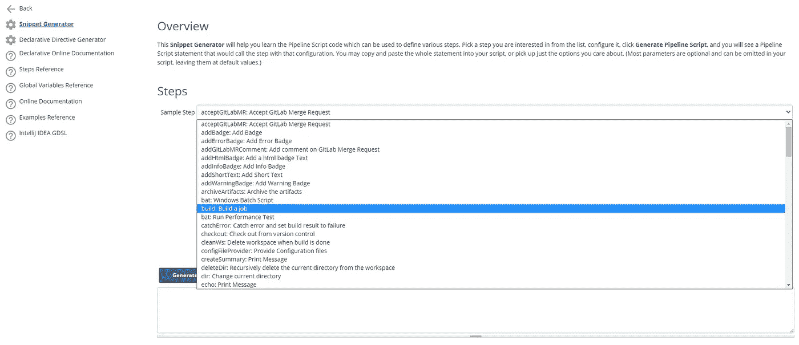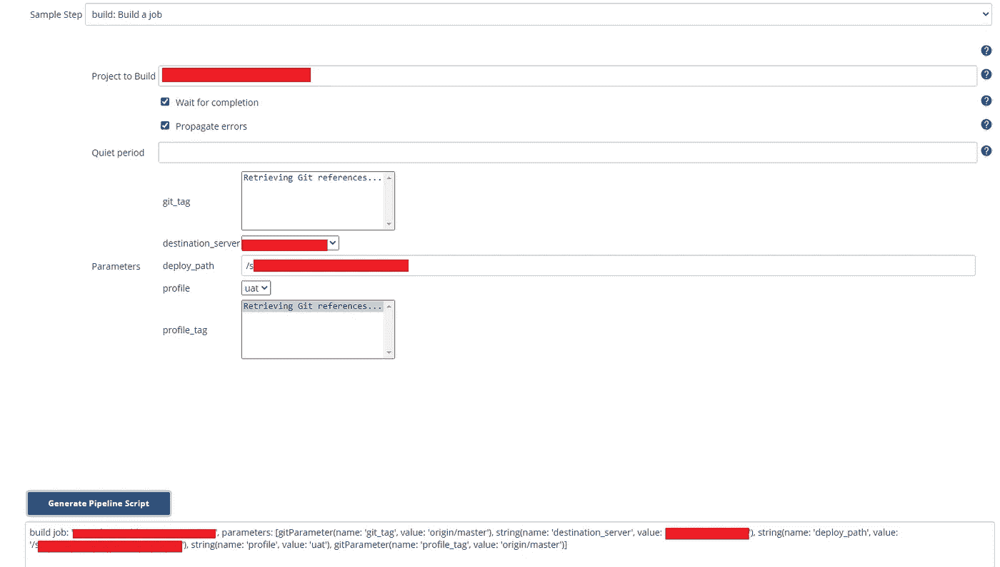

复制生成的脚本并粘贴到上一屏幕的管道部分。因此，我准备了多个具有不同参数(例如，目标服务器)的“构建作业”脚本

# 网络检查

我的另一个用例是与网络团队一起检查服务器之间的网络连接。

首先，我定义了一个多行字符串参数如下:

The parameter is having pattern “label | hostname or IP | port”

该脚本将执行:

1.  在第一行设置+xe 是为了不打印控制台结果中正在执行的行，并允许脚本继续运行，即使有错误
2.  通过中断 web_servers 参数中定义的值(用逗号分隔)来构建服务器数组
3.  将内部字段分隔符(IFS)更改为“\n ”,将多行参数拆分为行数组，然后恢复旧的 IFS
4.  对于每台 web 服务器，运行 SSH 命令进行 telnet(从每条线路获取主机名/ip 和端口)

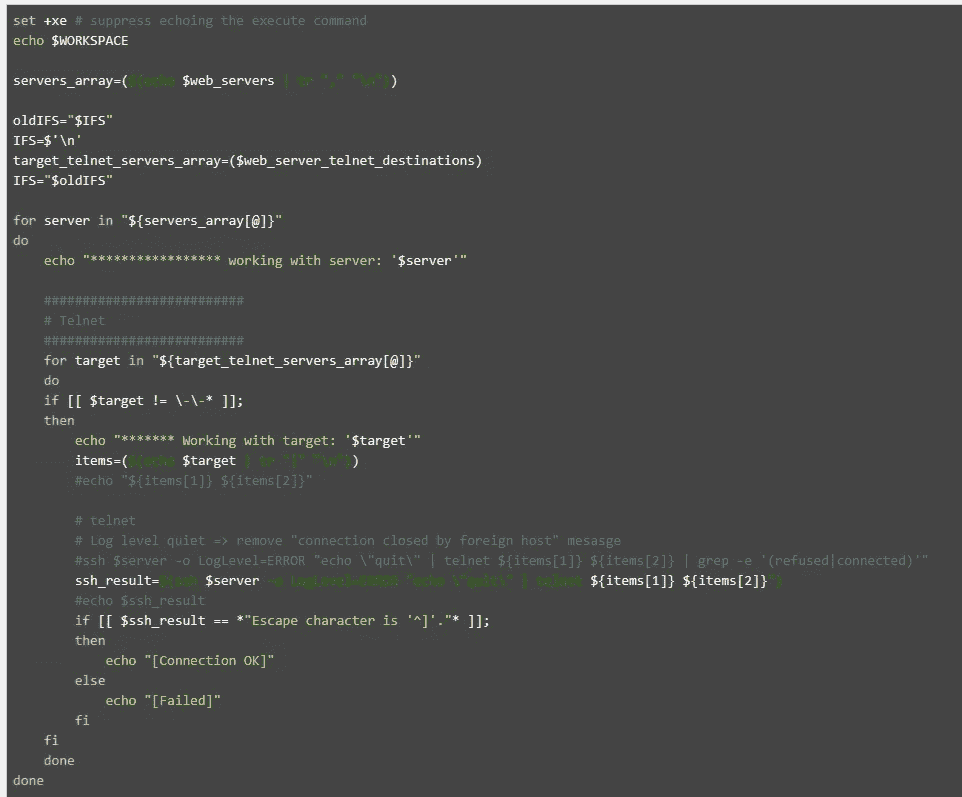

# API 检查和预热

API 检查与此类似，但是我们使用 curl，而不是在 ssh 命令中运行 telnet。

一个问题是 curl 有时更能容忍标准开关(例如证书错误)和不同于编程语言库(例如 axios)的结果。

对于预热场景，我的用例是处理 IIS 空闲超时(20 分钟),因此我将运行一个常规作业以卷曲到 API 端点，要在 Jenkins 中配置常规运行，我们可以在 build triggers 部分配置定期构建。

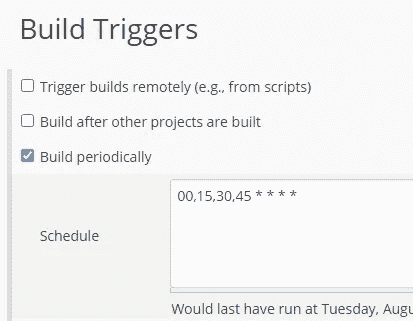

The schedule follow cron scheduling pattern — try this to help you build the pattern: [https://crontab.guru/](https://crontab.guru/) or [https://freeformatter.com/cron-expression-generator-quartz.html](https://freeformatter.com/cron-expression-generator-quartz.html)

# 结论

Jenkins 的用途比我最初预期的要多得多，但至少我觉得上面的用例涵盖了许多需要定期运行的部署和支持任务，尽管构建脚本和工作需要时间，但当我多次使用它时，它会得到很好的回报。