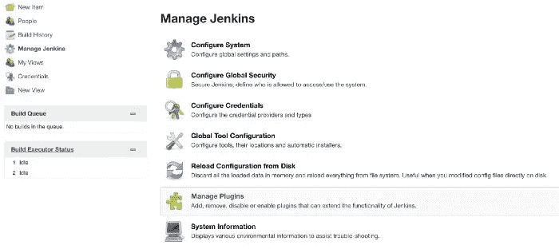
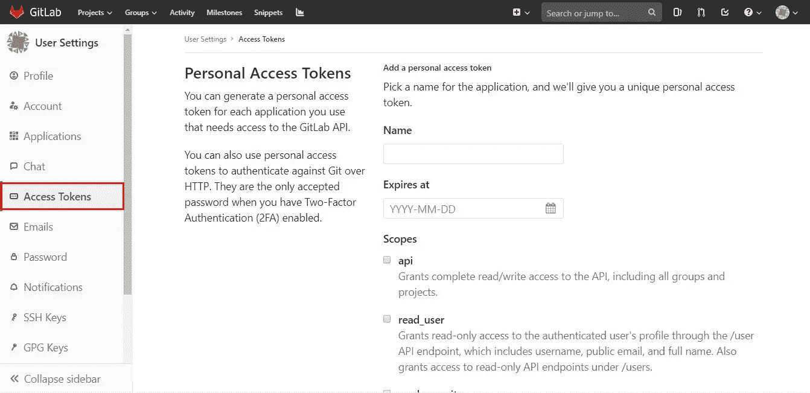
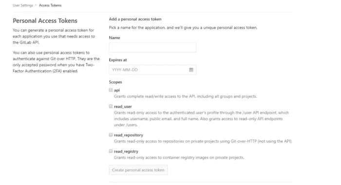
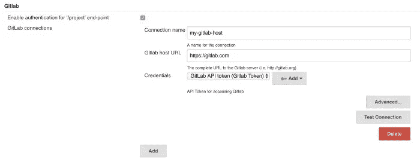
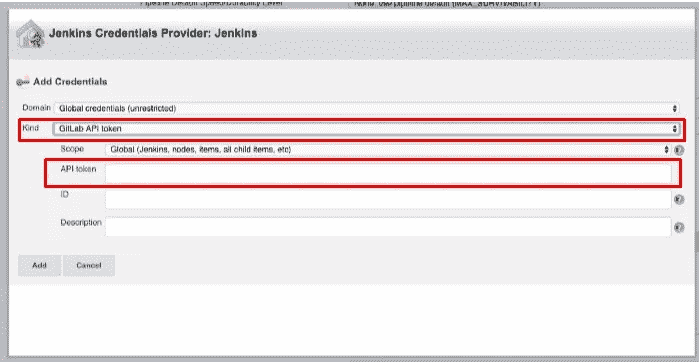
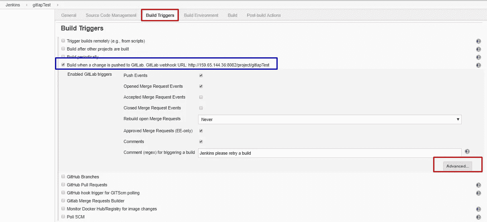
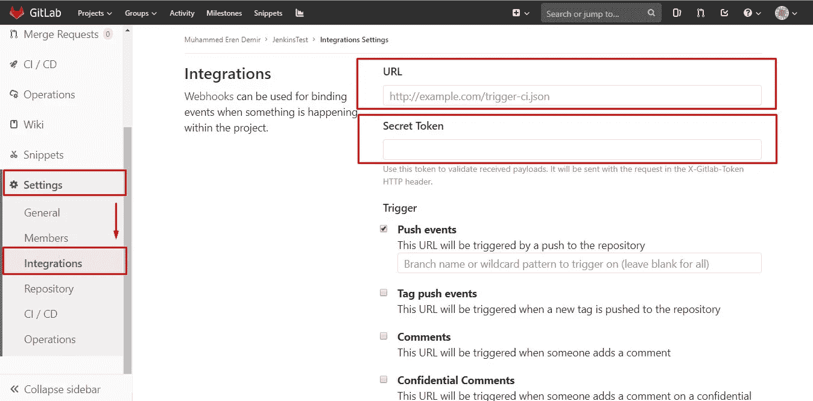
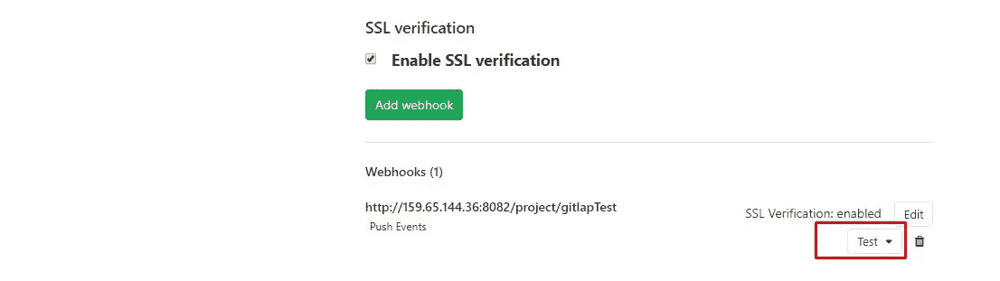

# Jenkins GitLab 集成流程

> 原文：<https://medium.com/geekculture/jenkins-gitlab-integration-processes-668937236e5d?source=collection_archive---------23----------------------->

通过整合 GitLab 和 Jenkins。使用 GitLab WebHook，我们将根据我们向 GitLab 发出的请求触发 Jenkins 来执行我们想要的操作。

举个例子，当我们的 GitLab 项目被推送时，詹金斯被触发，项目被构建。

## 综合

**第一步:**搜索**Manage Jenkins->Manage Plugins**git lab 插件并安装，然后重启。

**第二步:**登录 Gitlab，进入**访问令牌**选项卡，创建一个令牌。

让我们在创建令牌后复制令牌。

**步骤 3:** 让我们输入 Jenkins，并在“管理 Jenkins - >配置系统”中填写 GitLab 字段，如果没有我们在“令牌”部分创建的 GitLab 令牌，我们将通过单击“添加”创建一个新令牌。

*   让我们选择接收**种类的 GitLab API 令牌。**
*   我们在 GitLab 中创建的令牌将被输入到 **API 令牌**字段中。

**步骤 4:** 配置我们的 Jenkins 项目。我们将通过单击生成触发器中的高级，从高级选项中生成令牌。

此处蓝框中的 URL 将来会用到，所以我们将其复制或保存到不同的位置。

我们将复制创建的令牌，然后进入 Gitlab。

**第五步:**通过进入 GitLab 并从我们项目的设置区域进入 Integrations 字段，上一步中蓝框中的 URL 将是 URL。我们在上一步中创建的令牌将被输入到“机密令牌”字段中。

创建之后，我们可以从测试部分测试它。
流程完成。詹金斯现在可以被 GitLab 网页钩子触发。