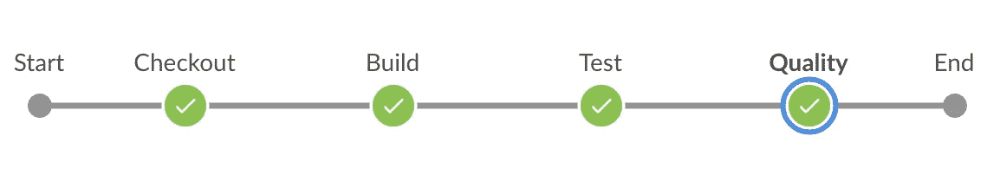
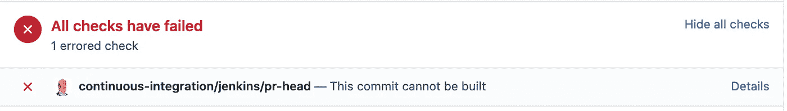
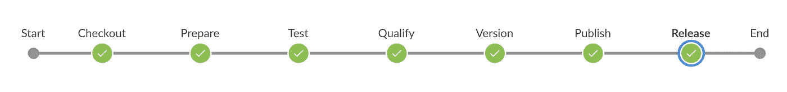
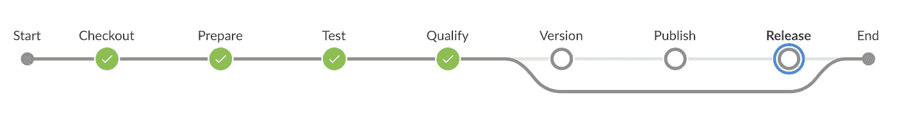
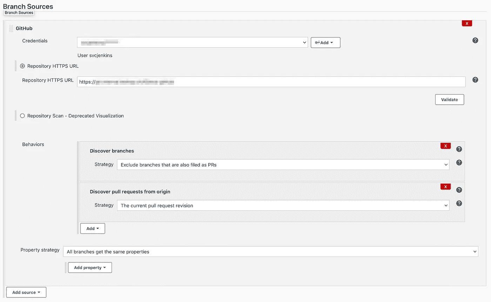
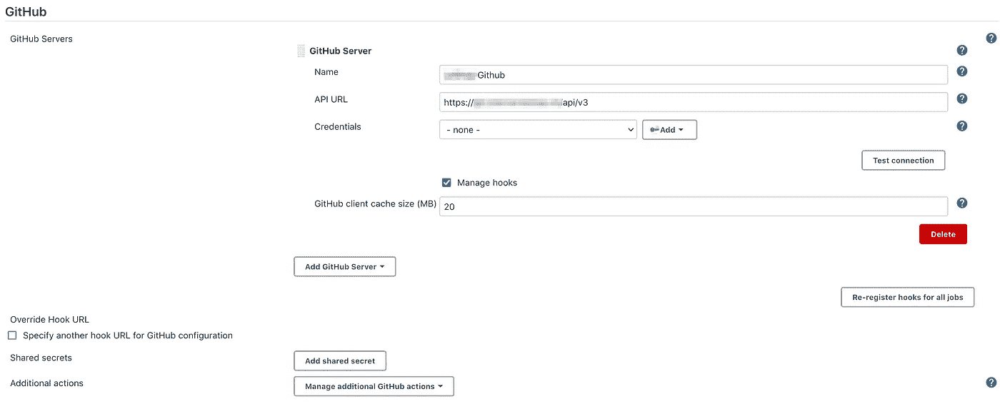
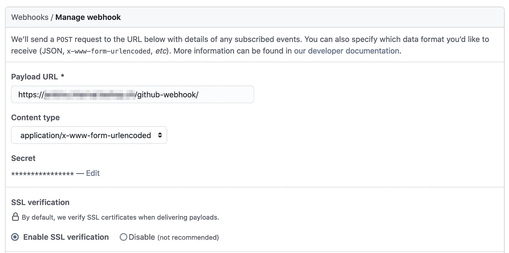
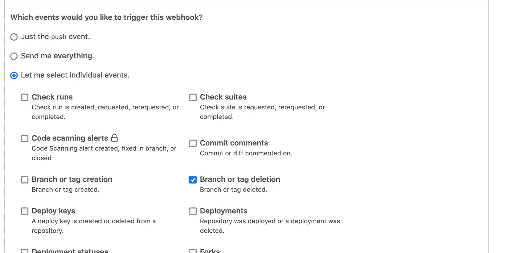

# 詹金斯管道，Python 和 Docker 一起

> 原文：<https://medium.com/geekculture/jenkins-pipeline-python-and-docker-altogether-442d38119484?source=collection_archive---------2----------------------->

## 使用 Jenkins 管道自动发布 Python 命令行应用程序

## 如何用 Python 写一个自动释放命令行工具的 Jenkins 管道？


Photo by [Chris Ried](https://unsplash.com/@cdr6934?utm_source=medium&utm_medium=referral) on [Unsplash](https://unsplash.com?utm_source=medium&utm_medium=referral)

# 介绍

在我目前的职位上，我们面临着 GitHub 企业设备的问题。我们需要在各种级别上将活动目录中的用户与设备同步:

*   允许用户登录 GitHub 企业设备
*   允许用户访问某些组织
*   允许用户成为团队成员

GitHub Enterprise 已经实现了部分同步，但并没有完全按照我们想要的方式来管理我们的用户和权限。

我们编写了一个“小”命令行工具来完成这项工作，并编写了其他有用的命令，如从命令行归档和移动存储库。但首先，这是我等待的把手伸进 Python 的机会。

我有很强的 Java 背景，精通 Ruby(尤其是 Ruby on Rails)和 JavaScript/TypeScript，但不精通 Python。这是构建一个包含一些最佳实践的工具的时机，比如单元测试和 CI/CD。

在本文中，我们不会关注构建这样一个工具是否是一个好主意。这不是目标。我们将讨论建立一个 Jenkins 管道来构建我的基于 Docker 的 Python 应用程序。

## 语境

我们从写一点代码开始。该代码包括单元测试和各种配置，以构建和测试项目。

一会儿，将是构建和分发工具的时候了。我们需要将它安装在某个管理服务器或其他地方来使用它。为此，我们需要一个工具链来构建、测试、打包和分发命令行工具。

我们首先关心的是知道我们将在哪里运行这个工具。运行该工具的服务器上已经运行了一些 Python 应用程序。我们不想管理各种 Python 版本，也不想处理依赖安装。

我们在寻找一种“更简单”的方式来运行我的命令行工具。这就是 Docker 参与进来的原因。Docker 是一种隔离运行时的友好方式。拥有一个自包含的容器是让主机只运行 Docker 和最小需求集的一个显著优点。

另一个问题是 Jenkins slaves，这里没有安装 Python。我们希望避免在 Jenkins slaves 上维护 Python 堆栈(有或没有 Jenkins 工具的帮助)。我想到了码头集装箱。我们可以在一个容器中运行构建和测试。

在这个阶段，我们同时做了两件事:

*   创建我的第一个詹金斯管道，
*   运行一些 Docker 实验

## 先决条件

为了全面了解目前的材料，我们建议了解以下领域的知识:

*   Jenkins 管道(DSL、Groovy、凭证等)
*   SonarSource 的 SonarQube(代码质量分析)
*   Git 作为配置管理工具
*   Docker 构建图像，运行容器，…

在参考资料一节中，您可以找到工具文档的各种链接。

# 詹金斯管道—第一版

my Jenkins pipeline 的第一个版本旨在构建和测试项目代码。它使我的拉动请求检查为绿色或红色。有四个连续的步骤:

*   检查代码
*   建立 Docker 形象
*   运行测试
*   运行代码质量分析

此外，还有最后一个行动后步骤来帮助清理一切。



Jenkins Pipeline View — First Version

## 詹金斯文件

Jenkins 文件使用专用的 Groovy DSL。它还包括一些来自附加插件的 DSL 语句。文件的一部分包含原始 groovy 语句。最后，它描述了如何像 Makefile 或 bash 脚本那样构建和测试项目。

Jenkinsfile — First Version

## Dockerfile 文件

Docker 文件是通过连续执行几个步骤来准备 Docker 映像的方法。我们安装附加的依赖项，复制源代码，并安装项目依赖项。

docker 文件中的最后一条语句描述了当与`--volumes-from`一起使用时，自动挂载哪个路径(`/usr/src`)。我们稍后会看到我们是如何使用它的。

Dockerfile — First Version

## 流水线执行

当我们运行一些管道命令时，我们可以更详细地看到发生了什么。

## 管道执行—检验

在流水线中，第一步是“**结账**”。没什么特别要说的。它签出项目的源代码来构建它。

## 管道执行—构建

构建 Docker 映像的命令在 Jenkins 管道的步骤“ **Build** 中。跑步是笔直向前的。

```
**❯ docker build . -t ghcli:py**[+] Building 30.2s (13/13) FINISHED                                                                                                                                                                                                     
 => [internal] load build definition from Dockerfile              0.0s
 => => transferring dockerfile: 373B                             0.0s
...
 => [7/8] RUN python -m pip install -e ".[test]"               27.3s
 => [8/8] COPY . .                                              0.3s 
 => exporting to image                                          0.7s 
 => => exporting layers                                         0.7s 
 => => writing image sha256:42a0d2b837...bb5fdef2994e8          0.0s 
 => => naming to docker.io/library/ghcli:py
```

## 流水线执行—测试

有了 Docker 映像，我们可以通过容器运行测试。它对应于 Jenkins 管道中的步骤“**测试**”。

✳️注释`--name ghcli`，它给 Docker 容器起了个名字。它将让我们在下一个 Jenkins 管道步骤中使用该容器作为卷容器。

✳️，你可以看到有两个测试运行部分。第一个是由`flake8`进行的语法验证，第二个是单元测试执行。有趣的是，语法验证是测试的一部分。

```
**❯ docker run --tty --name ghcli ghcli:py /usr/bin/make test**find . -name "*.pyc" -delete
find . -name "__pycache__" | xargs -I {} rm -rf {}
rm -rf ./.pytest_cache
rm -rf ./build/*
rm -f ./.coveragepytest . --flake8
======================= test session starts ========================
platform linux -- Python 3.8.10, pytest-6.2.4, py-1.10.0, ...
collected 440 itemsconftest.py .                                                 [  0%]
ghcli/commands/command.py .                                   [  1%]
...
tests/utils/test_filters.py .......                            [ 97%]
tests/utils/test_utils.py ..........                          [100%]======================= 440 passed in 10.82s =======================pytest tests --cov --cov-report term --cov-report xml:build/coverage.xml --cov-report html:build/htmlcov --html build/test_report.html --junitxml build/unit-report.xml======================== test session starts =======================
platform linux -- Python 3.8.10, pytest-6.2.4, py-1.10.0, ...
collected 296 itemstests/commands/test_archive_repository_command.py ......      [  2%]
tests/commands/test_command.py .......................        [ 11%]
...
tests/utils/test_filters.py ......                             [ 96%]
tests/utils/test_utils.py .........                           [100%]-------- generated xml file: /usr/src/build/unit-report.xml ---------
---- generated html file: file:///usr/src/build/test_report.html ----- --------- coverage: platform linux, python 3.8.10-final-0 -----------
Name                              Stmts   Miss Branch BrPart  Cover
--------------------------------------------------------------------
.../create_user_command.py           19      0      2      0   100%
...
.../utils.py                         28      0      8      0   100%
--------------------------------------------------------------------
TOTAL                              1738      0    392      0   100%Coverage HTML written to dir build/htmlcov
Coverage XML written to file build/coverage.xml======================= 296 passed in 6.19s ========================
```

这个 Docker 运行和本地环境中的测试运行没有区别。有趣的是，无需在主机上设置 Python 环境就可以运行测试。我们需要 Docker 引擎来运行 Docker 容器，但仅此而已。

## 管道执行—质量

詹金斯流水线的最后一步是“**质量**步骤。它包括从 Docker 容器运行 SonarQube 命令行实用程序。它将运行代码分析，并将结果发送到 SonarQube 服务器。

✳️在下一个命令中，您可以看到我们正在从容器`ghcli`中装载所有卷，该容器来自之前的 Docker 命令。`--volumes-from ghcli`将把`/usr/src`从前一个容器装载到 SonarQube 容器中。我们需要这个来分析项目的源代码。

⭐如果你想深入了解 Docker Volumes，你可以阅读 Docker volumes 文档或以下文章。

[](https://www.ionos.com/digitalguide/server/know-how/docker-container-volumes/) [## 了解和管理码头集装箱体积

### 了解 Docker 如何处理容器存储卷，如何从命令行启动带有卷的容器，以及…

www.ionos.com](https://www.ionos.com/digitalguide/server/know-how/docker-container-volumes/) [](https://docs.docker.com/storage/volumes/) [## 使用卷

### 卷是保存 Docker 容器生成和使用的数据的首选机制。当绑定挂载时…

docs.docker.com](https://docs.docker.com/storage/volumes/) 

```
**❯ docker run \
  --rm \
  -e SONAR_HOST_URL=https://<sonarQubeHost> \
  -e SONAR_LOGIN=<sonarQubeLoginCreds> \
  --volumes-from ghcli \
  sonarsource/sonar-scanner-cli \
  sonar-scanner -Dsonar.branch.name=<branchName>**INFO: Scanner configuration file: /opt/.../sonar-scanner.properties
INFO: Project root config file: /usr/src/sonar-project.properties
INFO: SonarScanner 4.6.2.2472
INFO: Java 11.0.11 AdoptOpenJDK (64-bit)
INFO: Linux 3.10.0-1062.9.1.el7.x86_64 amd64
...
INFO: 144/144 source files have been analyzed
INFO: Python test coverage
INFO: Parsing report '/usr/src/build/coverage.xml'
...
INFO: Read 757 type definitions
INFO: Reading UCFGs from: /usr/src/.scannerwork/ucfg2/python
INFO: 18:50:42.96343 Building Runtime Type propagation graph
INFO: Analyzing 3359 ucfgs to detect vulnerabilities.
...
INFO: ------------- Check Quality Gate status
INFO: Waiting for the analysis report to be processed (max 300s)
INFO: QUALITY GATE STATUS: PASSED - View details on https://...
INFO: Analysis total time: 19.291 s
INFO: --------------------------------------------------------------
INFO: EXECUTION SUCCESS
INFO: --------------------------------------------------------------
INFO: Total time: 23.957s
INFO: Final Memory: 8M/34MINFO: --------------------------------------------------------------
```

## 管道执行—结果

有了这条管道，我们现在有了一个在 Jenkins 上运行的项目。如果在执行过程中出现故障，执行将阻塞拉请求。



Pull Request Blocked by Pipeline Execution Failure

这还不错。每当我们推送一个分支并创建一个拉取请求时，就会触发一个管道的执行。你可以阅读附录一和附录二，看看关于集成 Jenkins 和 GitHub 的配置(webhooks，multibranch，…)。

# 詹金斯管道—第二版

在第二个版本中，我们将更进一步，引入一种机制来自动创建命令行工具的版本。当我们将一个分支合并到`main`分支时，发布的创建就会发生。

它遵循连续交付的趋势，即当一个特性准备好投入生产时，您就进行部署。在这种情况下，我们将只部署工具的一个新版本，每当一个特性准备好的时候。

## 版本增量

我们寻找的第一件事是自动管理版本号增量的工具。在我们的调查过程中，我们发现了工具`bump2version`，它正是我们一直在寻找的。

[](https://github.com/c4urself/bump2version) [## c4urself/bump2version

### 这是优秀 bumpversion 项目的一个维护分支。一个简单的命令就能升级你的软件！一个…

github.com](https://github.com/c4urself/bump2version) 

该工具允许我们配置识别我的文件中的版本的方式，决定我们要更新哪些文件，并在这些文件中进行更新。我们可以自己决定版本格式。

## bump 2 版本配置

`bump2version`的设置很容易做到。它需要一个名为`.bumpversion.cfg`的小文件，其中包含我们使用该工具时要更新的文件。

.bumpversion.cfg File

更新的第一个文件是一个名为`VERSION`的标志文件。这个文件将使在 Jenkins 管道中获得版本变得更加容易。

VERSION file

第二个更新的文件是命令行工具的脚本。它直接包含版本。工具`bump2version`可以更新任何文件。

scripts/ghcli file

该工具还会更新其配置文件。

运行该工具很容易。请看下面的命令。

```
**❯ bump2version --current-version 0.1 --allow-dirty minor**
```

## 管道流量

我的 Jenkins 管道必须涵盖用例:

*   当分支合并到主版本时构建新版本
*   在不创建新版本的情况下构建和验证分支和拉请求

下面，您可以查看第一个用例的 Jenkins 管道流。我们定义了以下步骤:`checkout`、`prepare`、`test`、`qualify`、`version`、`publish`和`release`。



Jenkins Release Pipeline Flow

在第二个用例中，我们跳过了`version`、`publish`和`release`步骤。它们是存在的，但是有一个条件阻止它们运行。



Jenkins Build Pipeline Flow

## 管道

自上一版本的管道以来，许多事情都发生了变化。基本元素仍然保持不变。

Jenkins Pipeline — Second Version (without stages)

在接下来的几节中，我们将深入研究每个步骤的细节。我们将讨论每个步骤。完整的管道代码在附录三中。

## 管道—阶段“检验”

`checkout`阶段很简单。它从预期的分支中检索项目的源代码。

ℹ️检索分支名称，我们使用两个 Jenkins 环境变量。当我们处于 change job 时，我们有可用的变量`CHANGE_BRANCH`,并用正确的分支填充。否则，我们需要使用`BRANCH_NAME`。

Pipeline —Stage “Checkout”

## 管道执行——阶段“检验”

`checkout`阶段的执行结果包含几个 git 命令。git/github 插件为我们处理命令。

```
[Pipeline] { (Checkout)
[Pipeline] script
[Pipeline] {
[Pipeline] deleteDir
[Pipeline] git
...
Cloning the remote Git repository
Avoid second fetch
Checking out Revision 275...3e7 (refs/remotes/origin/...)
Commit message: "..."
Cloning repository git@<host>:<org>/<repo>.git
 > git init /var/lib/jenkins/workspace/_... # timeout=10
Fetching upstream changes from git@<host>:<org>/<repo>.git
...
 > git checkout -f 275...3e7 # timeout=10
 > git branch -a -v --no-abbrev # timeout=10
 > git checkout -b ... 275...3e7 # timeout=10
 > git rev-list --no-walk 21b...785 # timeout=10
[Pipeline] }
[Pipeline] // script
[Pipeline] }
[Pipeline] // stage
```

## 管道—阶段“准备”

在`prepare`阶段，我们进行变量初始化和构建语句。

ℹ️:我们需要初始化一些变量，以便在整个管道中重复使用。我们还定义了一个标志来了解任务运行是否是一个发布。

ℹ️:我们构建了在管道中使用的 Docker 映像，并准备了一个容器用于稍后的`--volumes-from`。

ℹ️以下命令检测最后一次提交是否有多个祖先。如果提交只有一个祖先，则它不能是合并提交。当你使用挤压和重置策略时，它可能不起作用。

```
**❯ git rev-parse --verify -q HEAD^2**
```

Pipeline — Stage “Prepare”

Docker 文件与以前没有太大的不同。我们在与`apt`包相同的 Docker 语句中添加了 pip 的更新。

在安装依赖项之前，我们必须复制几个基本文件。一旦完成，我们就可以安装开发依赖项了。

Dockerfile File

我们现在可以复制所有的项目源。我们使用`.dockerignore`文件是为了避免复制太多无用的东西或者会带来不确定性的东西。

.dockerignore File

如果我们将其与`.gitignore`进行比较，它包含了更多的 ignore 语句。在`.dockerignore`文件中，我们排除了 Docker 容器中被跟踪但没有在 Jenkins 管道中使用的文件。

.gitignore File

最后，我们对用于安装开发依赖项的`setup.py`文件进行了清理和整合。开发依赖关系还包括“生产”依赖关系。

setup.py File

## 管道执行—阶段“准备”

在`prepare`阶段，我们检索创建 Docker 映像和容器的不同命令。

```
[Pipeline] stage
[Pipeline] { (Prepare)
[Pipeline] script
[Pipeline] {
[Pipeline] sh
+ **cat VERSION**
[Pipeline] sh
+ **git rev-parse --verify -q 'HEAD^2'**
+ **echo y**
[Pipeline] sh
+ **docker build . -t ghcli:ghcli_ad03ab99f73c4f1b919bf8414b22b879**
Sending build context to Docker daemon  891.4kB
Step 1/7 : FROM python:3.8.10-buster
 ---> e7d3be492e61
...
Step 7/7 : COPY . .
 ---> 075f58c2f430
Successfully built 075f58c2f430
Successfully tagged ghcli:ghcli_ad03ab99f73c4f1b919bf8414b22b879
[Pipeline] sh
+ **docker container create -v /usr/src \
  --name ghcli_ad0...879 ghcli:ghcli_ad0...b879**
306...cd6
[Pipeline] }
[Pipeline] // script
[Pipeline] }
[Pipeline] // stage
```

## 管道—阶段“测试”

我们还在`test`阶段运行测试，就像我们在之前版本的管道中所做的那样。

ℹ️:我们用设置了`--volumes-from`的 Docker 音量来运行测试。你可能觉得这没什么用，但是你会发现我们不得不这样做来存储和保存测试结果报告。我们需要这些报告来运行`qualify`阶段。

Pipeline — Stage “Test”

## 流水线执行——阶段“测试”

对于`test`阶段来说没有什么新鲜的。结果和之前的詹金斯流水线一样。

```
[Pipeline] { (Test)
[Pipeline] script
[Pipeline] {
[Pipeline] sh
+ **docker run --tty --rm --volumes-from ghcli_ad0...879 ghcli:ghcli_ad0...879 /usr/bin/make test**
find . -name "*.pyc" -delete
...
rm -f ./.coverage
pytest . --flake8
======================= test session starts ========================
...
collecting ... 
collecting 255 items                                                           
collected 440 items 
...
tests/utils/test_utils.py ..........                          [100%]

======================= 440 passed in 9.05s ========================
pytest tests --cov --cov-report term ...
======================= test session starts ========================
...
collecting ... 
collecting 93 items
collected 296 items
...
tests/utils/test_utils.py .........                           [100%]

...
Name                      Stmts   Miss Branch BrPart  Cover   --------------------------------------------------------------------
.../create_user_command.py   19      0      2      0   100%
...
--------------------------------------------------------------------
TOTAL                      1744      0    392      0   100%
...
======================= 296 passed in 5.05s ========================
[Pipeline] }
[Pipeline] // script
[Pipeline] }
[Pipeline] // stage
```

## 管道—阶段“合格”

`qualify`阶段和以前没有太大区别。我们继续用 SonarQube 客户机 Docker 映像运行它。

ℹ️:我们使用与`test`阶段相同的 Docker 音量。Sonar 可以检索覆盖率和单元测试报告。如果我们不这样做，质量关将永远保持红色。

Pipeline — Stage “Qualify”

## 管道执行——阶段“合格”

在`qualify`阶段，与之前的管道版本没有重大差异。如前所述，我们使用在`test`阶段使用的 Docker 容器容量来检索测试报告。

```
[Pipeline] stage
[Pipeline] { (Qualify)
[Pipeline] withCredentials
Masking supported pattern matches of $SONAR_LOGIN
[Pipeline] {
[Pipeline] script
[Pipeline] {
[Pipeline] sh
...
+ **docker run --rm --volumes-from ghcli_ad0...879 -e SONAR_HOST_URL=https://<sonarQubeHost> -e SONAR_LOGIN=**** sonarsource/sonar-scanner-cli sonar-scanner -Dsonar.pullrequest.branch=<branch> -Dsonar.pullrequest.key=24 -Dsonar.pullrequest.base=main**
Unable to find image 'sonarsource/sonar-scanner-cli:latest' locally
...
Status: Downloaded newer image for sonarsource/sonar-scanner-cli:latest
...
INFO: SonarScanner 4.6.2.2472
...
INFO: QUALITY GATE STATUS: PASSED - View details on https://<sonarQubeHost>/dashboard?id=ghcli&pullRequest=24
INFO: Analysis total time: 19.075 s
INFO: --------------------------------------------------------------
INFO: EXECUTION SUCCESS
INFO: --------------------------------------------------------------
INFO: Total time: 23.574s
INFO: Final Memory: 8M/34M
INFO: --------------------------------------------------------------
[Pipeline] }
[Pipeline] // script
[Pipeline] }
[Pipeline] // withCredentials
[Pipeline] }
[Pipeline] // stage
```

## 管道—阶段“版本”

在`version`阶段，我们开始发布流程。在这一阶段，我们将次要版本递增 1。

ℹ️这个阶段开始于一个条件。当且仅当分支是`main`并且最后一次提交是合并提交时，我们才执行该阶段。

接下来的命令，我们在 Docker 容器中运行版本碰撞。分配给容器的名称使得检索更新的文件更加容易。

在检索到更新文件后，我们只需清理创建的 Docker 容器。我们在流水线执行中不再需要它。

Pipeline — Stage “Version”

## 管道执行—阶段“版本”

当没有要创建的发布时，作业的执行跳过`version`阶段。

```
[Pipeline] stage
[Pipeline] { (Version)
Stage "Version" skipped due to when conditional
[Pipeline] }
[Pipeline] // stage
```

否则，阶段执行会产生以下结果。我们检索不同的 Docker 命令来复制用新版本更新的文件。

```
Pipeline] { (Version)
[Pipeline] script
[Pipeline] {
[Pipeline] sh
+ **docker run --tty --name ghcli_ad0...879 -e CURRENT_VERSION=0.3 ghcli:ghcli_ad0...b879 /usr/bin/make release**
bump2version --current-version 0.3 --allow-dirty minor VERSION
[Pipeline] sh
+ **docker commit ghcli_ad0...879**
[Pipeline] sh
+ **docker cp ghcli_ad0...879:/usr/src/VERSION .**
[Pipeline] sh
+ **docker cp ghcli_ad0...879:/usr/src/scripts/ghcli scripts/**
[Pipeline] sh
+ **docker cp ghcli_ad0...879:/usr/src/.bumpversion.cfg .**
[Pipeline] sh
+ **docker rm ghcli_ad0...879**
ghcli_ad0...879
[Pipeline] }
[Pipeline] // script
[Pipeline] }
[Pipeline] // stage
```

## 管道—阶段“发布”

在`version`阶段之后，我们有`publish`阶段。准备好 Docker 映像后，我们需要将它上传到 Docker 注册中心以使其可用。

⚠️根据使用情况，不需要`publish`阶段。在我们的例子中，我们希望直接从 Docker 容器中使用命令行工具，以避免在运行工具的地方设置和维护 Python。

ℹ️在第一个命令中，我们从前面的阶段中检索新版本。我们用`latest`版本关键字标记这个新版本的 Docker 图像。

ℹ️我们使用第二组命令登录并上传 Docker 镜像到 Docker 注册表。

Pipeline — Stage “Publish”

## 管道执行—阶段“发布”

像前面的阶段一样，我们可以跳过这个阶段，因为它有一个条件保护。

```
[Pipeline] stage
[Pipeline] { (Publish)
Stage "Publish" skipped due to when conditional
[Pipeline] }
[Pipeline] // stage
```

当我们执行该阶段时，它会产生以下结果。我们检索版本并用它标记 Docker 图像。我们将 Docker 映像推送到 Docker 注册中心。

```
[Pipeline] stage
[Pipeline] { (Publish)
[Pipeline] script
[Pipeline] {
[Pipeline] sh
+ **cat VERSION**
[Pipeline] sh
+ **docker tag sha256:c81...67b registry/component-releases/ghcli:0.3**
[Pipeline] sh
+ **docker tag sha256:c81...67b registry/component-releases/ghcli:latest**
[Pipeline] }
[Pipeline] // script
[Pipeline] withCredentials
Masking supported pattern matches of $USERNAME or $PASSWORD
[Pipeline] {
[Pipeline] sh
...
+ **docker login --username **** --password **** <registry>**
...
Login Succeeded
[Pipeline] sh
+ **docker push registry/component-releases/ghcli:0.3**
The push refers to repository [registry/component-releases/ghcli]
cde8248d47c8: Preparing
...
3bbdeb55be4f: Pushed
0.4: digest: sha256:128...6a6 size: 3476
[Pipeline] sh
+ **docker push <registry>/component-releases/ghcli:latest**
The push refers to repository [<registry>/component-releases/ghcli]
cde8248d47c8: Preparing
...
ccb9b68523fd: Layer already exists
latest: digest: sha256:128...6a6 size: 3476
[Pipeline] }
[Pipeline] // withCredentials
[Pipeline] }
[Pipeline] // stage
```

## 管道—阶段“发布”

最后一个阶段`release`旨在通过操作 Git 库来完成发布过程。

ℹ️:我们添加并提交更新的文件。更新的文件包含新版本。

ℹ️:我们为刚刚创建的提交设置了一个 Git 标签。它将发布版本标记为提交。

ℹ️:最后，我们将更新推送到 Git 存储库(远程源)

Pipeline — Stage “Release”

## **流水线执行——阶段“发布”**

同样，只有当我们满足条件时，我们才执行这个阶段。

```
[Pipeline] stage
[Pipeline] { (Release)
Stage "Release" skipped due to when conditional
[Pipeline] }
[Pipeline] // stage
```

当我们创建发布时，它会产生以下输出。它包含各种 git 命令来提交更新的文件，创建标签，并将所有内容推送到远程源。

```
[Pipeline] stage
[Pipeline] { (Release)
[Pipeline] script
[Pipeline] {
[Pipeline] sh
+ **git add VERSION .bumpversion.cfg scripts/ghcli**
[Pipeline] sh
+ **git commit -m 'Release 0.3'**
[<branch> b45a012] Release 0.3
 3 files changed, 3 insertions(+), 3 deletions(-)
[Pipeline] sh
+ **git tag v0.3**
[Pipeline] sh
+ **git branch -u origin/<branch>**
Branch '<branch>' set up to track remote branch 'feature/<branch>' from 'origin'.
[Pipeline] sh
+ **git push**
To <host>:<org>/<repo>.git
   275bd9c..b45a012  <branch> -> <branch>
+ **git push --tags**
To <host>:<org>/<repo>.git
 * [new tag]         v0.3 -> v0.3
[Pipeline] }
[Pipeline] // script
[Pipeline] }
[Pipeline] // stage
```

## 管道-发布操作

在管道执行之后，我们需要做一些清理工作。清洁会移除不再需要的剩余 Docker 容器/图像。我们还清理工作目录(工作区)。

Pipeline — Post Actions

## 管道测试

测试 Jenkins 管道可能会非常慢。首先，所有阶段可能需要几分钟的时间来运行。在这种情况下调试并不方便。

为了降低测试速度，我们在`Makefile`中添加了几个任务，首先测试我们将在管道中使用的不同命令。不是一个完整和完美的解决方案，但它远比什么都没有好。

ℹ️:所有以`ci-`开头的任务都是我们用来测试来自流水线的不同命令的任务。

Makefile File

有构建 Docker 映像和运行测试的命令。

```
docker build . -t ghcli:test
docker run --tty --rm ghcli:test /usr/bin/make test
```

然后，我们可以把精力集中在管道的发布部分，在那里我们修改版本号并标记图像。在这里，我们用一招一招，让它很好地发挥作用。我们不知道`make`解析变量的方式。下面的文章帮助我们对 make 任务中使用的变量进行了惰性评估。

[](https://blog.jgc.org/2016/07/lazy-gnu-make-variables.html) [## 懒惰的 GNU 制造变量

### GNU make 有两种风格变量:简单的和递归的。每个人都熟悉递归风格(使用…

blog.jgc.org](https://blog.jgc.org/2016/07/lazy-gnu-make-variables.html) 

下面的`Makefile`片段展示了如何使用惰性评估机制。

```
make-lazy = $(eval $1 = $$(eval $1 := $(value $(1)))$$($1))CURRENT_VERSION ?= $(shell cat VERSION)
DOCKER_IMAGE_COMMIT = $(shell docker commit ghcli)
NEW_VERSION = $(shell cat VERSION)

$(call make-lazy,NEW_VERSION)
$(call make-lazy,DOCKER_IMAGE_COMMIT)
```

现在我们有了懒惰评估机制，我们可以观察任务的划分。`ci-pre-release`任务包含修改版本的命令。我们从 Docker 容器运行 bump 版本，然后将更新的文件从容器复制回主机。它涵盖了詹金斯管道的`version`阶段。

```
docker run --tty --name ghcli -e CURRENT_VERSION=$(CURRENT_VERSION) ghcli:test /usr/bin/make release
docker cp ghcli:/usr/src/VERSION .
docker cp ghcli:/usr/src/scripts/ghcli scripts/
docker cp ghcli:/usr/src/.bumpversion.cfg .
```

在第二部分`ci-post-release`中，我们重点介绍码头工人图像的标记。只有在我们对`make`变量求值之后，才会发生`docker rm`。否则，`docker commit`不会正确发生。它对应于 Jenkins 管道中的`publish`阶段。

```
@echo New version: $(NEW_VERSION)
@echo Image commit: $(DOCKER_IMAGE_COMMIT)
docker rm ghcli
docker tag $(DOCKER_IMAGE_COMMIT) <registryHost>/component-releases/ghcli:$(NEW_VERSION)
docker tag $(DOCKER_IMAGE_COMMIT) <registryHost>/component-releases/ghcli:latest
```

如您所见，我们没有继续使用`docker push`来避免污染 Docker 注册表。出于同样的原因，我们不处理 Git 标记。

运行任务`ci-release`让我们确信不同流水线阶段的命令是正确的，并且顺序正确。

使用`Makefile`方法，我们节省了测试时间。Jenkins 管道中配置的命令是正确的，并且完成了预期的工作。只需要为 Jenkins 本身测试管道本身。

玩释放部分需要一点灵活性。Jenkins 中的`replay`功能很好，因为您可以在执行前对 Jenkins 管道代码进行更新后重新运行管道。它避免了在代码库中进行修改。

# 结论

当我们将分支合并到主分支时，我们成功地创建了创建发布的管道。我们在每条管道的运行中都保持了测试和质量关。总而言之，我们达到了预定的目标。

基于 Docker 的方法的优点是流水线只需要一个 Docker 引擎来运行 Docker 命令。Docker 容器中的所有东西对于运行的主机来说都是不可知的。当我们管理项目内部的上下文时，它使项目完全独立于运行的上下文。

这种方法的缺点来自管道本身。这使得编写和维护管道更加复杂。有更多的命令，步骤命令之间有更多的依赖关系。

根据我们的经验，引入的复杂性值得从运行的主机中获得独立性。我们可以完全自由地升级 Python、依赖项和许多其他东西，而不必担心对其他管道的副作用。

# 参考

Jenkins pipeline DSL 文档提供了编写和维护管道所需的一切。

[](https://www.jenkins.io/doc/book/pipeline/syntax/) [## 管道语法

### 最初创建 Jenkins Pipeline 时，选择 Groovy 作为基础。Jenkins 长期以来一直附带一个…

www.jenkins.io](https://www.jenkins.io/doc/book/pipeline/syntax/) 

Jenkins 管道 DSL 是基于 Groovy 的。有时，我们必须在管道中使用 Groovy。Groovy 文档很有用。

[](https://groovy-lang.org/documentation.html) [## 证明文件

### 该文档以单页文档的形式提供，或者在下面的直接部分随意挑选。

groovy-lang.org](https://groovy-lang.org/documentation.html) 

同样，Groovy Web 控制台是一种在线便笺式存储器，您可以在其中测试小的 Groovy 代码。

[](https://groovyconsole.appspot.com/) [## Groovy web 控制台

### Groovy Web 控制台是一个用于共享和执行 Groovy 编程代码片段的网站！

groovyconsole.appspot.com](https://groovyconsole.appspot.com/) 

Docker 文档非常详尽，给出了创建和运行容器的所有方面。

[](https://docs.docker.com/get-started/overview/) [## Docker 概述

### Docker 是一个开发、发布和运行应用程序的开放平台。Docker 使您能够分离您的…

docs.docker.com](https://docs.docker.com/get-started/overview/) 

我们在管道中使用各种 Git 命令。除了大量的堆栈溢出问题，Git 文档还帮助了我们。

[](https://git-scm.com/doc) [## 证明文件

### 斯科特·沙孔和本·施特劳布写的整本 Pro Git 书可以免费在线阅读。死树版本…

git-scm.com](https://git-scm.com/doc) 

下面这个网站是关于`make`和`Makefile`文件的大教程。

[](https://makefiletutorial.com/) [## Makefile 示例教程

### 我创建这个指南是因为我从来没有完全理解过 Makefiles。他们似乎充斥着潜规则和…

makefiletutorial.com](https://makefiletutorial.com/) 

在实验和实现阶段，我们重写了`setup.py`文件。在这个过程中，我们使用了以下描述 Python `wheel`的网站。

[](https://realpython.com/python-wheels/) [## 什么是 Python 轮子，为什么要关心？-真正的蟒蛇

### 在本教程中，您将了解什么是 Python wheels，以及作为开发人员和最终用户，您为什么应该关注…

realpython.com](https://realpython.com/python-wheels/) 

# 附录

## 附录 I — Jenkins 多分支管道 Git 配置

多分支管道中 Git 行为的配置很简单。有许多选项可以配置，但对于我们的需求来说，这些就足够了。



Git Configuration in the Multibranch Pipeline

此外，GitHub 需要一个 Jenkins 系统配置来接受来自 GitHub 的 webhooks(配置系统下的配置)。只有 Jenkins 管理员可以进行这种初始配置。

✳️默认情况下，詹金斯的 webhook 是`https://<host>/github-webhook`。



Jenkins GitHub Global Configuration

## 附录二— GitHub 知识库 Jenkins Webhook

GitHub 可以向 webhooks 发送各种事件。这是我们在存储库中配置的。我们在配置的第一部分定义了 webhook URL。



GitHub Repository Jenkins Webhook Configuration — Part 1

在第二部分中，我们定义了要发送给 webhook 的事件。在我们的例子中，事件是:`Branch or tag deletion`、`Pull requests`和`Pushes`。



GitHub Repository Jenkins Webhook Configuration — Part 2

## 附录三—詹金斯管道—第二版(完整版)

你可以阅读下面完整的詹金斯管道代码。

Full Jenkins Pipeline — Second Version