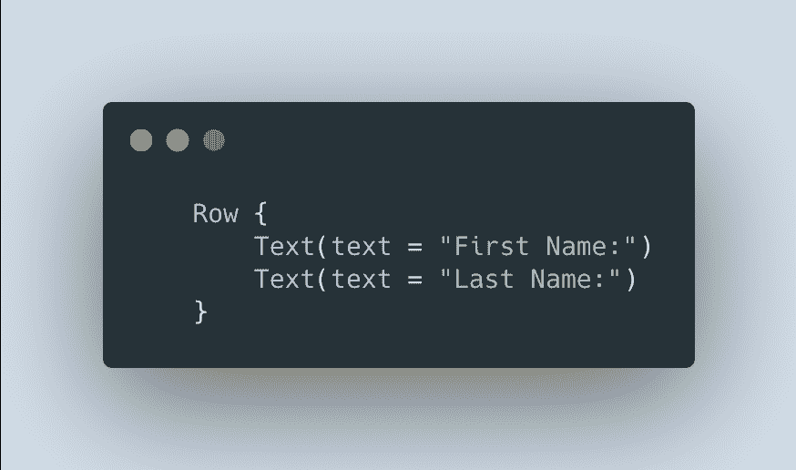
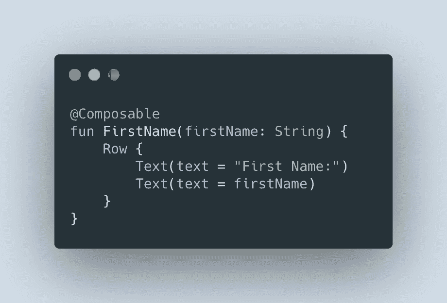
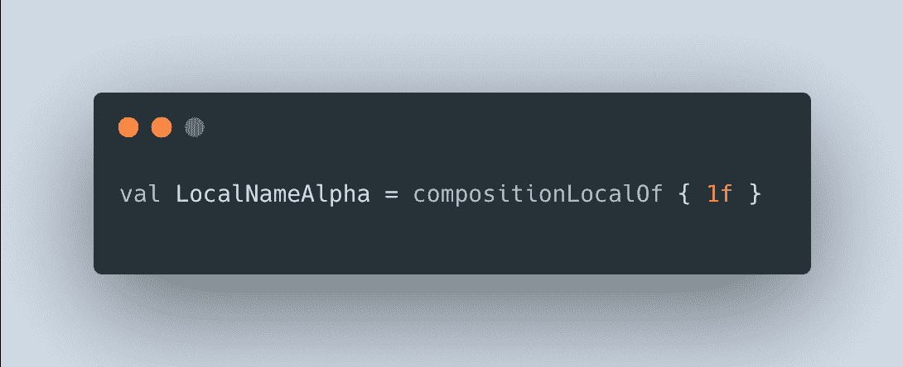
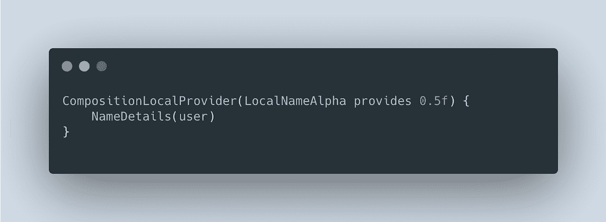
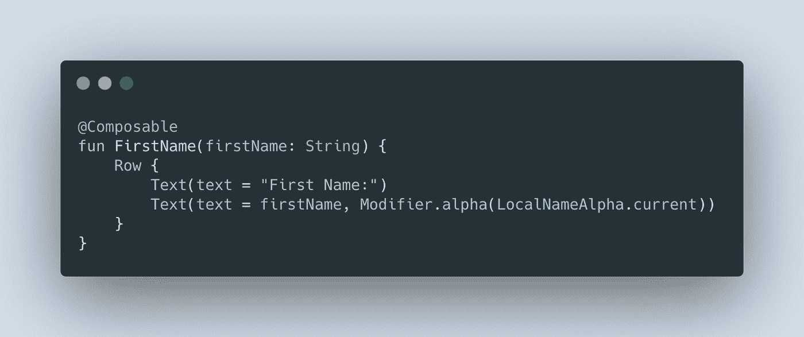
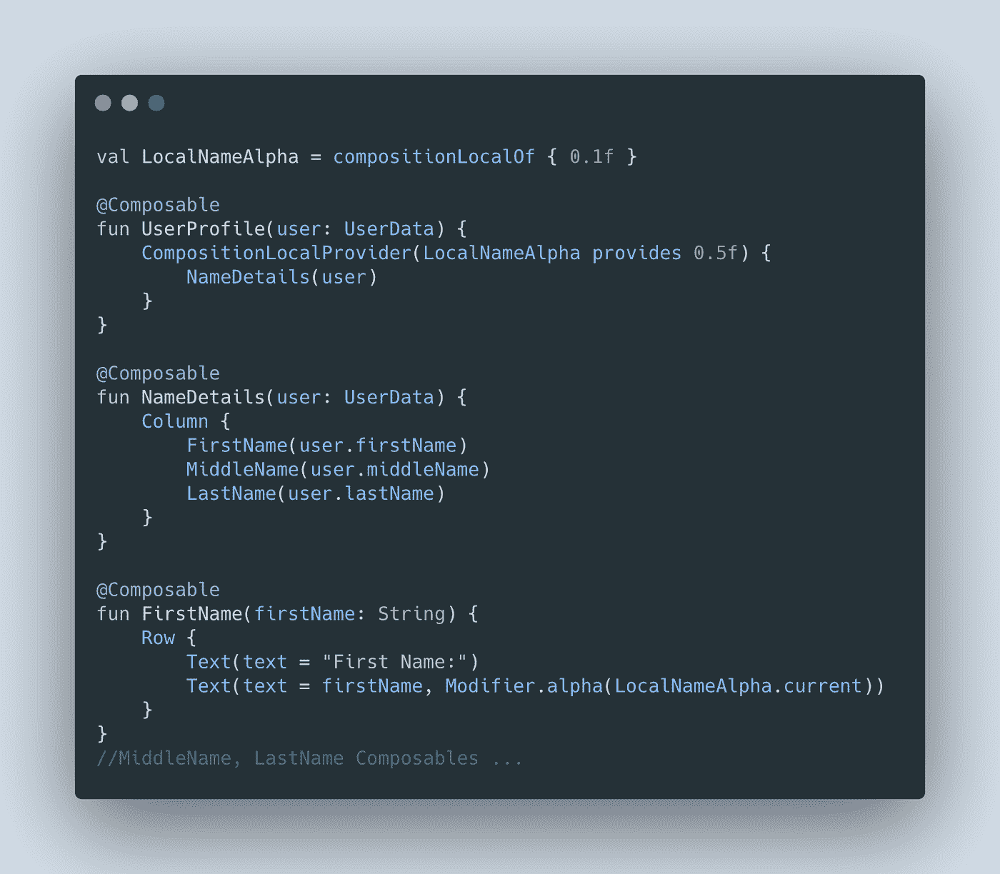
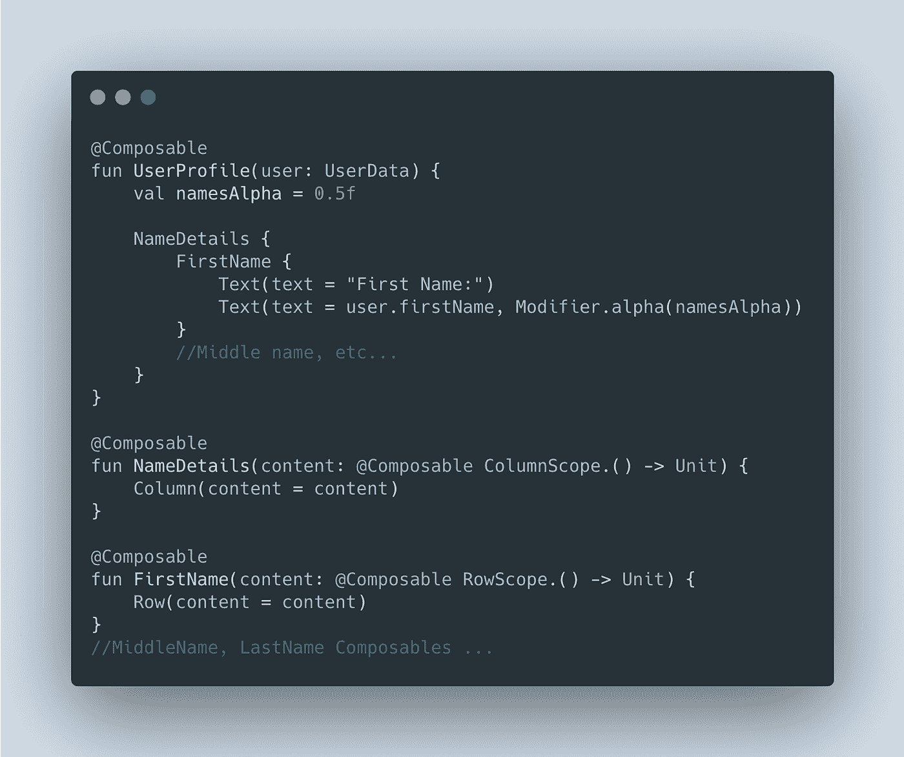
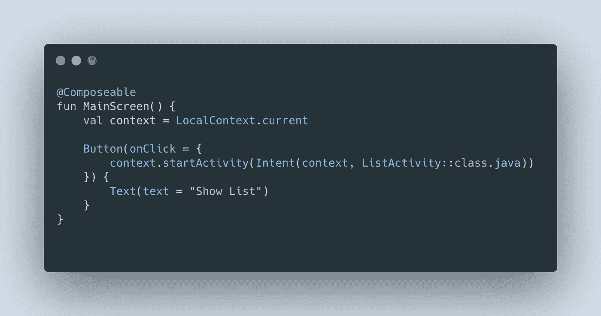
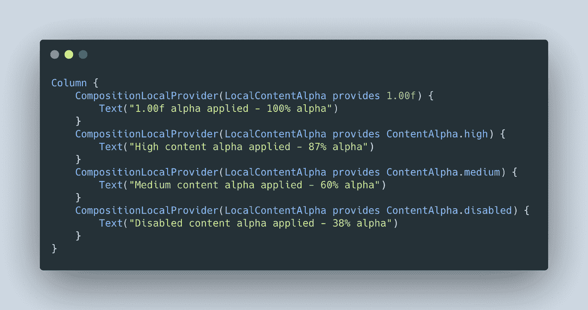

# jetpack Compose composition local-您需要知道什么

> 原文：<https://medium.com/geekculture/jetpack-compose-compositionlocal-what-you-need-to-know-979a4aef6412?source=collection_archive---------5----------------------->

Photo by [note thanun](https://unsplash.com/@notethanun?utm_source=medium&utm_medium=referral) on [Unsplash](https://unsplash.com?utm_source=medium&utm_medium=referral)

Jetpack Compose UI 是最初由谷歌 Android 团队开发的新 UI 框架，现在正由 Jetbrains 开发桌面版本。如果你是一个 Kotlin 程序员，那么 Jetpack Compose 是你应该认真考虑的 UI 框架，如果你想开发有用户界面的应用程序的话。

Jetpack Compose 采用了一种声明性的方法，使用了[高阶函数](https://kotlinlang.org/docs/lambdas.html#higher-order-functions)的组合。与其他一些框架不同，它不使用类来定义组件，Compose 中的每个可组合组件都是高阶函数，而不是类的实例。Kotlin 提供的语言特性使这种方法成为可能。Compose 利用的关键 Kotlin 特性是默认参数和一个[尾随 lambda 语法](https://kotlinlang.org/docs/lambdas.html#passing-trailing-lambdas)。这允许我们在定义组件时编写简洁且惯用的代码:

Simple Row composable containing two Text composables

在这个例子中，我们不需要向`Row,`传递任何参数，我们使用默认值。通过使用尾随 lambda 语法，我们可以定义`Row`有两个`Text`组件。这段代码不仅简洁，而且易于理解。很明显，这个`Row`只包含两个`Text`组件。

> 组合体是函数，尽管它们的语法起初看起来像对象。

这里每个组件都是一个函数，我们调用这些函数。从首字母大写的语法来看，你可能认为我们在构造对象，但事实并非如此。起初你可能会发现这个[命名约定](https://developer.android.com/kotlin/style-guide#function_names)令人困惑。如果它们是函数，那么为什么它们用 PascalCase 写——以大写字母开头，而不用 camelCase 写——以小写字母开头？composables 使用 PascalCase 的主要原因是它们通常被命名为名词，而不是像典型函数那样被命名为动词。

所以每个可组合的都是一个函数，这是有意义的，毕竟我们在这里做函数组合，但是这种方法有一些含义。

# 为什么我们需要组成本地人

我们已经确定了可组合函数是高阶函数。我们通过调用这些函数并使用作为 Kotlin 语言一部分的尾随 lambda 语法来创建合成树。如果我们想通过组合树传递数据，我们可以通过参数显式地传递。

Explicitly passing state via parameter arguments

在这里，您可以看到我们在`FirstName` composable 中传递了名称信息。这通常是通过树传递数据的最简单也是最好的方法，但有时这种模型会很麻烦。当我们有一个复杂且深度大的组件树，并且许多组件需要相同的数据时，通过函数参数显式传递状态可能是一个冗长乏味的解决方案。在这种情况下，我们需要的是一种在组件之间隐式传递信息的方式，这就是需要组合局部变量的地方。

# 创建组合本地

Jetpack Compose 附带了许多预定义的合成局部变量，它们是何时应该使用合成局部变量的好例子。但是为了理解它们是如何工作的，我们首先要看看如何创造我们自己的。这里的例子有点做作，不是使用组合局部变量的好方法，但是它使事情变得简单，并允许我们探索组合局部变量是如何工作的。

在这个例子中，我们将创建一个`UserProfile` composable，它调用多个 component Composables 来构建一个有名字、中间名和姓氏的 UI。

A UserProfile composable that contains NameDetails that contains a number of Name composables

在这里，我们将为名字、中间名和姓氏设置一个 alpha 值，这样我们就可以在与姓名标签进行比较时给予它们不同的强调。我们可以创建这个 alpha 值，并将其传递给我们的中间产品`NameDetails` composable，然后将其传递给每个名称 composable。这工作得很好，但是我们必须给`NameDetails`添加一个 alpha 参数，它什么也不做，然后必须将这个 alpha 值传递给每个名称 composable。在这个简单的例子中，这可能不是太大的问题，但是如果我们有一个更深更复杂的可组合树，我们可以看到这种方法可能会很快变得麻烦。

为了使事情简单一点，我们将创建我们自己的组合本地。首先，我们将创建它:

Creating a CompositionLocal by calling compositionLocalOf

这里我们创建了一个名为`LocalNameAlpha`的`CompositionLocal`，我们给了它一个默认值 1。我们现在可以通过获取它的当前值，在可组合树中的任何地方使用它。当我们在`LocalNameAlpha`上调用`.current`函数时，它总是会返回默认值。

这在一定程度上是有用的，其行为非常像一个全局变量，但是使用组合局部变量，我们可以做得更多。通过将对我们的`NameDetails` composable 的调用与对`CompositionLocalProvider,` 的调用包装在一起，我们现在可以为 Composable 树中位于`NameDetails`之下的所有 Composable 提供一个替代值。

Wrapping a composable in CompositionLocalProvider to give an alternative value to the Compose sub-tree

在这里，我们为`NameDetails`的所有孩子隐式地提供了一个值为 0.5 的`LocalNameAlpha`。我们还显式地将用户数据作为参数传递给`NameDetails`。要在我们的名称值中利用这一点，我们只需执行以下操作:

Calling LocalNameAlpha.current to get the Composition Local value

在上面的代码中，我们通过调用 current 来检索 alpha 值。因为我们在调用`NameDetails`时提供了一个值，所以此时在可组合树中检索到的值将是 0.5。还要注意，我们的中间`NameDetails` composable 不必将这个值传递给它的子 composable。将所有这些放在一起，我们的代码看起来像这样:

Simple example of creating and using a CompositionLocal

# composition local of vs . staticcompositionlocal of

在创建我们自己的组合局部变量时，还有最后一件事需要注意。在我们的示例中，当我们创建自己的 CompositionLocal 时，我们使用了`compositionLocalOf`函数，但是有一个替代方法可以调用`staticCompositionLocalOf`。对于`compositionLocalOf`单据的状态:

*"创建可使用 CompositionLocalProvider 提供的 CompositionLocal 密钥。更改该值将使使用 CompositionLocal.current 读取该值的 CompositionLocalProvider 的子级无效。"*

对于文档状态的 staticCompositionLocalOf:

*"创建可以使用 CompositionLocalProvider 提供的 CompositionLocal 密钥。更改提供的值将导致 CompositionLocalProvider 下的整个树被重新组合。*

所以希望这是相当清楚的。更改静态 CompositionLocal 提供的值将导致整个 UI 树的重组，这是从代码块`LocalCompostionProvider`中调用的。而改变非静态`compositionLocal`的值只会导致直接调用 `CompositionalLocal.current`的 composables 重新组合。

考虑到这一点，当静态组合局部变量的值改变时，使用静态组合局部变量似乎是低效的，因为与非静态相比，这将导致组合树中更多的节点被重新组合。文件指出:

*“静态 CompositionLocal 只应在所提供的值极不可能改变时使用。”*

此时你可能会想为什么不直接使用`compositionLocal`函数呢？这看起来像是当一个`CompositionLocal`被改变时，它将导致更少的合成树被重新合成。答案是，在最初构建可组合树时，非静态组合局部变量具有固有的额外成本。对于这些类型的组合局部变量，在设置时会有额外的开销，因此可以跟踪所有读取当前值的组件。

因此，使用这两个函数来创建复合局部变量各有利弊。总的来说，当组合局部被大量的组合使用并且值本身不太可能改变时，使用`staticCompositionLocalOf`。如果你有一个可以改变的值，`compositionLocalOf`很可能是更好的选择。

# 什么时候让你自己的作品本土化

我们上面创建自己的组合本地的例子有些做作，并不是何时使用组合本地的最佳例子。然而，它确实起到了说明如何创建和使用它们的目的。那么什么时候应该制作和使用自己的 Composition Locals？

简而言之，应该少用组合局部变量。在我们的示例中，我们使用它们来简化通过 NameDetails composable 显式传递 alpha 值的过程。但这是这里的最佳解决方案吗？

另一种方法是对我们的`NameDetails`和`FirstName`组件使用尾随 lambdas。这是一个很好的选择，因为它允许我们编写易于理解的惯用代码，同时也避免了显式传递 alpha 值。由于我们现在对我们的 composable 使用了尾随 lambda 语法，这意味着我们可以利用词法范围来访问父`UserProfile` composable 中声明的 alpha 值:

Using the trailing lambda syntax, we can use lexical scoping to access our alpha value

如本例所示，要简单地跳过可组合树的几层中的值的传递，有比使用组合局部变量更好的替代方法。只有在万不得已的情况下，才应该使用组合局部变量。一般来说，不要使用它们来传递应用程序数据(用于用文本和图像填充 UI 的数据)。这些数据应该总是显式传递。

真的，只有少数情况下组合本地才有意义。例如，当我们有一个很大的可组合体树，其中许多可组合体可能需要也可能不需要访问一个共享值时，这可能是一个很好的用例。在这里，我们不想为每个可组合组件添加额外的参数(带有默认值),以防需要。此外，由于树很大，可能无法使用词法范围之类的解决方案来共享这些值。使用组合局部变量的一些好例子是 Jetpack Compose 附带的预定义局部变量。

# 预定义合成局部变量

Android 附带了许多预定义的合成局部变量，Compose 中有两个主要领域大量使用了合成局部变量。这些是互操作性和主题化。

为了实现互操作性，Compose 需要与 Android 框架类(如上下文、配置和视图)进行交互。它们不是作为参数显式地传递给我们的可组合对象，而是通过预定义的组合局部变量提供的，这样我们就可以在任何可组合对象中访问它们。下面是一个访问 LocalContext 组合 Local 的示例，这样我们就可以启动一个新的活动:

Using the LocalContext CompositionLocal to get a Context

拥有一组预定义的组合局部变量的另一个有用领域是主题化。这里我们再次遇到这样的情况，任何可组合组件可能需要也可能不需要访问与主题化相关的状态。因此，在这种情况下，隐式传递这些参数又是一种比通过 params 显式传递它们好得多的方法。

在资源包中，我们有许多用于主题化的[合成局部](https://developer.android.com/reference/kotlin/androidx/compose/material/package-summary#top-level-properties)，我们可以使用它们来改变 UI 值，例如 alpha、颜色、文本样式等。在我们的示例中，我们为不同的 alpha 值创建了自己的 CompositionLocal，但 Compose 附带了一个预定义的 CompositionLocal 来完成这项工作，称为`LocalContentAlpha.`。作为一个示例，这是我们如何更改文本组件的 alpha 值:

Changing the alpha value of Text composable using LocalContentAlpha

# 摘要

这就结束了我们对局部变量构成研究。它们是在我们的组件之间隐式传递信息的便捷方式。它们允许我们减少必须为每个可组合函数指定的参数数量，并保持代码简洁易懂。Jetpack Compose 附带的预定义组合局部变量是如何以及何时使用它们的很好的例子，因为它们在整个代码中被广泛使用，所以我们很好地理解组合局部变量如何在 Jetpack Compose 中工作是有意义的。能够创建我们自己的组合局部变量也是有用的，但是应该谨慎使用。组合局部变量在许多方面类似于全局变量，它们有时是有用的，但应该谨慎使用，只有当替代解决方案不可实现或不可行时才使用。